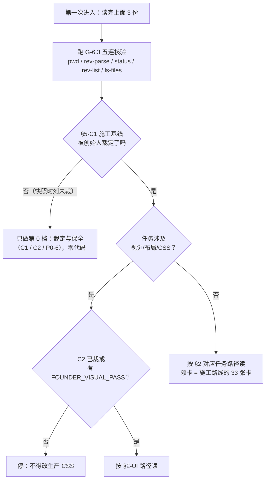

# 天衍 · AI 阅读入口索引 R0

> 状态：REFERENCE
> 作用域：全文。文中 SHA、计数是 2026-09-18/19 快照值（`BASE`＝`origin/codex/semantic-world-r3 @ 93f41aa`、盘＝`f77b800`）；动手前一律现测，不采信任何文档记的值（G-6.3）。
> 基线：不依赖代码改动。
> 取代关系：—（本文是路由表，不是权威链成员；权威链见 §0.1）
> 依据：2026-09-19 用户指令。输入＝快照/总入口/系统地图/施工路线/治理规则/项目目录导航 六份全文。
> 修订（2026-09-19 第二次指令，G-3.11 就地改）：登记 `docs/research/TIANYAN_CODE_NAVIGATION_R0.md`——§2.1 插入第 4 步（原 4/5 顺延为 5/6）、§4 加第 14 行（entity-dock 未登记事实）、§5 由十文件改为十一文件（新 #8，原 8/9/10 顺延）。本文其余判断未改。
> 落点：`docs/handoff/`（G-3.2 交接行）。本文自身是新增未跟踪件，入库走执行计划 §2.3 同款流程。

**本文是什么**：把 52 万字现状文档压成一张"5 分钟读什么"的路由表。按需读 3 份 ≈ 3–7 万字符即可安全开工。

### 0.1 权威链（冲突时下游立即失效，G-3.1）

```text
TIANYAN_PRODUCT_CORE.md（产品真相）
  └─ docs/product/TIANYAN_ROADMAP.md（能力账本＋冲突表）
      └─ docs/architecture/（合同＋FEATURE_INDEX.json）
          └─ docs/product/DESIGN.md（视觉约束）
              └─ 项目目录导航.md（代码定位＋唯一 Owner）
                  └─ docs/implementation/ + docs/operations/
                      └─ 日常入口.md / design-qa.md
                          └─ docs/research/ + data/   ← 权威链最末层
docs/handoff/ = 链外交接落点（本文在此）
```

### 0.2 ref 简称（动手前现测）

| 简称 | ref | 性质 |
| --- | --- | --- |
| `BASE` | `origin/codex/semantic-world-r3 @ 93f41aa` | **唯一还成立的生产代码线**，一切行号默认取此 |
| `R4` | `codex/world-workbench-r4 @ d16563b` | `FOUNDER_VISUAL_REJECTED`，禁合并、禁作基础 |
| `FR1` | `origin/pr-31 @ a37a314` | design-only，代码与 BASE 等价；R1 冻结文档只在这条线 |
| `盘` | `codex/world-materials @ f77b800` | 工作树，落后 BASE 44 提交 |

---

# 1. 如果你是第一次进入天衍

| 序 | 读什么 | 只读哪节 | 为什么是它 |
| --- | --- | --- | --- |
| 1 | `AGENTS.md` | 全文（14 行） | 硬约束：十脚本、唯一 Owner、Mock-only、受保护数据、创始人人工验收。**违反任何一条的产出都无效**，先知道围墙在哪 |
| 2 | `docs/handoff/TIANYAN_CURRENT_STATE_SNAPSHOT_R0.md` | §1、§2、§5-C1、§5-C2 | 5 分钟拿到：天衍是什么（一句话＋八空间）、哪条线是生产代码、C1/C2 两道未裁定闸门。**不知道 BASE 就会读错代码**（盘上缺 `entity-dock/` 等关键文件） |
| 3 | `docs/handoff/TIANYAN_NEXT_CODEX_ENTRY_R0.md` | §5、§6 | 禁止踩坑清单（C1–C6）＋ 现在能领的任务分档。读完直接决定"我能动手吗、能动手的是哪件" |



**固定七步**（任务开工时的完整顺序，沿用治理 G-6.1，不再改写）：`AGENTS.md` → `CORE.md`＋`项目目录导航.md` §1/§2/§9 → 任务卡基线 ref（现测）→ `ROADMAP` 优先级表＋冲突表 → 落点设计文档（带 CURRENT 状态块）→ `docs/research/` 同题前作 → 该切片 `data/工作日志.md`。**第 5 步之后不得再用 data/ 报告覆盖 docs/ 落点**；冲突即停（G-6.10）。

---

# 2. 不同任务读取路径

### 2.1 开发（后端 / 合同 / 接线）

| 序 | 读什么 | 拿什么走 |
| --- | --- | --- |
| 1 | `AGENTS.md` ＋ `项目目录导航.md` §5 | 唯一 Owner 表——你要动的字段有没有合法落点 |
| 2 | `docs/handoff/TIANYAN_IMPLEMENTATION_ROADMAP_R0.md` §一、§二、§六 | **唯一能直接领任务的文件**：33 张卡（P0×7 / P1×9 / P2×6 / P3×11）、依赖图、每卡八行字段 |
| 3 | `docs/research/TIANYAN_SYSTEM_MAP_R0.md` §4、§5 | Owner 图＋"已有但未接通"清单（防把合同当在线能力） |
| 4 | `docs/research/TIANYAN_CODE_NAVIGATION_R0.md` §1、§3、§4–§5 | **打开哪个文件**：生产代码地图（含 `path:line` 入口）、A–D 文件分级、高/低风险区分档；§4 判本次改动该用哪一档模型 |
| 5 | `docs/architecture/FEATURE_INDEX.json` | 读 `remainingGap`，**不要读 `status`** |
| 6 | 任务卡指向的 `BASE:src/...` 行号（用 `git show BASE:<path>` 读） | 真实代码 |

红线：Node 22＋npm 10 才能跑十脚本；测试只用 Mock；契约测试红了**不许改断言**；不新增 Owner/依赖/第二写入者。

### 2.2 UI / 视觉 / 布局

| 序 | 读什么 | 拿什么走 |
| --- | --- | --- |
| 1 | `docs/research/TIANYAN_DESIGN_PRINCIPLES_R0.md` §13、§14 | 三问判据（任一"否/不知道"就不动工）＋四条不授权；**其行号取自被否决的 r4，只可用原则文字，落码前按 BASE 重放** |
| 2 | `FR1:docs/design/TIANYAN_UI_DESIGN_FREEZE_R1/FOUNDER_FEEDBACK.md` ＋ `FEATURE_PRESERVATION_MATRIX.md`（用 `git show origin/pr-31:<path>` 读） | 创始人书面否决清单＋保全矩阵（最长也最硬） |
| 3 | `docs/research/TIANYAN_UI_VISUAL_ANALYSIS_R0.md` §5.3 | 效果图 23 组假功能清单——禁止先做界面 |
| 4 | `docs/research/TIANYAN_UI_REFERENCE_LIBRARY_R0.md` §0.3、§7 | 外部组件库/动效：只吸收规格，不引入依赖 |
| 5 | `docs/product/DESIGN.md` ＋ `C2` 状态检查 | 视觉现状落点；C2 未裁 ⇒ 不改生产 TS/TSX/CSS |

红线：四源视觉目标并存（快照 §5-C2）；新增样式前确认 token 真的存在（`--color-text-secondary` 等 140 次无 fallback 消费是基线缺陷）；shell 源码禁中文/禁字面色/禁 `panelOrder`（机器锁在 `tianyanR0ShellContract.test.ts`）。

### 2.3 世界观 / 地图 / 关系

| 序 | 读什么 | 拿什么走 |
| --- | --- | --- |
| 1 | `docs/product/TIANYAN_WORLD_WORKBENCH_PRODUCT_DESIGN_R0.md` §0、§1.3–1.4、§5.1、**§5.9**、§6、§7 | 诊断台定位、三条不做、权威来源表、**永久禁用假图清单**、切片 S0–S4 与 D1–D7 |
| 2 | `项目目录导航.md` §4 `components/world/` 行 | 地图/资料/关系三工作面的唯一 Owner 分界 |
| 3 | `visualDocumentRepository.mjs` ＋ `mapEditProposalRepository.mjs` 合同 | 唯一 VisualDocument Owner；提案不是第二地图库 |
| 4 | `ROADMAP` 地图/资料行 ＋ `FEATURE_INDEX` 对应条目 | 能力现状（M4/世界参考 R1/混合检索 R3 = LOCAL_REVIEW） |

红线：D1–D7 未裁 ⇒ 切片不启动；无来源不画；布局坐标/连线/人物出现/听闻永不写入正式事实；R4 目录只作证据不作施工起点。

### 2.4 角色 Agent / 记忆 / 知识边界

| 序 | 读什么 | 拿什么走 |
| --- | --- | --- |
| 1 | `docs/research/TIANYAN_CHARACTER_AGENT_V2_RESEARCH_R0.md` §五、§八 | 四个零调用者函数的精确事实＋Q1–Q10 裁定原文 |
| 2 | `docs/product/TIANYAN_CHARACTER_AGENT_PRODUCT_DESIGN_R0.md` §14.1、§15、§16 | 六态诚实性、"看着像有"四处、DQ1–DQ11（**DQ1 决定其余落点**） |
| 3 | `BASE:src/storyContracts/eventStoryCrossingKnowledge.ts` ＋ `characterMemoryRepository.ts` | **活的**知识边界 v2 与记忆台账（对照：`characterStateProjection.ts` 合同写完、生产零调用者） |
| 4 | 路线卡 P0-4 / P1-2 / P1-3 / P1-6 | 状态承载者裁定与接线任务 |

红线：角色不共享全知（CORE `:61`）；听闻永不升级为世界事实；别把"合同存在"读成"能力在线"。

### 2.5 仓库整理 / 归档 / 清理

| 序 | 读什么 | 拿什么走 |
| --- | --- | --- |
| 1 | `docs/operations/TIANYAN_REPOSITORY_CLEANUP_EXECUTION_PLAN_R0.md` | 四步原则（先入库→标状态→再压缩→逐项放行）＋十步执行顺序＋禁令 |
| 2 | `docs/research/TIANYAN_REPOSITORY_CLEANUP_AUDIT_R0.md` §6 | P0–P3 候选与唯一合法路径；删除候选一律"待人工确认" |
| 3 | `docs/research/TIANYAN_DOC_CLEANUP_PLAN_R0.md` §一、§3.1、§五 | docs/data 逐份处置＋A1–A6 放行门 |
| 4 | `docs/operations/TIANYAN_PROJECT_GOVERNANCE_R0.md` §2、§3.9、§4、§8 | 分支/worktree/数据形状规则＋不可移动清单＋例外清单 |
| 5 | `docs/research/TIANYAN_REPOSITORY_INDEX_R0.md` §5 | 当前不要碰区域速查 |

红线：`git clean`/批量删除/自动清理 data 永远禁止；G-3.19 钉住面不可动；多数"顺手清理"在这里被禁止。

---

# 3. 永远不要先读

| 对象 | 为什么不先读 | 什么时候才读 |
| --- | --- | --- |
| `data/`（81 个任务目录） | 过程与证据，不是现状；126 份 md 会污染上下文；结论提升进 `docs/` 的才是现状（G-6.1 第 5 步之后才允许看） | 领到切片后，只读该切片的 `工作日志.md` |
| `evidence/`（根）＋ `data/*/evidence/` | 被 `.gitignore:14` 静默吞掉的原始取证（49 件），G-4.7 违规现状，处置待人工确认 | 整理阶段按执行计划处置时 |
| 历史报告（`ROADMAP` 正文中间段、旧 handoff、`data/` 报告） | 正文按日期追加、自我覆盖；旧交接含**已失效指令**（如"从 origin/main 开始"会丢 228 个提交） | 确认某条历史决定时定点查 |
| 实验分支（`R4 @ d16563b`、`PR#30 @ 7b37ad8`、`design-freeze-r0`）与 16 个 worktree | 被否决形态/只读资产/未登记 worktree；对它们读码会得出错误现状 | UI 任务读 `FR1` 冻结 7 份时（`git show origin/pr-31:…`） |
| `.mimosa/`、`node_modules/`、`.git/`、`/tmp/tianyan-*` | Agent 运行态/依赖/版本库本体 | 永不作为信息源 |

---

# 4. 当前禁止误判

| # | 不要这样以为 | 事实 | 出处 |
| --- | --- | --- | --- |
| 1 | 最新分支 = 生产基线 | 最新 `a37a314` 是 design-only；次新 `R4` 被否决；生产代码只在 `BASE` | 快照 §2.1 |
| 2 | **R4 不是当前生产基线** | `FOUNDER_VISUAL_REJECTED`——禁合并、禁作基础；`wb-world-pulse` 在 BASE 上 0 命中 | `M0_STATUS.md:7`、入口 §5-C1 |
| 3 | 设计原型不是生产代码 | `FR1`/`PR#30` 是只读资产来源；`design-prototypes/` 不是产品 | `M0_STATUS.md:8` |
| 4 | **contract 存在不代表能力完成** | `characterFateProjection.ts` 零引用零测试；`compareCharacterStates`/`explainStateTransition` 零调用者；`buildWorldContextPack` 零消费者；NarrativeArrangement 合同在而生产事件线 UI（R12-B3）未开始 | 系统地图 §5.A/§5.B、快照 §4.2 |
| 5 | **screenshot 不是功能证明** | 截图只证明某一时刻某一视口；验收 = 创始人人工独立完成；技术全绿 ≠ 体验通过 | `AGENTS.md` 末条、G-4.15 |
| 6 | 效果图 = 现状 | AI 效果图必须标 `mockup`；23 组假功能禁止先做界面 | G-4.14、视觉分析 §5.3 |
| 7 | `PRODUCTION_CONNECTED` = 真实模型可用 | 16 项 `providerDependency=none`；真实 Provider 验收大面 NOT_RUN——**读 `remainingGap`，不要读 `status`** | 系统地图 §6 债务 7 |
| 8 | `npm run lint` 绿 = 工程依据可信 | lint 只校验路径存在；`sourceCommit` 不可解析；无反向"已挂载未登记"校验 | G-6.8 |
| 9 | 文件/目录名带 `final`/`R6`/`v2`/日期 = 更新 | 一律不作新旧依据；R5_M6 七个"兄弟"目录并存是真实反例 | G-6.4 |
| 10 | 未跟踪文件 = 存在 | 按治理视为**不存在**（G-4.10）；反之，盘上缺的文件可能只是未迁移（15 个 worktree） | G-4.10、G-6.7 |
| 11 | 盘上没有 = 能力不存在 | 盘落后 BASE 44 提交，缺 `entity-dock/`、`characterContextPack.ts` 等全部新能力载体——读码用 `git show BASE:<path>` | 快照 §0.2、系统地图 §0.2 |
| 12 | 4192 服务跑的 = 当前代码 | 它跑第三种构建；真实运行版本只看 `/__local/story-studio/health` 的 `codeRevision` | G-3.16、系统地图 §6 债务 3 |
| 13 | 非 Node 22 也能宣称验收 | `canonical-runtime.mjs` 硬门禁；绕过结果只能用于定位，不得冒充验收 | 快照 §2.3 |
| 14 | **entity-dock 是"第九空间"，或它是已登记能力** | 它只是挂载在所有 outlet 之上的叠加工作面（`ShellWorkspaceOutlet.tsx:105`），`FEATURE_INDEX.json` 与 `项目目录导航.md` 对它**零登记**。登记涉及功能索引、导航与 Shell Owner 三处，属治理改动：完成单独裁定前**不要自行补登记，也不要把它当第八/第九空间** | 代码导航 §1.5、§7.5、§7.7 |

---

# 5. 最小上下文启动包

第一次进入**只需要读这 11 个文件**（标注"节"的按节读，其余全文；合计约 5 分钟–半小时）：

| # | 文件 | 读哪节 | 得到什么 |
| --- | --- | --- | --- |
| 1 | `AGENTS.md` | 全文 | 硬约束围墙 |
| 2 | `TIANYAN_PRODUCT_CORE.md` | `:22-63`（一句话＋不是什么）、八空间各"它回答" | 产品真相的骨架 |
| 3 | `项目目录导航.md` | §1、§2、§5 | 代码定位＋唯一 Owner 表 |
| 4 | `docs/product/TIANYAN_ROADMAP.md` | 当前优先级表＋冲突表（**别读正文中间段**） | 现在做什么、什么被冻结 |
| 5 | `docs/handoff/TIANYAN_CURRENT_STATE_SNAPSHOT_R0.md` | §1、§2、§5-C1/C2、§6 | 基线陷阱＋阻塞项＋可开工分档 |
| 6 | `docs/handoff/TIANYAN_NEXT_CODEX_ENTRY_R0.md` | §1、§5、§6 | 禁令全集＋任务池 |
| 7 | `docs/research/TIANYAN_SYSTEM_MAP_R0.md` | §2、§3、§4 | 八空间＋核心数据流＋Owner 图（两张 mermaid） |
| 8 | `docs/research/TIANYAN_CODE_NAVIGATION_R0.md` | §0、§1、§3、§4–§6 | **打开哪个文件**：生产可达性实测、A–D 分级、高/低风险区与每领域第一读；#3 回答"谁负责"，本行回答"从哪个文件看起、该用哪档模型"。具体计数只在那份文档里，此处不复制（G-3.10） |
| 9 | `docs/research/TIANYAN_REPOSITORY_INDEX_R0.md` | 全文（短） | 空间地图＋"当前不要碰区域" |
| 10 | `docs/architecture/FEATURE_INDEX.json` | `boundaries` ＋各条 `remainingGap` | 功能/Owner 登记现状 |
| 11 | `docs/operations/TIANYAN_PROJECT_GOVERNANCE_R0.md` | §6（读取协议）、§7（收口清单）、§8（例外） | 游戏规则：怎么读、怎么收口、什么永远例外 |

> 跟踪状态提醒（2026-09-19 现测，`git log -1 --format=%h -- <path>`）：#1–#4、#9、#10 本就在库（#9 经 `9ba6ae3`）；#5、#6、#7 已经 `8093bc9` 入库；**#8、#11 尚未入库**，克隆环境里暂缺时按 §2.5 任务路径补读替代源。

**动手前最后一步**（G-6.3，全部实测，任一项与任务卡不符即停）：

```bash
pwd && git rev-parse HEAD
git status --porcelain
git -c core.quotepath=false rev-list --left-right --count origin/main...HEAD
git merge-base --is-ancestor origin/main HEAD
git -c core.quotepath=false ls-files --others --exclude-standard | wc -l
```

---

**本文边界**：只做路由与防误判，不含新设计、不裁决 C1/C2/Q/D/A/K 任何一条（§4-14 的 entity-dock 行是**事实登记**，不构成裁定）；失效条件——C1/C2 任一被裁定、BASE 前移、或 §5 十一文件中任一被取代时，就地重写本文（G-3.11，不另起"R1"）。
