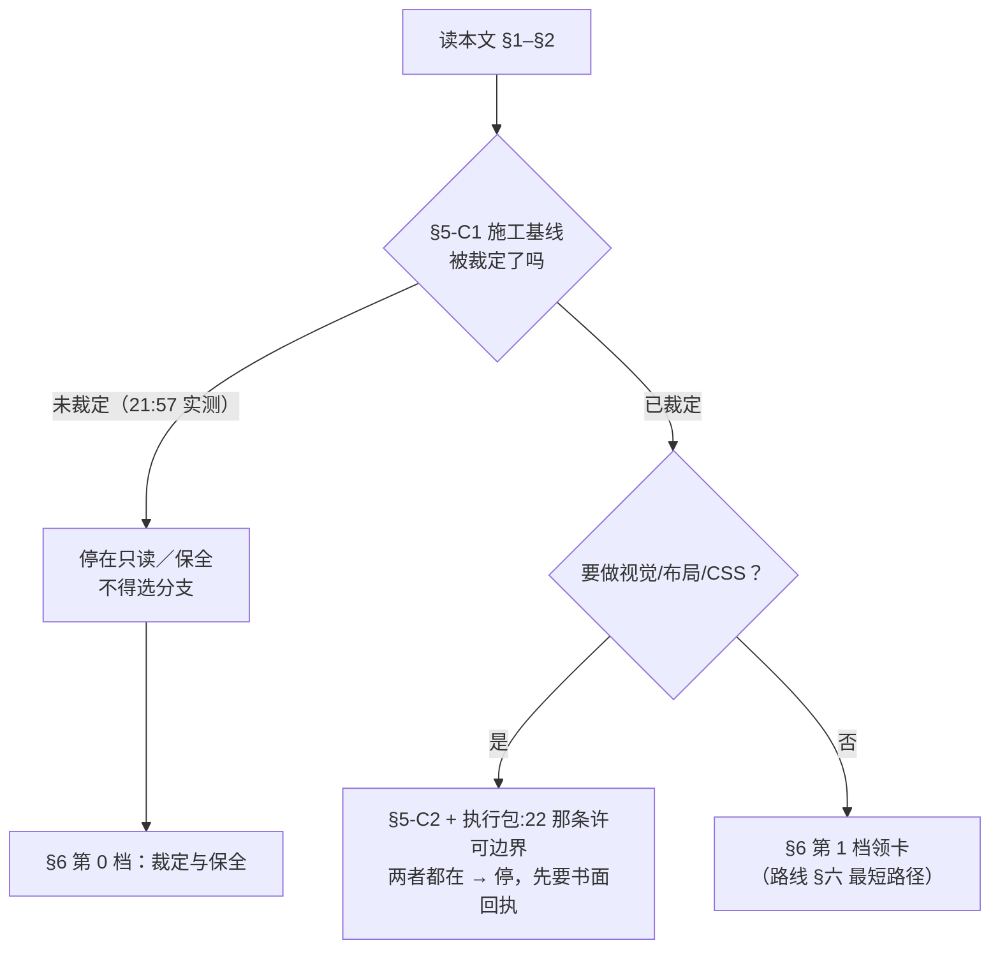

# 天衍 · 现状快照 R0（五分钟恢复上下文）

> 状态：CURRENT
> 作用域：全文。§2/§3/§5 的 SHA、计数与裁定状态仅在 2026-09-18 21:57 +0800 取值时刻成立（复核命令见 §2.4）；§1/§6/§7/§8 全部是指针，本文不含新设计。
> 基线：不依赖代码改动。取证位置 = 盘 `codex/world-materials @ f77b800`、`origin/codex/semantic-world-r3 @ 93f41aa`、`origin/codex/world-workbench-r4 @ d16563b`、`origin/pr-31 @ a37a314`（四者并列登记，未选边）。
> 取代关系：—（不取代任何一份；与 `docs/handoff/TIANYAN_CODEX_FIRST_EXECUTION_PACKAGE_R0.md` 在"施工基线"上互相冲突，按 §5-C1 保持原状态）
> 依据：本文六份输入 = `TIANYAN_NEXT_CODEX_ENTRY_R0.md`、`TIANYAN_PRODUCT_MAP_VISUAL_R0.md`、`TIANYAN_DESIGN_PRINCIPLES_R0.md`、`TIANYAN_DOC_CLEANUP_PLAN_R0.md`、`TIANYAN_IMPLEMENTATION_ROADMAP_R0.md`、`TIANYAN_PRODUCT_CORE.md`，合计 189,807 字符；2026-09-18 只读实测见 §2.4。未修改代码、未运行测试、未提交 Git。

---

## 0. 这份文档怎么用

| 项 | 内容 |
| --- | --- |
| 给谁 | 未来进入本仓库的 Codex / GLM / Claude |
| 目标 | 5 分钟建立起"能安全开工、不越界"的最小上下文 |
| 覆盖度 | 本文六份输入 189,807 字符；仓库现状文档全集 **19 份 / 520,344 字符 ≈ 52.0 万字**（不含本文，21:57 复测与 `入口:193` 一致） |
| 本文不做什么 | 不新增产品概念、不重新设计、不覆盖原文、**不裁决 C1/C2/Q1–Q11/D1–D7/DQ1–DQ11/A1–A6/K1–K9 中的任何一条**；冲突一律双侧登记 + 引来源 |
| 权威链 | `AGENTS.md` → `TIANYAN_PRODUCT_CORE.md` → `docs/product/TIANYAN_ROADMAP.md` → `docs/architecture/` → `docs/product/DESIGN.md` → `项目目录导航.md` → `docs/operations/治理` → `日常入口.md`/`design-qa.md` → `docs/research/`＋`data/`（`入口:18`，G-3.1） |
| 本文性质 | 快照＝**路由表 + 现状取证**。它是任务命名的入口，**不是权威链上的唯一入口**（同一口径见 `入口:18`、`清理:192`） |



---

## 1. 项目一句话定位

| 项 | 内容 | 出处 |
| --- | --- | --- |
| 一句话 | **天衍是一套由作者掌握最终决定权、由 AI 负责理解、记忆、维护、推演和协作的故事世界创造与演化系统** | `TIANYAN_PRODUCT_CORE.md:41`（原文逐字） |
| 不是 | 不是 AI 聊天机器人／不是资料库或项目管理软件／不要求先写完整大纲／不是巨型小说·剧本·漫画编辑器套件／不是让 AI 偷改正式故事的自动驾驶／不是角色共享全知视角的模拟器 | `CORE:47-61` |
| 产品结构 | 同一个故事内核的 **八个空间**：世界 · 天意 · 事件线 · 多元 · 女娲 · 资料 · 创作 · 数据；合册为唯一派生目的地 | `CORE:648-650`、`CORE:91`；断言 `BASE:tests/storyContracts/tianyanR0ShellContract.test.ts:24`、`:26` |
| 图形化入口 | 概念被整体可视化过一份，**读它代替通读 50 万字**：`docs/product/TIANYAN_PRODUCT_MAP_VISUAL_R0.md`（主脊 §1 / 八空间 §2 / 九层栈 §4 / 六级阶梯 §5 / 五动词 §6 / 写入链 §7 / 上下文分界 §11 / 冲突登记 §17） | 该行号取 `BASE:` |
| 产品冲突裁决序 | 任何文档与 `TIANYAN_PRODUCT_CORE.md` 冲突 ⇒ 以产品核心为准（各文档自述均遵守此序：`路线:7`、`地图:10`、`原则:3`） | `AGENTS.md` 首条 |

---

## 2. 当前真实基线（本文唯一自测项，2026-09-18 21:57 复跑）

### 2.1 四条线并存，两两不连续

| 简称 | ref / SHA | 与 `main` | 性质 | 后果 |
| --- | --- | --- | --- | --- |
| `main` | `0c110e2` | — | 2026-09-13 合并 PR #23 后**无新提交**（实测 `0 228` 未变） | 只作历史锚 |
| **`BASE`** | `origin/codex/semantic-world-r3 @ 93f41aa` | 领先 **228** | `FR1:M0_STATUS.md:6`「本轮功能基线」 | **唯一还成立的生产代码线**；一切行号默认取此（`入口:41`） |
| `R4` | `codex/world-workbench-r4 @ d16563b` | 领先 229 | `M0_STATUS.md:7`「**FOUNDER_VISUAL_REJECTED —— 禁止合并、禁止作为基础**` | **不得当起点分支**；与 BASE 只差 5 文件 `+574/-124` |
| PR #30 | `7b37ad8`（base = **R4**） | 领先 229 | 「R0 未获创始人认可 —— 只读资产来源」 | 设计稿与截图可读，代码底座不可继承 |
| `FR1` | `origin/pr-31 @ a37a314` | 领先 229 | DESIGN ONLY，代码与 BASE **逐字节等价** | R1 冻结 7 份只存在于这条线（用 worktree 或 `git show origin/pr-31:…`） |
| `盘` | `codex/world-materials @ f77b800` | 领先 **184** | 当前 checkout，落后 BASE 44 | 缺 `entity-dock/`、`characterContextPack.ts`、`worldReferenceProjection.ts` ⇒ 在此读码会得出"磁吸工作台不存在"的错误结论 |

```
main 0c110e2 (PR#23, 09-13) ──┬── 93f41aa  BASE   11:10  ← 生产代码只在这里是真的
                              │       ├── d16563b  R4    12:52  ← 已否决
                              │       │      └── 7b37ad8 PR#30 13:27  ← 只读资产
                              │       └── a37a314  FR1   15:19  ← design-only，代码==BASE
                              └── f77b800  盘      09-16  ← 你现在 cd 进来的地方
```

**核心陷阱：最新 ref ≠ 基线。** 最新的是 design-only，次新的是被否决形态。同一天四个提交（11:10 → 12:52 → 13:27 → 15:19）翻转过一次，基线可以在一个下午内移动 ⇒ 开工前先跑 §2.4，不要采信任何文档（含本文）里记的 SHA。

### 2.2 未合并状态

| 项 | 实测 |
| --- | --- |
| Open PR | **8 个**（#24–#31），其中 3 个属设计线或被否决线 |
| 自 PR #23 以来合入 `main` | **0** |
| 日常服务 `127.0.0.1:4192` | 跑 `f95fb7c` 构建，既不在 main 也落后 BASE；核对真实运行版本只读 `/__local/story-studio/health` 的 `codeRevision`（`路线:31`） |

### 2.3 运行时门禁：今天就是红的

| 项 | 实测（21:57） | 判据 |
| --- | --- | --- |
| `node -v` | **v24.16.0** | `BASE:scripts/canonical-runtime.mjs:1-2,11` 硬性要求 **Node 22 + npm 10**，不满足即抛错 |
| `npm -v` | **11.13.0** | ⇒ 所有 `npm run *` 直接失败 |
| `.nvmrc` | `22` | 拿不到 Node 22 时写 `BLOCKED=CANONICAL_RUNTIME` 并停止；**不得**用 `npx`／`node --test` 的绕过结果冒充验收（执行包 `:16`） |
| 已知环境假阳性 | `storyChangePreview` 的 `affectedFutureThreads` 排序红：`BASE:src/domainTemplates/storyWorld/changePreview/changePreviewBuilder.ts:47-49` 用 locale 相关的 `localeCompare` | 先在 Node 22 下重跑；通过则记为环境假阳性不改代码；**禁止改测试期望迁就实现**（执行包 `:44-48`） |

### 2.4 本节取证命令（全部只读）

```bash
git rev-parse --short HEAD                                                          # f77b800
git -c core.quotepath=false for-each-ref --sort=-committerdate \
  --format='%(committerdate:iso8601) %(refname:short) %(objectname:short)' refs/remotes/origin
git -c core.quotepath=false rev-list --left-right --count origin/main...HEAD         # 0  184
git -c core.quotepath=false rev-list --left-right --count origin/main...origin/codex/semantic-world-r3   # 0  228
git -c core.quotepath=false ls-files --others --exclude-standard docs | grep -c '\.md$'   # 15
git -c core.quotepath=false ls-files --others --exclude-standard data | grep -c '\.md$'   # 48
node -v && npm -v                                                                   # v24.16.0 / 11.13.0
```

| 口径 | 必须记住 |
| --- | --- |
| 中文路径 | 本仓几乎每条路径含中文，任何 `git ls-files` 比对先 `git -c core.quotepath=false`（或 `-z`），否则产生"522 个文件丢失"式假阳性（`路线:874`） |
| worktree | 证据散在 **15 个** git worktree（`/home/beelink/.codex/worktrees/`），18 个 `data/` 目录从未出现在主检出 ⇒ 一个"不存在"的路径可能只是未迁移（`路线:874`） |
| 两种口径相反 | 分析**生产实现** ⇒ 取 BASE（`git show BASE:<path>` 优于读工作文件）；盘点**开发者在盘上看到什么** ⇒ 取工作树，并把 BASE-only 文件标为"仅基线存在"而非计数（`入口`/`清理:9`） |

---

## 3. 已完成事项

**读法（七层不得合并）：** `计划中 / 已有基础 / 实现中 / 本地通过 / 真实模型待验 / 作者待验 / 已接受` 并列，测试通过不得冒充真实模型或作者体验验收（`docs/product/TIANYAN_ROADMAP.md:7`、`AGENTS.md` 末条）。下表按**证据强度**分档，本文不声明任何一项处于哪一层。

### A. 被代码与测试钉住的（改它 = 红）

| 已确认 | 落点 |
| --- | --- |
| 八空间中文名与数量 = 8、合册为唯一派生目的地；默认布局键集 `{project-directory, tianyi-agent}` + 工作台五段顺序；右工作面五态 `{NONE, EVENT_DETAILS, EVENT_CREATE, RELATION_REVIEW, TIANYI}`；同时最多挂载一个可用工具、未接入工具点不动 | `BASE:tests/storyContracts/tianyanR0ShellContract.test.ts:24`、`:25-26`、`:44-47`、`:52`、`:49-58` |
| dock 源码禁用 `panelOrder`/`expert-first`/`pinned`/`priority`（反向断言）；多面板堆叠另由 `doesNotMatch(/\.map\(/)` 禁 | 同上 `:62-63`；`tianyanWorkbenchR02.test.ts:51` |
| 外壳区禁中文、禁 `#hex`/`rgba(`、要求 `var(--color-workspace-background)`、保留 `focus-visible` 与 `prefers-reduced-motion`、rail/顶栏宽度钉值、命令面板存在；zh-CN 与 en-US 键集必须完全相同 | `test.ts:242,248,249,250,251,252,253,254`、`:33-41` |
| 54 个禁止路径保持不存在 ⇒ "世界模拟器 / 决策引擎 / 认知层"这类直觉命名在本工程**无合法落点** | `BASE:scripts/run-selected-tests.mjs:34-94` |
| Pi Agent 只在服务端，不得进浏览器文件 | `BASE:tests/storyStudio/piPredictionRuntimeBoundaryR0.test.ts:23` |
| 单一 Canon 写入者 / 唯一 World 事实所有者 / 唯一 Event 投影所有者 / NarrativeArrangement 各恰好 1，脚本硬校验 | `AGENTS.md`；`项目目录导航.md` §5；`BASE:scripts/validate-feature-index.mjs:20-26` |
| 八空间合同本体 | `BASE:docs/architecture/TIANYAN_R0_SHELL_CONTRACT.md` |

### B. 已跑完并留有书面回执的切片（≠ 已合并、≠ 已验收）

| 项 | 回执内容 | 出处 |
| --- | --- | --- |
| 女娲作者工作面视觉重构 **R6** | `FUNCTIONAL_RESULT=PASS`；`VISUAL_IMPLEMENTATION_RESULT=COMPLETE`；`EVIDENCE_RESULT=COMPLETE`；**`VISUAL_EXPERIENCE_RESULT=READY_FOR_FOUNDER_REVIEW`（创始人独立视觉验收未做；本轮不得签发 `FOUNDER_VISUAL_PASS`）**；真实 Provider 调用 = 0 | `data/2026-09-17_女娲作者工作面视觉重构R6/验收报告.md:5-11`（该链现状权威是 R6_2，见 `清理:191`） |
| 天意资料引用撤销链（盘 最近 5 个提交） | `d7c2b0e` 跨重进追踪作者已撤销的资料引用、`6a7797d` 统一所有移除路径的撤销追踪、`d21da66` 声明被忽略的 tracking refs、`f77b800` 归档 U1 取证 | `git log` on 盘；`原则:167` 记这一族的正确性"靠一串修复提交堆出来，**没有断言保护**" |
| 女娲 N1/N2A/N2B/N2C、事件线 R 系列、地图 M1–M4、资料 M2、混合语义检索 R3.1 等 | 结论散在 `data/` 任务目录与能力账本，**能力账本才是唯一登记处** | `docs/product/TIANYAN_ROADMAP.md` |

### C. 设计立场（本轮文档新确认，尚未进 ROADMAP ⇒ 不等于获准施工）

| 方向 | 落点 |
| --- | --- |
| 世界工作台 = 作者**诊断台**；图是仪表不是展板；无来源不画；默认态只给一个读数；世界侧三条不做（不建第二事实库、不写正式故事、不画无来源的形） | `docs/product/TIANYAN_WORLD_WORKBENCH_PRODUCT_DESIGN_R0.md:24-28`、`:36-40`、`:64-68` |
| 角色缺口是**三件组织性的东西**（时间主语 / 并置 / 正面呈现"不知道"），不是九个新页签；页签位置已留（`EntityInspectorDock.tsx:27` 九项） | `docs/product/TIANYAN_CHARACTER_AGENT_PRODUCT_DESIGN_R0.md:595-599`、`:523-536` |
| UI 标准答案 13 条（先说状态再说颜色 / Agent 是五段可审计链路 / 空态是答案 / 未标注即未知不是默认可见 / 颜色按角色派生不按色号手抄 / 天衍现在是零动效产品 …）＋ 三问判据 | `docs/research/TIANYAN_DESIGN_PRINCIPLES_R0.md` §1–§12、§13。**⚠ 其全部 `file:line` 取被否决的 r4 ⇒ 只在原则文字层可用，落码前按 BASE 重放**（`入口:183`、`:263`） |
| 6–12 个月能力节奏（角色 Agent / 世界模拟 / 命运 K 线） | `docs/product/TIANYAN_AGENT_EVOLUTION_ROADMAP_R0.md` —— 性质 = 研究，**不要当已排期**（`入口:186`） |

### D. 创始人书面否决过的（"已完成"的反面清单，重做即违反已有反馈）

| 否决 | 出处 |
| --- | --- |
| 女娲 6 条：功能可见性不足 / 三张等宽大卡压过正文 / 正文主位不足 / 登记≠可用 / 预留功能占主面 / 过于文档化缺少女娲身份 | `FR1:FOUNDER_FEEDBACK.md:12-36`（第 2 条原话在 `:19`） |
| 世界观 4 条：看板大于作者工作流 / **默认因果网络过重，不应作默认首屏** / 脉搏·时间线·对象浏览抢层级 / 缺稳定的编辑-新建-关联-冲突-补全入口 | 同上 `:38-54` |
| 本轮绝对约束 6 条（不删不造生产功能、不为简洁藏到三次操作后、未实现不做主按钮、预留不占默认面、通过前不改生产 TS/TSX/CSS、不合 PR #29） | 同上 `:56-63` |
| 更早被收回：R0.5 修复前版本、`19893b1` 旧外壳、"VISUAL_REMODEL_R1 整体 PASS"、女娲"四种平级聊天模式"、reality-map JSON 的 `FIXTURE_ONLY` 判定 | `docs/research/TIANYAN_DOCUMENT_INDEX_R0.md:280-288` |
| 被否决形态名单 | `TIANYAN_WORLD_WORKBENCH_PRODUCT_DESIGN_R0.md:497` |

---

## 4. 未完成事项

### 4.1 唯一任务池 = 路线的 33 张卡

| 波 | 数量 | 内容 | 状态 |
| --- | --- | --- | --- |
| P0 | 7 | 1 裁定基线、2 对齐分支、3 排除外泄、4 裁定状态承载者、5 裁定视觉、6 保全本机决定、7 让工程依据重新可信 | **5 张是裁定与保全，只有 P0-2/P0-3 改代码**（`路线:99`、`:884`） |
| P1 | 9 | 接线：目录入口+死深链、投影不再丢弃、两个零调用者函数、目标与计数、上下文诚实化、四类记忆写入者、Agent 设置面、卡历史投影、结清清单 | 共同前置 P0-2 |
| P2 | 6 | 顶栏、导航选中态、稿纸感、圆角描边、右栏层级、composer 双态 | **全部阻塞于 P0-5/C2** |
| P3 | 11 | 因果本体归一、时间帧、人格扩展、底线关卡、决策替换轮转、召回排序、目标可相撞、效果裁决者、统一 Attention 信封、命运 K 线、Agent 运行状态 | 阻塞于 Q1–Q11 |

出处：`docs/handoff/TIANYAN_IMPLEMENTATION_ROADMAP_R0.md:63-99`；依赖图与最短路径 `:791-814`。

### 4.2 "合同已写完、生产零调用者"清单（最容易被误判为已交付）

| 能力 | 实测 | 出处 |
| --- | --- | --- |
| `compareCharacterStates`、`explainStateTransition`、`validateKnowledgeBoundary` | 已实现且带完整测试，在 `src`+`apps` 内**零命中**；知情边界红线今天**没有任何执行者** | `BASE:src/storyContracts/characterStateProjection.ts:179`、`:192`、`:196-211`；`路线:295` |
| `buildWorldContextPack` | **无知情标签时默认可见**（fail-open），且全仓零调用者 | `BASE:src/storyContracts/worldCausalEvolution.ts:209` = `if (!knowledge) return entry.category !== "clue";`；`git grep buildWorldContextPack BASE -- src apps` 仅其定义 1 行 |
| `characterFateProjection.ts`（230 行命运契约） | 逐条满足产品红线且是**结构性**保证（`confidence` 类型上不可能是数值），但 `src`+`apps`+`tests`+`scripts` 内**零引用、零测试、零 UI**；FATE-F1 仍是**计划中** | `BASE:src/storyContracts/characterFateProjection.ts:31,144,147,150,151`；`docs/product/TIANYAN_ROADMAP.md:69` |
| 角色状态投影 | `projectCharacterState` 生产里已被真实调用，但三层断链：证据只合成 `knowledge\|belief` 两维、作用域是写死伪值、投影结果对象不外传（只有 revision hash 活到界面） | `BASE:src/storyContracts/eventStoryCrossingKnowledge.ts:113-130`、`:117`；`CharacterInspectorCard.tsx:122` |
| 四类角色记忆 | 账本全部规则已实现（幂等 ID、失效元数据永不删除、root/derived 作用域），但写入校验 `:194` **硬拒除 `heard` 外的一切** | `BASE:src/storyContinuity/characterMemoryRepository.ts:194` |
| Agent 设置面 | `AgentSettingsSection.tsx` 至今**无任何导入者**；同目录 storage 那份请求已被实现可判 OBSOLETE，agent 这份是真实待办 | `apps/story-studio/src/settings/agent/INTEGRATION_REQUEST.md`；`路线:375` |
| 女娲分支节点幂等重放 | `:3148` 按 `author-edit + "<operationId>.author"` 判可重放，`:3158` 成功写入时**从不追加** ⇒ 重放分支永不可达，第二次同 `operationId` 落到 `:3152` 报 409。兄弟实现 `adoptNuwaBranchNode` 在 `:3198` 追加了正确条目 | `BASE:src/storyControlSurface/storyStudioWorkspaceOperations.ts:3148,3152,3158,3198`；作者可见后果：自动保存后重试/双击/离线回补被判冲突 |
| 死深链 | dock 的「在角色目录中编辑档案」发 `objectId=`，Shell 读的是 `characterId=` ⇒ 该链接**永远进不了** `CharacterWorkspace`，静默回落世界总览 | `BASE:apps/story-studio/src/components/entity-dock/EntityInspectorDock.tsx:159` vs `TianyanR0Shell.tsx:95` |
| 天意上下文面板 | 7 行里 4 真 3 假，且假在最难三项（`selection`/`memoryState`/`excludedScope` 全为常量）；「管理上下文…」按钮动作是弹"尚未接入" | `BASE:apps/story-studio/src/components/tianyi/TianyiSidebar.tsx:313`、`TianyiSidebarComposer.tsx:41` |
| 排除来源标题外泄（潜伏） | N1 侧只发 `{count, reasonCodes}`（正确）；`liveProviderPilot.mjs:129/:152` 把携带 `label`+中文 `reason`+240 字 `excerpt` 的 `excludedSources` 整块 stringify 发出 | 正确写法 `BASE:apps/story-studio/server/nuwaN1PiAdapter.mjs:109-111`；外泄点 `apps/story-studio/server/providerGateway/liveProviderPilot.mjs:129,152` + `src/storyIntelligence/nuwaAttentionContext.ts:5-16,:37`。**是潜伏项不是正在泄露**，触发时点＝所有真实模型验收开始时 |
| UI 未登记 / 生产不可达 | 288 个域文件中 17 个不在生产闭包内（完全零引用 2、只有测试引用 10）；`apps/story-studio/src/` 4 个任何地方都不引用；`apps/story-studio/src/` 124 个 `.ts/.tsx` 中 **54 个不在任何 feature 的 entrypoints/sourceFiles 里**，含 `/world` 的默认工作面 | `docs/research/TIANYAN_SYSTEM_MAP_R0.md` §5.C、§5.E；`路线:229` |

### 4.3 文档与资产侧未完成

| 项 | 实测 | 后果 |
| --- | --- | --- |
| `docs/` 未跟踪 markdown | **15 份**（21:57 复测，含本文六份输入中的 4 份） | 按治理 G-4.10「未纳入 Git 的文档视为不存在」⇒ 施工计划、治理规则、四份研究对下游**都算不存在** |
| `data/` 未跟踪 markdown | **48 份 / 276.5 KiB 文本**（283,151 B）；其中 **36 份承担 14 项"当前有效设计"里的 7 项** | P0-6 的实际体积是 277 KiB 文本，**不是搬 193 MB**（口径分歧见 §5-K） |
| 被 lint / ROADMAP 钉住、不能顺手归档 | 8 份 md + 7 个 `data/` 目录 | 动它们 = `npm run lint` 红 |
| 工程依据失真 | `项目目录导航.md` 里 `entity-dock` 命中 **0**，而 `FEATURE_INDEX.json` 命中 18；`FEATURE_INDEX.json:3` 的 `sourceCommit` 在本仓不可解析；`validate-feature-index.mjs` 只校验路径存在，无新鲜度、无反向"已挂载未登记" | ⇒ **`npm run lint` 绿 ≠ 工程依据可信**（G-6.8） |
| 权威文档指向的死链 | 9 处 | 其"缺失内容"不得当作已确认事实，也不得重新发明近似替代品（G-8.2） |

---

## 5. 阻塞项（全部保持原状态，本文不裁决）

### C1 · 施工基线未被共同承认 —— 最高优先，实测仍未裁定

| 侧 | 主张 | 出处 |
| --- | --- | --- |
| 甲方 | `BASELINE_BRANCH = codex/world-workbench-r4` / `BASELINE_HEAD = d16563b…` 作为第一阶段作业基线 | `docs/handoff/TIANYAN_CODEX_FIRST_EXECUTION_PACKAGE_R0.md:8-10`（21:57 复核原文未改） |
| 乙方 | 同一条 `M0_STATUS.md:7` 判 R4 `FOUNDER_VISUAL_REJECTED`、禁止合并、禁止作为基础；R4 的 `wb-*` 只作被否决形态引用 | `FR1:docs/design/TIANYAN_UI_DESIGN_FREEZE_R1/M0_STATUS.md:7`；`FR1:FOUNDER_FEEDBACK.md:62-63`；世界设计 `:494` |
| 实测补充 ① | 执行包**任务一、任务二所在文件在 BASE 与 R4 之间逐字节相同** ⇒ 两任务在 BASE 上成立，与 C1 无关 | `入口:262` |
| 实测补充 ② | `[data-testid=wb-world-pulse]` 与整个脉搏结构在 BASE 上 **0 命中**（BASE 版 `WorldReferenceWorkspace.tsx` 287 行、无 `pulse`/`wb-*`；r4 版 561 行 / 64 处）⇒ **任务三及其全部截图判据建立在被否决形态上，按现文本无法在 BASE 执行** | `入口:262`、`:357` |
| 实测补充 ③ | `DESIGN_PRINCIPLES:13` 仍以 r4 为仓库侧基线，其 `file:line` 与头号反例（`tokens.css` 的 6 个 `--color-world-*` 抄三遍漏第三遍）**只在 r4 成立**；BASE 同名文件 100 行、`--color-world-*` 0 命中 ⇒ 属"被否决形态的缺陷"，据其落码会把缺陷搬进基线。**对照项**：`--color-text-secondary`（54 次）与 `--color-border-subtle`（47 次）全仓从未定义，在 **BASE 与 R4 各自重跑数字完全相同**（22 / 155 / 140）⇒ 这是**基线缺陷**，情形相反 | `入口:263`、`:296`；`原则:40`、`:117` |
| 实测补充 ④ | `PRODUCT_MAP_VISUAL` 从 BASE 独立测得同一事实：`BASE:docs/architecture/FEATURE_INDEX.json:530-531` 把 `continuous-world-pulse` 标 `PRODUCTION_CONNECTED`，而 `git grep -c pulse BASE -- apps/story-studio/src` = 0 ⇒ 其真实语义是写作面板的"显式提及"投影。**两份文档从不同 ref 撞到同一事实**（其 §17 K4） | `地图:589`；`入口:263` |
| 处置（不是裁决） | 未裁定前甲乙双方**都不得单独作为施工依据**；不投票、不取新者 | G-3.13、G-6.10（`治理:290`、`:485`）；登记处 `路线:855` |

### C2 · 视觉目标四份并存，且冻结本身还没有 PASS 回执 —— 实测仍未裁定

| 并存目标 | 状态 |
| --- | --- |
| ① `data/2026-09-17_女娲作者工作面视觉重构R6/参考效果图.png`（1586×992，AI 生成渲染图，非任何已实现页面的截图） | `VISUAL_IMPLEMENTATION_RESULT=COMPLETE` / `VISUAL_EXPERIENCE_RESULT=READY_FOR_FOUNDER_REVIEW` |
| ② R1 设计冻结（`FR1 @ a37a314`，只存在于该线，主检出与 BASE **0 引用 0 副本**） | R0 判 `FOUNDER_VISUAL_REJECTED`；明写"创始人通过前禁止进入生产代码" |
| ③ `docs/design/references/tianyan-r0-5-founder-character-directory.png`（被 `design-qa.md` 以 SHA-256 钉住的 R0.5 权威） | 并存期间**不得自称"当前目标"** |
| ④ `data/2026-09-18_天衍世界观工作台R4/` 的世界脉搏首屏 | 该线作基线已被否决 |

| 可测量冲突 | 值 |
| --- | --- |
| 右栏宽 | 图 350 / R1 320 / 已实现 312 / token 288（**四源**） |
| 左导航宽 | 图 190 / R1 176 / token 132（**三源**） |
| 场景头高 | 图 193px vs R1 ≤96px（**2.0×**，图与已验收首屏约束不自洽） |
| 圆角 | 图 8–12px / 现状 6/10/16px / R1 4/7/10px，**已实现的 R6 站在图这一边** |
| 主强调色色相 | 185° / 174° / 166°（三个不同） |
| 受管视口 | 1920 / 1440 / 1280 / 1195 / 1152 ⇒ **1586×992 不是受管视口，图上任何 px 必须先换算到 1440 重排后重量** |

| 更硬的一条 | 图上三张等宽方向卡、composer 首行预留功能徽标、白卡堆叠像控制台 —— 正是 R0 被创始人**明文书面否决**的理由（`FOUNDER_FEEDBACK.md:19`、`:30-32`）。选图等于撤回这条已记录的反馈，那是创始人的权力 | `路线:189`；`原则:144` |
| --- | --- | --- |
| 冲突的另一侧措辞 | 执行包 `:22` 记"创始人 2026-09-18 裁定"：`FOUNDER_FEEDBACK` 那条**只约束女娲／世界观视觉重设计方向本身**，世界观线允许改生产 TSX/CSS，条件是沿用既有 token 与 `.entity-dock*`／`.wb-*` 类名、不新增视觉语言、不改几何配色、不动女娲工作面；女娲视觉重设计仍需手写 `FOUNDER_VISUAL_PASS` | 出处见该行 |
| ⚠ 该裁定的证据强度 | **只在一份未跟踪文档中看到，未在 `FR1` 冻结文档里找到对应书面回执 ⇒ 按冲突处理，不按生效处理**（`入口:414` 不确定项 ①）。21:57 全仓 `FOUNDER_VISUAL_PASS` 检索命中的 8 份文件里，唯一 data 侧那处原文是"**本轮不得签发 `FOUNDER_VISUAL_PASS`**" | 本文实测 |

### 其余未裁清单（照原状引用，不逐条展开）

| 组 | 条目 | 出处 |
| --- | --- | --- |
| 13 条阻塞施工的前置裁定 | **Q11** 因果本体权威方 · **C1** 施工基线 · **C2** 视觉目标 · **Q1** 角色状态由谁承载 · **Q2** 人格录入形态 · **Q3** 唯一 Attention 信封形状 · **Q4** 候选轨迹点 ID 语义 · **Q5** K 线固定入口 · **Q6** 拒绝是否消耗派发 · **Q7** IF/派生分支角色能否获得长期记忆 · **Q8** 后台活动 vs 零值验收不变量 · **Q9** 虚构历法/世界时间结构 · **Q10** 越界校验失败语义 | `路线:852-866`（逐条附"为什么规划工程师不能替你定"）。**8 张卡的前置栏里直接写着待裁定编号 ⇒ 任何排期日期都是假数字**（`路线:878`） |
| 世界工作台 D1–D7 | 切片 S0–S4 全部不启动 | 世界设计 `:460-472`、`:476-487` |
| 角色 Agent DQ1–DQ11 | 其中 **DQ1（角色面长在哪）决定其余落点** | 角色设计 §16 |
| 文档治理 A1–A6 | A1 15 份 `docs/` md 是否入库 · A2 `docs/` 存放规则改不改 · A3 治理与设计文档落点 · A4 `.gitignore:14` 裸模式 `evidence/` 是否改成 `/evidence/` · A5 视觉目标唯一化 · A6 9 项 D 级决定是否提升 | `清理:196-205`。**清理计划全文零删除申请，但本身也未放行** |
| 产品地图 §17 K1–K9 | K1 顶级空间数量（`CORE:91`/`:648` 列 8 个 vs `CORE:367` 写"七个顶级产品空间之一"，以注册表 8 条为准）· K2 地图归属（`DESIGN.md` 说继续用世界空间 vs 实现在 `/library?libraryView=map`）· K3 命运 K 线 · K4 世界脉搏 · K5 因果本体两套并存无共同权威 · K6 势力口径（成员类型数组留空、圈层渲染 0 个）· K7 世界时间 x 轴（正式 Event 无结构化世界时间字段）· K8 数据空间 R0 只到静态壳 · K9 视觉几何四源 | `地图:582-594`。**本文一律不合并、不取均值、不 px 化** |
| 产品核心自述未冻结 | `CORE:2466-2468`「最终固定入口尚未确认」；§二十一 八条创始人待确认项（派生副本最终名称、副本管理入口、"来源"在目录中的位置、翻译同步粒度、创意首页、"叠层"命名、多元最终 IA、K 线固定入口） | `CORE:2404-2469` |

---

## 6. 当前允许执行任务

### 第 0 档 · 不裁定就无法开始（三件，都是决定或保全，零代码）

| # | 事项 | 登记处 |
| --- | --- | --- |
| 0-a | 裁 **C1**：基线取哪条线、PR #29 是否作废、执行包 BASELINE 是确认还是改判 —— **一句创始人书面决定** | `路线:855`；`治理:572`；本文 §5-C1 |
| 0-b | 裁 **C2 / P0-5**：视觉目标唯一化，或落 `FOUNDER_VISUAL_PASS` | `路线:185`、`:856`；世界设计 `:480` D1 |
| 0-c | **P0-6 保全**：把只存在于本机的决定入库 —— 15 份 `docs/` md + 36 份承担有效决定的 `data/` md（48 份合计 276.5 KiB）。`DOC_CLEANUP_PLAN` 已给逐份处置但**未放行** | `路线:205`；`盘点:345-347`；`清理:§一/§3.1/§五` |

### 第 1 档 · 现在就能开工（不需要任何裁定，且不依赖被否决线）

| 顺序 | 任务 | 为什么现在能做 | 前置 |
| --- | --- | --- | --- |
| 1 | **P0-3** 修掉"被排除来源标题外泄"潜伏项 | 不碰生产 UI；正确写法已在隔壁 `nuwaN1PiAdapter.mjs:109-111`，照搬语义不另设计。这条决定后续**所有真实验收是否作废** | — |
| 2 | **P0-4** 裁定角色状态的承载者 | 一次裁定解开 P1-2 / P3-7 / P3-8 / P3-10 四条链。判据：`storyStudioWorkspaceOperations.ts:1540-1541` 是**有意限制**不是疏漏 | 创始人 |
| 3 | **P1-3** 把 `compareCharacterStates`、`explainStateTransition` 接为展示与只读校验 | 代码写完、已带测试、不新增契约/Owner/库 | P0-4 + Q10 |
| 4 | 执行包**任务一**（女娲分支节点幂等重放，unit 红）＋**任务二**（`buildWorldContextPack` 收紧为 fail-closed） | 实测两任务所在文件在 BASE 与 R4 **逐字节相同** ⇒ 与 C1 无关 | 硬约束见下表 |
| 5 | 附带核对：`affectedFutureThreads` 排序红 | 先在 Node 22 下重跑，很可能是环境假阳性 | Node 22 |
| 6 | **纯文档 / 只读研究**：核对 BASE 口径下的行号重放、补 `十态 ↔ 各 Owner 实际字段` 对照表（`原则:39` 列为第一优先）、补画布 14 条手势的动词表规范（`原则:65`） | A 档，与像素无关、不改运行路径 | — |

| 允许任务的改动面红线 | 内容 |
| --- | --- |
| 任务一 | 只允许在 `updateNuwaBranchNodeContent` 内追加本次 `author-edit` + 实现 `:3157` 注释声明的 64 条裁剪；**不得**放宽 `expectedContentRevision` 守卫、不得改 `contentRevision` 语义、不得动 checkpoint、不得为凑截图新增界面 |
| 任务二 | 硬约束：**`characterTitle === null` 的作者公共视角结果必须逐字节不变**（任务三依赖它）；不得批量补写"知情"标签；不得接 Provider。同仓正确先例 = `resolveIndexEligibility`（隐私策略未知时返回 `LEXICAL_ONLY`）。反向陷阱：把"没标注"当"公共知识"是违反，把**作者公共视角一起改红**是误伤不是收紧 |
| P0-3 | 不新增第三套排除披露语义；不把 N1 侧更强的不变量弱化以"对齐"（方向只能从松收敛到严）；不削减作者检查器已可见的排除条目身份；不改 `server.mjs:332/3395/3935` 三道闸门 |

### 明确**不在**第 1 档

| ✗ | 执行包任务三"世界脉搏接线" —— 整项由 R4 形态定义，BASE 上 0 命中，**必须等 C1** | `入口:357` |
| --- | --- | --- |
| ✗ | 第 2 档全部（接线波 P1-1/P1-2/P1-4…P1-9、视觉波 P2-1…P2-6、长期能力波 P3-1…P3-11、世界切片 S0…S4）—— 卡已写好，**不要提前动手** | `入口:359-366` |

---

## 7. 当前禁止执行任务

| 组 | 禁令 | 出处 |
| --- | --- | --- |
| 基线 | 不在盘 `f77b800` 上做实现分析；不把"最新 ref"当基线；不在 `main` 工作、不自行合并、不部署、不切日常服务、不清理 `data/`；分支/目录/文件名里的 `final`、`最新`、`R6`、`v2`、日期一律**不作为新旧依据**（真实样本：`data/…R5_M6连续交互取证-{debug,pass,pass2,pass3,retry,retry2,final}` 并存） | `路线:37`；G-6.4；执行包 `:90`、`:94`；`治理:467` |
| 冻结（`apps/story-studio/**`） | **创始人通过前禁止修改生产 TS/TSX/CSS 的视觉性改动**（样式、布局、几何、配色）；PR #29 那 5 个文件（`WorldReferenceWorkspace.tsx`、`EntityInspectorDock.tsx`、`tokens.css`、`tianyan-r0-shell.css`、`FEATURE_INDEX.json` 的 R4 版）**禁止合并、禁止作为基础**；契约断言集合不得为解红而改断言（解红只能改设计）；未跟踪资产（15 份 docs md + 36 份 data md）任何清理前必须先入库；未实现的访谈/接管/干预模式不得做成可点击主按钮、不得占默认主工作面 | `FR1:FOUNDER_FEEDBACK.md:62`、`:30-32`、`:60-61`；`M0_STATUS.md:7`；`路线:824`；本文 §1.3/`入口:390` |
| 验收 | 非 Node 22 + npm 10 不得宣布验收通过（绕过方式只能用于定位）；十个脚本全用 `dev build serve typecheck lint test test:unit test:integration test:e2e verify`；`npm run lint` 绿 ≠ 工程依据可信；测试只用 Mock 或本地伪服务器 —— 两条真实通道（`TIANYAN_E2E_SCOPE=tianyi-real-creation-r6`+`TIANYAN_TIANYI_REAL_CREATION_ACCEPTANCE=1`、`TIANYAN_MAP_REAL_AI_LIVE_ACCEPTANCE=1`）**33 张卡里无一授权打开**；技术全绿 ≠ 创始人体验通过；**新增测试文件必须先 `git add`**（`run-selected-tests.mjs:24` 用 `git ls-files` 枚举，未跟踪测试被静默跳过） | `canonical-runtime.mjs:1-2,11`；执行包 `:16`、`:41`；`路线:822-824`；`AGENTS.md` |
| 假功能 | 效果图 **23 组假功能一律禁止先做界面**（判据＝找不到 store/state 字段、传输路由或服务端 handler、`src/storyContracts/` 合同类型三者之一）。高危四组：效应分数徽标「真相+1/风险+1…」（候选真实形状是句子数组，分数只存在于从未被引用的原型数据）、方向卡直选+「应用选择」（采纳合同是 `selectedStepIds[]` 不是三选一）、场景笔记（R6 自判 NOT_APPLICABLE）、自动保存时钟戳（现状是修订号语义）。四类世界假图永久禁用（势力强弱、亲缘远近、影响半径、时间趋势）；状态/命运投影占位 Tab 不补数据，保持诚实空态；仓库发布 0 位图、无 `public/` ⇒ 不引入位图资产，任何 `` 必须有非假降级 | `路线:835-844`；`docs/research/TIANYAN_UI_VISUAL_ANALYSIS_R0.md` §5.3；世界设计 §5.9；执行包 `:88` |
| token 可解析性 | 新增样式前先确认 token **真的存在**。已实测缺口：`--color-text-secondary`（54 次）、`--color-border-subtle`（47 次）全仓从未定义，被 **140 次无 fallback** 消费而 lint/test 全绿 —— `test.ts:249` 只要求消费 `var()`，**不校验能否解析**，取不到值时整条声明按 CSS 规则静默失效。复现该审计的唯一正确口径：定义集 = 全仓 `.css` 的 `--x:` ＋ TS/TSX 的 `"--x":` 内联键 ＋ `setProperty("--x", …)`；消费集 = `apps/story-studio` 下 11 张 css 的 `var()`（漏一项会得到 29/171/151 的假结果）。覆盖面：`test.ts:246` 只读 6 张表，而 40 处字面色全在名单外（`tianyi-workspace.css` 27、`nuwa-n1.css` 11、`character-directory.css` 2） | `入口:296-298`；参考库 §0.5；`原则:117` |
| 架构 | 不向 `App.tsx`（7 行）与 `TianyanR0Shell.tsx` 堆菜单、Dock 状态、业务数据或执行逻辑；不新增第二产品入口 / 第二 Canon 写入者 / 第二 WorldState 所有者 / 第二 Event 投影所有者；`bin/world-os-story.mjs` 不得成为第二入口或持久化根；**不引入依赖**（六家外部体系技术前提全缺：无 Tailwind / React Aria / motion / Radix / CSS-in-JS）；不给"世界模拟器/决策引擎/认知层"建新目录 | `AGENTS.md`；参考库 §0.3 |
| 明确不做（7 类） | 常驻逐角色模型实例、向量库与完整 RAG/rerank/ASR/TTS、自动文明演化、统一世界时钟与虚构历法、概率/权重/命运指数单分数、跨分支轨迹合并视图、预测自动升级为 IF | `路线:831-833`；`CORE:429`、`:558`、`:568`、`:1061` |
| 文档 | 新文档落点必须先过 G-3.3 落点表，表外位置需创始人批准；**禁止双写收口**：不新增"更新版/最终版/收口版"，要修订就在原文上改并更新状态块的`依据`（⇒ 若 C1 被裁定，按 `入口:393` 重写原文而**不起"入口 R1"**）；一个事实一个落点，其他地方只允许路径引用；`docs/**/*.md` 第一段落必须是五字段状态块；证据入 `data/YYYY-MM-DD_任务名/`，**不要放进 `evidence/` 或 `.world-os/`**（`.gitignore:14` 是裸 `evidence/`，会连 `data/<任务>/evidence/` 一起吃掉，已实测吞掉 45–49 件）；`scripts/tianyan-storage-inventory.mjs` 与 `scripts/repo-doctor.mjs` **不可当清理工具**（硬编码外来 macOS 根、往不存在的 `docs/ops/` 写） | `治理:228-242`、`:290`、`:292`、`:246-263`；执行包 `:95`；`路线:827`；G-8.1 |
| 回滚 | 不得使用 `git clean` / `reset --hard` / 删除正式事实；受保护数据（用户正文、项目数据、数据库、迁移、环境文件、密钥）**禁止纳入任何破坏性清理**；多 worktree 共享环境下不得用裸 `git stash`/`git stash pop`；已写入的正式事实只能走补偿版本，不得删除 | `AGENTS.md`；`路线:133`、`:827` |
| 计数与存在性 | 所有计数/存在性结论必须 `git -c core.quotepath=false`；"文件不存在"必须二次核验（`ls` → `git cat-file -e <ref>:<path>` → 确认 ref 与口径）；一个"不存在"的路径可能只是未迁移，先看 15 个 worktree | G-6.6/G-6.7；`路线:874` |

---

## 8. 下一次 AI 接手读取顺序

### 8.1 五分钟最小路径（本文的用途）

| 步 | 读什么 | 得到什么 |
| --- | --- | --- |
| 1 | 本文 §1 | 天衍是什么、不是什么、八空间 |
| 2 | 本文 §2 + 跑一遍 §2.4 命令 | 唯一生产代码线 = `BASE`；**SHA 必须现测** |
| 3 | 本文 §5-C1、§5-C2 | 两条"未裁定就不要选分支/不要改 CSS"的判据 |
| 4 | 本文 §6 或 §7 | 领一件事，或确认想做的这件事被禁止 |
| 5 | 需要细节再跳 | `路线`（唯一能直接领任务的文件）／`产品地图`（图形化替代通读 50 万字）／`设计原则 §13 三问`（任何 UI 决策先查） |

### 8.2 固定七步（沿用 G-6.1，不改写）

| 步 | 读什么 |
| --- | --- |
| 0 | **`NEXT_CODEX_ENTRY` §1.1 + §5-C1 或本文 §2/§5-C1**：确认基线冲突是否已被裁定；未裁定不要选分支 |
| 1 | `AGENTS.md`（十脚本、唯一 Owner、Mock-only、受保护数据、人工验收） |
| 2 | `CORE.md` + `项目目录导航.md` §1/§2/§9（放置与新增代码判定；§5 是不可重复的所有者清单） |
| 3 | 任务卡声明的基线 ref（一切行号、计数、存在性取自该 ref） |
| 4 | `docs/product/TIANYAN_ROADMAP.md` 当前优先级表 + 冲突表 |
| 5 | `治理` §3.2 落点表命中、带 CURRENT 状态块的设计文档。**5 之后不得再用 `data/` 报告覆盖 `docs/` 落点** |
| 6 | `docs/research/` 同题前作（治理 §5.2 强制检索结果 —— 防重复研究） |
| 7 | 该切片 `data/YYYY-MM-DD_任务名/工作日志.md` |

产品/功能/体验/信息架构/故事语义类任务：开始前必须**完整读** `TIANYAN_PRODUCT_CORE.md`（`AGENTS.md` 首条，43,931 字符 / 2488 行）。

### 8.3 按任务类型的最短读取集

| 任务类型 | 只读这些 | 然后 |
| --- | --- | --- |
| 修后端 / 合同缺陷（不改界面） | `路线` §三 P1-x + 对应 `BASE:src/…` 行号 + `系统地图` §5 | 可开工，不需要视觉裁定 |
| 接线（函数已写完、零调用者） | `路线` §三 + 角色设计 §14.1（防接上去是空的）+ `EntityInspectorDock.tsx:27` 九页签事实 | 状态归属类需先有 Q1/P0-4 |
| 视觉 / 布局 / CSS | `原则` §13 三问 + §14 四条不授权（行号按 BASE 重放）→ `FR1:FOUNDER_FEEDBACK.md` 全文 + `FR1:FEATURE_PRESERVATION_MATRIX.md`（最长也最硬）+ 视觉分析 §5.3 + 参考库 §7 + `路线` P0-5 | **C2/P0-5 未裁 ⇒ 不得改生产 CSS** |
| 世界观 / 地图 / 关系 | 世界设计 §0、§1.3–1.4、§5.1、**§5.9 永久禁用假图清单**、§6、§7 | D1–D7 未裁 ⇒ 切片不启动 |
| 角色 Agent 能力 | 角色研究 §五（四个零调用者函数）+ 角色设计 §15、§16 | DQ1 决定其余落点 |
| 提"外部组件库 / 动效 / 3D" | 参考库 §0.3 + §7 | 结论已写好：**只吸收规格，不引入依赖** |
| 产品概念 / 信息架构 / "这是什么" | **产品地图 §1、§2、§3、§6、§7、§16 + §17 K1–K9**（≈2.2 万字符替代通读 50 万字）；它不采信的措辞回 `CORE` 原文 | 不新增概念、不改名；冲突以 `CORE` 为准 |
| 某个界面该按什么标准做 | `原则` §13（三问 + A/B 档划分）→ §14 | 只吸收规格；**B 档（像素/几何/配色）等 C2** |
| `data/`、分支、worktree、归档、清理 | `治理` §2、§3.9、§4、§8 + `DOC_CLEANUP_PLAN` §一/§3.1/§五 | 多数"顺手清理"在这里被禁止；**清理计划本身未放行** |

### 8.4 动手前核验（G-6.2 五项合同，全部实测、不采信任务卡）

| 字段 | 必须写什么 |
| --- | --- |
| 基线 | 分支名 **+ 40 位 SHA** |
| 工作区 | 绝对路径（主检出还是某个 worktree） |
| 谱系 | 与 `main` 的关系，按实测填 |
| 脏度 | 是否含未提交/未跟踪改动；含 D 级未提交文档必须列路径 |
| 落点 | 本次读哪些 `docs/`、写哪个落点 |
| 任一项不符 | **停下回报**，不自行选"看起来更新的那个" |
| 交付附带 | "读取清单"：读了哪些文件、取自哪个 ref、发现的不符（G-6.11） |

```bash
pwd && git rev-parse HEAD
git status --porcelain
git -c core.quotepath=false rev-list --left-right --count origin/main...HEAD
git merge-base --is-ancestor origin/main HEAD
git -c core.quotepath=false ls-files --others --exclude-standard | wc -l
```

---

## 9. 冻结清单与失效条件

`docs/handoff/` 的交接文档必须写这两张表（G-3.3 落点表），本快照不例外。

### 9.1 读取期间视为不可动

| 冻结项 | 范围 | 依据 |
| --- | --- | --- |
| 生产 TS/TSX/CSS 的视觉性改动 | `apps/story-studio/**` 的样式、布局、几何、配色 | `FR1:FOUNDER_FEEDBACK.md:62`；女娲线另需手写 `FOUNDER_VISUAL_PASS`（本文实测：不存在） |
| PR #29 的 5 个文件 | `WorldReferenceWorkspace.tsx`、`EntityInspectorDock.tsx`、`tokens.css`(+12)、`tianyan-r0-shell.css`(+131)、`FEATURE_INDEX.json` 的 R4 版 | `M0_STATUS.md:7`、`FOUNDER_FEEDBACK.md:63` |
| 被 lint/索引钉住的文档 | 8 份 md + 7 个 `data/` 目录：不得移动、归档、压缩包化 | `盘点:123`、`治理:286,540` |
| 契约断言集合 | 不得为解红而改断言 | `test.ts` 全清单（`路线:824`） |
| 未跟踪资产 | 15 份 `docs/` 设计研究文档 + 36 份 `data/` md：任何清理前必须先入库 | 本文 §4.3 |
| 未裁清单一律保持原状 | C1、C2、Q1–Q11、D1–D7、DQ1–DQ11、A1–A6、K1–K9 | 本文全部只做"登记 + 停止"（G-3.13、G-6.10） |
| 区域命名 | `CORE` §十七 明写区域名**尚未冻结** ⇒ 不要硬烤新的区域标签 | `CORE:2057-2113` |

### 9.2 失效条件（出现任一 ⇒ 就地重写本文，不得另起"快照 R1"，G-3.11）

| # | 触发 | 要重写的部分 |
| --- | --- | --- |
| 1 | **C1 被裁定** | §2、§5-C1、§6 第 1 档；若 R4 彻底作废，执行包"任务三"改为随 R4 作废 |
| 2 | **C2 / P0-5 被裁定，或 `FOUNDER_VISUAL_PASS` 落笔** | §7 第 2 行解冻；路线 P2 全波解除阻塞 |
| 3 | ROADMAP 优先级表变更或 33 张卡增删 | §4 改为引用新表（**本文不自行维护任务列表**） |
| 4 | **BASE 前移**（#28 合并或新基底） | §2 全部重测；所有 `path:line` 按"搬运不等于再核验"重放（`路线:873`） |
| 5 | 六份输入任一被提升／取代／否决 | 按 G-3.7 同步 `SUPERSEDED_BY`，本文状态块跟进 |
| 6 | 有人已按 §6 开工，或有并行会话写 `docs/` | §4.3 每个数字即视为过期（本文写作期间 `docs/` 未跟踪数从 11 → 15，`入口:78`），必须重跑 §2.4 |
| 7 | 那条"生产 UI 许可边界"裁定取得 `FR1` 内的书面回执，或被推翻 | §5-C2 最后两行 |

---

## 10. 本文边界

| 项 | 内容 |
| --- | --- |
| 产出物 | 仅本文件（markdown，未跟踪，未提交）。**未修改代码、未运行任何测试、未执行 `npm run *`、未提交 Git、未启动 4191/4192/4195/4196、未打开浏览器** |
| 不新增 | 不新增产品概念、Owner、依赖、脚本、分支角色、工时、状态词；不重新设计；不覆盖任何原文 |
| 不裁决 | C1、C2、Q1–Q11、D1–D7、DQ1–DQ11、A1–A6、K1–K9 一条都不替创始人定；冲突双侧登记 + 引来源 |
| 不判定层级 | 不声明任何能力处于七层的哪一层，不声明任何一项"已验收"，不做任何排期 |
| 本文自测范围 | 仅 §2（四条线 SHA 与领先数、未跟踪计数、Node/npm 版本、`FOUNDER_VISUAL_PASS` 检索）。其余数字与行号来自 §0 所列六份输入及其上游 |
| 已知不确定 ① | `执行包:22` 的"创始人 2026-09-18 裁定"未在 `FR1` 冻结文档中找到对应书面回执 ⇒ 按冲突处理，不按生效处理（沿用 `入口:414`） |
| 已知不确定 ② | `DESIGN_PRINCIPLES` 全部 `file:line` 取 r4；`原则:39` 的"十态 ↔ 各 Owner 字段对照表"尚未产出；`路线 §2-B` 两格的产品核心表述（`入口:415` 不确定项 ②）本文原样引用未逐字复核 |
| 已知不确定 ③ | 本文不主张那 15 份未跟踪 markdown 的作者身份，只登记"未跟踪"这一事实；引用其中内容仅为路由，不构成背书或复核 |
| 下游动作 | 本文若被采纳，需在 `docs/product/TIANYAN_ROADMAP.md` 登记一行（G-5.3）；它自身指向的 9 处死链不得重新发明替代品（G-8.2） |
