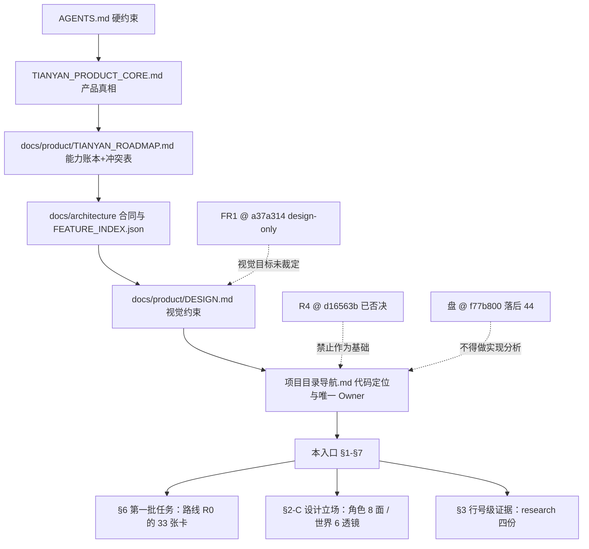

# 天衍 · 未来 Codex 开发总入口 R0

> 状态：CURRENT
> 作用域：全文。§1 的现状数字仅在 2026-09-18 取值时刻成立；§2–§6 全部是指针，本文不含新设计。
> 基线：不依赖代码改动。取证位置 = 盘 `codex/world-materials @ f77b800`、`origin/codex/semantic-world-r3 @ 93f41aa`、`origin/pr-31`。
> 取代关系：—（不取代 `docs/handoff/TIANYAN_CODEX_FIRST_EXECUTION_PACKAGE_R0.md`；与它在"施工基线"上互相冲突，见 §5-C1）
> 依据：2026-09-18 只读实测（命令见 §1.4）+ `FR1:docs/design/TIANYAN_UI_DESIGN_FREEZE_R1/M0_STATUS.md:6-8`

---

## 0. 定位（三格，其余全是索引）

| 项 | 内容 | 出处 |
| --- | --- | --- |
| 本文是什么 | 19 份现状文档 / **519,534 字符 ≈ 52.0 万字**的路由表（21:30 实测，**不含本文**：本文自计会随每次修订漂移）；按需读 3 份 ≈ 3–7 万字符 | 逐份字数与命令见 §3 |
| 本文新增的东西 | 只有两样：§1 的现状取证、§5-C1 的一条实测补充（`wb-world-pulse` 在 BASE 上 0 命中） | §1.4 命令 |
| 本文不做什么 | 不裁决 C1/C2/Q1–Q11/DQ1–DQ11/D1–D7；不新增 Owner、依赖、脚本、分支角色、工时；不复制上游正文 | `G-3.10`、`G-3.13`、`G-6.10`（`docs/operations/TIANYAN_PROJECT_GOVERNANCE_R0.md:290`、`:298`、`:485`） |
| "总入口"的性质 | 任务命名的入口，**不是权威链上的唯一入口**。权威链固定为 CORE → ROADMAP → architecture → DESIGN → 导航 → implementation/operations → 日常入口/design-qa → research+data；链上任何文档不得自封唯一入口而不被上游承认 | 同上 `:209-222`（G-3.1） |
| 交接文档合同 | `docs/handoff/` 的交接文档必须写冻结清单与失效条件 → §7 | 同上 `:241`（G-3.3 落点表） |



### 0.1 ref 简称（沿用仓库既有前缀）

| 简称 | ref | 性质 |
| --- | --- | --- |
| `BASE` | `origin/codex/semantic-world-r3 @ 93f41aa` | **唯一还成立的生产代码线**；一切行号默认取此 |
| `R4` | `codex/world-workbench-r4 @ d16563b` | **`FOUNDER_VISUAL_REJECTED`**，禁止合并、禁止作为基础 |
| `FR1` | `codex/tianyan-ui-design-freeze-r1 @ a37a314` | design-only；代码与 BASE 等价；R1 冻结文档只存在于这条线 |
| `盘` | `codex/world-materials @ f77b800` | 工作树，落后 BASE 44 提交，缺 `entity-dock/` |

---

## 1. 当前状态

### 1.1 Git / PR 现场

| 线 | SHA | 与 `main` | 状态判据 | Codex 行为后果 |
| --- | --- | --- | --- | --- |
| `main` | `0c110e2` | — | 2026-09-13 合并 PR #23 后无新提交（`治理:550`） | 只作历史锚 |
| **BASE / PR #28** | `93f41aa` | 领先 **228** | OPEN；`M0_STATUS.md:6`「本轮功能基线」 | **生产代码只在这里是真的**；读码用 worktree `/home/beelink/.codex/worktrees/tianyan-semantic-world-r3` 或 `git show BASE:<path>` |
| R4 / PR #29 | `d16563b` | 领先 229 | OPEN + `mergeStateStatus=UNSTABLE`（`gh pr view 29`）；`M0_STATUS.md:7`「**FOUNDER_VISUAL_REJECTED —— 禁止合并、禁止作为基础**」；`FOUNDER_FEEDBACK.md:63` | **不得当起点分支**。与 BASE 只差 5 个文件：`WorldReferenceWorkspace.tsx`、`EntityInspectorDock.tsx`、`tokens.css`、`tianyan-r0-shell.css`、`FEATURE_INDEX.json`（`+574 / -124`） |
| PR #30 | `7b37ad8`（base = **R4**） | 领先 229 | `M0_STATUS.md:8`「R0 未获创始人认可 —— 只读资产来源」 | 设计稿与截图可读，代码底座不可继承 |
| **FR1 / PR #31** | `a37a314` | 领先 229 | OPEN，标题 `DESIGN ONLY`；`FOUNDER_FEEDBACK.md:62`「创始人通过前禁止修改 `apps/story-studio` 生产 TS/TSX/CSS」 | 可写区仅 `design-prototypes/` + 它自己的 `docs/design/…R1/`。实测 r4 那 5 个文件一个都不在 `a37a314` 内 ⇒ **FR1 代码 == BASE 代码** |
| 盘 | `f77b800` | 领先 **184** | 2026-09-16；落后 BASE 44 | 在其上读 `entity-dock/`、`characterContextPack.ts`、`worldReferenceProjection.ts` 会得出"磁吸工作台不存在"的错误结论（`路线:37`、角色设计 `:39`） |

| 项 | 实测 |
| --- | --- |
| Open PR | **8 个**：#24–#31（`gh pr list --state open`），其中 3 个为设计线或被否决线 |
| 未推链深度 | 堆叠在 `codex/*` 上；`main` 自 PR #23 后未合任何一支（`治理:550`、`:554`） |

### 1.2 三条决定"能不能开工"

| # | 现状 | 冲突双方 / 判据 | 后果 |
| --- | --- | --- | --- |
| 1 | **施工基线未被共同承认（最高优先）** | 甲方 `docs/handoff/TIANYAN_CODEX_FIRST_EXECUTION_PACKAGE_R0.md:8-10`（BASELINE = `d16563b`）；乙方 `M0_STATUS.md:7` + `FOUNDER_FEEDBACK.md:63` + 世界设计 `:494`（R4 的 `wb-*` 只作被否决形态引用） | 谁先读哪份，第一步就相反。登记处：路线 §八 **C1**（`:855`）、治理 G-10.2 第 1/2 项（`:572-573`） |
| 2 | **视觉目标 4 份并存** | G1 设计目标 / R0.5 权威 png / 女娲 R6 参考效果图 / 世界观 R4 首屏（`盘点:295`、`治理:559`）；且 **R1 冻结本身还没有 `FOUNDER_VISUAL_PASS`** | 路线 P0-5 / C2（`:185`、`:856`）未裁 ⇒ "照 R1 做"也不等于获准改生产 CSS |
| 3 | **运行时不满足门禁（今天就红）** | `scripts/canonical-runtime.mjs:1-2` 要 Node 22 + npm 10，`:11` 不满足即抛错；本机实测 `node=v24.16.0 npm=11.13.0`，无 `~/.nvm` | 所有 `npm run *` 直接失败 ⇒ 写 `BLOCKED=CANONICAL_RUNTIME`；不得用 `npx`/`node --test` 的绕过结果冒充验收（执行包 `:16`） |

### 1.3 资产现状（只登记，不处置）

| 项 | 数量 | 出处 |
| --- | --- | --- |
| `docs/` 未跟踪 markdown | **15 份**（`git status --porcelain -- docs \| grep -c '\.md$'`，21:25 实测）。本文写作期间从 11 → 15：本文之外的 3 份（`TIANYAN_DESIGN_PRINCIPLES_R0`、`TIANYAN_PRODUCT_MAP_VISUAL_R0`、`TIANYAN_DOC_CLEANUP_PLAN_R0`）由并发作业者在 21:12–21:25 写入，本文不主张其作者身份 | 一次 `git clean -fd` 即永久消失；**这是移动靶：引用前重跑 §1.4 的 `# —— §1.3 的四个数` 段** |
| `data/` 未跟踪 **文本**（真正该入库的那批） | **48 份 md / 276.5 KiB**（283,151 字节）；其中 **36 份**承担 14 项"当前有效设计"里的 7 项，分布在 17 个 CURRENT 目录（15 个整目录未跟踪） | 子集口径 `盘点:255`、`:345-347`；**P0-6 的实际体积是 277 KiB 文本，一次 clean 即全失** |
| `data/` 未跟踪 **文件全集**（口径分歧，本文实测） | 严格口径（`--exclude-standard`）**485 个 / 172 MiB**；不加该选项 **534 个 / 193 MiB**。差的 **49 个是被 `.gitignore` 吃掉的证据件**：25 在 `09-04_天意事件线黄金闭环/evidence/`、11 在 `09-12_资料管理与世界设定方案/evidence/`、9 在 `09-05_天衍R2_2A工作面壳层/evidence/`、2 在 `.mimosa/`、2 在 `4196-before/after/` | 上游两份文档（`盘点:255` 与 `DOC_CLEANUP_PLAN:〇`）沿用的 **534 / 193 MiB 含不可入库件**；`61.7 MiB` 是 17 个目录的**体积**，不是 36 份 md 的字节数 ⇒ 引用 P0-6 时按"277 KiB 文本"理解，不要按"搬 193 MB"理解 |
| 已被 lint/ROADMAP 钉住、不能顺手归档 | 8 份 md + 7 个 `data/` 目录 | `盘点:123`（§2.3）、`治理 G-3.9:286`、`G-8.3:540` |
| 对应保全卡 | P0-6 保全本机有效决定、P0-7 让工程依据重新可信 | `路线:205`、`:225` |

### 1.4 本节取证命令（复核用，全部只读）

```bash
git rev-parse --short HEAD                                                                        # f77b800
git -c core.quotepath=false rev-list --left-right --count origin/main...HEAD                       # 0  184
git -c core.quotepath=false rev-list --left-right --count origin/main...origin/codex/semantic-world-r3   # 0  228
git diff --stat origin/codex/semantic-world-r3 origin/codex/world-workbench-r4 | cat                # 5 files, +574 -124
git grep -c "wb-world-pulse" origin/codex/semantic-world-r3 -- apps/story-studio/src                # 0 命中
git grep -c "wb-world-pulse" origin/codex/world-workbench-r4 -- apps/story-studio/src               # 1 命中
git grep -n "buildWorldContextPack" origin/codex/semantic-world-r3 -- src apps                      # 仅其定义 1 行
gh pr view 29 --json number,state,title,mergeStateStatus
git show origin/pr-31:docs/design/TIANYAN_UI_DESIGN_FREEZE_R1/M0_STATUS.md
node -v && npm -v                                                                                   # v24.16.0 / 11.13.0

# —— §1.3 的四个数（全部 strict 口径 = --exclude-standard）
git -c core.quotepath=false ls-files --others --exclude-standard docs  | grep -c '\.md$'          # 15  未跟踪 docs md
git -c core.quotepath=false ls-files --others --exclude-standard data  | grep -c '\.md$'          # 48  未跟踪 data md
git -c core.quotepath=false ls-files --others --exclude-standard data  | wc -l                    # 485 严格口径文件数
git -c core.quotepath=false ls-files --others                data      | wc -l                    # 534 含被 .gitignore 吃掉的 49 个
git -c core.quotepath=false ls-files --others --exclude-standard data  | grep '\.md$' \
  | tr '\n' '\0' | xargs -0 cat | wc -c                                                           # 283151 字节 = 276.5 KiB
# —— §3 合计（排除本文，避免自指随修订漂移）
git -c core.quotepath=false ls-files --others --exclude-standard docs | grep '\.md$' \
  | grep -v NEXT_CODEX_ENTRY | tr '\n' '\0' | xargs -0 cat | wc -m                                 # 432207（14 份）+ 已跟踪 5 份 88137 = 520344
```

---

## 2. 已经确认的产品方向（登记，不重述正文）

| 口径 | 内容 | 出处 |
| --- | --- | --- |
| "已确认" | 有机器断言、有产品核心条款、或有创始人书面回执 | — |
| **≠ 已验收** | 七层状态（计划中/已有基础/实现中/本地通过/真实模型待验/作者待验/已接受）**并列、不得合并**；测试通过不得冒充真实模型或作者体验验收 | `docs/product/TIANYAN_ROADMAP.md:7`；角色设计 `:53`；`AGENTS.md` 末条 |

### A. 被代码与测试钉住的（改它 = 红）

| 已确认 | 落点 |
| --- | --- |
| 八空间中文名与数量 8、合册为唯一派生目的地 | `tests/storyContracts/tianyanR0ShellContract.test.ts:24`、`:25-26`（本次逐行读实） |
| 默认布局键集 `{project-directory, tianyi-agent}` + 工作台五段顺序 | 同上 `:44-47` |
| 右工作面五态 `{NONE, EVENT_DETAILS, EVENT_CREATE, RELATION_REVIEW, TIANYI}` | 同上 `:52` |
| 同时最多挂载一个可用工具、`activeToolId` 唯一、未接入工具点不动 | 同上 `:49-58` |
| dock 源码禁用 `panelOrder`/`expert-first`/`pinned`/`priority`（反向断言） | 同上 `:62-63`；多面板堆叠另有 `tianyanWorkbenchR02.test.ts:51` 用 `doesNotMatch(/\.map\(/)`（`路线:824`） |
| 外壳区禁中文、禁 `#hex`/`rgba(`、要求 `var(--color-workspace-background)`、保留 `focus-visible` 与 `prefers-reduced-motion`、rail/顶栏宽度钉值、命令面板存在 | `test.ts:242,248,249,250,251,252,253,254`；逐条与跨 ref 一致性见 `docs/research/TIANYAN_UI_REFERENCE_LIBRARY_R0.md` §0.4 |
| zh-CN 与 en-US 键集必须完全相同 | `test.ts:33-41`（`路线:824`） |
| 54 个禁止路径保持不存在 ⇒ "世界模拟器 / 决策引擎 / 认知层"这类直觉命名在本工程无合法落点 | `scripts/run-selected-tests.mjs:34-94`（抄录 `路线:825`） |
| Pi Agent 只在服务端，不得进浏览器文件 | `tests/storyStudio/piPredictionRuntimeBoundaryR0.test.ts:23`；导入链见参考库 §0.3 |
| 八空间合同本体 | `docs/architecture/TIANYAN_R0_SHELL_CONTRACT.md`；盘点列为"当前有效设计"第 1 项（`:257`） |

### B. 被产品核心钉住的（语义红线）

| 已确认 | 落点（`:N` = `TIANYAN_PRODUCT_CORE.md`，盘与 BASE 该文件逐字节相同，已 `git diff --stat` 核实） |
| --- | --- |
| 角色不共享全知视角；视角是只读观察投影；无正式证据时显示**诚实空状态**；盲区开关默认关闭且打开必须标"角色未知" | `:61`、`:861`（本次读实） |
| 角色/物品/地点/组织/规则 Agent **≠** 各自常驻一个 Pi 实例 | `:429`（本次读实） |
| 命运变化由多维度共同造成、必须可解释，不做单分数；轨迹每格可回溯到事件/来源版本/原因 | `:558`、`:568`（本次读到行首，语义按 `路线:833` 的表述登记） |
| 未知明确写"未知"，不显示假数据 | `:2153` |
| 候选/保留可能性不自动成为正式事实，**只有作者明确"升级为 IF"才建派生副本与独立版本线**，且该门槛已确认 | `:1061`（本次定位；`路线:833` 所写的 `:2464` 实测是"多元信息架构"段，行号已修正） |
| 相邻不等于因果，因果/影响/传播/转移必须明确记录或标为推测 | `:825` |
| 天意不自动读取全部专题、角色不自动知道作者资料 | `data/2026-09-12_资料管理与世界设定方案/方案.md:146`（引用于执行包 `:74`） |
| 单一 Canon 写入者 / 唯一 World 事实所有者 / 唯一 Event 投影所有者；新能力停在候选身份之前 | `AGENTS.md`；`项目目录导航.md` §5；精确写入者行号见世界设计 `:67` |
| 六个外部 UI 体系一律不作为依赖引入，只吸收规格 | 参考库 §0.3、§7 |

### C. 本轮设计文档新确认的方向（尚未进 ROADMAP ⇒ 属设计立场）

| 方向 | 落点 | 性质 |
| --- | --- | --- |
| 世界工作台 = 作者**诊断台**；图是仪表不是展板；无来源不画；默认态只给一个读数 | 世界设计 `:24-28`、`:36-40` | 六视图 + 断点队列；切片 S0–S4 与验收 `:460-472`；"这算不算成了"三条可判据 `:472` |
| 世界侧**三条不做**：不建第二事实库、不写正式故事、不画无来源的形 | 世界设计 `:64-68` | 违反即撞 G-1 唯一 Owner |
| 角色缺口是**三件组织性的东西**（时间主语 / 并置 / 正面呈现"不知道"），不是九个新页签 | 角色设计 `:595-599` | 页签位置已留（`EntityInspectorDock.tsx:27` 九项）；体验优先级 `:523-536` 第 1 位 = 知识边界三栏并排 |
| 施工路线 = **33 张卡**（P0 7 / P1 9 / P2 6 / P3 11），其中 P0 有 5 张是裁定与保全、2 张改代码 | `路线:63-99`、结论 `:882-885` | 这张表就是任务池，不需要重新发明 |
| 6–12 个月能力节奏（角色 Agent / 世界模拟 / 命运 K 线） | `docs/product/TIANYAN_AGENT_EVOLUTION_ROADMAP_R0.md`（未跟踪） | 路线明确说它不在自己的四份输入内、未换算成卡（`:22`）；性质 = 研究，非开工承诺 |

### D. 创始人书面反馈确认的"不要再做"

| 否决 | 落点 |
| --- | --- |
| 女娲 6 条：功能可见性不足 / "接下来的走向"三张等宽大卡压过正文 / 正文主位不足 / 登记≠可用 / 预留功能占主面 / 过于文档化缺少女娲身份 | `FR1:FOUNDER_FEEDBACK.md:12-36`（第 2 条原话在 `:19`） |
| 世界观 4 条：看板大于作者工作流 / **默认因果网络过重，不应作默认首屏** / 脉搏·时间线·对象浏览抢层级 / 缺稳定的编辑-新建-关联-冲突-补全入口 | 同上 `:38-54` |
| 本轮绝对约束 6 条（不删不造生产功能、不为简洁藏到三次操作后、未实现不做主按钮、预留不占默认面、通过前不改生产 TS/TSX/CSS、不合 PR #29） | 同上 `:56-63` |
| 更早被收回：R0.5 修复前版本、`19893b1` 旧外壳、"VISUAL_REMODEL_R1 整体 PASS"、女娲"四种平级聊天模式"、reality-map JSON 的 FIXTURE_ONLY 判定 | `盘点:280-288`（逐条带原话出处） |
| 被否决形态名单（任何裁定中重做都视为违反已有书面反馈）：三张等宽卡、composer 平铺预留 chip、白卡堆叠、默认因果大网 | 世界设计 `:497` |

---

## 3. 已经存在的文档（按需读，不要通读）

| 文件 | 字符 | git | 只读哪些节 |
| --- | --- | --- | --- |
| `docs/handoff/TIANYAN_IMPLEMENTATION_ROADMAP_R0.md` | 65,409 | 未跟踪 | §0.2 基线口径、§一 总表、§六 依赖图与最短路径、§七 禁令；§二–§五按领到的卡号定点读。**唯一能直接领任务的文件** |
| `docs/operations/TIANYAN_PROJECT_GOVERNANCE_R0.md` | 24,059 | 未跟踪 | §6 全部 `:423-487`（读取协议、基线合同、禁止推断、计数口径、冲突即停）+ §7 收口清单 + §8 例外清单 |
| `docs/product/TIANYAN_CHARACTER_AGENT_PRODUCT_DESIGN_R0.md` | 29,527 | 未跟踪 | §0.3 三档口径、§14/§14.1 六态诚实性与四处"看着像有"、§15 优先级、§16 DQ1–DQ11、§17.1 亲测十条 |
| `docs/research/TIANYAN_CHARACTER_AGENT_V2_RESEARCH_R0.md` | 44,712 | 未跟踪 | §五 四个零调用者函数、§八 Q1–Q10 裁定原文、§9.2 被修正的六条 |
| `docs/product/TIANYAN_WORLD_WORKBENCH_PRODUCT_DESIGN_R0.md` | 36,567 | 未跟踪 | §0 矛盾表、§1.3 职责分界、§1.4 三条不做、§5.1 权威来源表、**§5.9 永久禁用假图清单**、§6 切片、§7 D1–D7 |
| `docs/research/TIANYAN_DOCUMENT_INDEX_R0.md` | 36,182 | 未跟踪 | §5 有效设计 14 项、§6.1 否决、§6.2 并存冲突、§2.3 被钉住的 8 份、§8.4 必须提交的、§9.1 9 处死链 |
| `docs/research/TIANYAN_SYSTEM_MAP_R0.md` | 31,646 | 未跟踪 | §4 Owner 表、§5 未接通清单、§6 技术债分级 |
| `docs/research/TIANYAN_UI_VISUAL_ANALYSIS_R0.md` | 34,879 | 未跟踪 | **§5.3 效果图 23 组假功能**（判据：找不到 store 字段 / 路由 handler / `src/storyContracts/` 合同类型之一即假）；§0.3 行号漂移的三类原因 |
| `docs/research/TIANYAN_UI_REFERENCE_LIBRARY_R0.md` | 29,299 | 未跟踪 | 有人提"换组件库 / 加动效 / 上 WebGL"时只读 §0.3、§0.5、§7。**其自我定位已被下一行下调为"证据附录"** |
| `docs/research/TIANYAN_DESIGN_PRINCIPLES_R0.md` | 9,533 | 未跟踪（21:12） | UI 决策先查这份：**§13 三问**（任一"否/不知道"就不动工）+ §14 四条不授权。**行号取自被否决的 r4 ⇒ 只在原则文字层可用，落码前按 BASE 重放；见 §5-C1「下游受累」行** |
| `docs/product/TIANYAN_PRODUCT_MAP_VISUAL_R0.md` | 21,600 | 未跟踪（21:17） | **想省掉"通读几十万字"就读这份**：CORE 的概念被整体图形化（§1 主脊 / §2 八空间 / §4 九层栈 / §5 六级阶梯 / §6 五个动词 / §7 正式写入链 / §11 上下文≠目录≠侧栏≠天意 / §16 分界），§18 是章节索引。行号取 `BASE:`（口径正确）。**§17 K1–K9 是它实测的冲突登记**，其中 K4 与本文 §5-C1 同一结论 |
| `docs/research/TIANYAN_DOC_CLEANUP_PLAN_R0.md` | 19,624 | 未跟踪（21:25） | 只在要动 `docs/`/`data/` 前读：§一 46 份逐份处置、§3.1 必须入库的 14 个 `data/` 目录、§五 六件待裁。**全文零删除申请**（`入库`≠移动，OBSOLETE 一律配 `不删`）；处置需创始人点头后才生效 |
| `docs/product/TIANYAN_AGENT_EVOLUTION_ROADMAP_R0.md` | 38,042 | 未跟踪 | 讨论 6–12 个月节奏时。**不要当已排期** |
| `docs/product/TIANYAN_ROADMAP.md` | 14,613 | **已跟踪** | 能力账本 + 当前优先级 + 冲突表（自称唯一入口且被导航承认）。每次开工先查"这事是否已在账上/已被否决/处于哪一层" |
| `TIANYAN_PRODUCT_CORE.md` | 43,931 | 已跟踪 | `AGENTS.md` 第一条：产品/体验/信息架构/故事语义任务**开始前完整读**。冲突时它赢 |
| `项目目录导航.md` | 23,202 | 已跟踪 | 新增/移动/定位代码前读 §1/§2/§5/§9；§5 是"不可重复的所有者"清单；改了责任区必须同步它 |
| `docs/product/DESIGN.md` | 2,125 | 已跟踪 | 视觉现状唯一落点（G-3.2），但它本身在 C2 冲突名单里 |
| `docs/handoff/TIANYAN_CODEX_FIRST_EXECUTION_PACKAGE_R0.md` | 9,210 | 未跟踪 | 三个任务的**内容**仍有效；**BASELINE = R4 已被否决** → §5-C1 |
| `docs/research/TIANYAN_REFERENCE_CATALOG.md` | 4,266 | 已跟踪 | 登记任何外部参考前先看 C/D/U/I/X 分级与"已安装≠已采用"（`:29-30`） |
| **合计（19 份，不含本文）** | **519,534**（21:30） | 未跟踪 14 + 已跟踪 5 | 通读 = 52.0 万字；按 §4.3 路由 = 3–7 万字。**21:35 重跑已变 520,344 ⇒ 只当量级看，别当账；命令在 §1.4** |

| `FR1` 冻结 7 份（另计，**改任何 UI 前必读**） | 字符 |
| --- | --- |
| `FEATURE_PRESERVATION_MATRIX`（最长也最硬） | 7,001 |
| `DESIGN_TOKENS` 2,317 / `IMPLEMENTATION_MAPPING` 2,316 / `COMPONENT_INVENTORY` 1,886 / `FOUNDER_FEEDBACK` 1,608 / `INTERACTION_RULES` 1,506 / `M0_STATUS` 1,146 | 10,679 |
| **合计** | **17,780** |

---

## 4. 未来开发读取顺序

### 4.1 固定七步（沿用 G-6.1，本文不改写）

| 步 | 读什么 | 出处 |
| --- | --- | --- |
| 0 | **本文 §1.1 + §5-C1**：确认基线冲突是否已被裁定；未裁定不要选分支 | 本文新增 |
| 1 | `AGENTS.md`（十脚本、唯一 Owner、Mock-only、受保护数据、人工验收） | `治理:430` |
| 2 | `CORE.md` + `项目目录导航.md` §1/§2/§9（放置与新增代码判定） | `:431` |
| 3 | 任务卡声明的基线 ref（一切行号、计数、存在性取自该 ref） | `:432` |
| 4 | ROADMAP 当前优先级表 + 冲突表 | `:433` |
| 5 | `治理` §3.2 落点表命中、带 CURRENT 状态块的设计文档 | `:434` |
| 6 | `docs/research/` 同题前作（`治理` §5.2 强制检索结果） | `:435` |
| 7 | 该切片 `data/` 的 `工作日志.md` | `:436` |
| 5 之后 | **不得**再用 `data/` 报告覆盖 `docs/` 落点；发现冲突按 G-6.10 停，不自行裁决 | `:439`、`:485` |

### 4.2 动手前核验（G-6.2 五项合同 + G-6.3 原文命令，全部实测、不采信任务卡）

| 字段 | 必须写什么 |
| --- | --- |
| 基线 | 分支名 **+ 40 位 SHA** |
| 工作区 | 绝对路径（主检出还是某个 worktree） |
| 谱系 | 与 `main` 的关系，按实测填 |
| 脏度 | 是否含未提交/未跟踪改动；含 D 级未提交文档必须列路径 |
| 落点 | 本次读哪些 `docs/`、写哪个落点 |
| 不符时任一项 | **停下回报**，不自行选"看起来更新的那个"（`:463`） |
| 交付附带 | "读取清单"：读了哪些文件、取自哪个 ref、发现的不符（`:487` G-6.11） |

```bash
pwd && git rev-parse HEAD
git status --porcelain
git -c core.quotepath=false rev-list --left-right --count origin/main...HEAD
git merge-base --is-ancestor origin/main HEAD
git -c core.quotepath=false ls-files --others --exclude-standard | wc -l
```

### 4.3 按任务类型的最短读取集

| 任务类型 | 只读这些 | 然后 |
| --- | --- | --- |
| 修后端 / 合同缺陷（不改界面） | 路线 §三 P1-x + 对应 `BASE:src/...` 行号 + 系统地图 §5 | 可开工，不需要视觉裁定 |
| 接线（函数已写完、零调用者） | 路线 §三 + 角色设计 §14.1（防接上去是空的）+ `EntityInspectorDock.tsx:27` 九页签事实 | 状态归属类需先有 Q1/P0-4 |
| 视觉 / 布局 / CSS | **原则 §13 三问 + §14 四条不授权**（`DESIGN_PRINCIPLES`，行号按 BASE 重放）→ `FR1:FOUNDER_FEEDBACK.md` 全文 + `FR1:FEATURE_PRESERVATION_MATRIX.md` + 视觉分析 §5.3 + 参考库 §7 + 路线 P0-5 | **C2/P0-5 未裁 ⇒ 不得改生产 CSS** |
| 世界观 / 地图 / 关系 | 世界设计 §0、§1.3–1.4、§5.1、§5.9、§6、§7 | D1–D7 未裁 ⇒ 切片不启动 |
| 角色 Agent 能力 | 角色研究 §五 + 角色设计 §15、§16 | DQ1（角色面长在哪）决定其余落点 |
| 提"外部组件库 / 动效 / 3D" | 参考库 §0.3 + §7 | 结论已写好：只吸收规格 |
| 产品概念 / 信息架构 / "这是什么" | **产品地图 §1、§2、§3、§6、§7、§16 + §17 K1–K9**（≈2.2 万字符替代通读 50 万字）；它不采信的措辞回 `CORE` 原文 | 不新增概念、不改名；冲突以 `CORE` 为准 |
| 某个界面该按什么标准做 | `DESIGN_PRINCIPLES` §13（三问 + A/B 档划分）→ §14 | 只吸收规格；B 档（像素/几何/配色）等 C2 |
| `data/`、分支、worktree、归档、清理 | 治理 §2、§3.9、§4、§8 + `DOC_CLEANUP_PLAN` §一/§3.1/§五 | 多数"顺手清理"在这里被禁止；**清理计划本身未放行** |

---

## 5. 禁止踩坑（禁令 | 出处 两列，逐条可回查）

### C1 唯一的口径冲突（本文不裁决）

| 项 | 甲方 | 乙方 |
| --- | --- | --- |
| 施工基线 | 执行包 `:8-10` BASELINE=`d16563b`；`:21` 记"世界观线允许改生产 TSX/CSS，条件沿用既有 token 与 `.wb-*` 类名" | `M0_STATUS.md:7` 禁止作为基础；`FOUNDER_FEEDBACK.md:62-63`；世界设计 `:494` R4 的 `wb-*` 只作被否决形态引用 |
| **本文实测补充** | 执行包任务一、任务二所在文件在 BASE 与 R4 之间**逐字节相同** ⇒ 两任务在 BASE 上成立 | `[data-testid=wb-world-pulse]` 与整个脉搏结构在 BASE 上 **0 命中**（BASE 版 `WorldReferenceWorkspace.tsx` 287 行、无 `pulse`/`wb-*`）⇒ **任务三与其全部截图判据建立在被否决形态上，按现文本无法在 BASE 执行** |
| 下游受累（本文实测） | 仍把 r4 当基线的文档共 **2 份**：执行包 `:8-10`、`docs/research/TIANYAN_DESIGN_PRINCIPLES_R0.md:13`。后者的全部 `file:line` 与它 §1 的头号反例（`tokens.css` = `apps/story-studio/src/product-shell/theme/tokens.css` 的 `:21-26` / `:84-89` 各抄 6 个 `--color-world-*`，`:92` 起的 night-paper 一个没有）**只在 r4 成立**；BASE 同名文件 100 行、`--color-world-*` **0 命中**（本文实测） ⇒ 属"被否决形态的缺陷"，据其落码会把缺陷搬进基线 | 以 BASE 为口径的 `docs/product/TIANYAN_PRODUCT_MAP_VISUAL_R0.md` **独立测得同一结论**：其 §17 K4 —— `BASE:docs/architecture/FEATURE_INDEX.json:530-531` 把 `continuous-world-pulse` 标 `PRODUCTION_CONNECTED`，而本文实测 `git grep -c pulse BASE -- apps/story-studio/src` = **0 命中** ⇒ "世界脉搏视为不存在，不得当作脉搏后端"。两份文档从不同 ref 撞到同一事实，C1 的"脉搏"一侧证据已够 |
| 处置 | 按 G-3.13：未裁定前甲乙双方**都不得单独作为施工依据**；按 G-6.10：不投票、不取新者 | 同一冲突已由别人登记为 **C1**（`路线:855`）——本文只补充证据，不重复登记 |

### C2 分支与版本

| 禁令 | 出处 |
| --- | --- |
| 不在盘 `f77b800` 上做实现分析（落后 44，缺三个关键路径） | `路线:37`；角色设计 `:39` |
| 不把"最新 ref"当基线（最新的是 design-only，次新的是被否决） | 本文 §1.1；G-6.4 |
| 分支/目录/文件名里的 `final`、`最新`、`R6`、`v2`、日期一律不作为新旧依据 | `治理:467`（本仓真实样本：`data/…R5_M6连续交互取证-{debug,pass,pass2,pass3,retry,retry2,final}` 并存） |
| 不在 `main` 工作、不自行合并、不部署、不切日常服务、不清理 `data/` | 执行包 `:90`、`:94`；`治理:481` |

### C3 验收与运行时

| 禁令 | 出处 |
| --- | --- |
| 非 Node 22 + npm 10 不得宣布验收通过；绕过方式只能用于定位 | `scripts/canonical-runtime.mjs:1-2,11`；执行包 `:16`；`路线:822` |
| 十个脚本全用：`dev build serve typecheck lint test test:unit test:integration test:e2e verify` | `AGENTS.md`；顺序锁 `scripts/run-selected-tests.mjs:111-116` |
| `npm run lint` 绿 ≠ 工程依据可信（只校验路径存在，无新鲜度、无反向"已挂载未登记"校验，`sourceCommit` 不可解析） | `治理:479`（G-6.8） |
| 契约测试红了**不许改断言**，解红只能改设计 | `路线:824` |
| 测试只用 Mock 或本地伪服务器；两条真实通道环境变量（`TIANYAN_E2E_SCOPE=tianyi-real-creation-r6`+`TIANYAN_TIANYI_REAL_CREATION_ACCEPTANCE=1`、`TIANYAN_MAP_REAL_AI_LIVE_ACCEPTANCE=1`）33 张卡里无一授权打开 | `路线:823`；默认态 `apps/story-studio/scripts/tianyan-r0-shell-smoke.mjs:183` |
| 技术全绿 ≠ 创始人体验通过；界面类必须人工独立验收 | `AGENTS.md` 末条；世界设计 `:470` |
| 新增测试文件必须先 `git add`——`scripts/run-selected-tests.mjs:24` 用 `git ls-files` 枚举，未纳入 Git 的测试被静默跳过 | 执行包 `:41` |

### C4 假功能与假数据（最容易顺手做的事）

| 禁令 | 出处 |
| --- | --- |
| 效果图 23 组假功能一律禁止先做界面；判据 = 找不到 store/state 字段、传输路由或服务端 handler、`src/storyContracts/` 合同类型三者之一 | `路线:835`；全集 `docs/research/TIANYAN_UI_VISUAL_ANALYSIS_R0.md` §5.3 |
| 高危四组：效应分数徽标（真相+1…）、方向卡直选+「应用选择」、场景笔记、自动保存时钟戳 | `路线:839-842` |
| 效应分数是假数据：候选真实形状是句子数组，分数只存在于从未被引用的原型数据 | 参考库 §7；证据 `server.mjs:4512-4530`、`storyIntelligenceTypes.ts:161/:203` vs `storyProductPrototypeState.ts:40-49` |
| 世界侧无来源不画：势力强弱、亲缘远近、影响半径、时间趋势四类假图永久禁用 | 世界设计 `:68`、§5.9 |
| 状态/命运投影占位 Tab 不补数据（无 actual/planned/candidate ⇒ 补数据 = 造第二事实源），保持诚实空态 | 执行包 `:88`；`EntityInspectorDock.tsx:160,164` |
| 新增样式前先确认 token 真的存在（本文用参考库口径在 **BASE 与 R4 各自重跑一次，三项数字完全相同** = 22 / 155 / **140**）：两个最大消费项是**近似名**——`--color-text-secondary` 54 次（tokens 只有 `--color-text-muted`）、`--color-border-subtle` 47 次（只有 `--color-border` / `-strong`），**这两个名字全仓从未定义**（`git grep -e "--color-text-secondary:" BASE` = 0）。⇒ **这是基线缺陷，不是被否决形态的缺陷**，与 §5-C1 的 `--color-world-*` 情形相反：那 6 个只在 r4 的 `tokens.css`（100→112 行）里，BASE 0 命中 |
| 色值审查的覆盖面：`test.ts:246` 只读 6 张表断言无字面色——实测这 6 张在 BASE 上确实 **0 处**，而 **40 处字面色全在名单外**：`tianyi-workspace.css` 27、`nuwa-n1.css` 11、`character-directory.css` 2（`global-search.css` 0；`tokens.css` 的 58 处属定义位，不算违规）。同一条测试 `:249` 只要求消费 `var(--color-workspace-background)`，**不校验 `var()` 能否解析** ⇒ 未定义 token 被 140 次无 fallback 地消费而 lint/test 全绿，`var()` 取不到值时整条声明按 CSS 规则静默失效 |
| 复现该审计的唯一正确口径（漏一项就会得到 29/171/151 的假结果，本文踩过）：定义集 = 全仓 `.css` 的 `--x:` **+** TS/TSX 的 `"--x":` 内联键 **+** `setProperty("--x", …)`（如 `BASE:apps/story-studio/src/components/nuwa/NuwaN1Workspace.tsx:198` 运行时写入 `--nuwa-composer-height`）；消费集 = `apps/story-studio` 下 11 张 css 的 `var()` | 参考库 §0.5 事实一（原始落点，数字经本文复核）、§8.5；`DESIGN_PRINCIPLES:117` 独立记录了同一个"只禁字面量、不查可解析"缺口 |

### C5 文档与证据

| 禁令 | 出处 |
| --- | --- |
| 新文档落点必须先过 G-3.3 落点表，表外位置需创始人批准 | `治理:228-242` |
| 禁止双写收口：不新增"更新版/最终版/收口版"；要修订就在原文上改并更新状态块的`依据` | `治理:292`（G-3.11） |
| `docs/**/*.md` 第一段落必须是五字段状态块；`data/**.md` 顶部必须有 `基线：<SHA>` + `结论落点：…`，写"未提升"就触发 D 级提升 | `治理:246-263`（G-3.4/G-3.5） |
| 一个事实一个落点，其他地方只允许路径引用（本文自身遵守：§2–§6 全部为指针） | `治理:290`（G-3.10） |
| 权威文档指向的 9 处死链，其"缺失内容"不得当作已确认事实，也不得重新发明一份近似替代品 | `治理:538`（G-8.2）；死链清单 `盘点:351-360` |
| 证据入 `data/YYYY-MM-DD_任务名/`，`data/` 内不放代码副本；**不要放进 `evidence/` 或 `.world-os/`**（`.gitignore:14` 是裸 `evidence/`，会连 `data/<任务>/evidence/` 一起吃掉）；提交信息带北京时间 | 执行包 `:95`；`路线:828` |
| 所有计数/存在性结论必须 `git -c core.quotepath=false`；"文件不存在"必须二次核验（`ls` → `git cat-file -e <ref>:<path>` → 确认 ref 与口径） | `治理:473-475`（G-6.6/G-6.7；真实假阳性："522 个文件丢失"） |
| 一个"不存在"的路径可能只是未迁移：证据散在 15 个 worktree，18 个 `data/` 目录从未出现在主检出 | `路线:874`；`治理:481`；`盘点:358` |
| `scripts/tianyan-storage-inventory.mjs` 与 `scripts/repo-doctor.mjs` 不可当清理工具（硬编码外来 macOS 根、往不存在的 `docs/ops/` 写） | `路线:827`；`治理 G-8.1:536` |
| 回滚不得使用 `git clean` / `reset --hard` / 删除正式事实；受保护数据（用户正文、项目数据、数据库、迁移、环境文件、密钥）不得进任何破坏性清理。**当前还有 15 份未跟踪 `docs/` 设计研究文档 + 48 份未跟踪 `data/` md（其中 36 份承担有效决定），一次 clean 就没了** | `路线:827`；`AGENTS.md`；本文 §1.3 |

### C6 架构

| 禁令 | 出处 |
| --- | --- |
| 不向 `App.tsx`（7 行）与 `TianyanR0Shell.tsx` 堆菜单、Dock 状态、业务数据或执行逻辑 | `AGENTS.md` |
| 不新增第二产品入口 / 第二 Canon 写入者 / 第二 WorldState 所有者 / 第二 Event 投影所有者；`bin/world-os-story.mjs` 不得成为第二入口或持久化根 | `AGENTS.md` |
| 不引入依赖（六家外部体系的技术前提全缺：无 Tailwind / React Aria / motion / Radix / CSS-in-JS） | 参考库 §0.3 实测 |
| 不给"世界模拟器 / 决策引擎 / 认知层"建新目录；新能力挂到 `项目目录导航.md` §5 已有 Owner 名下，或写成裁定 | `scripts/run-selected-tests.mjs:34-94`；`路线:825,841` |
| 常驻逐角色模型实例、向量库与完整 RAG/rerank/ASR/TTS、自动文明演化、统一世界时钟与虚构历法、概率/权重/命运指数单分数、跨分支轨迹合并视图、预测自动升级为 IF —— 一律不做 | `路线:831-833` |

---

## 6. 第一批推荐任务（全部来自已有文档）

### 第 0 档 · 不裁定就无法开始（三件，都是决定或保全）

| # | 事项 | 已有登记处 | 类型 |
| --- | --- | --- | --- |
| 0-a | 裁 **C1**：基线取哪条线、PR #29 是否作废、执行包 BASELINE 是确认还是改判 | `路线:855`；`治理:572`；本文 §5-C1 | 裁定（创始人一句话） |
| 0-b | 裁 **C2 / P0-5**：视觉目标唯一化（R1 冻结 vs 效果图 vs 现状代码 vs R4 首屏），或落 `FOUNDER_VISUAL_PASS` | `路线:185,856`；世界设计 `:480` D1 | 裁定（创始人） |
| 0-c | **P0-6** 把只存在于本机的决定提交入库：**15 份 `docs/` md + 36 份承担有效决定的 `data/` md**（48 份未跟踪 md 合计 276.5 KiB，搬 193 MB 是误解，见 §1.3 口径行）。`DOC_CLEANUP_PLAN` 已给出逐份处置但**未放行** | `路线:205`；`盘点:345-347`；`DOC_CLEANUP_PLAN:§一/§3.1/§五` | 保全 |

### 第 1 档 · 现在就能开工（不需要任何裁定，且不依赖被否决线）

#### 6.1 路线 §六「若只允许做三件事」最短路径（`:814`）

| 顺序 | 任务 | 为什么现在能做 | 前置 |
| --- | --- | --- | --- |
| 1 | **P0-3** 修掉"被排除来源标题外泄"潜伏项（`liveProviderPilot.mjs` 出站边界） | 不碰生产 UI；这条决定后续所有真实验收是否作废（违反即隐私事故，`盘点:268`） | — |
| 2 | **P0-4** 裁定角色状态的承载者 | 一次裁定解开 P1-2 / P3-7 / P3-8 / P3-10 四条链 | 创始人：`storyStudioWorkspaceOperations.ts:1540-1541` 是**有意限制**不是疏漏（`路线:857`） |
| 3 | **P1-3** 把两个零调用者函数（`compareCharacterStates`、`explainStateTransition`）接为展示与只读校验 | 代码写完、已带测试、不新增契约/Owner/库 | P0-4 + Q10（越界失败语义） |

#### 6.2 同档可并行（执行包三项，本文实测前两项所在文件在 BASE 与 R4 逐字节相同 ⇒ 与 C1 无关）

| 任务 | BASE 实测状态 | 改动面与禁令 |
| --- | --- | --- |
| 女娲分支节点**幂等重放缺陷**（unit 红） | `BASE:src/storyControlSurface/storyStudioWorkspaceOperations.ts:3148` 按 `author-edit + "<operationId>.author"` 判可重放；`:3158` 成功写入时传 `provenance: current.provenance` **从不追加** ⇒ 重放分支永不可达，第二次同 `operationId` 落到 `:3152` 报 409。兄弟实现 `adoptNuwaBranchNode` 在 `:3198` 追加了正确条目 | 只允许在 `updateNuwaBranchNodeContent` 内追加本次 `author-edit` + 实现 `:3157` 注释声明的 64 条裁剪；不得放宽 `expectedContentRevision` 守卫、不得改 `contentRevision` 语义、不得动 checkpoint、不得为凑截图新增界面（执行包 `:39-42`）。作者可见后果：自动保存后重试/双击/离线回补被判冲突 |
| `buildWorldContextPack` **无知情标签默认可见**（fail-open） | `BASE:src/storyContracts/worldCausalEvolution.ts:209` = `if (!knowledge) return entry.category !== "clue";`；`git grep buildWorldContextPack BASE -- src apps` **仅其定义 1 行**（零调用者，与执行包 `:68` 一致） | 与 `:861` 诚实空状态相反；同仓 fail-closed 先例 `resolveIndexEligibility`。硬约束：**`characterTitle === null` 的作者公共视角结果必须逐字节不变**（任务三依赖它），不得批量补写"知情"标签，不得接 Provider（执行包 `:59-60`） |
| 附带核对：`storyChangePreview` 的 `affectedFutureThreads` 排序红 | `src/domainTemplates/storyWorld/changePreview/changePreviewBuilder.ts:47-49` 用 `localeCompare`（ICU/语言环境相关）；本文实测本机 Node = v24（非规范） | **很可能是环境假阳性**：先在 Node 22 下重跑，通过则记为环境假阳性不改代码；仍失败才改为语言无关的稳定比较，且**禁止改测试期望迁就实现**（执行包 `:44-48`） |

| 明确不在第 1 档 | 内容 | 实测 |
| --- | --- | --- |
| ✗ | 执行包任务三"世界脉搏接线"——整项由 R4 形态定义，必须等 C1 | BASE 版 `WorldReferenceWorkspace.tsx` **287 行 / `pulse`+`wb-` 0 处**；r4 版 561 行 / 64 处（本文实测，命令 §1.4） |

### 第 2 档 · 等裁定（卡已写好，不要提前动手）

| 集合 | 卡号 | 阻塞于 |
| --- | --- | --- |
| 接线波 | P1-1、P1-2、P1-4、P1-5、P1-6、P1-7、P1-8、P1-9 | P0-2 对齐基线；P1-2 还要 P0-4；P1-6 要 P0-3+Q7；P1-9 要 P0-7 |
| 视觉波 | P2-1…P2-6 | **P0-5 / C2**（未裁 ⇒ 不得改生产 CSS） |
| 长期能力波 | P3-1…P3-11 | Q1–Q11 对应条目（`路线:850-866` 逐条列出"为什么规划工程师不能替你定"） |
| 世界工作台 | S0、S1、S2、S3、S4 | D1–D7（世界设计 `:460-472`、`:476-487`） |

### 第 3 档 · 明确不做

| 名单 | 出处 |
| --- | --- |
| 7 类不做（常驻逐角色实例、向量库与完整 RAG/rerank/ASR/TTS、自动文明演化、统一世界时钟与虚构历法、概率/权重/命运指数、跨分支合并视图、预测自动升级 IF） | `路线:831-833` |
| 23 组假功能 | `路线:835-844`；视觉分析 §5.3 |
| 六个外部体系的 11 条不吸收（WebGL 材质、容器 morph 取代路由、hover-only 预览、轮播式假 loading、Tailwind/shadcn/React Aria 落地、单字体家族、778 条变体目录、看板承载分支、图改写为流、效应分数徽标、用组件库补时间线/关系图） | 参考库 §7 |
| 世界侧四类假图 | 世界设计 §5.9 |
| 陈旧 E2E scope（`nuwa-n1`、`relation-reader-r1`、`n3-continuous`）与 `map-m4` 基线败：不并入第一批，要处理必须另开一个包且一次一个 scope；红线=适配测试可以、删断言或改成 `count()>=0` 放水不行 | 执行包 `:86` |

---

## 7. 冻结清单与失效条件

### 7.1 冻结（读取期间视为不可动）

| 冻结项 | 范围 | 依据 |
| --- | --- | --- |
| 生产 TS/TSX/CSS 的视觉性改动 | `apps/story-studio/**` 的样式、布局、几何、配色 | `FR1:FOUNDER_FEEDBACK.md:62`；女娲线另需手写 `FOUNDER_VISUAL_PASS` |
| PR #29 的 5 个文件 | `WorldReferenceWorkspace.tsx`、`EntityInspectorDock.tsx`、`tokens.css`(+12)、`tianyan-r0-shell.css`(+131)、`FEATURE_INDEX.json` 的 R4 版 | `M0_STATUS.md:7`、`FOUNDER_FEEDBACK.md:63` |
| 被 lint/索引钉住的文档 | 8 份 md + 7 个 `data/` 目录：不得移动、归档、压缩 | `盘点:123`、`治理:286,540` |
| 契约断言集合 | 不得为解红而改断言 | `test.ts` 全清单（`路线:824`） |
| 未跟踪资产 | **15 份 `docs/` 设计研究文档 + 36 份 `data/` md**：任何清理前必须先入库（`git clean -fd` 一次即永久消失） | §1.3；处置方案见 `TIANYAN_DOC_CLEANUP_PLAN_R0`（未放行） |
| 预留功能 | 未实现的访谈/接管/干预模式不得做成可点击主按钮、不得占默认主工作面 | `FR1:FOUNDER_FEEDBACK.md:30-32,60-61` |

### 7.2 失效条件（出现任一 ⇒ 重写本文，不得另起"入口 R1"，G-3.11）

| # | 触发 | 要重写的部分 |
| --- | --- | --- |
| 1 | C1 被裁定 | §1.1、§5-C1、§6 第 1 档；若 R4 彻底作废，则"任务三"改为随 R4 作废 |
| 2 | C2 / P0-5 被裁定，或 `FOUNDER_VISUAL_PASS` 落笔 | §7.1 第 1 行解冻；路线 P2 全波解除阻塞 |
| 3 | ROADMAP 优先级表变更或 33 张卡增删 | §2-C、§6 改为引用新表（本文不自行维护任务列表） |
| 4 | BASE 前移（#28 合并或新基底） | §0 ref 表与 §1.1 全部重测；所有 `path:line` 按"搬运不等于再核验"重放（`路线:873`） |
| 5 | 四份来源任一被提升/取代/否决 | 按 G-3.7（`治理:277-283`）同步 `SUPERSEDED_BY`，本文 §3 状态列跟进 |
| 6 | 有人已按 §6 开工 | §1 的每个数字即视为过期，必须先跑 §1.4 重测（G-6.3、G-6.5） |

---

## 8. 本文边界

| 项 | 内容 |
| --- | --- |
| 产出物 | 仅本文件（markdown，未跟踪，未提交）。未修改、移动或删除任何文件；未运行任何 `npm run *`；未启动 4191/4192/4195/4196；未打开浏览器 |
| 不裁决 | C1、C2、Q1–Q11、DQ1–DQ11、D1–D7 一条都不替创始人定，只做 G-3.13 的"登记 + 停止" |
| 不重新核验 | 除 §1.4 覆盖的取证外，全部行号来自 §3 所列来源；开工第一步仍是 `git rev-parse` 对基线 |
| 不判定层级 | 不声明任何能力处于七层的哪一层，不声明任何一项"已验收" |
| 不确定项 ① | 执行包 `:21` 所记"世界观线允许改生产 TSX/CSS"的创始人裁定，**只在一份未跟踪文档中看到，未在 `FR1` 冻结文档里找到对应书面回执** ⇒ 按冲突处理，不按生效处理 |
| 不确定项 ② | §2-B 中 `:558`、`:568` 两格的产品核心表述按 `路线:833` 的措辞登记，本次只读到该行行首语义，未逐字复核原句完整性；`:2464` 那条经实测为错误行号，已改为 `:1061` |
| 不确定项 ③ | 15 份未跟踪 markdown 的作者身份本文不逐条主张，只登记"未跟踪"这一事实；其中 3 份（`DESIGN_PRINCIPLES`/`PRODUCT_MAP_VISUAL`/`DOC_CLEANUP_PLAN`）在本文写作期间由并发作业者写入，本文对其内容的引用仅为路由，不构成背书或复核 |
| Node 版本 | 是本文写作时在盘上实测（v24.16.0），Codex 若在自己的 worktree 里换到 Node 22 则 §1.2-3 不适用 |
