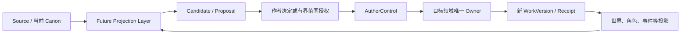

# TIANYAN_BOUNDARY_MODEL_R1

> 状态：产品语义边界冻结 R1
>
> 范围：跨端、Agent、Future Projection、角色认知与故事权威
>
> 性质：规范性产品文档，不是实现方案
>
> 不包含：UI、数据库、API、同步协议、部署方案与代码设计

## 0. 文档依据与效力

本文档继续收敛以下三类语义：

1. `TIANYAN_PRODUCT_CORE.md` 已冻结的作者权威、候选、版本、女娲、角色知识与唯一 Owner 原则；
2. `TIANYAN_CROSS_DEVICE_AND_AGENT_MODEL_R2` 在本任务中给出的跨端、Agent、Future 与角色认知语义；
3. `TIANYAN_CROSS_DEVICE_ENGINEERING_ALIGNMENT_R1` 对当前工程 Owner、双事实风险和女娲采纳链的对照结论。

当前仓库检出中没有发现后两份同名实体文件。因此，本文档以本任务明示的 R2 语义和上一轮工程对照结论为输入，不宣称已读取到这两份同名仓库文件。

本文档使用“必须”、“禁止”、“可以”表达规范强度。任何后续设计或实现与本文档冲突时，必须先回到产品语义层重新决策，不得以端侧便利、同步工具限制或 Agent 能力为理由绕过。

---

# 一、总边界：权威属于故事目标，不属于运行位置

天衍中一项故事内容是否成立，只能由以下组合判定：

- 明确的目标项目与故事来源；
- 明确的 WorkVersion 或派生版本身份；
- 目标领域的唯一 Owner；
- 有效的作者决定或已验证范围授权；
- 经 AuthorControl 与目标 Owner 完成的新版本和回执。

以下事物无论多么持久、昂贵、高可用或接近用户，都不是故事权威：

- 手机、电脑、浏览器、本地客户端；
- NAS、WebDAV、坚果云、Relay、官方云；
- 自部署服务、第三方 Provider、Agent Runtime；
- Run、Candidate、预测、规划事件、对照视图、本地缓存；
- 文件最新修改时间、上传成功、设备时钟或模型置信度。



图中的 Future 可以并行生成；进入同一目标故事的正式写入必须串行校验。

---

# 二、Future Projection Layer

## 2.1 统一定义

Future Projection Layer 是对“还没有成为当前目标故事事实的可能未来”的统一语义层。

它统一承载下列产品形态，但不要求它们在存储或界面中成为一个对象：

| 形态 | 语义 | 权威边界 |
| --- | --- | --- |
| Nuwa Scenario | 女娲在一次有界 Run 中演化出的场景或路径 | 只在所属 Run 中成立，不是正式故事 |
| Prediction | 基于已知来源提出的可能发展 | 是有据预测，不是已发生事实 |
| IF Proposal | 对“改变某个前提”的派生建议 | 在作者明确升级前，不是派生版本 |
| Planned Event | 作者或 Agent 为未来安排的事件 | 可以是已确认的计划，但不是已发生 Event |
| Derived Version | 由明确来源版本派生、可独立演化的故事版本 | 只在自身版本内拥有局部正式性，不是其来源版本的 Canon |

## 2.2 核心公式

> **Future ≠ 当前目标 Canon**

这句话同时包含两层含义：

1. Run、Prediction、IF Proposal 和 Planned Event 不得因为被保存、显示、同步或多次引用而成为 Canon；
2. Derived Version 可以在自身版本中拥有已确认内容，但它对来源版本始终是另一个故事目标，不得静默反向覆盖。

因此，“Future ≠ Canon”不否定派生版本自身的版本内事实；它否定的是跨目标、跨版本的默认等价。

## 2.3 所有 Future 形态共享的不变量

任何 Future 内容都必须能回答：

- 来自哪个项目、故事来源与 BaseVersion；
- 属于哪个 Run、候选、计划或派生版本；
- 使用了什么依据，哪些是已知、推断或未知；
- 当前是预测、建议、规划、待审、已过期、已拒绝还是已进入独立版本；
- 它可以被融入哪个明确目标，由谁决定；
- 来源变化后，它是否已过期或冲突。

这些是产品语义，不预设具体存储结构或传输形式。

## 2.4 允许的语义转换

| 起点 | 允许的下一步 | 正式性何时产生 |
| --- | --- | --- |
| Nuwa Scenario | 生成带来源的 Candidate | 经影响审查、有效决定、AuthorControl 与目标 Owner 后 |
| Prediction | 编辑、保留、拒绝、转 Candidate 或提议 IF | 同上；单纯“保留可能性”不产生正式性 |
| IF Proposal | 作者明确建立 Derived Version | 新派生版本身份和初始版本被正式建立后，且仅对该版本有效 |
| Planned Event | 保持规划，或作为正式 Event 候选进入审查 | 只有另行采纳为目标故事的 confirmed Event 才是目标事实；此时它已不再仅是 Planned Event |
| Derived Version | 独立演化，或对另一目标提出融入差异 | 融入必须在新目标上重新经过决定、AuthorControl 和目标 Owner |

## 2.5 绝对禁止

- 禁止把 Run 完成、Provider 成功、Candidate 持久化或多设备可见等同于 Canon。
- 禁止在读取、对照、同步或展示 Future 时顺便写回当前故事。
- 禁止把临时 Nuwa 走向冒充长期故事分支。
- 禁止把 IF Proposal 、保留可能性或规划事件自动升级为 Derived Version。
- 禁止用来源文件的最新内容静默替换已冻结 Run 的依据。
- 禁止将 Derived Version 的局部事实当作来源版本或另一派生版本的事实。

---

# 三、角色认知四层

## 3.1 四层定义

角色 Agent 的认知操作必须区分为 Query、Guidance、Experience 和 Information Transfer。四者不得因为都由对话或 Agent 触发而共用同一个“更新角色”语义。

| 层 | 定义 | 改变 Run | 改变正式角色状态 | 必须经过 Event |
| --- | --- | --- | --- | --- |
| Query | 查询角色已被授权可见的知识、信念、记忆和当前状态 | 否；可留下查询回执，但不改变推演语义 | 否 | 否 |
| Guidance | 对本次推演的注意方向、判断倾向或当前推演范围施加引导 | 是；仅改变本 Run 的约束与注意力 | 否 | 否；后续结果若要成为故事事实，另行走正式链 |
| Experience | 角色在故事或推演中亲历、目击、参与或承受的内容 | 临时经验改变所属 Run 的后续推演 | 只有正式经验才能改变 | 故事时间中的持久经验必须有已确认 Event |
| Information Transfer | 一个主体向另一个主体传递信息，包括完整、缺失、欺骗和误解 | 在推演中可以改变本 Run 的角色临时所知 | 跨 Run 的持久知识、信念或记忆变化必须经正式链 | 是；必须是已确认的信息传播 Event |

## 3.2 Query：只读，不因被问而发生改变

Query 可以读取：

- 角色已知内容；
- 角色相信、怀疑或误解的内容；
- 有来源的长期、短期、最近和关系记忆；
- 对当前故事版本有效的角色与世界状态投影。

Query 禁止：

- 因为作者向角色提问，就把问题中的信息加入角色知识；
- 把作者全知视角、联合对照结果或其他角色秘密透露给被查询角色；
- 把查询日志、自由摘要或模型回答冒充角色记忆。

## 3.3 Guidance：只改变 Run，不改变人物事实

Guidance 允许的影响只有：

- 角色在本次推演中优先注意什么；
- 在既有信念与价值观范围内，哪类判断倾向被放大或抑制；
- 本次允许思考、排除或尝试的推演范围。

Guidance 禁止：

- 直接增加角色知识、删除记忆或改写已发生事实；
- 把“请怀疑某人”写成角色已经怀疑某人；
- 把“从某个角度想”写成永久性格或信念变化；
- 在新 Run 中默认继承上一 Run 的 Guidance。

## 3.4 Experience：临时经验与正式经验必须隔离

Experience 有两种不同权威状态：

| 状态 | 作用域 | 后续可用性 |
| --- | --- | --- |
| Run-local Experience | 当前 Run、其子走向或同一派生上下文 | 可用于本次后续推演；不得自动进入其他 Run 或主故事记忆 |
| Canon-backed Experience | 明确目标版本 | 只有绑定已确认 Event，并经 AuthorControl 与目标 Owner 建立新版本后，才可持久影响角色认知与状态 |

如果一条经验能在独立 Run 中被自动召回并影响角色判断，它就已经不是纯类的当次临时状态。此时它必须二选一：

1. 被明确限定在同一 Run 系谱或同一派生版本中；
2. 成为由已确认 Event 支撑的正式经验。

不存在第三种“既能跨 Run 影响人物，又不属于任何故事范围”的中间事实。

## 3.5 Information Transfer：持久知识变化必须经过 Event

正式信息传播必须保留：

- 谁向谁传递；
- 传递了什么；
- 在什么故事时间与什么条件下发生；
- 信息是否完整、失真、被欺骗或被误解；
- 接收者是否听到、理解、相信、怀疑或拒绝；
- 该变化在哪个 WorkVersion 中有效。

持久信息传播的唯一语义链是：

```text
Event
  ↓
Author decision / validated scoped authorization
  ↓
AuthorControl
  ↓
Target domain Owner + new WorkVersion / receipt
  ↓
Character knowledge / belief / memory projection
```

不得使用“直接加一条角色知识”替代这条链。角色听见某句话，不代表相信它；相信它，也不代表它是世界事实。

## 3.6 不经 Event 的作者定义编辑

作者对角色核心设定、档案或初始知识的显式定义，可以由角色所在的正式 Owner 在授权下处理，不必伪造一个故事 Event。

但这是“作者定义”，不是 Experience 或 Information Transfer。任何声称发生于故事时间中的认知变化，必须由 Event 提供可回放的原因。

---

# 四、同步边界

## 4.1 两种“同步”必须分开

| 类型 | 处理对象 | 能够理解 | 不能承担 |
| --- | --- | --- | --- |
| 外部文件同步 | 文件、路径、字节、文件时间和文件级冲突 | 复制、传输、备份和文件差异 | Candidate / Canon、Owner、WorkVersion、角色知识边界、因果与跨 Owner 原子性 |
| 天衍项目同步 | 一个带项目、版本、Owner、权限与回执语义的故事工程 | 保留对象身份、来源、顺序、冲突、授权和权威状态 | 新建事实 Owner，或用传输结果改写故事语义 |

外部文件同步可以是天衍项目的一个字节传输或备份手段，但它不因此升级为天衍项目同步。

## 4.2 同步基础设施不是 Owner

| 载体 | 可以是 | 永远不是 |
| --- | --- | --- |
| NAS | 存储、备份、文件传输位置 | Event、Character、WorldState、Version 或 Canon Owner |
| WebDAV | 文件传输方式 | 版本冲突的故事语义裁判者 |
| 坚果云 | 第三方文件同步与备份服务 | 作者决定、项目权限或 WorkVersion Owner |
| Relay | 连接、转发、排队或协调载体 | 因“最新到达”就决定哪份故事为真的仲裁者 |
| 官方云 | 天衍提供的身份、传输、协调、计算、存储或备份环境 | 脱离目标项目 Owner 而存在的中央故事权威 |

官方云可以承载或运行唯一 Owner，但“运行在官方云”不会把官方云本身变成 Owner。

## 4.3 项目同步的不变量

任何被称为“天衍项目同步”的能力，必须满足：

- 保留项目、故事来源和派生版本身份；
- 保留 Event、Character、Relation、WorldState、WorkVersion、Candidate、Run 的权威等级；
- 保留作者决定、范围授权、回执、撤销与恢复语义；
- 保留对象稳定身份，不以同名或相同文本自动合并；
- 保留因果、顺序、角色知识和故事时间的来源语义；
- 对过期 BaseVersion、范围变化和冲突封闭失败，不覆盖对方；
- 跨多个 Owner 的状态不完整时，必须标记未完整或暂不可用，不得自行选择一份为真。

同步本身不创建新 WorkVersion。只有领域操作经有效权限与唯一 Owner 完成时，才能产生新版本。

## 4.4 冲突处理禁令

- 禁止“最后写入者胜出”成为故事语义。
- 禁止以设备时间、文件时间或上传顺序决定 Canon。
- 禁止把第三方工具产生的“冲突副本”自动并入项目。
- 禁止在不理解 Candidate 与 Canon 差异时合并文本。
- 禁止在离线端上用过期基线静默覆盖新版本。
- 禁止把同步错误包装为新分支、IF 或新故事方向。

---

# 五、Agent 四层权限

## 5.1 权限链

Agent 权限必须固定为：

```text
用户身份与意图
  ↓ 受项目成员身份限制
目标项目权限
  ↓ 受 Agent 能力声明限制
Agent 可用权限
  ↓ 受本次范围、版本、时间、预算与目标限制
Run 有效权限
```

一次 Run 的有效权限是四层权限的交集，不是并集。任何上层拒绝都优先于下层允许。

## 5.2 四层职责

| 层 | 回答的问题 | 能授予 | 禁止越界 |
| --- | --- | --- | --- |
| 用户 | 谁在发起和承担决定 | 身份、显式意图与确认 | 用户对其他项目的身份不自动延伸到当前项目 |
| 项目 | 该用户在哪个故事边界内能做什么 | 项目、故事来源、数据类型、动作级别与预算上限 | 不得访问未授权项目或把一个项目的事实带入另一个项目 |
| Agent | 该 Agent 被允许使用哪些能力 | 只读查询、Guidance、候选生成、工具、后台执行等可分能力 | Agent 不得因安装、换模型或换 Runtime 而扩大项目权限 |
| Run | 这一次究竟能对什么做到哪一步 | 明确 BaseVersion、对象、范围、目标、工具、预算、停止条件和权限级别 | 不得在执行中自我扩权、改变目标或延长到新项目/新版本 |

用户层确定发起者；实际故事权取决于该用户在目标项目中的身份和权限。“登录成功”不等于对所有项目有作者权。

## 5.3 权限不得上浮

- Run 不得创建或扩大 Agent 权限。
- Agent 不得修改项目成员权限或作者决定边界。
- 项目权限不得伪造用户身份或把一次决定延伸为永久决定。
- 设备、云端、Runtime、Provider 和插件都不得创建项目权限。
- 新增对象、范围、目标、版本或高风险操作时，必须重新确定 Run 授权，不得使用环境中的默认权限。

## 5.4 高权限女娲 Run

作者可以在 Run 开始时，对明确项目、故事来源、BaseVersion、范围、对象、操作类型、预算与停止条件作出一次有界授权。

该授权可以代替范围内逐项点击确认，但不能代替：

- 结构化差异与影响审查；
- 服务端范围与 BaseVersion 验证；
- ChangeSet；
- AuthorControl；
- Event、Relation、WorldState、Character 等目标 Owner；
- 新 WorkVersion、回执与补偿回溯。

超出范围、来源过期、出现新冲突、授权被撤销或达到停止条件时，高权限 Run 必须停止后续正式写入。

---

# 六、设备边界

## 6.1 设备是表面，不是故事主体

| 环境 | 可以承担 | 不得成为 |
| --- | --- | --- |
| 手机 | 阅读、查询、轻量创作、提出候选、发起作者决定 | “手机上的故事”的独立事实 Owner |
| 电脑 | 完整工作台、本地执行、项目存储、候选与正式操作入口 | 因为文件在本机就获得更高权威的设备 |
| 云端 | 身份、协调、计算、同步、备份、后台 Run | 不经项目 Owner 就能决定 Canon 的中央真理 |
| 自部署环境 | 运行天衍能力、保存项目、控制基础设施 | 因操作员掌握服务器就自动获得的作者身份 |

## 6.2 跨设备不变量

- 同一个项目对象在不同设备上保持同一稳定身份，不因复制而自动成为新对象。
- 每个正式写入都必须针对明确 BaseVersion 串行校验。
- 离线设备可以产生草稿、候选和待同步意图；在重新连接且通过目标版本校验前，不得声称已成为项目 Canon。
- 设备本地缓存、浏览器状态和未上传文件不得被其他设备当作项目事实。
- 多设备同时进行正式写入时，同一目标故事仍只能有一个通过版本校验的正式写入结果。
- 设备时钟、上线时间和上传先后不是故事时间，也不是版本因果。
- 设备丢失、离线或更换不得改变已有项目权威或把缓存升级为唯一真相。

## 6.3 运行位置可变，语义必须不变

同一个 Agent Run 可以在手机发起、云端运行、电脑审查、自部署环境保存。在这个过程中，以下内容必须保持同一语义：

- 用户与项目身份；
- Agent 与 Run 的权限范围；
- 来源、BaseVersion、目标和排除项；
- Candidate、ChangeSet、AuthorControl 和领域 Owner 的边界；
- 暂停、恢复、取消、过期、冲突和回执状态。

把 Run 从一台设备迁移到另一台设备，是执行位置变化，不是新 Run、新授权、新故事分支或新 Canon。

---

# 七、当前 Owner 的语义固定点

本文档不新建 Owner。后续实现必须继续复用已有责任：

| 领域 | 唯一语义责任 |
| --- | --- |
| Event | 正式发生的故事事件，通过既有 Event Writer 进入目标版本 |
| Character | 正式角色身份与作者定义的角色内容；角色投影不是第二 Character Owner |
| Relation | 正式关系与有效时间；关系图和观察视图只读投影 |
| WorldState | 对目标版本有效的正式世界状态 |
| WorkVersion | 作品版本身份、来源、派生和正式更迭权威 |
| Candidate | 多种领域候选可以各有工作流责任，但都必须保持非 Canon，不得形成通用第二事实库 |
| AuthorControl | 作者决定、范围授权、差异审查与正式写入边界 |
| Nuwa Run | 一次有界推演的来源、约束、权限、过程、临时状态与恢复点；不拥有正式故事事实 |

任何跨端或云化工作如果需要为上表中任一领域新建一个“云端真相”、“移动端快照真相”或“Agent 内部真相”，必须停止，回到 Owner 边界重新设计。

---

# 八、与当前工程的准入关系

本节不改写产品边界，只声明现有工程事实对后续开发的影响。

| 当前事实 | 对本边界的影响 |
| --- | --- |
| Event、Relation、WorldState、WorkVersion、AuthorControl 和 Nuwa Run 已有可定位的 Owner | 跨端与云化必须复用，不得新建对等 Owner |
| Candidate 是多种有界领域形态，不是一个统一汇总库 | 本文档只冻结“候选永远非 Canon”，不凭空指定新候选 Owner |
| 女娲已保持 Run → Candidate → ChangeSet → AuthorControl 的正式采纳边界 | 未来跨端 Run 不得缩短或替换该链 |
| 角色跨场景 `heard` 记忆可在完成正式 Event 采纳前持久并影响后续 Run | 这是对 Experience / Information Transfer 边界的当前高风险点；在它被明确限定为 Run 系谱临时记忆或改为 Event-backed 前，不得将其扩展到跨设备全局角色记忆 |
| 角色状态尚缺完整持久 Owner 和生产者 | 不得先做跨端角色状态同步，不得用云端或手机状态补位 Owner |
| Guidance 尚未成为一等语义合同 | 不得把任意自由文本指令持久成为角色知识、性格或信念 |
| WorkVersion 与回执尚未覆盖所有写入面，本地锁与原子替换也不是分布式写入协调 | 不得在此之前宣称支持多设备同时正式写入或无冲突云同步 |

上述缺口不会降低本文档的边界强度。它们意味着相应能力尚未获得开发准入，而不是可以临时绕过边界。

---

# 九、后续能力的准入门

任何手机端、NAS/WebDAV/坚果云接入、Relay、官方云、自部署、新 Agent 或角色记忆能力，在进入实现前必须逐项回答“否”：

1. 它是否在现有 Owner 之外保存了第二份事实？
2. 它是否把 Future、Candidate、Run 或规划内容当成当前 Canon？
3. 它是否使用设备、文件时间或上传顺序裁决冲突？
4. 它是否让外部同步工具或云服务成为故事 Owner？
5. 它是否让 Agent 或 Run 扩大了项目或用户权限？
6. 它是否让 Query 、Guidance 或自由文本回答改变角色知识？
7. 它是否让跨 Run 的 Experience 或 Information Transfer 绕过已确认 Event？
8. 它是否在不完整同步或过期 BaseVersion 上静默写入？
9. 它是否用 Runtime、Provider、插件、端或云的成功状态代替 AuthorControl？
10. 它是否在迁移 Run 或复制项目时伪造了新授权、新分支或新 Canon？

任何一项答案为“是”，都必须停止实现进入边界重新审查。

---

# 十、不可越界十二条

1. **Future 永远不等于当前目标 Canon。**
2. **Derived Version 只在自身版本内成立，不默认覆盖来源。**
3. **Query 只读；提问本身不会教会角色。**
4. **Guidance 只改变 Run 的注意、倾向和范围，不改变正式人物。**
5. **故事时间中的持久 Experience 和 Information Transfer 必须由已确认 Event 支撑。**
6. **角色知道、角色相信与世界为真是三种不同状态。**
7. **外部文件同步只处理文件，不处理故事权威。**
8. **NAS、WebDAV、坚果云、Relay 和官方云都不是事实 Owner。**
9. **有效 Agent 权限等于用户、项目、Agent 与 Run 四层权限的交集。**
10. **Run 可以使用被授予的权限，但永远不能创造更高权限。**
11. **手机、电脑、云端和自部署环境是执行表面，不是故事权威。**
12. **任何正式改变都必须回到目标项目、目标版本、AuthorControl 和唯一 Owner。**

---

# 十一、结论

天衍可以在任意设备上被阅读，可以在任意合法环境中运行 Agent，可以使用多种同步和云服务，也可以同时保留多种未来。

但这些可变部分必须始终围绕一个不变核心：

> **故事权威属于明确项目与版本中、经有效作者决定、由唯一领域 Owner 建立的事实。**

端、云、同步、Runtime、Provider、Agent、Run、Candidate 和 Future 都可以服务于这个核心，但都不能取代它。
