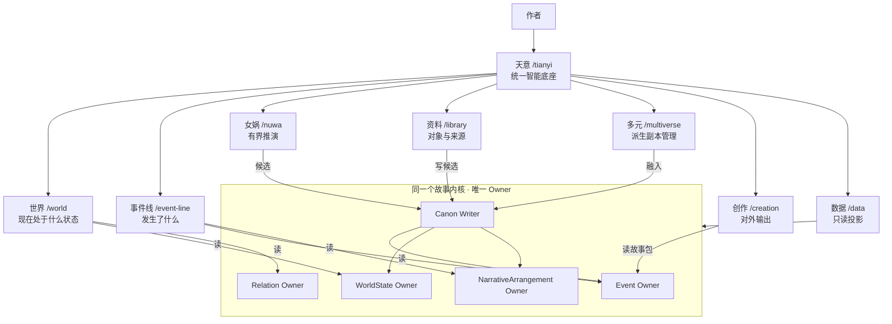
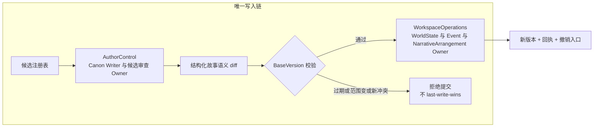
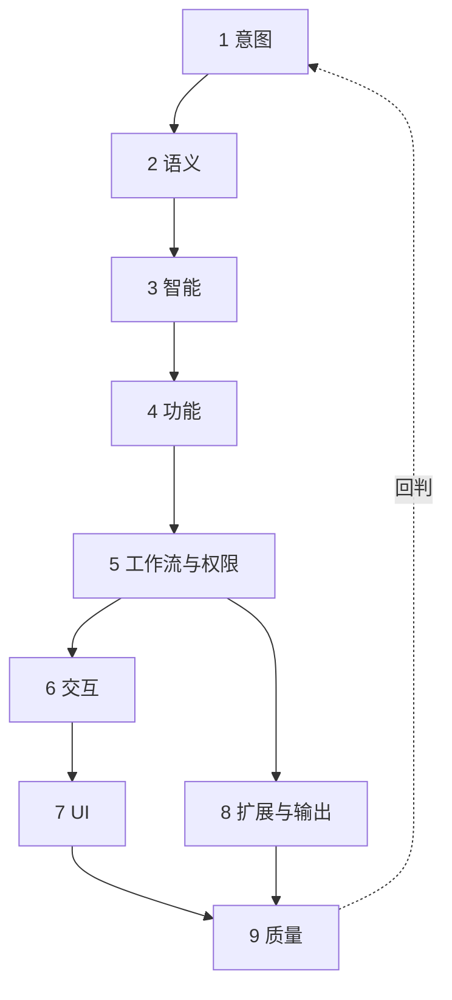
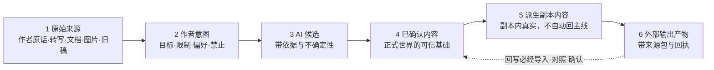
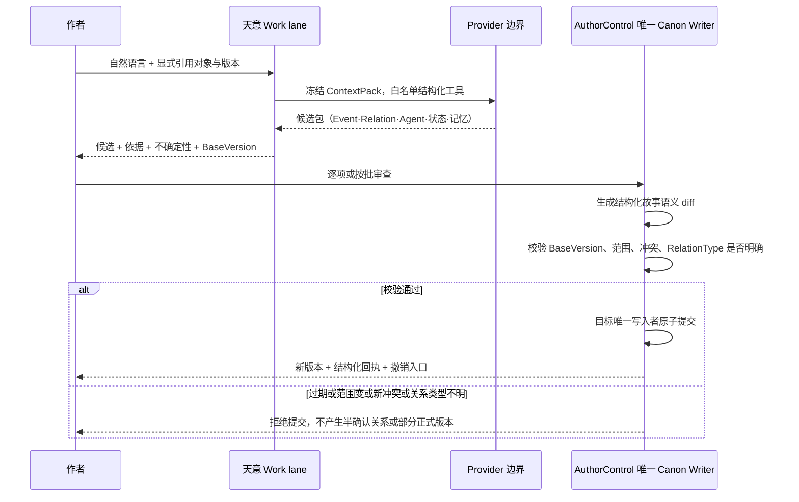
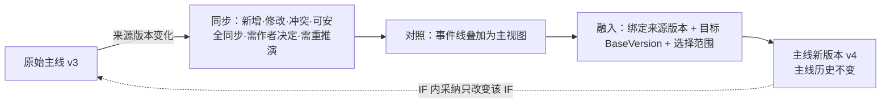
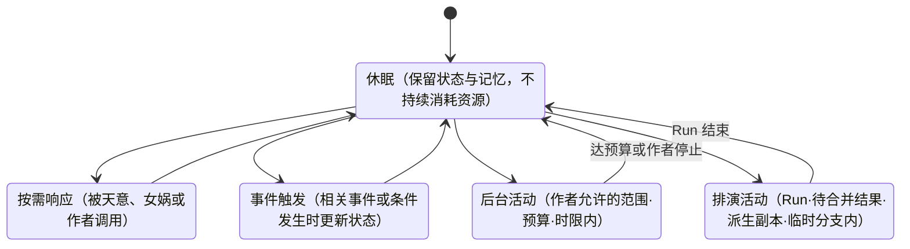
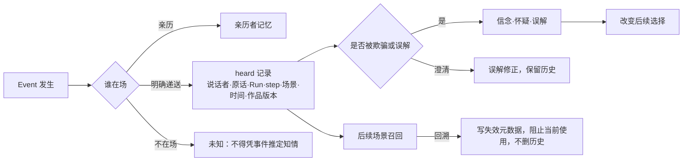
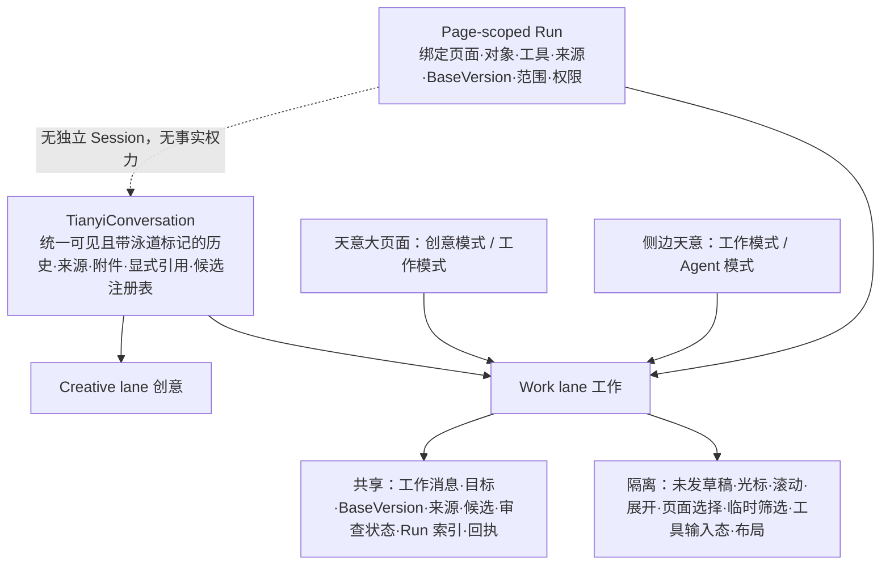
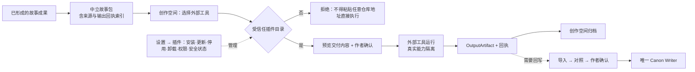

# 天衍产品地图可视化 R0

> 形式约束：只用 Mermaid、表格、ASCII。文字超过两行的段落视为违规。
> 概念不新增、不改名：全部取自 `TIANYAN_PRODUCT_CORE.md`（下称 `CORE`）。

## 0. 口径表

| 项 | 值 |
| --- | --- |
| 产品权威 | `CORE`（2488 行）；本文只做可视化，不改定义 |
| 代码 ref | `BASE:` = `origin/codex/semantic-world-r3 @ 93f41aa`（PR #28） |
| 被否决形态 | `R4:` = `d16563b`（PR #29，`FOUNDER_VISUAL_REJECTED`）— 只作反例引用 |
| 设计冻结 | `FR1:` = `a37a314`（PR #31）— 设计层，不含生产代码 |
| 路由来源 | `BASE:src/storyContracts/storyStudioWorkspaceRegistry.ts:40-47` |
| Owner 来源 | `BASE:docs/architecture/FEATURE_INDEX.json` → `.boundaries` |
| Owner 计数强制 | `BASE:scripts/validate-feature-index.mjs:20-26`（Canon Writer / WorldState / Event / NarrativeArrangement 各恰好 1） |
| 持久根 | `<project>/.world-os/workspace/**`、`<project>/.world-os/tianyi/**`（`BASE:src/storyControlSurface/storyStudioWorkspaceOperations.ts:1133-1136,4377`） |
| 本文不含 | 像素规格、切片计划、字段级合同、验收层级 |

---

## 1. 主脊：作者 → 天意 → 世界侧 / 角色侧

```
                            ┌──────────┐
                            │   作者   │  创造者·导演·观察者·最终决定者
                            └────┬─────┘
   核心设定解释权 │ 正式内容确认权 │ 副本处置权 │ Agent 采纳权
   AI 范围与预算控制权 │ 历史与插件控制权
                                 │
                    ┌────────────▼────────────┐
                    │          天意           │  统一智能底座
                    │   Creative lane 创意   │  把没说清的想法说清
                    │   Work lane      工作   │  收敛为候选·差异·决定·回执
                    └────────────┬────────────┘
             ┌───────────────────┴───────────────────┐
      世界侧＝结构（故事是什么）              角色侧＝生命（谁会怎么想）
             │                                           │
      ① 世界   现在成立吗                        ① 角色 Agent  稳定身份+档案
             │                                           │
      ② 事件线 发生了什么                          ② 运行状态  休眠/按需/触发
         节点 → 集点 → 单元                                   /后台/排演
             │                                           │
      ③ 关系与因果 谁连着谁                        ③ 记忆  核心·长期·短期·关系
             │                                           │
      ④ 地图   在哪、能不能到                      ④ 知识边界  知晓/未知/信念/误解
             │                                           │
      ⑤ 时间   什么时候成立                        ⑤ 命运 K 线  规划/实际/候选
             │                                           │
             └─────────► 同一批 Event，两种读法 ◄────────┘
                                 │
                     候选 → 作者审查 → 唯一写入链
                                 │
                    派生副本 · 女娲 Run · 外部输出
```

| 主脊层 | 世界侧落点 | 角色侧落点 | 二者共用 |
| --- | --- | --- | --- |
| 入口 | 空间轨 `/world` | 角色档案 + 磁吸实体 Dock | 工程目录的稳定引用 |
| 单位 | Event / 对象 / 系统 | Agent 的认知与状态 | 同一 WorkVersion |
| 权威 | Event、WorldState、Relation Owner | Profile、character-memory-ledger | Canon Writer |
| 变化 | 采纳 → 新版本 | 听闻 → `heard` 记录 | 结构化 diff + 回执 |
| 不可为 | 图上不画无来源的线 | 角色不记得未递送的信息 | 摘要不成为事实 |

---

## 2. 八空间总图



| # | 空间 | id | 路由 | 回答的问题 | 拥有事实 | 明令不拥有 |
| --- | --- | --- | --- | --- | --- | --- |
| 1 | 世界 | `world` | `/world` | 现在处于什么状态，最该看什么 | 无（总览） | 第二份 Event / WorldState |
| 2 | 天意 | `tianyi` | `/tianyi` | 我怎么把想法变成决定 | 会话与候选注册表 | Canon、版本、作者确认权 |
| 3 | 事件线 | `event-line` | `/event-line` | 发生了什么，方向怎么连、怎么冲突 | 事件组织关系的观察 | 每筛选条件一个事实库 |
| 4 | 多元 | `multiverse` | `/multiverse` | 副本与来源差在哪，怎么同步融入 | 派生副本身份 | 第二份 Event / WorldState / Canon |
| 5 | 女娲 | `nuwa` | `/nuwa` | 角色依据自己的知识会怎么走 | Run 与冻结输入 | 永久人物记忆库 |
| 6 | 资料 | `library` | `/library` | 对象与来源是什么，确认了没 | WorldObject、来源、地图文档 | 正文事实的权威 |
| 7 | 创作 | `writing` | `/creation` | 怎么安全交给外部工具 | OutputArtifact、故事包 | 直接读改整个数据库 |
| 8 | 数据 | `data` | `/data` | 系统跑成什么样了 | 无（只读投影） | 第二份 Canon / 会话 / 确认数据 |

| 路由细节（实测自 `BASE` 注册表，易错） | 值 |
| --- | --- |
| 创作空间 id ≠ 路由 | `id: "writing"` 但 `route: "/creation"` |
| 多元子路由（仍属同一空间） | `/multiverse/translation` · `/perspective` · `/pov` · `/if` · `/localization` · `/fan-localization` |
| 创作子路由 | `/creation/novel` · `/screenplay` · `/comic` · `/interactive` · `/translation-adaptation` · `/plugins` |
| 旧值静默迁移 | `creation→writing`、`intelligence→tianyi`、`localization→world`、`publish→world`、`/writing→writing`、`/tianyi-v2→tianyi` |
| 无法识别的 pathname | 落到 `world`，并标记 `migrated: true` |
| `/` + `skipIntro=1` | 落到 `library` |

---

## 3. 一内核八视角：谁写、谁读



| 边界 | Owner（`BASE`） | 约束 |
| --- | --- | --- |
| Canon 写入者 | `src/storyControlSurface/storyStudioAuthorControl.ts` | 恰好 1，脚本硬校验 |
| 候选审查 | 同上 | 与 Canon Writer 同文件 |
| WorldState | `src/storyControlSurface/storyStudioWorkspaceOperations.ts` | 恰好 1 |
| Event | 同上 | 恰好 1 |
| NarrativeArrangement | 同上 | 恰好 1 |
| Provider 出口 | `apps/story-studio/server/providerGateway/aiProviderGateway.mjs` | 唯一边界 |
| 关系 | `src/storyWorkspace/relationRepository.mjs` | 唯一读写者 |
| 地图/图/时间线/树/画布文档 | `src/storyWorkspace/visualDocumentRepository.mjs` | 唯一文档 Owner |
| 地图编辑提案 | `src/storyWorkspace/mapEditProposalRepository.mjs` | 只存提案与回执，不改地图 |
| 普通文件 | `src/storyWorkspace/materialFileRepository.mjs` | 附件不伪装成对象 |
| 人物记忆 | `src/storyContinuity/characterMemoryRepository.ts` | 项目级逐角色 ledger |
| Agent 识别提案 | `src/storyIntelligence/agentRecognitionProposalRepository.ts` | 唯一提案 Owner |
| 运行底座 | `src/storyAgent/tianyiAgentRuntimePort.ts` → `agentRuntimePlugin.ts` → `plugins/builtinPiAgentRuntimePlugin.ts` | Pi 可替换 |

| 空间 | 写 | 读 | 绝不做 |
| --- | --- | --- | --- |
| 天意 | 会话、引用、候选 | 来源、记忆、版本 | 自建第二套 `messages` / `sessionId` |
| 事件线 | 节点/集点/单元的组织 | Event、Relation、预测、待合并变化 | 为筛选新建事实库 |
| 女娲 | Run、冻结输入、候选步骤 | Profile、权限投影、听闻 | 成为永久记忆库 |
| 资料 | WorldObject、来源、文件、地图文档 | 修订历史、依据正文 | 附件冒充设定对象 |
| 多元 | 派生副本身份与同步决定 | 来源差异、冲突 | 反向覆盖来源 |
| 创作 | OutputArtifact、故事包 | 已确认 Event、Story Unit | 让插件直接写正式故事 |
| 数据 | 无 | 全部只读投影 | 建第二份 Canon |
| 世界 | 无 | 全部投影 | 把示意图当事实 |

---

## 4. 九层产品栈

| 层 | 回答 | 关键构件 | 出处 |
| --- | --- | --- | --- |
| 1 产品意图 | 为什么做 | 作者-AI 关系、不可牺牲价值 | `CORE:69-73` |
| 2 故事语义 | 故事由什么组成 | 来源·Agent·关系·事件·节点·集点·单元·主线·支线·暗线·时间·记忆·知识·伏笔·世界状态·风格·想法 | `CORE:75-79` |
| 3 智能与 Agent | AI 怎么理解记忆推演 | 天意、页面 Agent 模式、故事 Agent、上下文组装、记忆、知识边界、候选提炼、剧情检测、预测、女娲排演、后台任务 | `CORE:81-85` |
| 4 功能 | 去哪做什么 | 八空间 + 设置 + 个人中心 | `CORE:87-91` |
| 5 工作流与权限 | 想法怎么成正式故事 | 来源·候选·审查·正式·派生·同步·对照·融入·输出·操作历史 | `CORE:93-97` |
| 6 交互 | 怎么操作 | 对话·语音·拖入引用·上传·选节点·画布·批量审查·预览改·版本对照·确认 | `CORE:99-103` |
| 7 UI | 复杂能力怎么看清 | 空间轨·工程目录·主工作区·对象详情·右侧天意·移动抽屉·状态视觉·语义缩放·空状态·渐进披露 | `CORE:105-109` |
| 8 扩展与输出 | 怎么连外部 | 中立故事包·GitHub 适配·受信任插件·安装更新·外部调用·输出产物·回执·安全隔离 | `CORE:111-115` |
| 9 质量 | 怎样算好用 | 一致性·可解释·可恢复·长篇·权限安全·移动·无障碍·性能·视觉统一·真实作者体验 | `CORE:117-121` |



---

## 5. 六级信息阶梯



| 层级 | 能被 AI 摘要替代 | 默认 UI 身份 | 越界判据 |
| --- | --- | --- | --- |
| 原始来源 | 否，必须保留 | 来源卡 + 精确引用范围 | 摘要覆盖原文 = 违反 `CORE:198` |
| 作者意图 | 否 | 意图/约束条目 | 当成故事事实 = 违反 `CORE:204` |
| AI 候选 | 可编辑、合并、拒绝、重生成 | 候选标签 + 可编辑 | 猜装扮成已确认 = 违反 `CORE:160` |
| 已确认 | 修订须成新版本 | 实线稳定态 | 无痕覆盖 = 违反 `CORE:226` |
| 派生副本 | 副本内有效 | 来源标注 | 自动进主线 = 违反 `CORE:232` |
| 外部产物 | 否 | 外部输出态 | 直接回写 = 违反 `CORE:238` |

---

## 6. 五个动词不许混用

| 动作 | 改故事事实 | 建版本 | 建派生副本 | 持久度 | 出处 |
| --- | --- | --- | --- | --- | --- |
| 保存草稿 | 否 | 否 | 否 | 当前浏览器单槽 | `CORE:216` |
| 保留候选 | 否 | 否 | 否 | 可恢复候选历史 | `CORE:217` |
| 保留可能性 | 否 | 否 | 否 | 跨会话只读方向，不演化 | `CORE:218` |
| 升级为 IF | 否（另立线） | 是（副本自有） | 是 | 独立版本线 | `CORE:219` |
| 采纳 | 是 | 是 | 否 | 目标故事正式生效 | `CORE:220` |

| 易混对 | 判据 |
| --- | --- |
| 保留可能性 vs IF | 后者必须由作者显式升级，并建立来源与版本身份 |
| 待合并变化 vs 历史版本 | 前者尚未写入目标；后者已不可混淆 |
| 临时分支 vs 派生副本 | 前者局部短期，可比、可并、可弃、可长成副本 |
| 筛选视图 vs 事实 | 视图只存查询条件、显示范围、排序、折叠、叠加选择 |
| 归档 vs 永久删除 | 删除分四级：移出视图 / 归档 / 可恢复区 / 永久删除 |
| 未选候选 vs 丢弃 | 未选自动进可恢复候选历史，R0 不静默永久删除 |

---

## 7. 正式写入链



| 环节 | 硬规则 | 出处 |
| --- | --- | --- |
| 采纳前 | 必须已展示目标、`BaseVersion`、变化范围、受影响对象、来源、冲突、风险 | `CORE:294` |
| 点击采纳 | 唯一一次正式决定；高影响只加信息密度，不加第二次确认 | `CORE:294` |
| 采纳依据 | 只能用结构化故事语义 diff；文本或文件 diff 只是来源证据与表现补充 | `CORE:296` |
| 影响说明 | 从 diff 派生、逐项可追溯；自由摘要不得成为采纳依据、Canon 或长期记忆 | `CORE:298` |
| 回执内容 | `BaseVersion`、目标故事、变化范围、受影响对象、来源、安全工具参数快照 | `CORE:300` |
| 快照禁止 | 密钥、令牌、敏感凭据；大输入只存不可变引用、范围、摘要校验与必要哈希 | `CORE:300` |
| 关系阻断 | RelationType 不明确则含该关系的采纳必须阻断；可显式排除后作为新的完整原子操作 | `CORE:302` |
| 撤销 | 建补偿版本反向表达，不删原采纳版本 | `CORE:1845` |
| 恢复 | 以历史状态为来源建新当前版本，不指针倒退 | `CORE:1845` |
| 并行度 | 分析·预测·Run·候选生成可并行；正式写入同一时刻单写者 | `CORE:184` |
| 审查前 | 候选包在作者审查前对全部正式对象写入为 0 | `CORE:437` |

---

## 8. 版本谱系

```
原始主线（作者当前认可并持续维护的那条线，不是唯一真理）
│
├── 历史版本 … v1 ─ v2 ─ v3   不可混淆；撤销=补偿版本；恢复=新当前版本
│
├── 临时分支                   同一父版本内短期分叉：可比·可并·可弃·可长成副本
│
├── 候选历史                   未决工作记录，可恢复，不是分支也不是版本
│     └── 保留可能性            跨会话只读方向，不自动演化，无独立 Canon
│
├── 待合并变化                 已可比对、尚未写入目标；事件线只读叠加层观察
│
└── 派生副本                   各自拥有内容·历史·Agent·事件线·时间线
      ├── 女娲副本   ├── 翻译副本   ├── 视角副本   ├── IF 副本   └── 本土化/改编副本
            ▲ 只有作者显式"升级为 IF"才建立
            ✗ 不为每个 AI 候选自动建分支
```



| 对照视图元素 | 表达 |
| --- | --- |
| 原始内容 | 稳定显示 |
| 副本新增 | 另一种状态显示 |
| 修改 | 并排或重叠 |
| 删除或替换 | 保留轮廓 |
| 冲突 | 突出 + 处理入口 |
| 未同步来源变化 | 标记 |
| 点任意差异 | 展开 Agent、关系、物品、地点、记忆、知识与世界状态影响 |
| 一切对照 | 最终落到结构化故事语义 diff；自然语言总结不作权威变化集合 |
| 备选视图 | 左右分屏·变更列表·单元摘要·Agent 差异·关系图差异·地图差异·时间差异 |

---

## 9. 语义状态视觉矩阵

| 状态 | 线 | 面 | 角标 | 文字 | 权威字段 | 可编辑 |
| --- | --- | --- | --- | --- | --- | --- |
| 已确认 | 实线 | 稳定底 | 无 | 已确认 | Event / Relation 正式记录 | 修订成新版本 |
| 候选 | 实线 | 弱底 | 圆点 | 候选 · 尚未保存 | 候选注册表 | 是 |
| 预测 | 虚线 | 半透明 | 幽灵 | 预测 | 多节点预测 Run | 是 |
| 派生副本 | 双点线 | 副本底纹 | 来源箭 | 派生自 X@v | WorkVersion 来源 | 副本内可 |
| 未归类 | 细线 | 无 | 问框 | 未归类 | 归类状态 | 是 |
| 已过期 | 断线 | 灰化 | 旧版本标 | 基于旧版本 | BaseVersion 比对 | 只读 |
| 冲突 | 实线 | 警示底 | 叹号 | 冲突 · 待处理 | 冲突投影 | 需决定 |
| 未知 | 点线缺段 | 无 | 无 | 未知 | 字段缺省 | 否 |
| 已归档 | 细灰线 | 无 | 箱 | 已归档 | 归档状态 | 需恢复 |
| 外部输出 | 描边空心 | 无 | 外箭 | 外部产物 | OutputArtifact | 只读 |

| 硬规则 | 内容 | 出处 |
| --- | --- | --- |
| 颜色不得唯一 | 同时用标签、边框、线型、图标、文字 | `CORE:2131-2153` |
| 归类 ⟂ 权威 | "已分类/未归类" 与 "候选/待确认/已确认" 三个正交概念，不得混成一组互斥状态 | `CORE:496`、`CORE:1722` |
| 未知要写未知 | 不显示假数据，不为画图伪造精确日期 | `CORE:375` |
| 无连线含义 | 未展示 / 未定义，不推定中立 | 世界观前案 |
| 禁止动画插值 | 不编造中间状态 | 世界观前案 |
| 相邻不等于因果 | 事件相邻不自动成立因果 | `CORE:2317-2328` |

---

## 10. Agent 模型



| Agent 类型 | 侧重 | 与其他层的接点 |
| --- | --- | --- |
| 角色 | 目标·动机·认知·记忆·关系·选择·对话 | 角色核心与底线冻结进 Run；本场目标逐角色 |
| 物品 | 状态·持有人·能力·限制·历史·触发条件 | 持有人随事件与时间变化 |
| 地点 | 空间·环境·规则·容量·相邻·进入条件·事件记忆 | 与地图共用 `x-right-y-down`，可选北向 |
| 组织 | 成员·结构·目标·资源·影响力·内部关系 | 势力口径待作者定义 RelationType |
| 规则 | 适用范围·条件·例外·代价·冲突 | 规则对象也是 Agent |
| 自定义 | 按作者定义的能力·字段·行为参与故事 | 分类库扩展 |

| Agent 共同结构 | — |
| --- | --- |
| 身份 | 稳定身份与名称、类型与子类型 |
| 状态 | 当前状态、长期属性、变更历史 |
| 认知 | 记忆、与其他 Agent 的关系、知识边界 |
| 范围 | 所属地点与可活动范围、所属来源/分支/运行范围 |
| 能力 | 能力与限制、允许工具、可被谁调用、是否允许后台 |
| 来源 | 来源与可信度 |
| 作者可控 | 调用频率、工具、预算、上下文、可生成内容、是否允许创建子 Agent |

| 关键区分 | 内容 | 出处 |
| --- | --- | --- |
| Agent ≠ 常驻模型 | 本质是稳定身份 + 状态 + 记忆 + 关系 + 规则 + 能力 + 知识边界 + 可被调用的响应方式 | `CORE:417` |
| Pi ≠ 领域权威 | Canon、Event、WorldState、来源、分支与版本身份、权限、持久化、候选状态、作者确认权由天衍领域层拥有 | `CORE:427` |
| 新 Agent 默认未归类 | 仍须显示来源、用途、所属范围 | `CORE:481-483` |
| 创建入口 | 一句话引导·对话提炼·导入提取·节点生成·图片地图理解·手动·模板·女娲临时生成 | `CORE:503-511` |
| 起草之后 | 已知 / 推断 / 未知分开，逐项或按区块批次确认 | `CORE:513` |
| 归类动作 | 改名与类型·批量归类·合并重复·替换已有·留为 Run 专属·融入指定目标·删除·重生成 | `CORE:485-494` |

---

## 11. 上下文 ≠ 工程目录 ≠ 侧栏 ≠ 天意

```
┌ 左导航轨 ┬ 工程目录 ──────┬ 中央主工作区 ────────┬ 右侧天意 Dock ─┐
│ 八空间   │ 浏览与引用     │ 唯一工作面，不卸载   │ 操作界面       │
│ 全局导航 │ 组织·排序·     │                      │ 工作模式 /     │
│          │ 稳定引用      │                      │ Agent 模式     │
└──────────┴───────────────┴──────────────────────┴────────────────┘
      ✗ 上下文不是左侧栏    上下文 = 一次 AI 操作被允许看到和引用的范围
```

| 三者 | 拥有 | 不拥有 |
| --- | --- | --- |
| 工程目录 | 导航、组织、排序、稳定引用；已分类/未归类视图；待确认收件箱 | Canon、Event、WorldState、故事正文 |
| 上下文 | 本次操作的参考范围、排除项、预算、过期标记 | 不是 UI 区域，不是侧栏 |
| 右侧天意 | 操作界面、模式切换、Run 与回执投影 | 独立 Session、独立事实权力 |

| 上下文清单必答八项 | 内容 |
| --- | --- |
| 用了什么 | 页面·选中节点·单元·相关 Agent·关系邻域·最近事件·拖入资料·上传来源·当前副本·开放伏笔·风格·作者固定或排除项 |
| 为什么用 | 每条入选原因 |
| 来源版本 | 精确到对象版本与修订 |
| 排除了什么 | 及排除理由（可只显示数量而不泄漏被排除身份） |
| 是否过期 | 来源版本、筛选范围、启用结果、目标写入位置任一变化 → 回执过期并重校验 |
| 预算 | token 或字节上界；必需项超限时发送前阻断 |
| 边界 | 是否越过角色知识边界 |
| 影响 | 输出影响哪些对象 |



| 记忆维度 | — |
| --- | --- |
| 类型 | 核心 · 长期 · 短期 · 最近 · 确认经历 · 关系记忆 · 知识 · 信念 · 怀疑 · 误解 · 被遗忘或被压抑 · 当前注意力 · 副本临时记忆 |
| 隔离 | 主故事记忆 / 派生副本记忆 / Run 与待合并结果的临时记忆互不污染 |
| 来源 | 每条记忆需来源与时间 |
| 非世界时间 | 系统回执时间、归档时间、人物听闻时刻、图形位置都不作为世界时间 |

---

## 12. 天意：一个会话、两条泳道、三个表面



| 切换 | 必须 | 禁止 |
| --- | --- | --- |
| 创意 ↔ 工作 | 两条泳道都不清空、不丢统一历史 | 自动进入另一泳道的 ContextPack |
| 大页面 ↔ 侧栏（同一 Work lane） | 消息、来源、候选、审查状态、Run 索引连续 | 建第二套 `messages` / `sessionId` Owner |
| 工作 ↔ Agent | 切换不取消 Run | 把计划步骤、工具状态写进故事脊柱 |
| 左侧一级"天意" vs 事件线"天意助手" | 分别用 `routeId=tianyi` 与 `toolId=tianyi-agent` | 共用 active state、动作或可访问性语义；`/tianyi` 上循环打开自身 |
| ContextDock | 只有一个 `activeToolId`，切工具替换当前工具 | 追加第二个面板 |
| 布局挤压 | 空间不足时工程目录与 ContextDock 互斥，Dock 变可关闭覆盖层 | 卸载、隐藏或丢失中央工作面路由内状态 |
| 工具执行后 | 实际使用的安全参数快照进 Run 回执 | 密钥与凭据进快照 |

| 六种权限形态（不是只有允许/不允许） | 效果 |
| --- | --- |
| 只读理解 | 只读取、解释、回答 |
| 提供建议 | 不创建内容 |
| 生成候选 | 建候选对象或节点，等作者审查 |
| 授权编辑 | 指定对象与范围后直接改，保留修改记录与回退 |
| 派生副本自主运行 | 副本内连续推演，不越界改原始主线 |
| 后台持续工作 | 在时间·预算·范围·停止条件内持续整理、检查或推演 |

| 确认的粒度 | 作者可对一次操作、一个批次、一个单元或一个派生副本预先给范围授权；系统仍须保留修改记录、影响说明与撤销 |
| --- | --- |

---

## 13. 六类智能能力对照

| 能力 | 触发者 | 输入边界 | 输出 | 落点 |
| --- | --- | --- | --- | --- |
| 候选提炼 | 作者显式"整理为故事候选" | 白名单工具 `propose_story_intake` | 版本化候选包 | AuthorControl |
| 剧情检测 | 一级本地确定性；二级作者触发 | 一级零 token | 异常、冲突、开放问题 | 只读投影 |
| 事件线预测 | 作者选节点或连续片段 | 当前来源与版本，局部直接 | ≥1 条有依据虚线后续 | 候选注册表 |
| 女娲排演 | 作者建 Run | 冻结角色核心·底线·本场目标·人物修订·权限与可知投影 | 步骤候选，可授权自动应用 | Run + 既有 Owner |
| 注意力选择 | Run 装配 | 先取授权集合，再按目标·词项·稳定 ID 排序，UTF-8 字节上界 | 入选来源与原因；排除项只显数量 | 检查器与工具输入同源 |
| 跨场景记忆 | 明确递送 | 同项目·同版本链·不晚于场景时点的 active `heard` | 召回记录 | character-memory-ledger |

| `propose_story_intake` v1 | 说明 |
| --- | --- |
| 允许写入的 `type` | `character` `item` `location` `event` `relation` `story_unit` `narrative_path_membership` `unresolved` |
| 每个候选必须绑定 | 精确原文证据、来源、`BaseVersion`、置信度、不确定性、提议关系、候选生命周期 |
| 只读迁移，不得继续写入 | `storyUnit` `narrativePathMembership` `storyline` |
| `narrative_path_membership` 边界 | 只是同一版本内主线/支线/暗线的成员关系候选；不是正式故事线实体，不建第二个 StoryUnit / Storyline / Event / 版本 Owner |
| Provider 自由文本 | 只能作说明，不替代工具结果，不自动转成候选 |
| 逐项处理 | 只有作者逐项确认且存在对应唯一 Writer 适配时，目标 Writer 才处理该项；未确认、拒绝或不受支持类型继续保持候选 |

---

## 14. 外部输出与插件



| 插件原则 | 判据 |
| --- | --- |
| 权限 | 只获得已声明并由作者确认的能力 |
| 输入 | 收故事包，不收整个项目数据库 |
| 写入 | 不能自动写入正式故事 |
| 卸载 | 不删除已有故事包与输出产物 |
| 迁移 | 换插件不需要迁移核心故事数据 |
| 完整性 | 安装、更新、执行前重新验证 |
| 失败 | 失败·超时·取消·不可用都有明确状态与回执 |
| 归属 | 插件中心固定属于"设置 → 插件"；创作空间只有"选择外部工具"入口 |
| 证明 | 记录上游仓库、版本、许可证与构建证明 |

| 适配方向 | — |
| --- | --- |
| 长文 | 小说与长文工具 |
| 剧本 | Fountain 与其他剧本工具 |
| 互动叙事 | Ink、Twine |
| 视觉 | 漫画工作流、分镜、漫剧与视频工作流 |
| 语言 | 翻译与排版工具 |
| 空间 | 地图与图谱工具 |
| 声音 | 音频工具 |

---

## 15. 六类完整作者体验（流程表）

| 体验 | 步序（→ 一次交接） | 收口判据 |
| --- | --- | --- |
| 只有一个想法 | 天意说出 → 记录原话并提问 → 提炼角色·地点·故事问题·想法·灵感候选 → 快速审查 → 首个候选进注册表与可恢复历史 → 同一会话继续改·保留·保留可能性·升级 IF → 一次采纳生成新版本+回执+撤销 → 世界首页显示状态与下一步 | 候选不因模式切换丢失 |
| 导入已有长篇 | 上传 → 保留原文并分章节·节点·集点·单元 → AI 提取 Agent·关系·事件·时间·伏笔·描写·风格 → 按章节或类型批量审查 → 已确认进资料与事件线 → 开放问题与冲突清单 → 选范围继续规划·预测·送女娲 | 原文逐字不被摘要替代 |
| 事件线预测 | 选节点或连续片段 → ≥1 条有依据虚线后续 → 直接修改·组合·拒绝·保留候选·保留可能性·升级 IF → 选当前明确目标 → diff 展示 BaseVersion·范围·来源·影响·冲突 → 一次采纳 → 未选进候选历史 | 在 IF 中采纳只改该 IF |
| 女娲深入推演 | 选来源与版本 → 选单元·事件·Agent 范围并设目标·限制·预算·权限 → 有界 Run 或显式保留的副本中推演 → 可读·对话·暂停·干预·继续 → 来源变化时提示同步与过期范围 → 对照看增删改替 → 选范围融入或高权限 Run 一次授权 → 串行校验建新版本 | 旧版本与来源副本仍保留 |
| 多元派生 | 选来源版本 → 选派生目的（翻译·视角·IF·本土化·改编）→ 建副本 → 来源变化时作者手动拉更新、看差异、决定冲突 → 需要时交创作插件输出 | 派生不反向覆盖来源 |
| 外部创作 | 选成果 → 生成故事包 → 选方向 → 从受信任目录安装或选择工具 → 预览交付内容并确认 → 运行 → 输出与回执进创作空间 → 需回写则导入对照确认 | 输出保留来源包、工具、版本、参数与回执 |

---

## 16. 分界：避免做出第二份事实

| 问题 | 归属 | 判据 |
| --- | --- | --- |
| 发生了什么 | 事件线 | 单位是 Event |
| 现在还成立吗 | 世界 | 单位是对象与系统 |
| 他怎么想 | 角色 Agent 与记忆 | 单位是认知与状态 |
| 为什么走成这样 | 因果观察（无独立本体） | 派生自正式 Event 与 Relation |
| 在哪、能不能到 | 资料空间地图（编辑）+ 世界（观察） | 布局坐标与视口不写事实 |
| 日志、成熟度、Provider 计数 | 数据 | 面向系统的账本，只读 |
| AI 会话历史 | 天意 | 唯一 `TianyiConversation` |
| 副本谱系 | 多元 + 副本管理 | 唯一来源与版本身份 |

| 三条不做 | 理由 |
| --- | --- |
| 不建第二份事实库 | 日志、地图、关系视图都不得建立第二份事实 |
| 不把未实现功能做成可点主按钮 | 预留功能必须显式标识且不可点击，不占默认主工作面 |
| 不用"映射率 100%"替代可发现性 | 登记位置 ≠ 可用 |

---

## 17. 口径冲突登记（绘图时实测到的不一致）

| # | 冲突 | 两侧事实 | 处置 |
| --- | --- | --- | --- |
| K1 | 顶级空间数量 | `CORE:91` 与 `CORE:648` 列 8 个；`CORE:367` 写"事件线空间是七个顶级产品空间之一"；`BASE` 注册表 `id` 恰好 8 条 | 以注册表 8 条为准，`CORE:367` 待订正 |
| K2 | 地图归属 | `docs/product/DESIGN.md` 写"地图继续使用世界空间"；实现在 `/library?libraryView=map`，smoke 钉住该 URL | 需创始人裁定；本文两侧都画，不预先合并 |
| K3 | 命运 K 线 | 产品核心已确认多维、可编辑、多轨迹对照、可解释关联事件；代码侧 `characterFateProjection` 零引用零测试且缺时间轴权威 | 图上保留节点并标"未接通" |
| K4 | 世界脉搏 | `FEATURE_INDEX` 有 `continuous-world-pulse` 且标 PRODUCTION_CONNECTED，但 UI 侧 `pulse` 命中 0；其真实语义是写作面板的"显式提及"投影 | 不得当作脉搏后端；世界脉搏视为不存在 |
| K5 | 因果本体 | `eventCausalIndex`（正式 Relation 派生）与 `worldCausalEvolution`（标签正则派生）并存无共同权威 | 需裁定唯一本体 |
| K6 | 势力口径 | 成员投影已写好但唯一消费端把成员类型数组留空，圈层渲染 0 个；测试钉住"追捕/结盟不是成员" | 一期只做成员圈层与地点管辖 |
| K7 | 世界时间 x 轴 | 正式 Event 无结构化世界时间字段，世界时间是投影形态 | 需裁定时间权威 |
| K8 | 数据空间 | 产品核心定义其职责为集中呈现；R0 有意只到静态壳、不接领域数据 | 图上标"外壳" |
| K9 | 视觉几何 | 左轨 190/176/132、右栏 350/320/312/288 四源不一致；受管视口是 1920/1440/1280/1152 | 本文不取任何 px |

---

## 18. 章节索引

| 本文小节 | 权威出处 |
| --- | --- |
| 1 主脊 | `CORE:127-141` 作者 · `CORE:142-167` AI · `CORE:413-419` Agent |
| 2 八空间 | `CORE:648-1421` + `BASE:src/storyContracts/storyStudioWorkspaceRegistry.ts:40-47,85-115` |
| 3 一内核八视角 | `CORE:650` + `BASE:docs/architecture/FEATURE_INDEX.json .boundaries` |
| 4 九层栈 | `CORE:65-121` |
| 5 信息阶梯 | `CORE:190-238` |
| 6 五动词 | `CORE:214-220` |
| 7 写入链 | `CORE:182-186` · `CORE:292-302` · `CORE:431-437` |
| 8 版本谱系 | `CORE:246-290` · `CORE:1803-1884` |
| 9 状态视觉 | `CORE:2131-2153` · `CORE:496` · `CORE:1722` |
| 10 Agent | `CORE:421-513` |
| 11 上下文与记忆 | `CORE:1566-1659` |
| 12 天意泳道 | `CORE:682-769` · `CORE:1480-1488` · `CORE:2063-2091` |
| 13 智能能力 | `CORE:431-437` · `CORE:873` · `CORE:1063-1220` |
| 14 插件与输出 | `CORE:2004-2055` |
| 15 作者体验 | `CORE:2251-2313` |
| 16 分界 | `CORE:656-678` · `CORE:1415-1419` · `docs/product/DESIGN.md` |
| 17 冲突登记 | `docs/research/TIANYAN_SYSTEM_MAP_R0.md` §5-§6 · `docs/research/TIANYAN_UI_VISUAL_ANALYSIS_R0.md` §3.2 · `docs/product/TIANYAN_WORLD_WORKBENCH_PRODUCT_DESIGN_R0.md` §7 |
