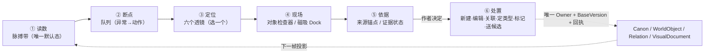
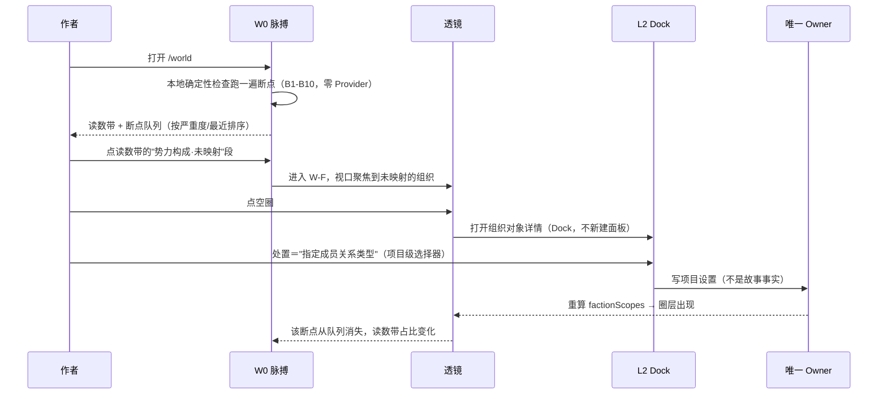
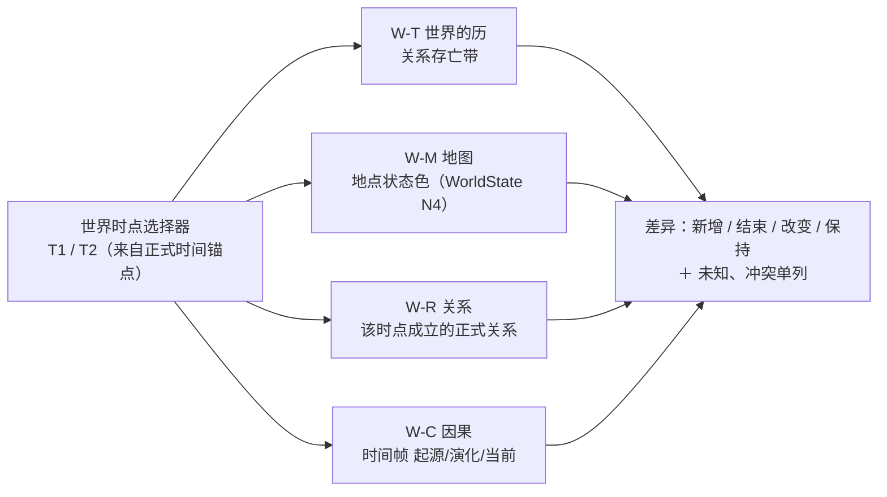

# 天衍世界工作台产品设计 R0

> 生成日期：2026-09-18。角色：产品设计（只读分析 + 设计提案，不改代码、不动数据、不提实现补丁）。
>
> 输入：`docs/research/TIANYAN_SYSTEM_MAP_R0.md`（工程地图）、`docs/research/TIANYAN_UI_VISUAL_ANALYSIS_R0.md`（视觉拆解）、`TIANYAN_PRODUCT_CORE.md`（唯一产品定义）、`docs/product/DESIGN.md`、`docs/product/TIANYAN_VISUAL_WORLD_EVOLUTION_R0.md`、`FOUNDER_FEEDBACK.md`（R1 冻结对 R0 世界观的否决理由）。
>
> **ref 记法**（本文所有行号必须带这两个前缀之一）：`BASE:` = `origin/codex/semantic-world-r3` @ `93f41aa`（11:10，生产代码基线）；`FR1:` = `origin/codex/tianyan-ui-design-freeze-r1` @ `a37a314`（15:19，最新 ref，仅设计原型与冻结文档）；`R4:` = `codex/world-workbench-r4` @ `d16563b`（12:52，**已被创始人否决，禁止作为基础**）；`盘` = 工作树 `f77b800`（09-16，落后基线 44 个提交）。合同一律在**仓库根** `src/storyContracts/`，不在 `apps/story-studio/src/`。
>
> 本文是**产品设计**，不是工程现状报告。它不新增 Owner、不改八空间注册表、不冻结像素；§7 的七项必须创始人书面裁定后才能进入实现。

---

## 0. 动手前必须摆平的矛盾

这次任务同时给了两个方向相反的要求，把它们摆在一起才有设计空间：

| 来源 | 要求 |
| --- | --- |
| 本轮任务 | 世界观**不是资料库**；重点设计世界脉搏 / 因果 / 势力 / 地图 / 时间 / 角色关系；**用图表思维表达，避免大量文字列表** |
| `FR1:docs/design/TIANYAN_UI_DESIGN_FREEZE_R1/FOUNDER_FEEDBACK.md:38-55`（对 R0 世界观的四条否决） | ① 展示看板大于作者工作流，首屏四块脉搏 + 因果网络 + 演化时间线 + 类型卡全集，"像一个世界设定报告"，作者不知道先做什么；② 默认因果网络过重，多数节点无正式证据，"容易把示意当成事实"，**因果网络不应作为默认首屏**；③ 脉搏、时间线、对象浏览互相抢层级；④ 缺少明确的编辑 / 新建 / 关联 / 冲突处理 / 补全入口，搜索只给结果不闭环 |

上一版已经按"图表化"做过一次并失败了：`R4` 那一版把世界观改成 pulse / typed cards / causal chains / story rail（`R4:apps/story-studio/src/components/world/WorldReferenceWorkspace.tsx`），结果是**四块脉搏是 `<ul>` 文字列表、演化区是 `<ol class="wb-timeline">` 加 CSS 圆点、因果链是 `<li>` 加 `→` 字形**——形式上仍是列表，观感上仍是报告；同时 `R4:...WorldReferenceWorkspace.tsx:109` 的注释"全部来自既有标签/性质/状态，不生成百分比"说明作者刻意回避了图形化，因为**没有可信的分母**。

所以本设计的立场不是"多画图"，而是三条判据：

1. **图是仪表，不是展板。** 每个图必须回答一个作者问题，并且图上的每个异常标记都能变成一个动作。回答不了动作的图，就是报告。
2. **无来源不画。** 图上每个视觉标记（点、线、圈、色、宽度、角度）都必须能指回一个唯一 Owner 的真实字段；指不回的不画，宁可留空。**这一条是"禁止假按钮/假数据"纪律在图形上的延伸**，也正是否决理由②的解药。
3. **默认态只给一个读数，其余按透镜展开。** 六个视图不等于六块首屏。层级失衡（否决理由③）只能靠"少同屏"解决，不能靠字号。

---

## 1. 产品定位：世界观不是资料库

### 1.1 一句话

> **事件线读"发生了什么"，世界读"现在还成立吗"。**
>
> 世界工作台是作者的**诊断台**：在这里看出这个世界是否还在自转——哪些规则在生效、哪条因果没有依据、哪个势力没有成员、哪个地方没落到图上、谁还不知道什么、事情发生的先后对不对得上——然后把看到的每一个异常变成一个可执行的动作。

资料空间回答的是"有哪些人、事、物、地点、关系、规则和创作资料，它们从哪里来，现在处于什么状态？"（`TIANYAN_PRODUCT_CORE.md:1225`）——那是**清点**。世界空间回答"我的故事世界现在处于什么状态，我接下来最需要关注什么？"（`:656`）——那是**判断 + 下一步**。产品核心给世界首页列的 15 项内容里，"未解决的伏笔、问题和冲突""等待作者确认的候选""正在运行的 Run""下一步建议"占了一半（`:660-677`），并明确要求"第一屏突出当前作品、当前状态、最重要异常和一个清楚的下一步"（`:678`）。**世界工作台不是资料库，也不是资料库的图形化前端。**

### 1.2 六个视图：资料库形态 vs 工作台形态

| 视图 | 资料库形态（要避免的） | 工作台形态（本设计） | 作者在这里作出的判断 |
| --- | --- | --- | --- |
| 世界脉搏 | 一组统计数字卡片 | **读数带 + 断点队列**：每个读数是构成条（真实分母 = 对象全集），点下去就是待处置清单 | "世界现在健康吗？最该先补哪一处？" |
| 因果 | 一张大网络图 | **因果脊**（六桶横向链）→ 按需升网络（≤1 跳）；每条边带确定性档位 | "这件事的后果有没有依据？哪一环是我猜的？" |
| 势力 | 组织简介卡片 | **成员圈层 + 管辖描边**：圈层来自成员关系，边界来自管辖关系，无关系不画 | "哪股力量是空的？哪个地方归属未定义？" |
| 地图 | 一张好看的图 | **时点透镜**：同一张图在两个世界时点上的状态差 | "到这里为止，世界在空间上说得通吗？" |
| 时间 | 事件列表按日期排 | **世界的历**：锚点 / 区间 / 冲突 / 未定位四种 x 轴落法 + 关系存亡带 | "时间和关系、地点对不对得上？哪里对不上？" |
| 角色关系 | 关系表格 | **邻域图 + 知情差集矩阵**：图讲"连着谁"，矩阵讲"谁不知道" | "谁掌握了他不该知道的？谁被漏在消息之外？" |

**知情差集矩阵是六视图里唯一别人做不了的**：角色不共享全知视角是产品硬边界（`:61`），而 9 态知情投影在生产里是活的（见 §5.7）。世界工作台如果只画"人和人的连线"，就退化成了资料库的另一种皮肤。

### 1.3 与相邻空间的职责分界（防止做出第二份事实）

| 分界 | 世界工作台 | 对方 | 判据 |
| --- | --- | --- | --- |
| vs **事件线** | 以**对象/系统**为单位看持续性作用（规则 scopeLevel、changeKind、关系存亡区间） | 以 **Event** 为单位看发生了什么、叙事编排、预测、视角（`:804-873`） | 事件线已有 观察·关系 / 编排·时间线 两个投影。**世界不复制 Event、不承载 NarrativeArrangement、不做预测、不做采纳**；世界的时间轴只读同一批 Event ID |
| vs **资料** | 只读投影 + 处置入口 | 对象的创建、编辑、归类、来源审查、批量整理（`:1229-1288`） | "编辑这个对象"永远跳回资料或角色档案，世界工作台不内嵌第二套编辑器 |
| vs **数据** | 面向创作的诊断 | 面向系统的只读投影、运行状态、目录成熟度、日志、可解释性（`:1417-1419`，R0 有意停在静态壳） | 见裁定项 **D6**：不裁定就会出现两个"总览" |
| vs **天意** | 图上的选择与范围 | 一切自然语言问答、候选生成、Agent 模式 | 世界工作台只交出**稳定引用**（对象 ID / Event ID / Relation ID + 版本），不自己组装上下文 |

### 1.4 三条不做（写进设计的硬边界）

1. **不建第二事实库。** 无新 Owner；WorldObject / Relation / Event / WorldState / VisualDocument / Canon 继续由 `BASE:src/storyControlSurface/*` 与 `BASE:src/storyWorkspace/*` 唯一拥有。`项目目录导航.md` §5 与 `scripts/validate-feature-index.mjs:19-28` 会拒绝任何平行实现。
2. **世界工作台不写正式故事。** 页面内 0 写入端口；所有处置动作都是"带着稳定引用离开本页"——送候选进 `createCandidateReview`，或跳资料/角色档案编辑。唯一 Canon 写入者仍是 `BASE:src/storyControlSurface/storyStudioAuthorControl.ts:977`。
3. **不画无来源的形。** 见 §5.9 假图清单：势力强弱、亲缘远近、影响半径、时间趋势——这四类是故事工具里最常见的假图，本文全部禁用。

---

## 2. 产品结构：一条主环 + 四层 + 六个透镜 + 一份断点目录

### 2.1 主环



主环的关键是**闭合**：否决理由④说"搜索第二状态只展示结果，没有与任务完成形成闭环"（`FR1:docs/design/…/FOUNDER_FEEDBACK.md:53-55`）。本设计中每一层都有一条明确的出口边通向下一层，且⑥之后图上那个标记的状态必须真的改变（因为图绑定的是 Owner 投影，不是本地副本）。

### 2.2 四层结构

| 层 | 内容 | 默认出现 | 可写 | 复用现有资产 |
| --- | --- | --- | --- | --- |
| **L0 脉搏层** | 读数带（4 个构成读数）+ 断点队列 + 当前故事镜头 | **是，且是唯一默认态** | 否 | `BASE:...components/world/WorldOverviewWorkspace.tsx`（122 行，`/world` 默认面）、`continuous-world-pulse` 特性位 |
| **L1 透镜层** | 因果 / 势力 / 地图 / 时间 / 关系 五个全屏只读投影 | 否（作者显式进入） | 否 | `FocusedRelationsWorkspace.tsx`、`MapM1Workspace.tsx`、`event-observation/TemporalCanvas.tsx` |
| **L2 现场层** | 对象详情：概览 / 因果链 / 演化时间 / 关系与影响 / 当前故事 / 来源与证据 | 由 L0/L1 上的点按出 | 否（编辑跳走） | `BASE:...components/entity-dock/EntityInspectorDock.tsx:27`（`DOCK_TABS`，挂在所有 outlet 之外的通用工作面） |
| **L3 依据层** | 来源锚点、Evidence 状态、修订与回执；技术信息降权 | 折叠 | 否 | `getRelationEvidence`、`readMapRevision`、回执链 |

L2 直接复用**已存在**的磁吸 Dock，不新建详情面板：它的六个页签（`FR1:design-prototypes/tianyan-ui-freeze-r1/world.html` 的对象 dock 是 概览/因果链/演化时间/关系与影响/当前故事/来源与证据）与产品核心的"渐进披露"（`:2121-2129`）一致。注意其中三签目前是**诚实空态**（状态/命运投影合同无生产者，`EntityInspectorDock.tsx:160/:164`；世界 6 签中"当前故事""规划/候选"为空，`:322`），保持空态，不用文字填满。

### 2.3 六个透镜的定义表（本文的轴）

| # | 透镜 | 作者的问题 | 主图元 | 一句读法 | 默认动作 | 禁止表达 |
| --- | --- | --- | --- | --- | --- | --- |
| P | 脉搏 | 现在最该管哪一处 | 构成条（stacked bar）× 4 + 断点队列 | 看**构成分布**，不看大小 | 点读数 → 过滤断点队列 | 时间趋势线（无世界时间历史）、百分数（无稳定分母的项） |
| C | 因果 | 这一环有依据吗 | 因果脊（六桶横向）→ 有向网络（≤1 跳） | **实线=正式，虚线=候选，点线=推测** | 点断链 → 定关系类型 / 送候选 | 全图网状默认态、无向"相关"边 |
| F | 势力 | 哪股力量是空的 | 成员圈层（半透明圆角域）+ 管辖描边 | 圈内=成员，圈外=未映射；**线=有向关系** | 点空圈 → 指定成员关系类型 | 节点大小=实力、领地填充=主权、势力间无类型连线 |
| M | 地图 | 空间上说得通吗 | 分层图（图层/标记/区域/通道）+ 时点状态色 | 色=WorldState 派生，形=作者手绘 | 点地点 → 看该时点依据 | 比例尺/距离数字（`scaleKnown=false`）、"曾出现"→"现居" |
| T | 时间 | 先后对得上吗 | 世界的历：锚点点 + 区间块 + 冲突带 + 未定位托盘；叠加关系存亡带 | 越靠右越晚；**空心=推断** | 选两点 → 关系/地点双时点比较 | 用 `updatedAt`/系统回执时间当 x 轴、均匀插值伪造中间态 |
| R | 角色关系 | 谁不知道什么 | 径向邻域图 + 知情 9 态矩阵 | 线=正式关系，格=该角色对该事件的知情态 | 点越界格 → 查来源 / 送候选 | 边长=亲密度、力导向自动跳动布局 |

**因果与时间的"默认不重"如何实现**：P 是默认，C/T/F/M/R 全部在透镜选择器后面；C 的默认形态是**单条脊**（一屏内 ≤12 个节点，超出即折叠为集点），网络形态需要作者显式"展开为网络"。这直接对上否决理由②和 `FR1:docs/design/…/FEATURE_PRESERVATION_MATRIX.md:55` 已登记的口径——世界因果网络图当前是"设计预留（不可点击）… 无证据不画线"。

### 2.4 断点（Break）：世界工作台唯一的"下一步"来源

断点 = **一条可机器判定的、指向真实字段的、带动作的世界级异常**。它是把"看板"变成"工作台"的那个零件：读数带统计断点的构成，队列展示断点，透镜定位断点，处置消费断点。

断点分两档，**沿用产品核心已确认的两级检测合同**（`:873`：结构类由本地确定性检查、零 tokens；语义类由作者触发的 AI 检查）：

| ID | 档 | 触发条件（全部是真实字段） | 出现 | 动作 | 动作去向的 Owner |
| --- | --- | --- | --- | --- | --- |
| B1 孤立对象 | 本地 | `WorldObject`（`BASE:...storyStudioWorkspaceOperations.ts:310`）的 `backlinks` 空且 `linkedObjects` 空且 `relatedKeys` 空 | P F M R | 关联 / 标记待确认 | Relation Owner / AuthorControl |
| B2 关系类型未决 | 本地 | `relationTypeResolution === "unresolved"`（`relationRepository.mjs:19`）或 `relationTypeId` 为未决哨兵 | C R | 定类型（**采纳前必须阻断**，`:302`） | Relation Owner |
| B3 证据过期 | 本地 | `RelationEvidenceStatusR0.status ∈ {stale, unsupported, legacy-unanchored}`（`storyStudioRelationOperations.ts:84`） | C R L3 | 查看依据 / 重绑来源 | 只读 |
| B4 时间冲突 | 本地 | `TemporalConflict`（`temporalProjection.ts:45`）或 `RelationTemporalConflict`（`relationTemporalComparison.ts:17`） | T P | 核对时点 | Event owner（经作者确认） |
| B5 时间未知 | 本地 | `temporal.validFrom` 非 ISO → 行落入 `unknown`（`relationTemporalComparison.ts:12/:99`）；或 `placementKind==="unplaced"` | T | 补时点 / 触发有界推断 | 同上 |
| B6 势力无成员 | 本地 | 存在 `type==="faction"` 对象，但 `factionScopes()` 返回 `[]`（`BASE:...components/world/factionScopes.ts:43`） | F P | 指定"成员关系类型" | 项目级设置（**待建，见 §5.8 S0-1**） |
| B7 管辖未定义 | 本地 | `MapRegion` 无 `objectId`、或 `structure.administrationRelationTypeIds` 未覆盖该地点（`BASE:…localTransport.ts:863`）；`unclassifiedRelationCount > 0`（`storyStudioLocationTopology.ts:29`） | M F | 归类地点结构 | Location topology 读投影 |
| B8 规则无生效依据 | 本地 | `CausalDimensions.authority === "author"` 且无 `confirmed-event` 时间帧（`worldCausalEvolution.ts:17/:39/:158`） | C P | 补来源 / 转候选 | Event owner |
| B9 地点没上图 | 本地 | `WorldObject.type==="location"` 且当前版本所有地图 `markers[].objectId` / `regions[].objectId` 均不含它 | M P | 放到图上 | VisualDocument Owner |
| B10 因果本体分歧 | 本地 | `eventCausalIndex` 与 `worldCausalEvolution` 对同一对象给出不同维度/方向结论 | C T | 只看分歧，不给建议 | **裁定项 D3** |
| B11 因果缺口 | **AI** | 作者触发：相邻不自动等于因果（`:825`）却缺边 | C | 送天意提候选 | Candidate Review |
| B12 知情越界 | **AI** | 作者触发：`knowledgeState` 与事件 `knowledgeSubjectIds` 矛盾（`eventStoryCrossingKnowledge.ts:33/:54`） | R | 送天意 / 建候选 | Candidate Review |
| B13 伏笔未回收 | **AI** | 作者触发：`thread` 类对象无对应下游确认事件 | P T | 送天意 | Candidate Review |

纪律：**本地档必须零 Provider、零 token、可离线全量跑**；AI 档只能由作者显式点击、必须显示范围与费用预估、结果只能是候选（`:867`、`:906-910`）。断点队列**不是第二个待确认收件箱**——它只导航到已有的候选审查面（顶栏 `data-panel-toggle="pending-review"` + `project-directory/pendingReviewAggregation.ts:135`），见 **D7**。

### 2.5 产品结构层明确不做

不做实时协作看板；不做"世界评分/丰富度总分"（无字段，见 §5.9）；不做地图测量与地形物理；不做命运 K 线（`characterFateProjection` 零引用零测试，且只覆盖产品核心要求的 3/5 种轨迹——先补合同与时间轴权威，见 FATE-F1）；不做势力数值沙盘；不做自动布局动画；不在 `/world` 内嵌正文编辑器。

---

## 3. 页面结构

### 3.1 壳层与路由事实（设计必须服从的现状）

- **没有路由库。** 目的地 = `window.location` + query，挂载点是 `BASE:apps/story-studio/src/product-shell/workspace/ShellWorkspaceOutlet.tsx:44-102` 的 `if` 阶梯。新增视图 = 新组件 + 一条 outlet 分支 + 一个 FEATURE_INDEX 条目，不改 `App.tsx`（7 行）与 `TianyanR0Shell.tsx`（`AGENTS.md`）。
- **磁吸 Dock 不属于任何空间**，无条件挂在所有 outlet 之外（`ShellWorkspaceOutlet.tsx:105`）→ L2 复用，不新建。
- **右栏是"单工具槽"不是信息流**：`useDockLayoutState.ts:6-34` 只有一个 `activeToolId`，`tianyanR0ShellContract.test.ts:54-58` 断言"切第二个工具后 `openPanelIds` 仍只有一个"。**所以 L1 透镜不能塞进右栏**；右栏只放当前故事上下文（`FR1:…/INTERACTION_RULES.md:24-27` 已定：1440 常驻 300px，1152 覆盖抽屉）。
- 深链参数名必须统一：现状唯一断链是 Dock 发 `objectId` 而 Shell 读 `characterId`（系统地图 §5.F）；本文新增深链一律 `worldView` + 显式 `objectId`/`relationId`/`eventId`，不再发明第二个别名。

### 3.2 W0 默认态（1440）

```
┌ rail ┬──────────────────────── central workspace（世界工作台）────────────────┬ 300 ┐
│ 176  │ 状态条  作品 · WorkVersion · 世界时间锚点 · 证据健康 n/m   （技术信息折叠）│ 当前 │
│ 八空 │ ┌────────────────────── ① 读数带（4 个构成条，全宽，高 ≤96px）────────┐ │ 故事 │
│ 间导 │ │ 规则构成  压力/生效  未决线索   与当前故事关联                        │ │ 上下 │
│ 航   │ │ ▓▓▓░░░    ▓▓░░░░    ▓▓▓▓░      ▓▓▓▓▓░        ← 每段可点=过滤        │ │ 文   │
│      │ └────────────────────────────────────────────────────────────────────┘ │ (对 │
│      │ ② 断点队列（唯一的"下一步"面）                                          │ 象   │
│      │  ▸ B6 势力无成员 · 北溟漕帮            [指定成员关系类型 →]  2 项         │ 详情 │
│      │  ▸ B4 时间冲突 · 3 个事件互斥          [核对时点 →]          1 项         │ 按需 │
│      │  ▸ B2 关系类型未决 · 4 条              [定类型 →]            4 项         │ 打开)│
│      │ ③ 当前故事镜头（小卡：当前单元 / 最近确认事件 / 当前世界时间）            │
│      │    [进入透镜：因果 · 势力 · 地图 · 时间 · 关系]  ← 次级按钮，≤5 个        │
└──────┴─────────────────────────────────────────────────────────────────────────┴─────┘
```

- **首屏面积配比**：读数带 ≤96px、队列与镜头占主列余量；图（构成条/透镜画布）是最大视觉区域，任何文字列表不得高于一屏 50%。这是对否决理由①"四块横带 + 纵向演化轨 + 卡片网格在同一屏竞争注意力"的直接修正：一屏只有一个带、一个队列、一个镜头。
- 1152：右栏改覆盖抽屉；队列保持单列可读（`FR1:…/INTERACTION_RULES.md:42-43`）。
- 视觉值不锁死：rail 176 / 右栏 300 是 FR1 冻结值，现状代码是 132 / 288，2026-09-17 效果图是 190 / 350（`TIANYAN_UI_VISUAL_ANALYSIS_R0.md` §3.2）。本文按 **FR1 值**画结构，几何归裁定项 **D1**。

### 3.3 页面清单

| 页面 | 路由 | 内容 | 现有对应物 | 迁移处理 |
| --- | --- | --- | --- | --- |
| W0 世界工作台 | `/world` | L0 三层 | `BASE:...world/WorldOverviewWorkspace.tsx`（**未登记进 FEATURE_INDEX**，系统地图 §5.E） | 改版后必须登记；保留 `world-overview-*` testid 或同步改 smoke 断言（§6） |
| W-C 因果 | `/world?worldView=causal` | 因果脊 / 网络两态 | `EntityInspectorDock` 的因果链页签（`R4` 已改文本 `<ol>`，`worldCausalEvolution.ts` 已接通） | 旧 `/world?worldView=causal` 无历史，不需兼容 |
| W-F 势力 | `/world?worldView=faction` | 成员圈层 + 管辖 | `factionScopes.ts` 投影 + `FocusedRelationsWorkspace.tsx:259` 的圈层渲染（现渲染 0 个） | 与关系透镜共用 SVG 底座 |
| W-M 地图 | `/world?worldView=map` | 时点透镜（只读） | `BASE:...world/MapM1Workspace.tsx`（现入口在 `/library?libraryView=map`，旧 `/world?worldView=map` 只作兼容） | **归属性见 D2** |
| W-T 时间 | `/world?worldView=time` | 世界的历 | `BASE:...event-observation/TemporalCanvas.tsx` + `temporalCoordinateTracks.ts` | 世界侧只读复用，不建第二时间轴 Owner |
| W-R 关系 | `/world?worldView=relations` | 邻域图 + 知情矩阵 | `BASE:...world/FocusedRelationsWorkspace.tsx`（现入口在 `/library?libraryView=relations`） | 同上，见 D2 |
| L2 现场 | 磁吸 Dock | 六页签 | `EntityInspectorDock.tsx` | 不新建 |
| L3 依据 | Dock 内折叠 / 抽屉 | 锚点、修订、回执 | 既有 | 不新建 |

**不新增顶级导航**：八个空间注册表 `BASE:src/storyContracts/storyStudioWorkspaceRegistry.ts:39-48` 与 `tianyanR0ShellContract.test.ts:24/:26`（displayName 数组恰为八个、workspace 数 = 8）都不动。六个透镜是 `/world` 的 query 态，不是六个目的地——这与 `FR1:design-prototypes/tianyan-ui-freeze-r1/world.html:127-130` 只有四态（默认/搜索/对象详情/因果视图）不冲突，见 §3.4。

### 3.4 与 FR1 四态原型的关系

`FR1` 的世界观原型把界面收敛成 **4 个状态**：① 默认工作态（任务区 + 故事透镜）② 搜索结果 ③ 对象详情 ④ 因果视图。它的默认态把"作者下一步可以做什么"放在主任务区（`FR1:…/INTERACTION_RULES.md:6`），搜索是第二状态、清空即回到默认（`:15-18`）。

本文的六透镜对它的关系是**展开而非重做**：

| FR1 状态 | 本设计 |
| --- | --- |
| ① 默认工作态（task-list / task-card / task-actions） | = W0，其中"任务区"由**断点队列**具体化（本文 §2.4 给每条任务真实触发字段，避免任务变成装饰） |
| ② 搜索第二状态 | 保持（`hybridRetrieval` + `semantic-index` 已在基线，混合检索 R3 的语义通道在配置 profile 前诚实不可用） |
| ③ 对象详情 | = L2 磁吸 Dock |
| ④ 因果视图 | = W-C；**势力/地图/时间/关系四个透镜是本次新增**，FR1 里只有 `查看地图`/`查看关系` 两个跳转按钮 |
| `sem is-faction` 语义徽标 | 保留为六类之一（`WorldReferenceCategory` 已含 `faction`，显示名"组织"） |

FR1 原型里的因果网络是**硬编码 `svg viewBox="0 0 760 300"`**（`FR1:...world.html:342`），且已登记为"设计预留（不可点击）… 实施时需补充证据驱动投影"（`FEATURE_PRESERVATION_MATRIX.md:55`）。本设计的对应要求是：**没有 `buildEventCausalIndex` 驱动就不允许画那条网络**（§5.8 S0-2 是它的前置）。

### 3.5 每页首屏三件套（统一模板）

```
[ 图（主区，最大视觉元素） ]
[ 读数/图例条（≤40px，含"本图缺什么数据"的诚实位） ]
[ 动作带（1 个主动作 + ≤4 个次级） ]
```

- 一个状态只有一个主动作（产品核心 `:2115-2119`、`FR1:…/INTERACTION_RULES.md:7` 橙色/玉色主按钮 ≤1）。
- 技术信息（Run ID、修订、Provider 次数、索引健康）一律进折叠 `.tech-box`（`FR1:…/INTERACTION_RULES.md` §6）。
- 六透镜共享同一"图例 + 缺失声明"组件：任何图先自报"本视图绑定 N 个来源、M 项无数据"，把诚实空态做成图的一部分而不是页脚的道歉文字。

---

## 4. 交互流程

### 4.1 F1 诊断 → 处置（主流程）



要求：**每一跳都必须可返回且保持现场**（视口、选择、筛选、滚动）；断点消失只能因为它的触发条件真的不再成立，不能因为"作者看过"。

### 4.2 F2 双时点回放（跨透镜共享同一个观察时点）

世界工作台唯一的"跨视图状态"是**观察时点**（T1/T2），其余状态各视图自持：



这条流程不是新发明：`REL-N3B` 的双世界时间只读比较已交付（`compareRelationsAtWorldTimes:37`、`TIANYAN_ROADMAP.md:56`），`MAP-M2` 的"按故事节点观察地点状态、观察位置只由已确认 Event 派生、`current` 不等于系统时间"也已交付（`TIANYAN_ROADMAP.md:58`）。**本设计做的是把两者接到同一个时点选择器上**，不新增事实。禁止：动画插值中间态、无历史几何时用当前地图冒充历史地图（`docs/product/TIANYAN_VISUAL_WORLD_EVOLUTION_R0.md` §6）。

### 4.3 F3 图上补全 → 回写（唯一写入链）

```mermaid
flowchart LR
  S["图上选中 1..n 个对象<br/>（稳定 ID + 当前 WorkVersion）"] --> H["交给天意<br/>只传引用，不传副本"]
  H --> CD["Candidate<br/>（AI 只能产出候选）"]
  CD --> AR["AuthorControl.createCandidateReview<br/>BASE:storyStudioAuthorControl.ts:693"]
  AR|"作者采纳一次"| AW["applyAuthorChangeSet :977<br/>校验 BaseVersion，不 last-write-wins"]
  AW -->|"唯一 Canon/Relation/WorldState 写入"| OS["Owner 投影更新 + 回执"]
  OS --> GR["图上该标记从虚线→实线<br/>断点退出队列"]
```

约束（来自系统地图 §3 的四条，全部有工程载体）：AI 侧 `formalWrites: 0`；世界工作台自身 0 写端口；推断落回正式事实必须走这条链；角色记忆 / 听闻不是世界事实，不进任何视图的事实层。

### 4.4 统一画布语法

沿用产品核心 `:2155-2174` 与现有实现，六透镜不得各发明一套：

| 能力 | 语法 | 现有实现 |
| --- | --- | --- |
| 缩放 / 平移 / 适应 / 聚焦当前 | 滚轮缩放、Space 或中键拖、"适应视图"、"定位当前" | `FocusedRelationsWorkspace.tsx:294/:298`（手写 pan/zoom/fit，边界 .55–1.8）；`EventGraphCanvas.tsx` 用 `@xyflow/react` 的 `Controls/MiniMap` |
| 选择 | 普通单选；Shift/Ctrl/Cmd 多选；空白框选 | 产品核心 `:871` |
| 交给天意 | 拖入 = 稳定引用；**每个拖拽都要有点击式"添加引用"替代**（键盘/触控） | `:2176-2182` |
| 语义缩放 | 缩远见骨架/集点，中景见关键项，近景见完整内容 | `:843-847`；地图侧 `TIANYAN_VISUAL_WORLD_EVOLUTION_R0.md` §4 |
| 右键菜单 | 随对象身份变化；Esc 只关菜单不清依据 | `:871` |
| 复制稳定 ID | 保留 | 现有 |

**不做力学/力导向布局**：现状没有任何自动布局算法（`eventNarrativeLayout.ts:49-55` 是"轨道 × 深度"手工坐标；`TemporalCanvas.tsx:213-218` 是时间→像素；关系图是手工径向 `:289`），`@dagrejs/dagre` 与 `leaflet` 在 `BASE:package.json:24,27` **声明但从未 import**。透镜布局必须**稳定不跳动**（产品核心 `:837` "新增分支不能让已经固定的主干整体跳动"），所以采用"手工/确定性轨道布局 + 作者可钉位"，不引入新依赖。

### 4.5 证据状态视觉语法（图表思维的地基）

产品核心 `:2131-2153` 要求"颜色不是唯一表达方式，需同时使用标签、边框、线型、图标和文字"。六视图共用这张表，任何视图不得自定义语义：

| 状态 | 线 | 填充/面 | 角标 | 文字 | 真实字段来源 |
| --- | --- | --- | --- | --- | --- |
| 已确认 | 实线（墨） | 纸色实心 | 无 | 名称 + 类型 | `reviewState==="confirmed"` / `nature==="confirmed-fact"` |
| 候选 | **虚线（铜金）** | 斜纹 | `候` | "候选 · 尚未保存" | `reviewState==="candidate"` / `certainty==="ai-candidate"` |
| 作者规划 | 点划线 | 无填充 | `规` | "规划，未发生" | `status==="planned"`（`EVENT_AUTHORITY_STATUSES`，`storyStudioWorkspaceOperations.ts:241`）/ tag `作者规划`（`:239`）/ `authority==="author_planned"` |
| 推测/无依据 | 点线（浅） | 无 | `?` | "推测" | `certainty==="speculative"` |
| 冲突 | 双线 + 红色警示槽 | 条纹 | `!` | "冲突 n" | `TemporalConflict` / `RelationTemporalConflict` / `certainty==="conflict"` |
| 过期 | 降饱和 + 右上角断链标 | — | `旧` | "基于旧版本" | `confidence==="stale"`、`evidence.status==="stale"` |
| 未知 | 空心 | 无填充 | `未知` | **必须写"未知"，不留白**（`:2153`） | `unknown` 集合、`placementKind==="unplaced"` |
| 派生副本 / IF | 来源色描边 + 来源角标 | — | `IF` | 显示来源与版本 | `workVersionId` / `inheritedFromWorkVersionId` |
| 听闻（角色记忆） | 不进事实层 | — | `闻` | "听闻，非世界事实" | `characterMemoryRepository` 的 `heard` |

**这条表是"避免大量文字列表"能安全执行的前提**：图形语法一旦被允许自定义，六视图就会给出六种互相冲突的读法，否决理由②（示意冒充事实）会以另一种形式回来。

### 4.6 降级规则（数据不足时视图怎么退）

| 情况 | 退法 |
| --- | --- |
| 无 `TemporalProjectionRun` | 显示基于正式 Event/Relation 的**确定性基础布局**，且不得标为"AI 推断"（`:867` 原话） |
| `scaleKnown=false` | 隐藏比例尺、禁距离/面积读数；只保留方位（作者显式设北向时才谈方位结论，`TIANYAN_ROADMAP.md:59`） |
| 无成员关系类型映射 | 势力透镜显示"0 个圈层 · 需指定成员关系类型"的**动作空态**，不是显示组织卡片列表凑数 |
| 因果两源分歧（D3 未裁） | 只显示 `eventCausalIndex`（正式 Relation 派生），`worldCausalEvolution` 的标签派生维度折叠在"标签推断"分组里并显式标源 |
| Embedding profile 未配置 | 检索只走词项通道，语义通道显示"诚实不可用"（`hybridRetrieval.ts:185` reranker 槽位空、`ACTUAL_EMBEDDING_EVAL=NOT_RUN`） |
| 合同有、无生产者（状态/命运投影） | 页签保留 + 诚实空态（`EntityInspectorDock.tsx:160/:164`），不生成无来源轨迹 |

### 4.7 空态与返回现场

空态必须说明"为什么空 / 什么会出现在这里 / 从哪里开始 / AI 能怎样帮"（`:2184-2193`），不能只留图标和 `0 项`。跨空间跳回必须恢复：中心对象、筛选、视口、滚动、当前队列项——`REL-F0` 已交付"返回现场"（`TIANYAN_ROADMAP.md:57`），世界改版不得回退它。

---

## 5. 数据来源（逐视图绑定 + 三档成熟度）

### 5.1 权威来源清单（本文不允许出现这张表之外的来源）

| 来源 | 提供什么 | 成熟度（FEATURE_INDEX / 实测） |
| --- | --- | --- |
| `BASE:src/storyContracts/worldReferenceProjection.ts` | `WorldReferenceEntry{id,title,category,nature,status,knowledge[],tags[],relatedKeys[],updatedAt}`；六类（含 faction→"组织"）、四性质、三角色知识态 | `world-reference-r1` LOCAL_REVIEW；**纯无状态，persistenceOwner: None** |
| `BASE:src/storyControlSurface/storyStudioWorkspaceOperations.ts` | `WORLD_OBJECT_TYPES:232 = character\|location\|event\|item\|faction\|rule\|thread`；`StoryStudioWorldObject:310{body,properties,typedProperties,knowledgeSubjects,subtype,profile,linkedObjects,backlinks,card,visualReferences,worldProjection}`；可编辑 frontmatter `:239`；事件权威 `:241`；写作文档 `mentionedObjects:437` | `world-materials-m2` PRODUCTION_CONNECTED；`continuous-world-pulse` PRODUCTION_CONNECTED（**注意：`src/` 与 `apps/story-studio/src` 全仓 0 处 "pulse" 字样；该特性位指的是"显式提及 + 已验证事件 + 已存元数据"这套投影口径，不是一段脉搏代码**） |
| `BASE:src/storyControlSurface/storyStudioRelationOperations.ts` | `RelationRecordR0:45{sourceObjectId,targetObjectId,relationTypeId,relationLabelSnapshot,direction,reviewState,evidenceRefs,provenance,revision,archived,supersedesRelationId,decisionReceipt,temporal}`；`temporal:15{validFrom,validTo,orderConstraint,confidence,sourceAnchors}`；`RelationTypeDefinitionR0:66`；`evidence:84`；`RelationReadProjectionR0:93` | `focused-relations-r0` LOCAL_REVIEW。**Relation 上没有 `kind`/`category` 字段，只有 `relationTypeId` + label** —— 这条决定了势力/因果视图能画什么 |
| `BASE:src/storyContracts/eventCausalIndex.ts` | `buildEventCausalIndex(eventId, relations):28` → `EventCausalIndex:15{antecedents,directTriggers,necessaryConditions,results,downstreamImpacts,uncertainOrConflicted}`，项含 `depth:1\|2`、`category`、`certainty` | **唯一真正的因果边来源**；分类是 `:24-26` 的标签/ID 正则；只吃 `confirmed` + `author-confirmed` |
| `BASE:src/storyContracts/worldCausalEvolution.ts` | `CausalDimensions:29{scopeLevel,expression,changeKind,bounds,authority,worldTime,branchLabel}`；`CausalEvolutionCard:47`；`CausalTimeFrame:39`；`WorldContextPack:183` | 已接通到 Dock（`projectCausalEvolution`/`attachTimeFrames` 在用）；`buildWorldContextPack:203` **无生产消费者**；`projectCausalEvolution:133` 返回 `timeFrames: []`（`:152`），`attachTimeFrames:158` **永不产出"规划/候选"帧**；维度全部由 `:105-123` 标签正则派生 |
| `BASE:src/storyContracts/temporalProjection.ts` + `temporalCoordinateTracks.ts` | `TemporalPlacement:20`（5 种 `placementKind`）、`TemporalSegment:35`、`TemporalConflict:45`、`TemporalProjectionRun:58`；轨道 `primary/parallel/aftermath`（y=150/340/530） | 合同完整；**Run 需要 Provider**（作者触发、有界、带费用预估）；`authoredTimeLabel/inferredWindow` 是世界时间目前的**投影形态** |
| `BASE:src/storyContracts/relationTemporalComparison.ts` | `compareRelationsAtWorldTimes:37` → `{rows[{lineageId,kind:added\|ended\|changed\|maintained}], unknown, conflicts}`；`relationActiveAtWorldTime:109`（**validTo 含端点**） | N3B 已交付（`tests/storyStudio/relationTemporalComparisonN3.test.ts`）；**`validFrom` 非 ISO 即整行落 unknown** —— 时间/势力/关系三个视图的共同闸门 |
| `BASE:src/storyContracts/eventStoryCrossingKnowledge.ts` | 9 态 `EventKnowledgeState:9`；`StorylineProjection:26{kind:main\|character\|investigation\|location\|custom,eventIds}`；`SafeKnowledgeEvent:54`；投影带 `writes:0,providerCalls:0` | **生产里活的**（服务端 4 处生产者 + 7 个消费者）；`characterStateProjection` 的四个端口方法**无生产调用者** |
| `BASE:src/storyWorkspace/visualDocumentRepository.mjs` | 地图文档模型（`BASE:…localTransport.ts:838-869`）：`layers/markers/regions/labels/drawings/entrances/placements/connections/backgrounds/coordinateSystem{x-right-y-down,bounds,unit,scaleKnown,precision:"illustrative",north}/structure{geographyRelationTypeIds,administrationRelationTypeIds}` | `map-management-ai-editing-m4` LOCAL_REVIEW；唯一地图 Owner；`VisualDocument:975` 联合含 **`TimelineDocument`/`GraphDocument`/`TreeDocument`/`CanvasDocument`** |
| `BASE:src/storyContracts/storyStudioLocationTopology.ts` | `LocationStructureKind:26 = geography\|administration`；`TypedLocationStructureProjection:29{nodes,edges,childrenByParentId,unclassifiedRelationCount}` | 现成的地点层级/管辖结构 —— **势力与地图视图的合法骨架** |
| `BASE:src/storyWorkspace/worldStateN4.ts` + `readWorldStateN4`（`BASE:…localTransport.ts:2940`、路由 `server.mjs:1691`） | `{observation:"current"\|"event", projection}` | **服务端只接受 `type==="location"`（`server.mjs:1703`）**；N4 只有 `passage` 与 `holder` 两种变化 |
| `BASE:src/storyContracts/objectCatalog.ts` / 角色目录 | `objectCatalog` **只有** `categoryId/trashedAt/trashedFrom/displayOrder`；`roleLevel` 是表单字段名，写进 `WorldObject.subtype`（`CharacterCreateDialog.tsx:17/:25/:62/:72`） | `object-catalog-character-directory-r0` FOUNDER_REVIEW。**分类元数据表不存字段/标签/关系/记忆**（FEATURE_INDEX 禁令） |

### 5.2 世界脉搏（P）

| 图元 | 字段 | Owner | 档 |
| --- | --- | --- | --- |
| 读数①"规则构成"分段（按 nature 四类） | `WorldReferenceEntry.nature ∈ {confirmed-fact,pending-clue,rumor,author-note}` | `worldReferenceProjection.ts:14` | **T0** |
| 读数②"生效/规划/候选"构成 | `WorldObject.status`（事件权威 `planned\|committed`）+ `CausalDimensions.authority` | `storyStudioWorkspaceOperations.ts:241` / `worldCausalEvolution.ts:17` | **T0**（authority 为 `planned/candidate` 的**时间帧**无生产者，见 §5.8） |
| 读数③"未决线索占比" | `nature ∈ {pending-clue,rumor}` | 同① | **T0** |
| 读数④"与当前故事关联" | `WritingDocument.mentionedObjects` + `linkedRuleIds` | `storyStudioWorkspaceOperations.ts:437/:4000` | **T0** |
| 断点计数 | §2.4 的 B1–B10 | 各 Owner 只读投影 | **T1**（检测器不存在） |
| 检索索引健康（折叠 `.tech-box`） | `GET /semantic-index` 状态 | `BASE:apps/story-studio/server/semanticIndexService.mjs` | **T1** |
| ~~世界时间趋势曲线~~ | 无字段（只有 `updatedAt`，那是**编辑时间**） | — | **T2 禁用** |

分母规则：构成条的分母**只能是当前 WorkVersion 内该类对象全集**，条上标 `n/总数`。缺这项就退回纯计数 + 断点数，不画条。（R4 当年注释"不生成百分比"就是因为分母不可信；本设计要求分母显式化后才允许图形化。）

### 5.3 因果（C）

| 图元 | 字段 | 档 |
| --- | --- | --- |
| 因果脊六桶（前因/触发/必要条件/结果/下游/不确定） | `EventCausalIndex` 六桶 | **T0** |
| 边的确定性档位（实/虚/点/冲突） | `EventCausalIndexItem.certainty`、`depth` | **T0** |
| 规则的作用域阶梯 macro/meso/micro、变化类型 fixed/periodic/event-triggered/mixed | `CausalDimensions`（`worldCausalEvolution.ts:29`） | **T1** —— 由 `:105-123` **标签正则**派生，必须逐项显示 `CausalField.source`（`object-body`/`tags`/`null`），`null` 不画 |
| 时间帧带（起源/演化/当前） | `attachTimeFrames:158` | **T0** |
| 时间帧带（规划/候选） | `CausalTimeFrame.frameAuthority` 允许 `planned\|candidate`，但生产只发 `confirmed-event` | **T1**（`EntityInspectorDock.tsx:322` 现为诚实空态） |
| WorldContextPack（供角色/世界模拟用） | `buildWorldContextPack:203` | **T1**（无生产消费者） |
| ~~对象间自由"相关"边~~ | Relation 无 `kind`；相邻不等于因果（`:825`） | **T2 禁用** |
| ~~无 Relation 的推断因果网~~ | 只有正则猜测，无 Owner | **T2 禁用**（正是否决理由②） |

⚠ **B10 分歧是真实存在的**：`eventCausalIndex.ts:42/:47` 把 Relation 的另一端 `objectId` 直接当因果项的 `eventId`，不校验它是否为正式事件；`worldCausalEvolution` 另用标签派生维度。两者无共同权威（系统地图 §6 债务 6）。**裁定项 D3 之前，因果透镜只允许显示 `eventCausalIndex`。**

### 5.4 势力（F）—— 六格中数据最薄的一格

| 图元 | 字段 | 档 |
| --- | --- | --- |
| 组织节点 | `WorldObject.type==="faction"`；`WorldReferenceCategory.faction`（显示名"组织"）；`agentTypeCatalog.ts:29` `BUILTIN_WORLD_TYPES.organization=["faction"]` | **T0** |
| **成员圈层**（半透明域 + hue） | `factionScopes(relations,objects,{memberRelationTypeIds,personType}):37` → `FactionScope{orgId,label,hue,memberIds}`；要求显式 `relationTypeId` 白名单 + `confirmed` + 仅 faction↔character（`:55-57`） | **T1 — 最接近可用的一格**：投影已写好，唯一消费端 `FocusedRelationsWorkspace.tsx:15` 传的是 **空数组**，故今日渲染 0 个圈层；缺的只是"项目级成员关系类型选择"这一设置（文件头 `:10-11` 已点名它不存在） |
| 圈层着色稳定性 | `scopeHue:75` 按 orgId 确定 | **T0**（`tests/storyStudio/factionScopes.test.ts:53-55` 已钉） |
| 领地**边界**（描边，不上填充色） | 地点↔地点 `administration` 关系：`structure.administrationRelationTypeIds`（"Explicit Relation Owner type IDs. Labels and free text are never inferred."）+ `storyStudioLocationTopology` + `MapM1Workspace.tsx:34-37` 的"行政边界与名称"层（`:593` 原文"行政管辖关系仍由 Relation Owner 单独管理"） | **T1** |
| 势力度（可选） | 该组织的 confirmed relation 度数（真实计数） | **T0，但必须标注"关系数，不是实力"** |
| ~~节点大小 = 实力~~ | 无任何数值字段 | **T2 禁用** |
| ~~领地填充 = 主权~~ | `MapRegion.objectId` 只指向**地点**，从不指向组织；`fillColor/fillOpacity` 是绘图属性 | **T2 禁用**（DESIGN.md：地图不表达"控制、所有权、现居、通行"事实） |
| ~~势力 A → 势力 B 的敌对/同盟边~~ | 无 faction↔faction 类型学；测试明确钉住"追捕/结盟不是成员"（`factionScopes.test.ts:38,45`） | **T2 禁用，直到作者定义这些 RelationType** |
| ~~AI 推断的势力消长曲线~~ | 无历史世界时间权威 | **T2 禁用** |

设计结论：**势力透镜第一阶段只有"成员圈层"这一张真图**，其余全部是动作空态。这不是保守，是把"组织如何相互作用"这句产品语义（`TIANYAN_VISUAL_WORLD_EVOLUTION_R0.md` §5：'供资源'与'依赖保护'是两条有向关系，不合并成含糊双向）落成有依据的图。前置是 §5.8 的 S0-1 + S0-3。

### 5.5 地图（M）

| 图元 | 字段 | 档 |
| --- | --- | --- |
| 图层叠放 / 可见 / 锁定 | `MapLayer{id,title,visible,locked}` | **T0** |
| 地点标记（含 hover 标签） | `MapMarker{objectId,layerId,x,y,color,labelMode}`（坐标 0–100 示意） | **T0** |
| 区域轮廓 | `MapRegion{points[≥3],strokeColor,fillColor,objectId\|null}`（`visualDocumentRepository.mjs:382` 强制 ≥3 点） | **T0** |
| 地形/线/面/符号 | `MapDrawing{kind:terrain\|line\|area\|symbol,subtype,points,objectId}` | **T0** |
| 世界→区域→城市 的嵌套 | `MapPlacement{childMapId,kind:point\|range\|calibrated,transform,calibration,precision}` + `entrances[].targetMapId` | **T0**（M4 已交付点/范围/校准） |
| 通道/门/道路 | `MapConnection{kind:door\|stairs\|elevator\|road\|portal\|passage,direction,from,to,relationId}` | **T0**；**"显式地图连接不创建 Relation 或 WorldState 事实"**（`map-management-ai-editing-m4` remainingGap） |
| 地点在该时点的状态色 | `readWorldStateN4(observation:"current"\|"event")`，**仅 location** | **T1**（角色/物品状态需扩 N4 或走 `possessionState` 投影） |
| 比例尺/距离 | `coordinateSystem{unit,scaleKnown}` | **T1，仅 `scaleKnown=true`** |
| AI 地图提案 | `MapEditOperation` union 只覆盖 drawings/placements/connections（**无 region/marker/faction/ownership 操作**） | **T1** —— 所以"AI 帮你画势力范围"当前**技术上不存在操作位** |
| ~~用坐标推相邻/可达~~ | 坐标是示意；`scopeObjectId` "not a containment fact" | **T2 禁用** |
| ~~图片地图=结构化空间关系~~ | 产品核心 `:628` "核心空间关系不能只存在于一张 AI 无法可靠理解的图片里" | **T2 禁用**（位图资产现状为 0：`TIANYAN_UI_VISUAL_ANALYSIS_R0.md` §0.4） |

### 5.6 时间（T）

| 图元 | 字段 | 档 |
| --- | --- | --- |
| x 轴落点（锚点/推断/区间/冲突/未定位） | `TemporalPlacement.placementKind` + `authoredTimeLabel` + `inferredWindow` + `anchorBefore/AfterEventIds` | **T0** |
| 三轨（主序/并行/余波） | `temporalCoordinateTracks.ts:1-7` | **T0** |
| 区间段 | `TemporalSegment{kind:authored_anchor\|inferred_phase\|interval\|unresolved, start/endAnchorEventIds}` | **T0** |
| 关系存亡带 | `RelationTemporalMetadataR0.validFrom/validTo` + `relationActiveAtWorldTime:109` | **T1**（受 `validFrom` ISO 覆盖率决定；不合规整行落 unknown） |
| 双时点差异 | `compareRelationsAtWorldTimes:37`（added/ended/changed/maintained + unknown + conflicts） | **T0（N3B 已交付）** |
| 作者编排的时间线文档 | `VisualDocument` 联合的 `TimelineDocument` + 路由 `/timeline/validate:2950`、`/timeline/planning-event/*:2957,2964` | **T1** |
| AI 推断位置 | `TemporalProjectionRun`（`trigger`、`stale`、`confidence`） | **T1**（只在作者确认范围与费用后跑；失败只能作者显式重试） |
| ~~以 updatedAt 为 x 轴~~ | 那是编辑修订时间 | **T2 禁用**（产品核心 `:869` "UI、localStorage、画布坐标、世界时间、Event ID、标题、创建时间…都不是正式排序 Owner"；系统地图 §6 债务 5：**正式 Event 上没有结构化世界时间字段**） |
| ~~把未定时事件堆进最后一栏~~ | — | **T2 禁用**（`:865` 明令） |

⚠ 时间透镜的 x 轴权威目前**是缺口**：`characterFateProjection.validateWorldTime:179-185` 要求非 unknown 必须由调用方给显式 `sortKey`。裁定项 **D5** 解决"世界的历用什么当 x"。

### 5.7 角色关系（R）

| 图元 | 字段 | 档 |
| --- | --- | --- |
| 中心对象 + 直接正式关系 | `listRelations({projectId,workVersionId,reviewState})` → `RelationReadProjectionR0:93` | **T0**（REL-F0 已交付：8 人物/2 地点/孤立人物场景验证过全局、聚焦、筛选、依据正文、天意交接、返回现场） |
| 方向箭头 | `direction: forward\|reverse\|both\|none` | **T0** |
| 一屏多关系（同对多关系逐条） | 每条独立 `relationId` + 方向 + 精确 Event 修订（`TIANYAN_ROADMAP.md:57`） | **T0** |
| 圈层（成员） | 同 §5.4 | **T1** |
| **知情差集矩阵**（9 态 × 事件） | `SafeKnowledgeEvent.knowledgeState` + `perspectives[{observerId,state}]`；`mode:"single"\|"compare"`、`audience:"author"\|"author-comparison"\|"role"` | **T0（生产在跑）** |
| 暗线/主线/角色线分轨 | `StorylineProjection.kind` | **T0** |
| 盲区开关（作者知道角色不知道） | `hiddenEventIds/hiddenCount`，默认关闭且打开必须标"角色未知"（`:861`） | **T0** |
| 时间有效性与双时点 | §5.6 | **T1** |
| ~~布局距离=亲疏~~ | 手工径向坐标（`FocusedRelationsWorkspace.tsx:289`） | **T2 禁用** |
| ~~心理/状态/演化轨迹~~ | `characterStateProjection` / `characterFateProjection` **合同无生产者**（前者四方法零生产调用，后者全仓零引用零测试） | **T2 禁用**（保持诚实空态） |
| ~~把 `excluded` 当"未知信息"列表~~ | `characterContextPack.ts:5-9` 硬约束"作者备注/传闻永不进入"，现状只露**计数** | **T2 禁用**（`TIANYAN_UI_VISUAL_ANALYSIS_R0.md` §5.2 E58 已量化该误用） |

### 5.8 T1 接线清单（进入 S0，不画界面）

| # | 缺什么 | 落点 | 变真判据 |
| --- | --- | --- | --- |
| S0-1 | **项目级"成员关系类型"设置**：让 `memberRelationTypeIds` 由作者显式选，而不是硬编码空数组 | 项目设置（非故事事实）+ `factionScopes` 消费端 | 选定后 `FactionScope[]` 非空；未选时渲染 0 且显示动作空态；`追捕/结盟` 不被算作成员（守住 `factionScopes.test.ts:38,45`） |
| S0-2 | **因果本体裁定**：`eventCausalIndex` 与 `worldCausalEvolution` 谁是世界因果权威；`objectId` 冒充 `eventId` 的校验（`eventCausalIndex.ts:42/:47`） | 合同层（不改 UI） | 一条边只有一个来源；D3 有书面结论 |
| S0-3 | **管辖关系可读投影**：`unclassifiedRelationCount` 与 administration 类型集合进世界视图（现只服务地图） | `storyStudioLocationTopology` | 每个 region 能指出它的管辖关系或标"归属未定义" |
| S0-4 | **断点检测器**：B1–B10 一个本地确定性只读投影，零 Provider | 新只读投影（挂在既有 Owner 上，不建第二事实库） | 每条断点可指回字段与对象 ID；无数据时该断点不出现 |
| S0-5 | `planned/candidate` 时间帧生产者（类型已允许，生产分支缺席） | `attachTimeFrames` + Event 权威 `status==="planned"` | 规划帧来自作者规划，非 `updatedAt` |
| S0-6 | `WorldOverviewWorkspace.tsx` **未登记 FEATURE_INDEX**（`/world` 默认面却看不见） | `docs/architecture/FEATURE_INDEX.json` + `validate-feature-index.mjs` | 索引能回答"这个组件还有人用吗"（系统地图 §5.E / 债务 4） |

### 5.9 永久禁用清单（画了就是假图）

无字段支撑、且不属于任何已登记切片：世界健康总分 / 丰富度分数（唯一带 `riskLevel+impacts+consequence` 的结构是 `storyProductPrototypeState.ts:40-49` 的**硬编码原型数据**，`apps/story-studio` 从不 import）；效应徽标"真相+1/风险+1"（系统地图与视觉拆解同判：候选真实形状是**句子数组** `change/after/causes/uncertainty/risks/unknowns`，全仓无类型化计分）；势力实力半径/影响力圆盘；亲缘远近距离编码；世界时间趋势曲线；候选自动演化为正式事实的任何可视化。

### 5.10 工程约束（影响"能画成什么样"）

- **仓库没有任何图表库。** `BASE:package.json:22-31` 实依赖：`@xyflow/react`（唯一图渲染器，EventGraph/Temporal/AgentExecution 在用）、`lucide-react`（图标）、`react`/`react-dom`、pi 运行时；`@dagrejs/dagre`、`leaflet`、`@geoman-io/leaflet-geoman-free` **声明但从未 import**；`node_modules` 里的 d3 包只是 xyflow 的传递依赖。**结论：所有图元必须手写 SVG 或用 xyflow → 图元语法要少、要复用，别设计需要专业制图栈的图。**
- 世界侧现为手写 SVG（关系径向、地图 `viewBox="0 0 100 100"`）；xyflow 只在事件线。新增大网络图优先复用 xyflow（自带 `MiniMap/Background/Controls`），小仪表用 SVG。
- 契约锁：`tests/storyContracts/tianyanR0ShellContract.test.ts` 冻结八空间顺序/中英键集/工作台顺序/右 Dock 五态/单工具/禁旧轨宽 token/禁硬编码色值/必须 `focus-visible` 与 `prefers-reduced-motion`（`:24/:26/:33-41/:44-47/:52/:54-63/:208-209/:248/:250-251`）。其中 `:62-63` 对 `useDockLayoutState.ts` **源码**做 `doesNotMatch(/panelOrder|expert-first|pinned|priority/)` —— 任何"钉住面板/专家优先"式的设计都要先改这条规则，不能绕过。
- 现状**没有任何单元测试钉住世界组件的 DOM**（`wb-*` testid 零测试），但 E2E smoke 钉住了结构：`BASE:apps/story-studio/scripts/tianyan-r0-shell-smoke.mjs:3057-3062`（`world-overview-workspace`、标题"主要人物"、`.world-overview-collection li`、按钮"查看地图"、截图 `00-世界首页内容预览-1440x900.png`）、`:3065-3070`（`.focused-relations-node === 9`、`.focused-relations-edge-label === 6`、`svg.focused-relations-edges > path.is-context === 2`）、`:2558`（URL 必须是 `/library?libraryView=relations/`）。**改结构 = 必须同步改这三处断言，否则假绿。**

---

## 6. 切片与验收

| 切片 | 内容 | 绑真实据 | 前置 | 验收 | 不动 |
| --- | --- | --- | --- | --- | --- |
| **S0 数据前置** | §5.8 六项（只做合同与只读投影，**不做界面**） | 见各行 | D3、D5 裁定 | 单测覆盖每条断点与每个 `FactionScope`；`npm run verify` 绿；真实 Provider 0 | 不新增 Owner；不改世界 UI |
| **S1 脉搏 + 队列** | W0 从"5 块静态区"改成"读数带 + 断点队列 + 故事镜头"；证据状态语法表落地为共享组件 | §5.2 全 T0 | S0-4、S0-6 | smoke 三处断言同步更新后绿；1440/1195/1152/1024 人工核对无横向溢出、主动作 ≤1；每个读数可点且过滤生效 | 不动八空间注册表；不加顶级导航项；不内嵌编辑器 |
| **S2 关系 + 时间** | W-R（邻域图 + **知情差集矩阵**）、W-T（世界的历 + 双时点带） | §5.6/§5.7 T0 项 | D5 | 矩阵每格能指回 `knowledgeState` 与事件来源；无 Run 时基础布局不标"AI 推断"；返回现场不回退 | 不建第二时间轴事实库；不在世界做编排 |
| **S3 地图 + 势力** | W-M 时点透镜（复用 MapM1 渲染）、W-F 成员圈层 | §5.4/§5.5 | **S0-1、S0-3**、D2 | `scaleKnown=false` 时无比例尺；圈层只在白名单类型下出现；空圈层显示动作空态 | 不做主权填充；不让地图写 Relation |
| **S4 因果** | W-C 因果脊 → 按需网络（xyflow），接 `eventCausalIndex` | §5.3 T0 项 | **S0-2**、D3、S0-5 | 每条边有 `certainty` 与来源 Relation；**网络不进默认首屏**；无证据不画线 | 不做正则"发现"新因果边 |

**全局验收与禁令**：十个脚本全用（`dev/build/serve/typecheck/lint/test/test:unit/test:integration/test:e2e/verify`，Node 22 + npm 10）；测试只用 Mock 或本地伪服务器，真实 Provider 调用 0，且不得打开 `tianyan-r0-shell-smoke.mjs:107/:111` 那两条真实通道环境变量；证据入 `data/YYYY-MM-DD_任务名/`（截图 `NN-页面-宽x高.png`），`data/` 内不放代码副本；**技术全绿不等于创始人体验通过**（`AGENTS.md` 末条），世界工作台每一片都要单独走创始人视觉与长时使用验收。

**"这算不算成了"的判据**（把定性变可判）：作者进入 `/world` 后 **10 秒内点出一个处置动作** 的比例；处置后**该断点真的从队列消失**（比例 100%，否则是假闭环）；图上**无来源标记数 = 0**（静态可测）。

---

## 7. 需要创始人裁定的七件事（不裁定则切片不启动）

| # | 问题 | 冲突事实 | 本文推荐 |
| --- | --- | --- | --- |
| **D1** | 视觉目标取哪一条 | R1 冻结（rail 176 / 右栏 300 / 纸色墨线 / 紧凑方向栏）vs 2026-09-17 效果图（190 / 350 / 白卡堆叠）vs 现状代码（132 / 288–312），四源互相冲突；R1 尚未获 `FOUNDER_VISUAL_PASS`，且明令"创始人通过前禁止进入生产代码" | 以 **FR1 冻结文档**为结构基准；几何在 1440/1280/1152 重新量过后再定 token |
| **D2** | 地图 / 关系归属哪个空间 | `docs/product/DESIGN.md` 写"地图继续使用**世界空间**"，实现在 `/library?libraryView=map\|relations`，smoke `:2558` 钉住该 URL | 采用**单一渲染器 + 双入口**：**观察在 `/world`，编辑在 `/library`**，URL 互为跳转、现场互通，不复制组件 |
| **D3** | 世界因果的唯一本体 | `eventCausalIndex`（正式 Relation 派生）与 `worldCausalEvolution`（标签正则派生）并存无共同权威；后者 `objectId→eventId` 未校验 | 以 **`eventCausalIndex` 为权威**，标签派生降为"标签推断"折叠分组 |
| **D4** | 势力的口径 | 测试钉住"追捕/结盟不是成员"；无 faction↔faction 类型学、无强弱数值 | 一期**只做成员圈层 + 地点管辖**；势力间关系等作者定义 RelationType 后再画；不做任何实力数值 |
| **D5** | 世界时间轴的 x 轴用什么 | 正式 Event 上**没有结构化世界时间字段**，世界时间目前是投影形态；`characterFateProjection` 要求显式 `sortKey` | x 轴 = `TemporalPlacement`（锚点/区间）+ 作者编排 TimelineDocument；明确排除 `updatedAt`；未定时进托盘不堆尾 |
| **D6** | 世界脉搏与 `/data`（数据空间）的边界 | 产品核心给数据空间的定义正是"只读投影、运行状态、目录成熟度、日志、可解释性集中呈现"，但 R0 有意停在静态壳 | 世界=**面向创作的健康判断**；数据=**面向系统的账本**。日志/成熟度/Provider 计数留在 `/data`，世界侧只留 `.tech-box` 折叠 |
| **D7** | 断点队列与既有"待确认"入口的关系 | 顶栏已有 `pending-review` 面板与 `pendingReviewAggregation` 计数 | 队列**只导航不收纳**：候选权威仍是 AuthorControl；队列项点击落到既有审查面，不在世界空间二次确认 |

---

## 8. 本设计的边界

1. **这是产品设计，不是工程现状。** 现状以 `TIANYAN_SYSTEM_MAP_R0.md` 为准；本文引用其 §5/§6 的缺口结论时不重复举证。
2. **不预测架构演进。** 角色 Agent V2、世界模拟 V1、命运 K 线 V1、Attention Pack 统一属另一文档范畴。
3. **字段清单是 `BASE` @ `93f41aa` 时刻的快照。** 若续作切到新 ref，§5 全部行号需重放；`R4` 的 `wb-*` 结构本文只作为"被否决的形态"引用，**不作为基础**。
4. **未实测像素、未打开浏览器。** §3 的几何是 FR1 冻结值 + 现有 token 推算，不是规格；任何值进 token 前必须在受管视口重量。
5. **§5.9 的禁用清单只登记，不设计实现。** "需要数据决策"不等于"可以先做界面"。
6. **创始人体验状态未知。** 本文不预测 D1–D7 的裁定结果；被否决过的形态（三张等宽卡、composer 平铺预留 chip、白卡堆叠、默认因果大网）在任何一条裁定中重做，都视为违反已有书面反馈。
