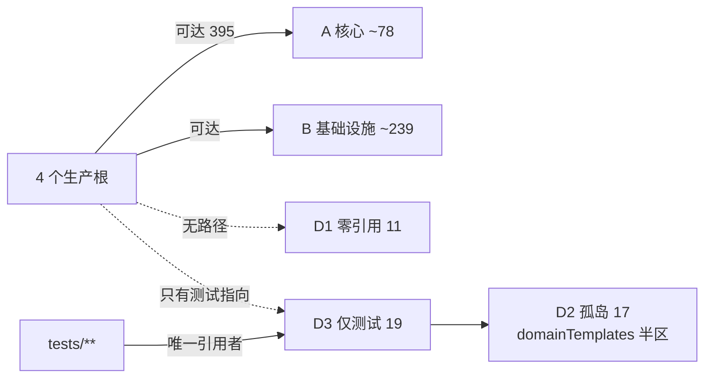

# 天衍 · 代码导航地图 R0

> 状态：REFERENCE
> 作用域：全文。
> 代码测量 ref：`codex/character-state-inspector-r0 @ 3683183`（worktree `/home/beelink/.codex/worktrees/tianyan-semantic-world-r3`），**含 4 文件未提交切片**（已 `git add`、未 commit）。切片影响已逐项量化，见 §0.3。
> 文档基线：主检出 `codex/world-materials @ 9ba6ae3`（三份输入文档与本文只在这里；worktree 内 `docs/research/` 无这些文件）。
> 基线依赖：不依赖任何代码改动。本文不修改、不移动、不删除任何生产文件。
> 取代关系：—（路由与分级文档，不是权威链成员）
> 依据：2026-09-19 用户指令（`TIANYAN_AI_CODE_NAVIGATION_AUDIT_R0`）。
> 失效条件：`3683183` 前移、切片被 commit、或 FEATURE_INDEX 注册面变化时，就地重测（G-6.3），不另起 R1。

**本文是什么**：把"这个仓库里哪 20 个文件真的在跑、哪 47 个没在跑、改哪里要最贵的模型"压成一页，用于**降低每次进入的上下文消耗**。

**本文不是什么（分工声明，G-3.10）**

| 已有权威 | 它独占的问题 | 本文态度 |
| --- | --- | --- |
| `项目目录导航.md` | 代码放哪、唯一 Owner、改动影响与最低验证 | 本文只按"读码成本 / 模型档位"重排，Owner 表以它为准 |
| `docs/research/TIANYAN_SYSTEM_MAP_R0.md` | 八空间语义、数据流、未接通能力（取 `93f41aa`） | 本文不复述产品语义；只补 §5/§6 的**代码可见性与分级**，并更正其两处口径（§7） |
| `docs/research/TIANYAN_REPOSITORY_INDEX_R0.md` | 磁盘/文档/`data/` 空间地图与"不要碰区域" | 本文只覆盖 `.ts/.tsx/.mjs/.css`，不碰 `data/` 与 docs 分区 |
| `docs/handoff/TIANYAN_AI_READ_ORDER_R0.md` | 读哪几份**文档** | 本文回答读哪几个**文件**；两者互补不重叠 |
| `docs/architecture/FEATURE_INDEX.json` | lint 强制的功能登记 | 本文只读它算注册覆盖率，不修改（§8 列为待裁定项） |

---

## 0. 开工前 60 秒

### 0.1 读码口决（先定 ref，再读文件）

```text
要看"生产代码真实状态"   → /home/beelink/.codex/worktrees/tianyan-semantic-world-r3 (3683183)
要看"文档/权威链/data/"  → 主检出 (9ba6ae3)
主检出读生产代码         → ✗ 落后 44+ 提交，缺 entity-dock/、characterContextPack.ts 等
git show BASE:<path>     → 只在无法进 worktree 时用
```

### 0.2 规模（同 ref 实测，`git -c core.quotepath=false ls-files`，排除 `data/` `docs/`）

| 口径 | 数 | 说明 |
| --- | --- | --- |
| 跟踪文件（纯 commit `3683183`） | 1303 | 含 png 311 / webm 60 |
| 跟踪文件（当前索引，含切片） | 1305 | +2：presentation 文件与新测试 |
| 代码文件（ts/tsx/mjs/css） | 722 | 本文全部计数的分母 |
| 生产文件（`src/`+`apps/…/src/`+`apps/…/server/`，排除 `*.test.ts`） | **442** | §3 分级对象 |
| 测试文件（`tests/**/*.test.ts`） | 252 | 其中 127 个含 `readFileSync`/`doesNotMatch` 源码文本断言 |
| **生产入口可达**（4 根静态闭包，见 §8） | **395 / 442 = 89.4%** | 未解析相对导入 **0** |
| **生产不可达** | **47** | 11 零引用 + 19 仅测试 + 17 孤岛 |
| 未登记进 FEATURE_INDEX 的生产文件 | **276 / 442 = 62.4%** | lint 只校验"已登记路径存在"，不校验反向覆盖 |

### 0.3 切片对计数的影响（唯一差异源）

| 前缀 | 纯 commit | 当前索引 | delta | 归属 |
| --- | --- | --- | --- | --- |
| 全部跟踪 | 1303 | 1305 | +2 | 新增 presentation + 新增测试 |
| `tests/` | 268 | 269 | +1 | `tests/storyStudio/characterStateInspectorPresentationR0.test.ts` |
| `apps/story-studio/src/components/` | 73 | 74 | +1 | `entity-dock/characterStateInspectorPresentation.ts` |
| `src/` | 251 | 251 | 0 | 未动 |
| `apps/story-studio/server/` | 37 | 37 | 0 | 未动 |

⇒ 本文所有 442/47/276/252 都是"基线 + 我 4 文件切片"口径；`EntityInspectorDock.tsx` 与 `FEATURE_INDEX.json` 是就地改写，不改文件计数。

---

## 1. 生产代码地图

### 1.1 主运行链

```text
apps/story-studio/src/main.tsx (24 行)
  → App.tsx (7 行，只选路由)
  → product-shell/TianyanR0Shell.tsx（区域组合）
      → product-shell/workspace/ShellWorkspaceOutlet.tsx:44-102  ← 八空间唯一挂载表（无路由库）
  → components/<八个工作面>
  → src/lib/localTransport.ts:1-3798                              ← 前端传输唯一合同层
      ⇅ HTTP（同源，无第三方请求库）
apps/story-studio/server/server.mjs:1-5269                         ← 路由 + 依赖组装
  → src/storyControlSurface/*                                       ← 用例编排 + 唯一 Canon 写入
      → src/storyWorkspace/*.mjs                                    ← 磁盘持久化
      → src/storyContinuity/*                                       ← 会话/回执/记忆/Grant
      → src/storyIntelligence/*                                     ← 女娲 RunPack + 注意力
  → server/providerGateway/aiProviderGateway.mjs                    ← 唯一模型出口
  → src/storyContracts/*                                            ← 只读投影（写 0、Provider 调 0）
```

### 1.2 `src/` 14 域（files / LOC / 职责 / 唯一 Owner / 先读入口）

| 域 | 件 | 行 | 职责（一句话） | 唯一 Owner 证据 | 先读入口 |
| --- | --- | --- | --- | --- | --- |
| `storyControlSurface/` | 18 | 13,882 | 用例编排、作者权限、候选审查、**Canon 唯一写入链** | `storyStudioAuthorControl.ts:977 applyAuthorChangeSet`、`:693 createCandidateReview`；`storyStudioWorkspaceOperations.ts:1453 createConfirmedEventOnce` | `storyStudioAuthorControl.ts` → `storyStudioWorkspaceOperations.ts` |
| `storyContinuity/` | 43 | 11,434 | 天意会话、上下文回执、停止点、授权、有据回答、角色听闻台账 | `tianyiGroundedContextGate.ts`（发送前重验）；`characterMemoryRepository.ts`（`heard` 唯一生产者） | `receiptStoppingRepositories.ts` + `tianyiGroundedContextGate.ts` |
| `storyWorkspace/` | 23 | 9,414 | 项目文件、文档、关系、卡片、布局、作品版本、`.tianyan` 备份 | `relationRepository.mjs`、`visualDocumentRepository.mjs`、`materialFileRepository.mjs`、`workVersionAuthority.ts` | `workVersionAuthority.ts` + 对应 `*Repository.mjs` |
| `storyIntelligence/` | 24 | 8,624 | 女娲计划/运行/注意力/候选综合、Agent 识别提案 | `nuwaN1Runtime.ts`、`nuwaN1Attention.ts`（`permission-first-lexical-utf8/v1`）、`agentRecognitionProposalRepository.ts` | `nuwaRunPack.ts` → `nuwaN1Attention.ts` |
| `storyContracts/` | 44 | 7,469 | 前后端共享契约与**只读投影**（最大文件数、最小平均体积） | `narrativeArrangement.ts`、`eventStoryCrossingKnowledge.ts`（v2，活的那半）、`characterContextPack.ts` | `eventStoryCrossingKnowledge.ts`（≠ `characterStateProjection.ts`） |
| `domainTemplates/storyWorld/` | 36 | 4,253 | 确定性故事世界流程模板 | 半区可达：`analysis changePreview commit decision evidence intent workflow`（23 件）；半区孤岛：`scene simulation writing productUI`（13 件，见 §3-D2） | 可达侧 `commit/commitPipeline.ts` |
| `storyCreation/` | 18 | 4,020 | 创作文档模型、中立故事包、派生交付、格式适配、插件生命周期 | `creationSourceSelectionPort.mjs`（服务端）＋来源快照带 contentHash | 中性故事包 + `fountainJs*Adapter` 属 D 级 |
| `storyAgent/` | 15 | 2,334 | 产品 AgentRuntimePort、受控工具、能力注册、Pi 适配 | `tianyiAgentRuntimePort.ts`（Port）、`agentRuntimePlugin.ts`（ABI）、`plugins/builtinPiAgentRuntimePlugin.ts`（唯一 Pi SDK 导入点） | `tianyiAgentRuntimePort.ts` |
| `storyCardPresentation/` | 7 | 1,530 | 卡片模板、预设、表现投影 | 不拥有故事事实 | 模板 + 预设两文件 |
| `skillRuntime/` | 5 | 876 | Skill 加载、执行、沙箱 | 工具执行安全边界 | 加载器入口 |
| `skillControl/` | 8 | 639 | Skill 清单、策略、预算、开关、Recipe 草案 | `skillRecipeDraft.ts` 仅测试引用（D 级） | 清单文件 |
| `memorySkills/` | 3 | 420 | 外部记忆 Skill 合同与适配 | 读取边界 | 合同文件 |
| `productWorkspace/` | 3 | 315 | 工作区模型与选择 | 工作区身份 | `storyStudioWorkspaceRegistry.ts`（在 contracts） |
| `productWorkspaceRuntime/` | 2 | 346 | 工作区运行视图投影 | 不得成为第二状态 owner | 投影文件 |
| `src/` 根级 | 2 | 938 | 历史/过渡文件，新代码禁止模仿 | `nuwaSceneRuntimeContracts.ts`(32, 可达)、`storyProductPrototypeState.ts`(906, **不可达**) | 跳过 |

### 1.3 `apps/story-studio/src/`（产品 UI，代码件 / 行）

| 目录 | 件 | 行 | 职责 | 关键入口 |
| --- | --- | --- | --- | --- |
| `components/` | 70（+4 README） | 15,087 | 八空间工作面 | `tianyi/` 25/3,946、`world/` 13/3,870、`event-observation/` 9/3,166、`nuwa/` 6/1,168、`entity-dock/` 3/531、`page-tools/` 4/149、`creation/` 2/191、`multiverse/` 1/100 |
| `product-shell/` | 48（+3 README） | 5,734 | 导航、顶栏、工程目录、右 Dock、Shell 状态 | `project-directory/` 17/1,960、`global-search/` 5/503、`right-dock/` 7/243、`runtime/` 2/273、`navigation/` 4/159、`workspace/` 2/132（`ShellWorkspaceOutlet.tsx`）、`layout/` 1/24 |
| `lib/` | 15 | 5,220 | 前后端传输、本地存储适配、投影辅助 | `localTransport.ts` 3,798（占本目录 73%） |
| `styles/` | 10 | 6,608 | 全局样式 | `event-line-projection.css` 2,252、`tianyan-r0-shell.css` 1,833 |
| `settings/` | 4（+2 md） | 675 | 设置工作区 | `agent/INTEGRATION_REQUEST.md` 是 LINTPIN |
| `storyDiagnostics/` | 1 | 150 | 诊断 | `localDiagnosticService.ts` 仅测试引用（D 级） |
| `hooks/` | 1 | 44 | — | `useDocumentHistory.ts` **零引用**（D 级） |
| 根级 | 3 | — | `main.tsx` 24、`App.tsx` 7、`worldObjectCatalog.ts`（零引用）、两个 `.d.ts` | — |

### 1.4 `apps/story-studio/server/`（37 件 / 15,870 行，全部 `.mjs`）

| 分层 | 文件 | 说明 |
| --- | --- | --- |
| 入口 | `server.mjs` 5,269 | 路由 + 依赖组装；`api-only` / `combined-static` 由 `runtimeMode.mjs` 决定 |
| 边界 | `publicAccess.mjs` | 只在显式配置时保护页面/API/附件/流，精确 HTTPS Origin |
| Port | `storyIntakeBatchPort.mjs`、`nuwaN1Port.mjs` 1,424、`nuwaN1PiAdapter.mjs`、`normalEventCreationPort.mjs`、`tianyiCreativeEventPort.mjs`、`creationSourceSelectionPort.mjs` | 服务端把 UI 意图转交既有 Owner；**不建第二仓库** |
| 服务 | `semanticIndexService.mjs`、`localFileManager.mjs` | R3 检索切片（`embeddingProfile.ts` 在其链内但生产闭包外） |
| `providerGateway/` 21 件 / 5,509 | `aiProviderGateway.mjs`（唯一 Broker）、`providerCatalog.mjs`、`persistentProviderProfileStore.mjs`、`providerRequestBudgetLedger.mjs`、`sessionCredentialController.mjs`、协议适配 `siliconFlowAdapter.mjs`/`ollamaNativeAdapter.mjs`/`radeonCloudAdapter.mjs`(仅测试)、`goldenLoop*.mjs` ×3 | 真实外部调用边界；测试必须 Mock/本地伪服务器 |
| **`*Fixture*.mjs` 5 件** | `characterStateImpactFixture`、`multiverseB1Fixture`、`multiverseSingleDerivedFixture`、`nuwaBoundedScenarioFixture`、`workVersionBoundCreationFixture` | `项目目录导航.md` 明写"过渡例外，禁止照此新增生产功能" ⇒ **D 级** |

### 1.5 八空间挂载表（`storyStudioWorkspaceRegistry.ts:40-47` → `ShellWorkspaceOutlet.tsx`）

| 空间 | 路由 | 挂载行 | 组件 | 有工作面？ |
| --- | --- | --- | --- | --- |
| 世界 | `/world` | `:90`（角色 `:87`） | `WorldOverviewWorkspace` / `CharacterWorkspace` | ✓ |
| 天意 | `/tianyi` | `:58` | `TianyiConversationWorkspace` | ✓ |
| 事件线 | `/event-line` | `:48` | `R0EventLineProjection`→`EventLineWorkbench` 等 | ✓ |
| 多元 | `/multiverse` | `:66` | `MultiverseB1Workspace` | ✓ |
| 女娲 | `/nuwa` | `:62` | `NuwaN1Workspace` | ✓ |
| 资料 | `/library` | `:84`（map`:73`/relations`:77`/reference`:81`） | `MaterialsWorkspace` 等 | ✓ |
| 创作 | `/creation` | `:54` | `CreationSourceWorkspace` | ✓ |
| 数据 | `/data` | `:92` 占位舞台 | 无 | ✗（产品核心有意冻结在壳层） |
| 合册（派生目的地） | `/collections` | `:92` 占位舞台 | 无 | ✗（注册表 `:66`） |
| 磁吸实体 Dock | 不属任何空间 | `:105` 无条件挂载 | `EntityInspectorDock` | ✓ 叠加层 |

---

## 2. AI 开发第一次不要读

| 不要读 | 精确位置 | 为什么 | 什么时候才读 |
| --- | --- | --- | --- |
| `*Fixture*.mjs` 5 件当参考格式 | `apps/story-studio/server/`（§1.4） | 导航明写过渡例外；它们直接调 `applyAuthorChangeSet`（`characterStateImpactFixture.mjs:116` 等），照着写会绕过端口分层 | 只读它们作为"writer 调用点清单"证据 |
| `domainTemplates/storyWorld/{scene,simulation,writing,productUI}` 13 件 | 见 §3-D2 | 生产闭包外的**孤岛**：互相引用成环，但没有任何生产入口指向它们 | 领到"模板接通"切片时 |
| `src/storyContracts/characterFateProjection.ts` | 11,236 B / 230 行 | **全仓零引用零测试**；且合同本身缺两条轨迹（产品核心 `:560-568` 要 5 种，`characterFateProjection.ts:59-61` 只 3 种） | 命运投影切片立项后 |
| `src/storyCreation/` 内 6 个仅测试件 | `autosaveController` `compositionBuffer` `markdownDocumentModel` `screenplayFormatAdapter` `derivedEventLineR1` `fountainJsNodeAdapter` | 类型齐全、生产分支缺席 | 创作输出切片 |
| `tests/manual/` | 盘上 3 个 `.mjs`，**tracked 0** | 另一 Agent 的手工取证脚本；不在 `git ls-files` 内，runner 永不可见 | 需追溯那次手工验证时 |
| `data/`（81 目录 ~400 MB） | 全仓 | 过程与证据不是现状；126 份 md 会污染上下文 | 领到切片后只读该切片 `工作日志.md` |
| `evidence/`（根）＋ `data/*/evidence/` 49 件 | `.gitignore:14` 静默吞 | G-4.7 违规现状，处置待人工确认 | 整理阶段按执行计划 |
| `scripts/tianyan-{nuwa-real-api-runner-r0,pi-agent-real-gate-r0-smoke,siliconflow-real-gate-r0-smoke,multi-node-prediction-real-provider-smoke-r1}.mjs` | `scripts/` | **真实 Provider 冒烟**，违反 Mock-only 默认路径 | 只在创始人另行授权与预算下 |
| `.mimosa/`、`node_modules/`、`.git/`、`/tmp/tianyan-*` | — | Agent 运行态/依赖/版本库本体 | 永不作为信息源 |
| 实验分支 `R4 @ d16563b`、`PR#30`、`FR1 @ a37a314` | `git worktree list` | 被否决形态 / design-only；对着它们读码会得出错误现状 | UI 任务读 `FR1:docs/design/TIANYAN_UI_DESIGN_FREEZE_R1/` |
| 主检出的生产代码 | `codex/world-materials @ 9ba6ae3` | 落后基线 44+ 提交，缺 `entity-dock/` 等 | 只读它的 `docs/` `data/` 与权威链 md |
| `FEATURE_INDEX.json` 的 `status` 字段 | 33 项 | `PRODUCTION_CONNECTED` ≠ 真实模型可用；13 项 PARTIAL/FOUNDER_REVIEW 里也有已跑通的 | 改读 `remainingGap`（33/33 都有） |
| `docs/research/TIANYAN_MAINLINE_LINEAGE_..._REALITY_MAP_R0.json` | — | 导航明写"不是当前工程现状报告"，是对账测试输入 | 来源漂移对账 |

---

## 3. 文件分级（A/B/C/D，442 个生产文件）

判据：A = 改它要懂产品语义且会落到磁盘事实；B = 改它只影响承载与显示；C = 只影响验证；D = 生产不可达或历史例外，**默认不动、不当参考**。

| 级 | 定义 | 覆盖 | 件数 |
| --- | --- | --- | --- |
| **A 核心业务** | 唯一 Owner 与写入链、上下文正确性、版本与授权 | `storyControlSurface/`（除 3 个 D 件）、`storyWorkspace/*Repository.mjs`+`workVersionAuthority.ts`+`multiverseB1.ts`、`storyContinuity/`（gate+回执+记忆）、`storyIntelligence/`（runtime+attention）、`server/providerGateway/aiProviderGateway.mjs`+`persistentProviderProfileStore.mjs`、`src/storyContracts/narrativeArrangement.ts`+`eventStoryCrossingKnowledge.ts`+`storyStudioWorkspaceRegistry.ts` | ~78 |
| **B 基础设施** | 传输、投影、装配、Shell、样式、无状态辅助 | `src/lib/localTransport.ts`、`apps/…/server/server.mjs` 路由层、`product-shell/` 48、`components/` 表现层、`styles/` 10、`storyContracts/` 其余纯投影、`scripts/` 20 | ~239 |
| **C 测试** | 只影响验证，不影响事实 | `tests/**` 252 `.test.ts` + 3 `tests/fixtures/*.ts` + 2 `tests/storyContinuity/fixtures/*.ts` | 257 |
| **D 历史/实验/不可达** | 生产闭包外或例外，禁止当参考 | 5 `*Fixture*.mjs` + 47 不可达 − 与 A/B 重复计数后 44 件 + `src/` 根级 2 件 + `tests/manual/`(未跟踪) | ~51 |

**D 级 47 项完整清单（按可达性细分）**

| 细分 | 判据 | 件 | 清单 |
| --- | --- | --- | --- |
| D1 零引用（真孤儿） | 生产 0 ∧ 测试 0 | **11** | `apps/…/src/worldObjectCatalog.ts`、`lib/initialWritingFlow.ts`、`lib/skillRegistryProjection.ts`、`lib/providerCredentialInput.ts`、`hooks/useDocumentHistory.ts`、`product-shell/right-dock/DockResizeHandle.tsx`、`src/mjs-modules.d.ts`、`src/vite-env.d.ts`、`src/storyContracts/characterFateProjection.ts`、`src/storyControlSurface/storyControlSerializer.ts`、`src/storyCreation/legacyNuwaCreationHandoffAdapter.ts` |
| D2 孤岛（有生产引用者，但引用者自己也不可达） | 闭包外互相引用 | **17** | `domainTemplates/storyWorld/scene/` 4 件、`simulation/` 3 件、`writing/` 4 件、`productUI/` 2 件（合计 13）；`storyControlSurface/storyControlState.ts`+`storyControlTypes.ts`（挂在仅测试的 `storyControlSurface.ts` 上）；`storyCreation/fountainJsAdapter.ts`；`src/storyProductPrototypeState.ts` |
| D3 仅测试引用（合同活着、运行不活着） | 生产 0 ∧ 测试 ≥1 | **19** | `providerGateway/radeonCloudAdapter.mjs`、`components/event-observation/eventLineFixture.ts`、`lib/graphAuthoring.ts`、`lib/timelineProjection.ts`、`storyDiagnostics/localDiagnosticService.ts`、`skillControl/skillRecipeDraft.ts`、`storyAgent/piR4ValidationContract.ts`、`storyCardPresentation/characterCardHistoryProjection.ts`、`storyContinuity/tianyiRequestContextBudget.ts`、`storyContracts/embeddingProfile.ts`、`storyContracts/hybridRetrievalGoldenSet.ts`、`storyControlSurface/storyControlSurface.ts`、`storyCreation/{autosaveController,compositionBuffer,derivedEventLineR1,fountainJsNodeAdapter.mjs,markdownDocumentModel,novelEventProposal,screenplayFormatAdapter}.ts` |
| 入口自身（不算孤儿） | 4 根 | 2 | `apps/…/src/main.tsx`、`apps/…/server/server.mjs` —— 零 import 者是定义使然 |



---

## 4. 高风险区域（需高级模型；错一次即污染磁盘事实或上下文正确性）

| 区域 | 入口 `path:line` | 不可变合同 | 典型失败模式 | 最低验证 |
| --- | --- | --- | --- | --- |
| **Canon 写入链** | `storyStudioAuthorControl.ts:977` → `storyStudioWorkspaceOperations.ts:1453` | 全仓 **12 个真实调用点**（`server.mjs:2475`、`nuwaN1Port.mjs:457/699`、`tianyiCreativeEventPort.mjs:190/271`、`normalEventCreationPort.mjs:165`、5 个 Fixture、`localTransport.ts:2394`、`PendingReviewPanel.tsx:178`；另 `:12` 是 import） | 新增第二条写入路径；让 AI 结果跳过候选审查直接落正式 | `tests/storyControlSurface/authorChangeSetCrashSafeEventApply.test.ts` + `verify` |
| **候选审查 / AuthorControl** | `storyStudioAuthorControl.ts:693` | 候选必须带精确原文片段；确认前正式写入必须为 0 | 把 Provider 输出当已确认；批次越界（影响预览与实际写入范围不一致） | `storyStudioAuthorControl.test.ts` + Intake 回归 |
| **上下文边界（天意）** | `storyContinuity/tianyiGroundedContextGate.ts`、`receiptStoppingRepositories.ts` | 依据以 `contentHash` 冻结；回执显示实际采用正文 | 用当前正文替换旧依据；无来源锚点进入 Receipt | `tianyiContextProjectionAndQuestion.test.ts`、`tianyiProductOperations.test.ts` |
| **上下文边界（角色/女娲）** | `storyContracts/eventStoryCrossingKnowledge.ts`(v2)、`storyIntelligence/nuwaN1Attention.ts`、`characterContextPack.ts` | 权限**先于**相关性；ContextPack 三条硬排除 `author-note`/`rumor`/`character-unknown` | 把隐藏事实泄进 DOM/接口/ContextPack；注意力结果反过来授予读取权限 | `nuwaAttentionContext.test.ts`、`characterKnowledgeHandoff.test.ts` |
| **版本系统 / IF** | `storyWorkspace/workVersionAuthority.ts`、`multiverseB1.ts`、`storyContracts/narrativeArrangement.ts` | BaseVersion 串行化 + `expectedHash`，**不是** last-write-wins；回溯用补偿版本不删历史 | 用 UI/localStorage 顺序充当排序事实；把 IF 当 Git 分支 | `workVersionAuthorityR0.test.ts`、`narrativeArrangementAuthorityR0.test.ts` |
| **Provider 边界与凭据** | `providerGateway/aiProviderGateway.mjs`、`sessionCredentialController.mjs`、`providerRequestBudgetLedger.mjs` | 测试只用 Mock/本地伪服务器；成功后生命周期辅助回调失败不得把成功传输改写成失败；不记密钥/向量正文 | 在测试里真调 Provider；把 preset 建议伪装成 endpoint 结果 | `storyStudioProviderGateway.test.ts`、`replaySafeProviderReceiptReceipt` 族 |
| **磁盘格式 / 备份 / 恢复** | `storyWorkspace/*.mjs`（`relationRepository.mjs` 1,560、`visualDocumentRepository.mjs` 1,318、`materialFileRepository.mjs`）、`.tianyan` 仓储 | traversal/symlink/半文件防护；导出排除 cache/lock/run/凭据/绝对路径 | 改名即丢历史；原子写失败留下半文件 | `storyWorkspaceRepository.test.ts`、`atomicNoReplaceFile.test.ts` |
| **产品语义裁定** | `TIANYAN_PRODUCT_CORE.md`（2,488 行） | 三条硬分界（`:47-63`）；八空间"它回答"（§八） | 用实现现状覆盖产品定义 | 人工：创始人验收 |

**这一层的机器锁**（改前先确认能过）：`scripts/validate-feature-index.mjs:19-28` 强制 Canon Writer / WorldState Owner / Event Owner / NarrativeArrangement Owner **各恰好一个**；`scripts/run-selected-tests.mjs:34-88` 列出 **53** 个退役路径，任一出现即 lint 红。

---

## 5. 低风险区域（可交普通模型）

| 区域 | 范围 | 允许的动作 | 仍需守的边界 |
| --- | --- | --- | --- |
| 文档 | `docs/research/`、`docs/handoff/`、`data/*/工作日志.md` | 新增、定点更正、补日志 | 8 份 LINTPIN md 不可移动/改名；权威链下游不覆盖上游 |
| 只读展示组件 | `components/` 内不写库的叶组件、`page-tools/` 4/149、`settings/` 4/675 | 文案、排版、空态 | 不新增持久化 owner；`pageToolRegistry.ts:9-12` 4 个 `not-connected` 不得伪装可用 |
| 样式 | `styles/` 10/6,608 | 在既有 token 范围内调密度 | **C2 未裁 ⇒ 不改生产 TS/TSX/CSS**；新增样式前确认 token 真存在（14 个悬空 token 被消费 139 次，见 §7.3）；shell 源码禁中文/禁字面色/禁 `panelOrder` |
| 测试补充 | `tests/<对应域>/` | 为既有行为加断言、加隔离用例 | 契约测试红了**不许改断言**；新文件必须 `git add` 才对 runner 可见（`run-selected-tests.mjs:25` 用 `git ls-files`）；不用真凭据 |
| 纯投影合同 | `storyContracts/` 内无写入的只读投影（`writes:0`、`providerCalls:0`） | 加派生字段、加稳定 digest | 不建第二 Owner；不把系统时间当故事时间 |
| 诊断与辅助 | `scripts/`（非门禁类）、`storyDiagnostics/` | 加只读检查 | `canonical-runtime.mjs` 门禁不得放宽；`tianyan-storage-inventory.mjs`/`repo-doctor.mjs` 是 OBSOLETE，不作格式参考 |
| 未登记面 | 276 个未进 FEATURE_INDEX 的生产文件 | **只做只读审计表**，不擅自登记 | 登记=改 lint 输入，需单独放行 |

> 低风险 ≠ 无边界。以上任何一项都不授权 commit/push（AGENTS.md + 本轮任务书）。

---

## 6. 每个领域：第一次接手，先读什么

| 领域 | 第 1 读 | 第 2 读 | 一句话（为什么是这两个） |
| --- | --- | --- | --- |
| 事件 / WorldState | `storyStudioWorkspaceOperations.ts:1453` | `storyContracts/narrativeArrangement.ts` | "如果我是 Codex，我先看唯一 Event 写入者的入参和幂等键，再看编排合同，因为顺序事实只活在那里，不看清就会写出第二份。" |
| Canon / 候选审查 | `storyStudioAuthorControl.ts:693` | 同文件 `:977` | "我先读候选是怎么建起来的，再读它是怎么被确认落库的，中间那段就是权限。" |
| 关系 | `storyContracts/relationTemporalComparison.ts` | `storyWorkspace/relationRepository.mjs` | "先分清 `validFrom/validTo` 的端点包含规则，再看持久化，否则会把回执时间当世界时间。" |
| 天意会话 / 记忆 | `storyContinuity/tianyiGroundedContextGate.ts` | `receiptStoppingRepositories.ts` | "先读发送前重验，因为它是 fail-closed 的唯一防线，回执只是它的产物。" |
| 角色知识边界 | `storyContracts/eventStoryCrossingKnowledge.ts`（**v2**） | `entity-dock/characterStateInspectorPresentation.ts` | "先确认活的是 v2 不是 `characterStateProjection.ts`，再看 UI 是怎么消费九态的。" |
| 女娲 | `storyIntelligence/nuwaRunPack.ts` | `nuwaN1Attention.ts` | "先看 RunPack 的边界（2–3 角色/1 场景/≤6 步），再看权限先于相关性的排序，顺序反了就会以为检索能授权。" |
| 资料 / 普通文件 | `apps/…/src/components/world/MaterialsWorkspace.tsx` | `src/storyWorkspace/materialFileRepository.mjs` | "先从唯一产品入口倒推到 Owner，确认 UI 不持有正文与修订。" |
| 地图 | `visualDocumentRepository.mjs` | `mapEditProposalRepository.mjs` | "先认唯一的 VisualDocument，再看提案表只是待审操作，否则会造出第二地图库。" |
| 作品版本 / 多元 | `storyWorkspace/workVersionAuthority.ts` | `multiverseB1.ts` | "先读版本权威与冻结快照身份，IF 是派生比较不是分支。" |
| 创作输出 | `src/storyCreation/` 中性故事包 | `server/creationSourceSelectionPort.mjs` | "先看故事包结构与 contentHash 快照，再看服务端复核，损坏要封闭失败。" |
| Agent 运行时 | `src/storyAgent/tianyiAgentRuntimePort.ts` | `plugins/builtinPiAgentRuntimePlugin.ts` | "先读产品 Port（Pi 不拥有 Canon），再看唯一 Pi SDK 导入点。" |
| Provider | `server/providerGateway/aiProviderGateway.mjs` | `providerCatalog.mjs` + `persistentProviderProfileStore.mjs` | "先确认所有外呼只有一条路，再看实例身份是 `providerInstanceId` 不是厂商名。" |
| Shell / 导航 | `storyContracts/storyStudioWorkspaceRegistry.ts:40-47` | `product-shell/workspace/ShellWorkspaceOutlet.tsx:44-102` | "先读注册表再读挂载表，因为这里没有路由库，八空间就是一张 if 顺序表。" |
| 工程目录 | `product-shell/project-directory/directoryWorkspaceState.ts` | `PendingReviewPanel.tsx:178` | "先分清浏览状态与唯一的右侧工作面 owner，再看唯一 Canon 调用点怎么从 UI 进来。" |
| 前端传输 | `apps/…/src/lib/localTransport.ts:2394` 附近 | `server/server.mjs` 对应路由 | "先读一份请求在客户端的合同，再对齐服务端路由，前后端错位的修复点在传输层不在组件。" |
| 测试 | `scripts/run-selected-tests.mjs:5/25` | `tests/<目标域>/` 同名测试 | "先读 runner 的门禁与文件发现方式，否则绿色的测试数会因为一个错误路径而假绿。" |
| 卡片表现 | `src/storyCardPresentation/` 模板 | `components/CardWorkbench.tsx` | "先确认表现投影不替代故事事实所有者。" |
| Skill | `src/skillControl/` 清单 | `src/skillRuntime/` 沙箱 | "先看能力可见性与预算，再看执行路径。" |
| 数据空间 / 合册 | `TIANYAN_PRODUCT_CORE.md:1417-1419` | `ShellWorkspaceOutlet.tsx:92-102` | "先读产品核心，才知道这里的空是设计不是缺失。" |

---

## 7. 对前文档的口径更正（本文实测）

| # | 前文写法 | 实测 | 出处 |
| --- | --- | --- | --- |
| 7.1 | 系统地图 §0.3 的核验根写作 `src/lib/localTransport.ts` | 真实路径 `apps/story-studio/src/lib/localTransport.ts`（`src/lib/` 不存在）；4 根均在 `3683183` 上存在 | §0.1 复现输出 |
| 7.2 | 系统地图 §5.C（取 `93f41aa`）："288 个域文件中 17 个生产不可达" | 同法在 `3683183`：**442 个生产文件中 47 个不可达**（11 零引用 / 19 仅测试 / 17 孤岛）。差异不是口径冲突，是 44 个提交新增的载体 | §3 |
| 7.3 | read-order §2.2："140 次无 fallback 消费" | **14 个真悬空 token 被消费 139 次**（86 使用 / 61 定义 / 29 未定义；其中 6 个 TSX 运行时注入、12 个带 fallback）。头部：`--color-text-secondary` 54、`--color-border-subtle` 47、`--color-canvas` 8、`--space-7` 6、`--shadow-sm` 6、`--color-text-primary` 5、`--radius-xs` 4 | 现测 |
| 7.4 | 系统地图 §6 债务 7："16 项 `providerDependency=none`" | **精确等于字符串 `none` 的只有 5 项**；16 是"字段文本含 none 一词"的宽松口径。FEATURE_INDEX 33 项 status 分布：PRODUCTION_CONNECTED 13 / LOCAL_REVIEW 10 / PARTIAL 7 / FOUNDER_REVIEW 3；`remainingGap` 33/33 齐全；`sourceCommit = 19f3f276f3ae2eecf54198aa6294e366097574af` | 现测 |
| 7.5 | 系统地图 §5.D：`/data`、`/collections` 无分支 | 补充：`entity-dock/` 3 件全部**不在** FEATURE_INDEX 任何 `entrypoints/sourceFiles` 中；未登记面比 §5.E 的"54 个 UI 文件"更大——生产全域 **276/442** | §0.2 |
| 7.6 | 系统地图 §5.A 暗示"只差接线" | `characterFateProjection.ts` 不是只差接线：**合同本身缺 2 条轨迹**（`:59-61` 3 条 vs 产品核心 `:560-568` 5 种） | 现读 |
| 7.7 | `项目目录导航.md` §4/§5 | `entity-dock/` 在导航中**零登记**（八空间表与唯一 Owner 表都没有它），而它是挂载在所有 outlet 之上的叠加层（`ShellWorkspaceOutlet.tsx:105`）——导航需同步，但本文不改（待裁定） | §1.3 |

---

## 8. 本文怎么复现（只读）

```bash
# 0. 定 ref
cd /home/beelink/.codex/worktrees/tianyan-semantic-world-r3
git rev-parse --abbrev-ref HEAD && git rev-parse --short HEAD   # codex/character-state-inspector-r0 / 3683183
git -c core.quotepath=false diff --cached --name-only           # 4 文件切片

# 1. 可达性闭包（4 根；解析 import/export from/require()/动态 import，仅相对说明符）
#    扩展名候选："" .ts .tsx .mjs /index.ts /index.tsx /index.mjs
node /tmp/nav-scan.mjs      # 输出 §0.2 的 442 / 47 / 276 / 127 / 0-unresolved

# 2. 孤岛侧半区
node /tmp/nav-reach.mjs     # domainTemplates 36 件：23 reach / 13 unreach

# 3. 规模与登记
git -c core.quotepath=false ls-files | wc -l                              # 1305（索引）
node -e 'const j=require("./docs/architecture/FEATURE_INDEX.json");/* §7.4 */'
grep -n "applyAuthorChangeSet" -r --include=*.ts --include=*.tsx --include=*.mjs src apps | wc -l   # 13 命中 = 12 调用点 + 1 import

# 4. 门禁（未绕过）
grep -n "assertCanonicalRuntime" scripts/run-selected-tests.mjs   # :7 顶层 ⇒ lint/test:unit 无直跑旁路
```

**本文边界**：不删除、不移动、不修改任何生产文件；不裁决 C1/C2/Q/D/A/K；不 `git add` 自身（新增未跟踪件，入库需用户确认）。
