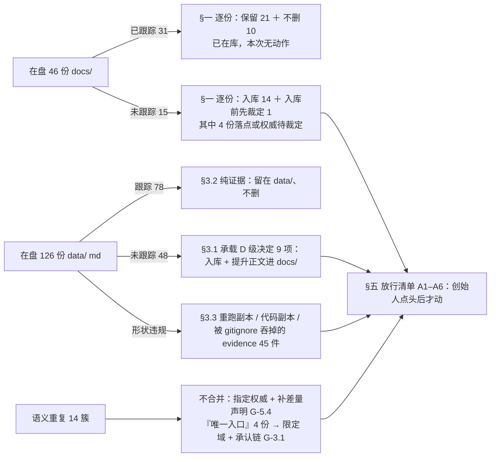

# 天衍文档清理计划 R0

> 生成日期：2026-09-18。角色：文档治理规划（只读 + 单文件产出）。
>
> **本文一条删除都不申请。** 全文只出现六种建议动作：`保留` / `入库` / `提升` / `不删` / `冻结` / `待裁定`。`入库` = 把已存在的文件纳入 Git 跟踪；`提升` = 把决定正文写进权威落点，原件留在原处不动。OBSOLETE 与 HISTORICAL 一律配 `不删`。
>
> 规则依据：`docs/operations/TIANYAN_PROJECT_GOVERNANCE_R0.md`（治理规则，本文服从其 G-3.2 落点表、G-3.9 不可移动清单、G-4.10「未纳入 Git 的文档视为不存在」、§5 重复研究门禁）。分类口径沿用 `docs/research/TIANYAN_DOCUMENT_INDEX_R0.md` §0.3 的六词状态表。
>
> 取证范围与口径：工作树 `codex/world-materials @ f77b800`（开发者实际看到的目录）。所有计数用 `git -c core.quotepath=false` 重新推导（中文路径在本仓会产生假阳性）。
>
> 本文取数时刻（下列数字会随并行会话漂移，执行前须按 §〇 的口径重算）：`docs/` 在盘 46 份、`data/` md 在盘 126 份、反查语料 318 份、evidence 被吞 45 件。

---

## 〇、三个数（本次实测，非搬运）

| 面 | 实测 | 含义 |
| --- | --- | --- |
| `docs/` | **46 份在盘上** = 跟踪 31（28 md + 2 json + 1 png）+ **未跟踪 15**（含本文）；0 个跟踪文件缺盘 | 未跟踪占比已达 **33%**；治理规则 §9 快照（同日 20:30 前后）记的是"31 + 5"，两小时内又长出 10 份 → **本表是移动靶，执行前必须重新 `git -c core.quotepath=false ls-files --others docs` 一次**（口径：`find docs -type f` 与 `git ls-files docs/` 取差集） |
| `data/` md | **126 份在盘** = 跟踪 78 ＋ 未跟踪 48（81 个任务目录，其中 **39 个整目录未被跟踪**）；未跟踪件合计 534 个 / **193 MB** | 承担"当前有效设计"的 14 项里有 9 项住在这里，其中 7 项未提交（口径来自 `DOCUMENT_INDEX` §5 的 14 项表；本行的跟踪/未跟踪与体积数字为本次实测，且 §3.1 按目录判为 16 行 19 个）——**两者不冲突：9 是"设计项"，19 是"装这些项的目录"** |
| 引用可见性 | 反查语料 **318 份**在盘 md/json（含未跟踪）。15 份未跟踪 `docs/` 里，**扣掉本文自身的点名后仍有 4 份零引用者**：`TIANYAN_NEXT_CODEX_ENTRY_R0`、`TIANYAN_PRODUCT_MAP_VISUAL_R0`、`TIANYAN_DESIGN_PRINCIPLES_R0`、本文；其余 11 份已被同日更新的文档互相引用 | 但这些"互相引用"**全部发生在未跟踪文件之间**，按 G-4.10 对下游等于不存在。`FEATURE_INDEX.json` 的 `sourceFiles` 共 158 条，其中文档路径 **7 条**（`docs/` 6 ＋ `data/` 1）；代码/测试实际能解析到的 `docs/` md 只有 6 份 |

**一句话总账：`docs/` 的问题不是乱，是"最新的东西不在库里"；`data/` 的问题不是多，是"决定藏在那里且没提交"；重复不在字节层（全仓 md5 逐字节相同只有 4 对，且都是证据转储），在语义层——同一主题三份以上、且没有任何一份被登记为权威。**

---

## 一、`docs/` 逐份处置（46 份在盘 + 1 份仅基线）

| 文件 | 当前状态 | 建议 |
| --- | --- | --- |
| `docs/architecture/FEATURE_INDEX.json` | CURRENT | 保留（已在库）。`sourceCommit=19f3f276` 在本仓不可解析，就地重算并刷新，不新建第二索引 |
| `docs/architecture/TIANYAN_R0_SHELL_CONTRACT.md` | CURRENT | 保留。被 lint 钉住，禁移动（G-3.19） |
| `docs/architecture/TIANYAN_TIAN_YI_AGENT_MODE_AND_RUNTIME_R0.md` | CURRENT | 保留 |
| `docs/architecture/TIANYAN_RUNTIME_MODE_AND_SINGLE_ENTRY_R0.md` | CURRENT | 保留；`:62`「不新增 systemd」已被 `scripts/deploy-tianyan-review-server.sh:107` 事实推翻 → 冻结该段，等一句裁定 |
| `docs/architecture/TIANYAN_MEMORY_AND_MODEL_CAPABILITY_BOUNDARIES_R0.md` | CURRENT | 保留。被 lint 钉住，禁移动 |
| `docs/architecture/TIANYAN_PROVIDER_CATALOG_AND_EMBEDDING_BINDING_R0.md` | CURRENT | 保留；`:32` schema「v3」与代码常量 4、`:53` 类型名两处不一致 → 就地更正，不出副本 |
| `docs/architecture/TIANYAN_R0_6_1_AGENT_RUNTIME_PLUGIN_ABI.md` | CURRENT | 保留；`:9` upstream 0.84.2 已过期 → 就地更正 |
| `docs/architecture/TIANYAN_WORKSPACE_LAYOUT_V1.md` | CURRENT | 保留 |
| `docs/architecture/TIANYAN_MULTI_NODE_PREDICTION_REAL_PROVIDER_SMOKE_COMMAND_R0.md` | CURRENT（条件生效） | 保留。真实 Provider 一旦授权即成为硬前置 |
| `docs/architecture/TIANYAN_R0_3_1_ACTIVE_TREE.md` | HISTORICAL | 不删（清理前可达图，是唯一记录"哪些真被删了"的账）；停止作为现状引用 |
| `docs/architecture/TIANYAN_LEGACY_KEEP_REWRITE_REMOVE_R0.md` | OBSOLETE | 不删；`:38/:39` REMOVE 项已全部消失，头部加一行"决策已执行完"即可 |
| `docs/architecture/TIANYAN_R0_6_AGENT_TEXT_VERTICAL_SLICE_PRE_IMPLEMENTATION_MAP.md` | OBSOLETE | **不删且禁移动**（lint 把它列为 `sourceFiles`）。只加"已被插件运行时取代"一行 |
| `docs/design/references/tianyan-r0-5-founder-character-directory.png` | REFERENCE | 保留（1.6 MB 已入库，带 SHA-256）。四个视觉目标并存期间不得自称"当前目标" → 待裁定 C2 |
| `docs/handoff/TIANYI_R2_2B1_PHASE_CLOSURE_R1.md` | CURRENT | 保留。继续 Story Intake 前必读 `:48-52` |
| `docs/handoff/TIANYAN_R0_5_TO_R0_6_MEMORY_HANDOFF.md` | HISTORICAL | 不删；`:69` 五条冻结项仍有效，但"新工作从 fetch 后的 `origin/main` 开始"**已失效**，照做会丢 44 个提交 → 就地标注失效，勿删原件 |
| `docs/handoff/TIANYAN_CODEX_FIRST_EXECUTION_PACKAGE_R0.md` | UNKNOWN | **入库前先待裁定**：它把作业基线写成 `codex/world-workbench-r4 @ d16563b`，而该线当日即 PR #29 已被否决。任务内容仍可用 |
| `docs/handoff/TIANYAN_NEXT_CODEX_ENTRY_R0.md` | CURRENT（新） | 入库（301 行，未跟踪，21:18 落盘）。落点正确（阶段裁定/交接 → `docs/handoff/`）。它自己已声明与上一份在"施工基线"上**互相冲突**、未裁定前两者都不得单独作为施工依据 → 这正是待裁定 C1，本文不代答。另：它自称"总入口"，须按 G-3.1 被上游承认后才成立（见 §四"唯一入口声称者"簇） |
| `docs/product/TIANYAN_PRODUCT_MAP_VISUAL_R0.md` | REFERENCE（新） | 入库（618 行 Mermaid/表/ASCII 可视化，未跟踪，21:17 落盘）。落点正确。它已自报"产品权威是 `TIANYAN_PRODUCT_CORE.md`，本文只做可视化、不新增概念"，符合 G-3.5 单一权威；风险是**派生视图必然滞后上游** → 头部需带"派生视图，权威为 CORE，核对日期"一行，且 `CORE` 的 §八 章每次改动都要回扫它 |
| `docs/handoff/TIANYAN_IMPLEMENTATION_ROADMAP_R0.md` | CURRENT | 入库（33 卡施工计划，现在只在这台机器上）。按 G-3.1 需被 `ROADMAP` 承认一行，否则视为不存在 |
| `docs/implementation/TIANYAN_R4_PI_ZERO_CALL_AND_NUWA_N1.md` | CURRENT | 保留。被 lint 钉住，禁移动；Provider 预算与 N1 边界以它为准 |
| `docs/operations/TIANYAN_DAILY_4191_4192_UPGRADE_RUNBOOK.md` | CURRENT | 保留；`:9`「最终候选」仍是占位，需补实值 |
| `docs/operations/TIANYAN_HK_REVIEW_DEPLOYMENT.md` | CURRENT | 保留；它描述的 TLS/443 环节对应的 `ops/tianyan-review/*.conf` 两份配置**未被任何文档引用** → 加一行指向，不搬文件 |
| `docs/operations/TIANYAN_PROJECT_GOVERNANCE_R0.md` | CURRENT | 入库（581 行治理规则，未跟踪）。**落点待裁定**：G-3.2 里 `docs/operations/` = 运维手册，治理规则按该表无落点（应在根级与 `AGENTS.md`/`CORE.md` 同级，或 `docs/architecture/`）。其 §9 的 `docs/` 计数（31+5）已过期，按本文实测刷新为 **31 跟踪 + 15 未跟踪** |
| `docs/product/TIANYAN_ROADMAP.md` | CURRENT | 保留（唯一能力账本）。所有研究报告按 G-5.3 在此登记一行，这是消除"重复研究"的主手段 |
| `docs/product/DESIGN.md` | CURRENT | 保留；`:40-45` 女娲节已被 `data/2026-09-17_…R6/R6.1/R6.2` 三档推翻、`:48-52`「已规划：地图 M1」其实早已交付 → 冻结该两节，等 C2 裁定后一次性改准 |
| `docs/product/TIANYAN_NUWA_RUN_AND_MULTIVERSE_DERIVED_VERSION_BOUNDARY_R0.md` | CURRENT | 保留。`项目目录导航.md:124` 称它是"测试输入"是错的（全仓无程序读取）→ 改导航，不改本文 |
| `docs/product/TIANYAN_MULTI_NODE_PREDICTION_IMPLEMENTATION_PLAN_R0.md` | CURRENT（`:82-144` 施工段 OBSOLETE） | 不删；`:24-42` 八条门禁独有且有效，`:82-144` 标 OBSOLETE 后留在原文件内 |
| `docs/product/TIANYAN_VISUAL_WORLD_EVOLUTION_R0.md` | REFERENCE | 保留。`:67` 多阵营重叠是创始人已确认的硬约束，别整篇当建议稿略过 |
| `docs/product/TIANYAN_DEV_SUGGESTIONS_R0.md` | REFERENCE | 保留。与上一份**互补不可互删**（它点名的缺口至今未闭合） |
| `docs/product/TIANYAN_MATERIALS_MANAGEMENT_M2_IMPLEMENTATION.md` | HISTORICAL | 不删（M1→M2 三份里唯一有实质 Owner 内容的一份） |
| `docs/product/WORLD_MATERIALS_M1_PLAN.md` | HISTORICAL | 不删；`:19` 已自述补齐，`:39` 已把职责转交 runbook |
| `docs/product/TIANYAN_MATERIALS_M2_DAILY_UPGRADE_DELTA.md` | OBSOLETE | 不删；停止引用，切换一律读 runbook |
| `docs/product/TIANYAN_EVENT_WORKSPACE_R9_FOUNDER_REVIEW_EVIDENCE.md` | HISTORICAL | 不删（其分支与 Draft PR #2 已被现链吞并，是唯一的判决留痕）。形状更像 `data/` 证据，但已入库且被引用 → 原地保留 |
| `docs/product/TIANYAN_AGENT_EVOLUTION_ROADMAP_R0.md` | REFERENCE | 入库（475 行，未跟踪）。**落点待裁定**：按 G-3.2 研究报告应住 `docs/research/`；且与 `TIANYAN_CHARACTER_AGENT_V2_RESEARCH_R0.md` 同题 → 按 G-5.4 补一段差量声明（它按子系统组织并给六个月节奏，后者按六个能力面组织），二者都不是实现计划 |
| `docs/product/TIANYAN_CHARACTER_AGENT_PRODUCT_DESIGN_R0.md` | 待裁定（新） | 入库（599 行产品设计，未跟踪）。引用面：全仓仅 1 处，且来自同样未跟踪的 `TIANYAN_NEXT_CODEX_ENTRY_R0`。落点正确（G-3.2 设计决定 → `docs/product/`）；§7 各项须创始人书面裁定后才进实现 |
| `docs/product/TIANYAN_WORLD_WORKBENCH_PRODUCT_DESIGN_R0.md` | 待裁定（新） | 入库（497 行产品设计，未跟踪；被 2 份同样未跟踪的新文档点名）。落点正确；它自报 `R4: d16563b 已被否决、禁止作为基础`，这条与执行包冲突 → 待裁定 C1 |
| `docs/research/TIANYAN_REFERENCE_CATALOG.md` | REFERENCE | 保留（外部参考台账，版本固定表是吸收外部机制前的门禁）。需追加 R25–R30 六项的登记行 |
| `docs/research/WEBNOVEL_WRITER_REFERENCE_MAP_R0_6.md` | REFERENCE | 保留。`:126-132` GPL 红线与 `:86-100` 向量库选型前置是已生效门禁（G-5.7） |
| `docs/research/TIANYAN_MAINLINE_LINEAGE_AND_CAPABILITY_REALITY_MAP_R0.json` | OBSOLETE | 不删；`:71` fixture 全仓 0 命中、`:91` 已被 NUWA-N1 推翻、`:10-16` 分支/领先数全部失效。**导航 `:125` 称它是"来源漂移对账测试输入"是错的** → 改导航 + 文件头加"快照日期 2026-08-25，非现状" |
| `docs/research/TIANYAN_SYSTEM_MAP_R0.md` | REFERENCE | 入库（46 961 B，未跟踪）。取数 ref 已自报（基线 `93f41aa`），符合 G-5.5 |
| `docs/research/TIANYAN_DOCUMENT_INDEX_R0.md` | REFERENCE | 入库（56 938 B，未跟踪）。它是治理规则与本文的共同输入；其 §2 的 `docs/` 清单**漏 11 份**（按 basename 反查：46 份在盘件里有 13 份没被它提过，扣掉它自己与本文这两份"自指"即 11）→ 入库时同批补齐，不要再长出第二份索引 |
| `docs/research/TIANYAN_UI_VISUAL_ANALYSIS_R0.md` | REFERENCE | 入库（58 819 B，未跟踪）。AI 效果图必须继续标 `mockup`（G-4.14），其 §5.3 的 23 组假功能清单是防假按钮的权威依据 |
| `docs/research/TIANYAN_CHARACTER_AGENT_V2_RESEARCH_R0.md` | REFERENCE | 入库（73 246 B，未跟踪）。是两份产品设计的上游，按 G-5.1 施工顺序段要显式标"建议，未冻结" |
| `docs/research/TIANYAN_UI_REFERENCE_LIBRARY_R0.md` | REFERENCE | 入库（未跟踪，落盘后几小时内被《设计原则》降级为"证据附录"）。落点正确（外部调研 → `docs/research/`）；编号 R25–R30 沿用参考库约定，**必须在 `TIANYAN_REFERENCE_CATALOG.md` 补登记行**，否则按 G-5.3 等于没做过 |
| `docs/research/TIANYAN_DESIGN_PRINCIPLES_R0.md` | 待裁定（新） | 入库（205 行 / 13 条原则，未跟踪，21:12 落盘）。**两处待裁定**：① 落点——它不是"外面有什么"而是"天衍遇到一类界面问题时的标准答案"，按 G-3.2 属交互模型/D 级决定，应住 `docs/product/` 或 `DESIGN.md` 小节；② 它自述"以后做 UI 决策时先查本文"＝自称权威入口，而 G-5.6 明令未提交、未经创始人确认的研究文档不得成为权威 → 先入库再确认，确认前 §13 的"三问"只作建议 |
| `docs/product/WORLD_REFERENCE_AND_CHARACTER_AGENT_PREP_R0.md` | CURRENT（**仅基线存在**） | 保留（在基线分支上）。本工作树无副本，且其点名的 `WorldReferenceWorkspace`/`worldReferenceProjection` 在盘上 0 命中 → **合并基线前不要按它施工**；不要在本树"补一份近似替代品"（G-8.2 明令） |
| `docs/research/TIANYAN_DOC_CLEANUP_PLAN_R0.md`（本文） | REFERENCE | 入库（本文自处，与 A1 同批）。落点正确（处置清单是取证件 → `docs/research/`，G-3.2）。**不自封权威**：状态只到"待创始人放行"，采纳前对下游等于不存在（G-4.10、G-5.6）；本文任何一条判定与治理规则或创始人裁定冲突时，以治理规则与裁定为准 |

---

## 二、根目录与代码区（根 6 ＋ 代码区 10 份 md，另 2 行合并项：测试 fixture 9 份、脚本 2 份 = 18 行 / 27 个文件）

| 文件 | 当前状态 | 建议 |
| --- | --- | --- |
| `TIANYAN_PRODUCT_CORE.md`（2 488 行） | CURRENT | 保留（唯一产品定义）。`:2466-2468` 自承"最终固定入口尚未确认"→ 待裁定，不因新研究自动解除 |
| `AGENTS.md` | CURRENT | 保留（硬约束）。末次提交比它所约束的链老 20 天以上 → 就地补一行，不新建第二份规则文件（G-10.3） |
| `CORE.md` | CURRENT | 保留（`data/` 形状唯一权威）。`:27` 举例路径从未提交 → 就地换一个存在的例子 |
| `项目目录导航.md`（207 行） | CURRENT | 保留。四处失真待更正：`:26`「`docs/` 只保留被代码/lint/测试直接读取的文件」与实际严重不符（43 份在盘 md 里只有 **6 份**被代码或索引读取）→ **待裁定**（治理 G-3.8 已提修订提案，本文不代答）；`:124/:125` 两处"测试输入"说法错；缺 `entity-dock/` 条目 |
| `日常入口.md` | CURRENT | 保留。`:45` 指向的 `data/2026-09-14_天衍第一阶段功能收尾/` 只在别的 worktree → 迁移或改指针，不新造目录 |
| `design-qa.md`（根，38 行） | HISTORICAL | 不删。`:8-10` 承认的对照输入 `对照/`、`真实运行证据/` 在本机是空目录 → 状态降为"结论仍有效、证据已丢" |
| `apps/story-studio/design-qa.md`（56 行） | HISTORICAL | 不删。与根 `design-qa.md` 同名不同物（`diff` 零共享文本、另一套状态词）。**是否改名/移动需裁定**——改名会断掉历史引用 |
| `apps/story-studio/src/product-shell/project-directory/README.md` | CURRENT | 保留（6 份 README 里唯一有增量的：扩展了 `character/` 细节） |
| `apps/story-studio/src/product-shell/right-dock/README.md` | CURRENT | 保留（导航 §4 的局部复述；改该区域时二者同步，不去重） |
| `apps/story-studio/src/components/page-tools/README.md` | CURRENT | 保留（同上，局部复述） |
| `apps/story-studio/src/components/tianyi/capability-launcher/README.md` | CURRENT | 保留（同上） |
| `apps/story-studio/src/components/tianyi/composer/README.md` | CURRENT | 保留（同上） |
| `apps/story-studio/src/components/tianyi/sidebar/README.md` | CURRENT | 保留（同上） |
| `apps/story-studio/src/product-shell/project-directory/INTEGRATION_REQUEST_R06.md` | CURRENT | 保留。**全仓零引用者**（`git grep` 实测），且 `DOCUMENT_INDEX` 的"代码区 md 9"漏算了它（真值 10）→ 在同目录 README 加一行指向它 |
| `apps/story-studio/src/settings/agent/INTEGRATION_REQUEST.md` | CURRENT（**请求未完成**） | 保留且禁移动（lint 钉住）。它要求宿主挂载 Agent 设置面，`AgentSettingsSection.tsx` 至今无导入者 → 是一个真实待办，不是垃圾 |
| `apps/story-studio/src/settings/storage/INTEGRATION_REQUEST.md` | OBSOLETE | 不删（请求已被 `ShellWorkspaceOutlet.tsx:5` 实现）。全仓唯一英文 md，其"多责任"表述与导航"唯一责任"框架相冲 → 就地加"已完成"一行 |
| `tests/fixtures/story-markdown-workspace-v1/**/*.md`（9 份） | 非文档 | 保留（测试用虚构正文）。必须留在原地，且文档检索时应排除 |
| `scripts/tianyan-storage-inventory.mjs` / `scripts/repo-doctor.mjs` | OBSOLETE | 不删。`:7-8` 硬编码外来 macOS 根、往不存在的 `docs/ops/` 写文件、不在十脚本内、0 消费者 → 治理 G-8.1 已判为整改对象，本文只登记不处置 |

---

## 三、`data/`：哪些该进 Git、哪些只是证据（按目录）

`data/` 不是文档区，但**当前有 9 项有效设计住在里面**（其中 7 项未提交），所以必须逐目录给结论。`入库` 指 `git add` 该目录，不等于把全文搬进 `docs/`。

### 3.1 承担有效设计、必须入库或提升（16 行 / 19 个目录）

| 文件（目录） | 当前状态 | 建议 |
| --- | --- | --- |
| `data/2026-09-02_天衍R11事件观察工作台/`（10 md，已提交） | CURRENT | 保留 + **提升**：五维观察配方与 14 行概念边界表在 `docs/` 里 0 命中，应提升进 `docs/product/DESIGN.md` 或事件线小节；原件不删不动 |
| `data/2026-09-03_天衍R12B2_1叙事编排权威合同/`（4 md，已提交） | CURRENT | **禁移动、禁改名、禁压缩包化**（`FEATURE_INDEX.json` 的 `sourceFiles` 钉住其中一份，动它 = `npm run lint` 红）。这是"设计上的重复"，不去重 |
| `data/2026-09-04_天衍单根仓库收口/E2E_KNOWN_BLOCKER.md` | REFERENCE | 入库（已在库）+ 提升：断言仍活在 `apps/story-studio/scripts/tianyan-r0-shell-smoke.mjs`，但合同没有 `docs/` 落点 |
| `data/2026-09-05_天衍G0产品设计与现场核对/`（2 md，整目录未跟踪） | CURRENT | **入库**（G-4.9：含 D 级结论的目录未提交 = 该切片未完成）。G1 选 A + 6 条冻结原则只在这台机器上 |
| `data/2026-09-05_天衍G1自适应任务主工作面/`（48 文件 23 MB，整目录未跟踪） | CURRENT | 入库（先按 §3.3 剔除可重生成物）。恢复/撤销/Envelope 语义的唯一书面来源 |
| `data/2026-09-06_天衍G1-R2连续作者工作面/`（58 文件，整目录未跟踪） | CURRENT | 入库。"全书概览 / 阅读所选"两层语义在 `docs/` 里 0 命中，而 `tianyiLane` 是活代码 |
| `data/2026-09-07_天衍R5_M6连续交互证据/`（canonical） | CURRENT | **路径不可动**：`docs/product/TIANYAN_ROADMAP.md:87` 逐路径引用它（连项目 ID、作品版本、SHA 一起写死）。其中 1 个 2.3 MB webm 未提交 → 入库 |
| `data/2026-09-08_天衍R5固定稿二次打开首因/` | CURRENT | 入库 + 提升：`sourceDriftCompare` 丢 `artifactId` 的首因链与"多稿必须显式 artifactId"叙事未进 `docs/`；改创作来源读取前必读 |
| `data/2026-09-11_MEM-A1a-按问题检索故事依据/`（整目录未跟踪） | HISTORICAL | 入库（Gate Event Reference 上限 24 这条只在这里）。已在库的只有转述版 |
| `data/2026-09-16_天衍动态对象与世界观改造手册R0/`（整目录未跟踪） | CURRENT | 入库 + 提升：动态对象四态投影路线是后续 R5/N 系列前提 |
| `data/2026-09-16_天衍女娲分支与节点改造评估R0/`（整目录未跟踪） | CURRENT | 入库 + 提升：女娲十条硬约束 |
| `data/2026-09-17_女娲入口与交互模型评估R2/`（11 文件，整目录未跟踪） | CURRENT | 入库 + **提升**：四层交互模型（共创/访谈/接管/干预）+ 零自动触发铁律只在这份 `交互模型修订报告R2b.md` 里，且它同时是"已否决设计"的主案例（四种平级聊天模式被逐字否决）——两件事都必须进权威落点 |
| `data/2026-09-17_角色磁吸详情工作台R0/`（10 文件，整目录未跟踪） | CURRENT | 入库 + 提升：通用 Entity Dock 四态九页签，`EntityInspectorDock.tsx:27` 就是它的实现 |
| `data/2026-09-17_女娲R6_2微打磨/` + `…_女娲作者工作面视觉重构R6/` + `…_女娲聚焦与响应式打磨R6_1/` + `…_女娲视觉证据收尾R4_1/`（四目录均整目录未跟踪） | CURRENT（R6_2 为链上现状权威） | 入库 + 提升进 `DESIGN.md` 女娲节；**同时触发 G-4.13 冻结**：该区域现在有第二个视觉目标，创始人指明哪个算数之前两条链都不许往生产写视觉代码 |
| `data/2026-09-18_天衍世界观工作台R4/`（33+2 文件，整目录未跟踪） | CURRENT（视觉）／已被否决（作基线） | 入库为**证据**；`最终报告.md` 的世界脉搏首屏结论需提升进 `DESIGN.md`。PR #29 已被否决 → 该目录**只作历史与证据，不得作为任何施工起点** |
| `data/2026-09-18_混合语义检索R3_1/`（10 文件，整目录未跟踪） | CURRENT | 入库 + 提升：作者秘密 LOCAL_ONLY 与 `IndexEligibility` 先于远程调用是**出站隐私边界**，违反即事故，必须进 `docs/architecture/` |

### 3.2 只是证据，留在 `data/`、不进 `docs/`（不删）

| 文件（目录） | 当前状态 | 建议 |
| --- | --- | --- |
| `data/2026-08-27_天衍工程重整/工作日志.md`（225 行） | HISTORICAL | 不删（八空间与 Node22 基线最早记录） |
| 2026-08-28～08-29 的 8 个 R0/R0.1/R0.2/R0.6 证据目录 | HISTORICAL | 不删（结论已提升到架构文档与导航） |
| `data/2026-08-29_天衍工作台R0_2创始人桌面纠偏R0/验收记录.md` | HISTORICAL | 不删（记的是 `REJECTED`，`docs/` 里没有落点，是唯一判决） |
| `data/2026-09-04_天意事件线黄金闭环/`（26 文件 / 16 MB） | REFERENCE | 不删；25 份因 `.gitignore:14` 裸模式 `evidence/` 被静默吞掉（见 §3.3）。结论在 `docs/handoff/` 与测试里 |
| `data/2026-09-04_天意三模式采纳与版本IF复核/CLAUDE_*.md`（36 KB prompt 存档） | HISTORICAL | 不删（prompt 存档，非文档） |
| `data/2026-09-06_天衍R4稳定视角与Pi准备/R4_ACCEPTANCE_REPORT.md` | HISTORICAL | 不删；顶部 `DOCS=` 字段已自我作废 |
| `data/2026-09-07_天衍女娲N1小闭环/ACCEPTANCE_REPORT.md` | REFERENCE | 不删且**路径不可动**（被 `docs/implementation/` 按路径引用） |
| `data/2026-09-09` N2/N3/N4 与 `2026-09-10` 记忆查询/B1 系列 | REFERENCE | 不删；`ROADMAP:94/:101/:103` 显式引用者路径不可动。`浏览器链-最终/README.md` 是 `TIANYAN_E2E_SCOPE=character-memory-query` 唯一复现配方 → 保留并提升进十脚本文档 |
| 2026-09-12～09-15 日常升级预演／核心导航整合／资料 M2／地图 M4／真实 AI 审阅 R1／切换主目录（工作日志合计 ≈176 KB） | HISTORICAL | 不删（`ROADMAP:87` 与运维链按路径引用者不可动） |
| 只有截图、零结论 md 的 3 个目录（`2026-08-29…顶栏与天意模式视觉修复`、`2026-08-29…R0_6存储Agent外壳集成`、`2026-09-06_天衍R4-R2布局与上下文验收`） | UNKNOWN | 不删；缺 `工作日志.md` 违反 `CORE.md` 固定结构（G-4.2 判"未交付"），**补日志而不是删证据** |

### 3.3 `data/` 的形状违规（不删，登记处置）

| 文件（目录） | 当前状态 | 建议 |
| --- | --- | --- |
| `data/2026-09-07_天衍R5_M6连续交互证据{-debug,-final,-pass,-pass2,-pass3,-retry2}` + `…连续证据-retry/`（7 目录 61 文件 34.5 MiB，**一个 md 都没有**） | EXPERIMENT | 不删。违反 G-4.4（禁止用目录后缀表达第 N 次尝试）。处置需逐条放行，本文不申请批量删除；可先把 7 个变体登记为"canonical 的 attempt 变体" |
| `data/2026-09-18_R3_1C_UI收口/` vs `…_R3_1C_UI收口与证据/` vs `…_R3_1C证据与GitHub收口/`（三目录同一切片 ID，前两个各 1.5 MB 且截图名重叠） | EXPERIMENT | 不删。同一 R3_1C 切片散进三个目录 = 同时违反 G-4.3 与 G-4.4 → 待裁定哪个是 canonical |
| `data/2026-09-18_混合语义检索与世界工作台R3/` vs `…_混合语义检索R3_1/`（`最终报告.md` 与 `收口报告.md` 高度重叠） | CURRENT | 不删；`R3_1/` 是后者（有效设计来源，见 §3.1），`与世界工作台R3/` 降为 HISTORICAL 并在头部注明前者为权威 |
| `data/*/**.mjs｜.cjs｜.patch`（**10 份代码副本**：`路由核验脚本.mjs`、`r3-entry-state-未完成补丁.patch`、`nuwa-r4-probe.cjs`、`r5-unified-workspace-未完成.patch`、`密度探针脚本.mjs`、`baseline-shot.mjs`、`check-shot.mjs`、`final-evidence.mjs`、`walk.mjs`、`密度bug-探针.mjs`） | EXPERIMENT | 不删。违反 G-4.6：留在 `data/` 的脚本没人能重跑，只会漂移 → 有用的进 `scripts/` 并被十脚本或专项 scope 消费，其余就地标注"不可重跑的存档" |
| `data/2026-09-17_天衍R5构建身份与路由一致性/…` 与 `data/2026-09-18_世界构建因果演化工作台R2/密度bug/…` 两份探针（各 3 220 B，**字节级相同**） | EXPERIMENT | 不删；在其中一份头部注明"与另一份逐字节相同，取后者为准" |
| `data/*/evidence/` 3 个子目录里的 **45 个文件**（`git check-ignore` 实测 45/45 全被忽略）（含 `2026-09-04_天意事件线黄金闭环` 25、`2026-09-12_资料管理与世界设定方案` 11、`2026-09-05_天衍R2_2A工作面壳层` 9） | EXPERIMENT | 不删。`.gitignore:14` 是**裸模式 `evidence/`**，会静默吃掉 `data/<任务>/evidence/`，即使任务目录本身已跟踪 → 待裁定是否把该模式改成根锚定 `/evidence/`（这是唯一能一次性解除"证据静默丢失"的动作，比逐目录搬迁更安全） |
| 非标准子目录名：`证据/`×8、`screenshots/`×6、`browser/`×3、`证据包/`×2、`改造前／改造后/`、`录像/`、`运行成果/`、`attempt-5/` | 违规形状 | 不删、不改名。`CORE.md` 规定的是 `截图/ 验证/ 附件/`；新建目录必须用标准名，历史目录保留并在此登记 |
| 4 对逐字节相同的 `固定稿A-回溯前/后…md`（`2026-09-08`、`2026-09-09`×2、`2026-09-10`） | EXPERIMENT | 不删。**"回溯前/后"内容完全相同这件事本身就是证据**（说明回溯未改变固定稿），别当重复清掉 |

---

## 四、重复簇（语义重复，全部不删，用"权威 + 差量声明"收敛）

| 文件（簇成员） | 当前状态 | 建议 |
| --- | --- | --- |
| 角色 Agent 三份：`docs/research/TIANYAN_CHARACTER_AGENT_V2_RESEARCH_R0.md`（六个能力面·证据）／`docs/product/TIANYAN_AGENT_EVOLUTION_ROADMAP_R0.md`（子系统·六个月节奏）／`docs/product/TIANYAN_CHARACTER_AGENT_PRODUCT_DESIGN_R0.md`（界面形态） | REFERENCE ×3 | 保留三份 + 各补一行差量声明（G-5.4）。三者回答的不是同一个问题，**合并会造成信息丢失**；真正的风险是没登记，下一个人会重做第四份 |
| 计划类三份：`docs/product/TIANYAN_ROADMAP.md`（唯一能力账本）／`docs/handoff/TIANYAN_IMPLEMENTATION_ROADMAP_R0.md`（33 卡施工计划）／`docs/handoff/TIANYAN_CODEX_FIRST_EXECUTION_PACKAGE_R0.md`（第一阶段执行包） | CURRENT ×3 | **待裁定 C1 + 权威链声明**：账本唯一权威仍是 `TIANYAN_ROADMAP.md`；施工计划与其执行包必须被它承认或改判，否则按 G-4.10 视为不存在。执行包的基线（R4 线）已被否决，冲突必须先结清 |
| 清理取证两份：`docs/architecture/TIANYAN_LEGACY_KEEP_REWRITE_REMOVE_R0.md` vs `TIANYAN_R0_3_1_ACTIVE_TREE.md` | OBSOLETE ／ HISTORICAL | 不删（一个定策略、一个记已删，无字段冲突）。可合并为一份历史，但**合并 = 移动 = 需裁定**，且前者被 lint 钉住 |
| 资料 M1→M2 三份（`WORLD_MATERIALS_M1_PLAN` / `M2_IMPLEMENTATION` / `M2_DAILY_UPGRADE_DELTA`） | HISTORICAL ×2 + OBSOLETE | 不删；进度权威是 `ROADMAP:54-55`。三份各自被不同 ref 引用，不做物理合并 |
| 多节点推演三份（`…IMPLEMENTATION_PLAN_R0` / `…SMOKE_COMMAND_R0` / `ROADMAP:67`） | CURRENT | 保留；只在 PLAN 的 `:82-144` 段头标 OBSOLETE，门禁段 `:24-42` 无后继文档 |
| 世界观两稿建议（`TIANYAN_DEV_SUGGESTIONS_R0` vs `TIANYAN_VISUAL_WORLD_EVOLUTION_R0`） | REFERENCE | 保留两份（同日相隔 1 小时，互补，**不能二删一**） |
| 记忆边界两份（架构文档 vs `docs/handoff/TIANYAN_R0_5_TO_R0_6_MEMORY_HANDOFF.md:67`） | CURRENT ／ HISTORICAL | 不删；架构文档为权威，handoff 那份是交接摘录，就地加"权威见架构文档"一行 |
| 区域 README ×6 vs `项目目录导航.md:74-78` | CURRENT | 保留（README 是复述，唯一有增量的是 `project-directory/README.md` 的 `character/` 细节）。不去重，改为在 README 头部写明"权威在导航 §4" |
| `design-qa.md`（根） vs `apps/story-studio/design-qa.md` | HISTORICAL ×2 | 不删。`diff` 零共享文本 → 不是重复，是**检索陷阱**（同名不同物、两套状态词）。改名/移动需裁定 |
| 4 份镜像式 `data/*/README.md` vs 组件级 README ×6 | 混合 | 不删（三种角色：复现配方 / 责任边界 / 证据包元数据）。第三种用 `README.md` 命名违反 `CORE.md` 固定形状，新目录禁用此名 |
| UI 研究三份：`docs/research/TIANYAN_UI_VISUAL_ANALYSIS_R0.md`（拆内部 mockup）／`…_UI_REFERENCE_LIBRARY_R0.md`（外部模式库 R25–R30）／`…_DESIGN_PRINCIPLES_R0.md`（13 条天衍自己的标准答案） | REFERENCE ×3 | 保留三份。它们**已自带 precedence 声明**（《设计原则》§定位：参考库"是证据附录，不是设计依据"），这正是 G-5.4 要求的差量声明，无需再补。风险只在落点：原则稿住在 `docs/research/` 却承担 D 级职责 → 待裁定 A3 |
| `docs/operations/TIANYAN_PROJECT_GOVERNANCE_R0.md` vs `docs/research/TIANYAN_DOCUMENT_INDEX_R0.md` | CURRENT ／ REFERENCE | 保留两份（一个定规则、一个记现状）。治理规则 §0.2 已声明分工，G-10.3 明令不得另起"治理 R1"——**若出现第三份治理文档即为真重复** |
| 女娲工作面证据 R1/R4_1/R5/R5A/R6/R6_1/R6_2 七目录（均整目录未跟踪，其中 `R5` 0 字节 patch、`R5A` 无报告） | HISTORICAL～CURRENT 序列 | 不删。`DOCUMENT_INDEX` §6.3 的序列重建是判 CURRENT 的唯一依据；**只有 R6_2 是现状权威**，其余六份在各自 `最终报告.md` 头部标"HISTORICAL，现状见 R6_2"即可，无需搬迁 |
| "唯一入口"声称者四份：`docs/product/TIANYAN_ROADMAP.md:3`「路线和能力状态的**唯一项目内入口**」／`docs/implementation/TIANYAN_R4_PI_ZERO_CALL_AND_NUWA_N1.md:3`「（**唯一当前状态入口**）」／`docs/handoff/TIANYAN_NEXT_CODEX_ENTRY_R0.md:1`「未来 Codex 开发**总入口**」／`docs/research/TIANYAN_DESIGN_PRINCIPLES_R0.md`「以后做 UI 决策时**先查本文**」 | CURRENT ×3 ＋ 待裁定 ×1 | 不删、不改名，但**必须各自限定域并写上上游承认**（G-3.1 `:222`：链上任何一份文档都不允许自封"唯一入口"而不被上游承认）。现状：`ROADMAP` 已被 `项目目录导航.md` 承认为账本 → 合法；`R4_PI_ZERO` 的"唯一"实际只覆盖"当前运行现场"这一类问题 → 加限定词即可；`NEXT_CODEX_ENTRY` 已在 `:18` 自行声明「**不是权威链上的唯一入口**」并复述 G-3.1 → 它是四份里唯一自带限定的，可作模板；`DESIGN_PRINCIPLES` 的"先查本文"是 UI 域的权威自称 → 并入 A3（落点）与 G-5.6（未提交不得为权威）一并裁定。**这不是内容重复，是权威声明重复**：收敛手段是限定域 + 承认链，不是合并 |

---

## 五、放行清单（需要创始人点头的六件事，与治理 G-10.2 同构）

| 待裁定 | 内容 | 不裁的后果 |
| --- | --- | --- |
| A1 | 未跟踪的 15 份 `docs/` 是否立即入库（本文全部建议入库；`data/` 的 48 份未跟踪 md 不在此批） | 按 G-4.10「未纳入 Git 的文档视为不存在」，四份研究 + 施工计划 + 治理规则**都算不存在**，下一位 Agent 会重做 |
| A2 | `docs/` 的存放规则改不改（`项目目录导航.md:26` 只允许被代码/lint/测试读取的文件留在 `docs/`，实际 43 份 md 里只有 6 份符合） | 规则与现状互相无视，每次盘点都要重新解释一遍 |
| A3 | 治理规则落点（`docs/operations/` 还是根级）、两份"路线/设计"文档落点（`docs/product/` 还是 `docs/research/`） | G-10.3 禁止另起治理 R1，位置一旦漂移就会长出第二份 |
| A4 | `.gitignore:14` 裸模式 `evidence/` 是否改成 `/evidence/` | 45 个证据文件继续被静默吞掉，且会发生在**已跟踪**的任务目录里 |
| A5 | 视觉目标唯一化到哪一个（四个并存） | `DESIGN.md` 女娲节、R6 链、R0.5 png、R4 首屏继续互相推翻；按 G-4.13 该区域保持冻结 |
| A6 | `data/` 里 9 项 D 级决定是否提升进 `docs/`（提升 = 正文重写一次到权威落点，原件不动） | 最新设计继续藏在本机，`docs/` 永远是旧地图 |

---

## 六、本文的边界

1. **不删、不改、不移动、不提交。** 本文只列处置，任何一条落地都需单独放行；`入库` 动作由人或 Codex 执行，且 push 前必须按 G-4.11 重扫凭据面（不能沿用旧结论）。
2. **不新增 Owner、不新增落点类别。** §一/§二 的"落点待裁定"要么落在 G-3.2 表内已有的位置上，要么明写"G-3.2 该表没有对应格"（治理规则自身就是这一种）；出现表外位置属创始人批准范围（G-3.3），本文不代答。
3. **本文自身的状态**：`REFERENCE`，未跟踪，零引用者。若被采纳，请在 `docs/product/TIANYAN_ROADMAP.md` 与 `TIANYAN_REFERENCE_CATALOG.md` 各登记一行（G-5.3），并在 `项目目录导航.md` 增补 `entity-dock/` 与 §一 标为"入库"的 15 份未跟踪件——这三件事是本文唯一要求的"顺手改动"。
