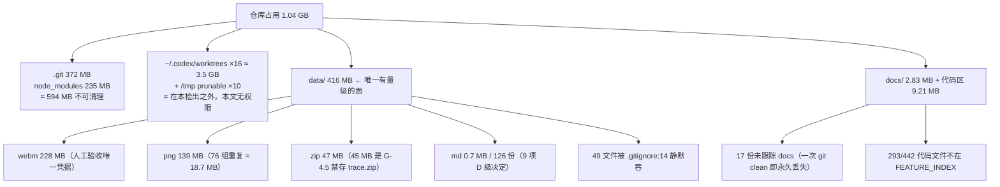

> 状态：REFERENCE
> 作用域：全文。所有字节、计数、引用数仅在 2026-09-18 22:40 +0800 于盘 `codex/world-materials @ f77b800` 成立；复核命令见 §0.4。本目录（`docs/research/`）按 G-3.1 处于权威链最末层，本文不是承诺。
> 基线：不依赖代码改动。取证 ref = 盘 `f77b800`；对账基线 = `origin/codex/semantic-world-r3 @ 93f41aa`（§7 表内两侧分开列，不混用）。本文全部结论只覆盖工作树，不覆盖基线（差异见 §7.3）。
> 取代关系：—（不取代任何一份；`docs/research/TIANYAN_DOC_CLEANUP_PLAN_R0.md` 管"文档处置"，本文管"资产占用与形状"，二者字段不同、不双写：G-3.10、G-3.11）
> 依据：只读取证，2026-09-18 实测。**未修改代码、未删除文件、未移动文件、未提交 Git、未运行 `npm run *`**（门禁为红，见 §7.4）。规则依据 `docs/operations/TIANYAN_PROJECT_GOVERNANCE_R0.md`（下称 `治理`）§3.1/§3.9/§4/§8；口径依据 `docs/research/TIANYAN_DOCUMENT_INDEX_R0.md`（下称 `盘点`）§0.3、`docs/research/TIANYAN_DOC_CLEANUP_PLAN_R0.md`（下称 `清理计划`）§〇。

# 天衍 · 仓库资产清理候选报告 R0

---

## 0. 口径、边界与总账

### 0.1 本文只列候选，不申请执行

| 本文有 | 本文没有 |
| --- | --- |
| 路径、字节、计数、引用者数 | 任何 `rm` / `mv` / `git rm` / `git clean` / `git worktree remove` 的执行或授权申请 |
| 建议动作词：`不动` `登记` `入库` `标状态` `可压缩` `待放行` | `删除`。删除候选一律写成 **P3 待逐条放行**，见 §6.4 |
| 与 `治理` §9 既有数字的逐条对账（§7.1） | 对 C1／C2／A1–A6 的任何裁决（保持原状态，G-3.13） |
| 假阳性显式标注（入口文件、配置、`.d.ts`） | 把"零 importer"等同于"可删"（§5.1 口径声明） |

**受保护数据前置**：`AGENTS.md` 最后第二条 —— 用户正文、项目数据、数据库、迁移、环境文件、密钥禁止纳入破坏性清理。`data/` 内 702 png + 95 webm 是**创始人体验的录像与截图**，属该条射程内。本文因此不给任何一件媒体文件"删除"建议，只给"可压缩/待放行"。

### 0.2 总账（工作树，排除 `node_modules/` 与 `.git/`）

| 项 | 值 | 占可清理面 |
| --- | --- | --- |
| 可清理面合计 | **436,762,222 B ≈ 416.5 MiB** | 100% |
| `data/` | 416,281,711 B（1046 文件 / 81 任务目录） | **95.3%** |
| 代码区（`src` 3,335,526 + `apps/story-studio/src` 2,586,042 + `apps/story-studio/server` 924,702 + `tests` 2,238,223 + `scripts` 102,962 + `bin` 18,218） | 9,205,673 B | 2.1% |
| 根级杂项（`evidence/` 5,359,634 + `apps/story-studio/dist/` 2,067,809 + `.mimosa/` 94,483 + `output/` 4,472） | 7,526,398 B | 1.7% |
| `docs/` | 2,831,494 B（48 文件 = 31 跟踪 + 17 未跟踪，含本文） | 0.6% |
| 根级 md（6 份，含 `TIANYAN_PRODUCT_CORE.md` 110,418 B / 2,488 行、`项目目录导航.md` 39,719 B） | 162,817 B | 0.04% |
| 其余（`.github/`、`ops/`、`package.json`、`.gitignore` 等） | 754,129 B | 0.2% |

```text
可清理面 416.5 MiB 的构成（实测字节占比）
data/ .webm  ██████████████████████████  217.6 MiB  (52.2%)  ← 人工验收唯一凭据
data/ .png   ████████████████            133.0 MiB  (31.9%)  ← 76 组逐字节重复 18.7 MiB
data/ .zip   █████                        44.9 MiB  (10.8%)  ← 其中 43.4 为 G-4.5 禁存 trace.zip
代码 + docs  ███                          11.5 MiB  ( 2.8%)
根级杂项     █                             7.2 MiB  ( 1.7%)
data/ 其余   ▌                             2.1 MiB  ( 0.5%)  ← 0.5% 体积承载 9 项 D 级决定
根级 md+其余 ▌                             0.9 MiB  ( 0.2%)
```

> 各行按 `st_size` 相加 = 437,389,054 B，比上表"可清理面合计"多 626,832 B —— 差额即 §0.4 陷阱表第二行（`data/` 用 `du -sb` 416,281,711 vs `Σ st_size` 416,908,543）。本文不交叉相减。

**一句话总账**：仓库占用问题 95% 在 `data/` 的媒体文件上，且其中最大的一块（43.4 MiB）是 `治理` G-4.5 明文禁止存放的两件 `trace.zip`；`docs/` 的问题不是体积（2.8 MiB）而是 **17/48 份未入库**；代码区没有体积问题，只有**登记缺口**（293/442 不在索引里）。

### 0.3 不可清理占用（登记，不列入任何候选表）

| 路径 | 大小 | 为什么不可动 |
| --- | --- | --- |
| `.git/` | 372,496,667 B | 版本库本体 |
| `node_modules/` | 235,431,020 B | 依赖，`.gitignore:1`；重取需 `npm ci`，且受 §7.4 门禁阻挡 |
| `~/.codex/worktrees/*` ×16 | **约 3.5 GB**（单个最大 541 MB） | **不在本检出内**。其中 4 个承载 P0-1／C1 争议基线；G-2.22 三条前置未过；G-2.23 未登记即不得被任何 Agent 删除 |
| `/tmp/tianyan-*` ×11 | 已标 prunable（10 条） | G-2.21 的违规现状。`git worktree prune` 会改写 Git 元数据 = 属执行动作，本文只登记 |
| `data/2026-09-03_天衍R12B2_1叙事编排权威合同/` | 19,186 B | G-3.19 第一条：被 `FEATURE_INDEX.json` 的 `sourceFiles` 钉住，动它 = `npm run lint` 红 |
| `docs/` 内被钉住的 6 份 md（全局 8 份：6 在 `docs/` ＋ 1 在代码区 ＋ 1 在 `data/`） | — | 同 G-3.19；8 份完整清单见 §2.4 |
| 被 `TIANYAN_ROADMAP.md` / `docs/implementation/` / `项目目录导航.md` / `design-qa.md` / `FEATURE_INDEX.json` 按完整路径引用的 `data/` 目录 | 131,223,420 B | G-3.19 第二、三条；实测 **10 个目录 / 31.5% 的 `data/`**，逐条含行号见 §6.1a。另有 4 个已死的路径串（同表下注），按 G-8.2 不得重造 |

### 0.4 本文取证命令（全部只读；复跑即刷新本表）

```bash
du -sb . node_modules .git data docs                                   # §0.2 总账
find data -type f | wc -l ; git -c core.quotepath=false ls-files data | wc -l   # 1046 / 512
git -c core.quotepath=false ls-files --others --exclude-standard data | wc -l   # 485
find data -type f | git -c core.quotepath=false check-ignore --stdin | wc -l    # 49  ← G-4.7
find docs -type f | wc -l ; git ls-files docs | wc -l ; git ls-files --others --exclude-standard docs | wc -l  # 48 / 31 / 17（含本文）
git worktree list                                                      # 27 条，11 在 /tmp，10 prunable
node -e "console.log(require('./docs/architecture/FEATURE_INDEX.json').features.length)"   # 30
```

**三条口径陷阱**（复现自 `治理` §9 末「口径教训」与 `盘点` §6.4）：

| 陷阱 | 后果 | 本文做法 |
| --- | --- | --- |
| 默认 `core.quotepath` | 中文路径被转义 → 未跟踪 md 数在 Git 口径下得 **0**，真实 **48** | 全程 `-c core.quotepath=false` |
| `du -sb` vs `Σ st_size` | 同目录两值可差 0.5–1%（块口径 vs 稀疏） | 目录用 `du -sb`；文件明细用 `st_size`；不交叉相减 |
| `find -name '*.md' \| wc -l` 在含 `data/` 全仓 | 把 126 份证据 md 计入"文档数" → 虚高 4 倍 | `docs/` 与 `data/` 分别计，见 §2 与 §3 |

---

## 1. 空间占用 TOP50

`建议` 列只用六个词：`不动` / `登记` / `入库` / `标状态` / `可压缩` / `待放行`。`作用` 列引 `清理计划` §3 或 `治理` §9 的原判定，不另立分类。

| # | 路径 | 大小 | 类型 | 当前作用 | 建议 |
| --- | --- | --- | --- | --- | --- |
| 1 | `data/`（整面） | 416,281,711 | 证据根 | 81 任务目录；`CORE.md` 规定的唯一证据落点 | 登记 |
| 2 | `data/2026-09-13_天衍地图管理与AI共同编辑M4/` | 83,690,628 | 证据 | 地图 M4 全量证据，97 png + 22 webm，**139 文件全已跟踪** | 可压缩 |
| 3 | `data/2026-09-08_天衍R5固定稿二次打开首因/` | 54,299,995 | 证据 | 首因链 D 级决定（`sourceDriftCompare` 丢 `artifactId`）；`清理计划` §3.1 判入库+提升 | 入库 |
| 3a | ├ `验证/修复后/trace.zip` | 23,406,826 | **G-4.5 禁存物** | Playwright trace，可重生成 | 待放行 |
| 3b | └ `验证/修复前/trace.zip` | 21,979,782 | **G-4.5 禁存物** | 同上；两件合计 **43.4 MiB = 全仓可回收最大单体** | 待放行 |
| 4 | `data/2026-09-16_天衍真实AI作者闭环R2/` | 39,721,449 | 证据 | U1 交付证据；58/58 **已跟踪**；1 引用者 | 已在库，标状态 |
| 5 | `data/2026-09-15_天衍真实AI审阅闭环R1/` | 34,959,968 | 证据 | 真实 AI 审阅 R1；29/30 **已跟踪**（仅 1 件未跟踪）；含 1 份门禁 verify `.log`(311 KB) | 入库（1 件）＋标状态 |
| 6 | `data/2026-09-05_天衍G1自适应任务主工作面/` | 23,155,274 | 证据 | 恢复/撤销/Envelope 语义**唯一书面来源**（`清理计划` §3.1）；48 文件全未跟踪 | 入库 |
| 7 | `data/2026-09-04_天意事件线黄金闭环/` | 15,870,044 | 证据 | 结论已进 `docs/handoff/`；**25 文件被 `.gitignore:14` 吞** | 登记 |
| 8 | `data/2026-09-15_日常服务切换主目录/` | 12,173,784 | 证据 | 运维切换链；38/39 未跟踪 | 入库 |
| 9 | `data/2026-09-07_天衍R5_M6连续交互证据-retry2/` | 11,615,072 | **G-4.4 违规变体** | 无 md、0 引用者、12 文件全未跟踪 | 待放行 |
| 10 | `data/2026-09-12_天衍资料管理M2/` | 7,906,834 | 证据 | 资料 M2；26/26 **已跟踪**，但无 `工作日志.md` | 已在库；补日志＋标状态 |
| 11 | `data/2026-09-07_天衍R5_M6连续交互证据/`（canonical） | 7,765,250 | 证据 | 被 `ROADMAP:87` 逐路径钉住（连项目 ID/版本/SHA） | 不动 |
| 12 | `data/2026-09-17_女娲作者工作面视觉重构R6/` | 7,086,486 | 证据 | 视觉链现状之一；`验收报告.md` 明写「本轮不得签发 FOUNDER_VISUAL_PASS」→ C2 未裁定 | 不动 |
| 13 | `data/2026-09-09_天衍N3连续交付证据/` | 6,786,992 | 证据 | `ROADMAP:101` 按路径引用 | 不动 |
| 14 | `data/2026-09-06_天衍G1-R2连续作者工作面/` | 5,819,257 | 证据 | "全书概览/阅读所选"两层语义唯一书面来源；58 文件全未跟踪 | 入库 |
| 15 | `data/2026-09-09_天衍N3交付复核R1/` | 5,728,196 | 证据 | `ROADMAP` 链引用 | 不动 |
| 16 | `data/2026-09-17_女娲视觉证据收尾R4_1/` | 5,579,275 | 证据 | 视觉链历史段；2 文件被 ignore 吞 | 标状态 |
| 17 | `evidence/`（根） | 5,359,634 | **G-4.7 禁存目录** | R2_2B1 三组截图/录像；**tracked 引用者 0**；被 `.gitignore:14` 吞 | 登记 |
| 18 | `data/2026-09-12_天衍核心导航与作者便捷性整合/` | 5,216,071 | 证据 | 24/24 **已跟踪**，无 `工作日志.md`；与 `资料管理M2` 有逐字节重复 png | 已在库；补日志＋标状态 |
| 19 | `data/2026-09-07_天衍R5_M6连续交互证据-pass3/` | 5,155,577 | G-4.4 违规变体 | 0 引用者、全未跟踪 | 待放行 |
| 20 | `data/2026-09-05_天衍R2_2A工作面壳层/` | 4,887,560 | 证据 | **9 文件全被 ignore 吞**（tracked=0/untracked=0/ignored=9） | 登记 |
| 21 | `data/2026-09-18_天衍世界观工作台R4/` | 4,596,374 | 证据 | 世界脉搏首屏视觉权威候选（C2 四源之一）；PR #29 已否决 → 只作证据 | 入库 |
| 22 | `data/2026-09-07_天衍R5_M6连续交互证据-pass2/` | 4,273,780 | G-4.4 违规变体 | 0 引用者 | 待放行 |
| 23 | `data/2026-09-17_女娲工作面视觉重构R1/` | 4,134,258 | 证据 | 视觉链最早段；与 R4_1 有 4 份逐字节相同"改造前"png | 标状态 |
| 24 | `data/2026-09-07_天衍R5_M6连续交互证据-final/` | 4,098,758 | G-4.4 违规变体 | 0 引用者 | 待放行 |
| 25 | `data/2026-09-07_天衍R5_M6连续交互证据-pass/` | 4,097,277 | G-4.4 违规变体 | 0 引用者 | 待放行 |
| 26 | `data/2026-09-12_资料管理与世界设定方案/` | 3,548,439 | 证据 | 11 文件被 ignore 吞；含 1.7 MB `交互原型与验证.zip` | 登记 |
| 27 | `data/2026-09-07_天衍R5_M6连续交互证据-debug/` | 3,544,998 | G-4.4 违规变体 | 0 引用者 | 待放行 |
| 28 | `data/2026-09-10_天衍角色经历与记忆查询/` | 3,440,076 | 证据 | 记忆查询链，7 文件全已跟踪 | 不动 |
| 29 | `data/2026-09-07_天衍R5_M6连续证据-retry/` | 3,391,144 | G-4.4 违规变体 | 0 引用者 | 待放行 |
| 30 | `src/`（整面） | 3,335,526 | 代码 | 领域契约/智能/创作层；非清理对象 | 不动 |
| 31 | `data/2026-09-17_角色磁吸详情工作台R0/` | 2,903,667 | 证据 | 通用 Entity Dock 四态九页签设计来源；10 文件全未跟踪 | 入库 |
| 32 | `docs/`（整面） | 2,831,494 | 文档 | 48 文件 = 31 跟踪 + 17 未跟踪（含本文） | 入库 |
| 33 | `data/2026-09-17_女娲分支浏览器验收R2/` | 2,787,778 | 证据 | 12 文件全未跟踪 | 入库 |
| 34 | `data/2026-09-02_天衍R11事件观察工作台/` | 2,634,227 | 证据 | 五维观察配方 + 14 行边界表，`docs/` 内 0 命中 → 待提升 | 入库 |
| 35 | `apps/story-studio/src/` | 2,586,042 | 代码 | 八空间 UI 与 Shell；非清理对象 | 不动 |
| 36 | `data/2026-09-09_天衍N2人物注意力跨场景连续证据/` | 2,480,695 | 证据 | 全已跟踪 | 不动 |
| 37 | `data/2026-09-18_混合语义检索与世界工作台R3/` | 2,377,192 | 证据 | 与 `混合语义检索R3_1/` 报告重叠 → `清理计划` §3.3 判降 HISTORICAL | 标状态 |
| 38 | `data/2026-09-17_女娲聚焦与响应式打磨R6_1/` | 2,106,681 | 证据 | 视觉链中段；全未跟踪 | 入库 |
| 39 | `data/2026-09-18_R3_1B视觉与GitHub收口/` | 2,081,644 | 证据 | 全未跟踪；2 png 与 `混合语义检索R3_1/证据/` 逐字节相同 | 入库 |
| 40 | `apps/story-studio/dist/` | 2,067,809 | **构建产物** | `.gitignore:23`；`npm run build` 可重生成 | 登记 |
| 41 | `data/2026-09-18_世界构建因果演化工作台R2/` | 2,008,296 | 证据 | 全未跟踪；含 `密度bug/密度探针脚本.mjs`（G-4.6 违规代码副本） | 入库 |
| 42 | `data/2026-08-28_天衍全局外壳重建R0/` | 1,954,923 | 证据 | 八空间外壳最早记录；全已跟踪 | 标状态 |
| 43 | `data/2026-08-29_天衍R0_6存储Agent外壳集成/` | 1,814,668 | 证据 | 无 `工作日志.md`（G-4.2 判未交付） | 标状态 |
| 44 | `docs/design/references/tianyan-r0-5-founder-character-directory.png` | 1,673,596 | 权威图 | R0.5 权威视觉参考，被 `design-qa.md` 以 SHA-256 钉住（C2 四源之一） | 不动 |
| 45 | `data/2026-09-07_天衍R5_M3连续交互证据/` | 1,579,669 | 证据 | M3 段 | 不动 |
| 46 | `data/2026-09-18_R3_1C_UI收口与证据/` + `..._R3_1C_UI收口/` | 1,510,710 + 1,475,982 | **同切片散进两目录** | G-4.3/G-4.4 双违规；9 png 里 6 份与另一份逐字节相同；0 引用者 | 待裁定 |
| 47 | `data/2026-09-12_天衍MAP-M3作者体验收尾/` | 1,409,865 | 证据 | 全已跟踪 | 不动 |
| 48 | `data/2026-09-03_天衍R12B1统一工程基线/` | 1,180,688 | 证据 | 工程基线记录 | 标状态 |
| 49 | `data/2026-09-03_天衍R12B2故事推进生产化/` | 1,163,066 | 证据 | 同上 | 标状态 |
| 50 | `.mimosa/`（根） | 94,483 | **Agent 运行态** | `hook-status` / `hook-state` / `history`；非项目资产；**既不被跟踪也不被 ignore**（唯一会污染 `git status` 的根级目录） | 登记 |
| — | 其余 38 个 `data/` 目录（各 <1.2 MB，173 文件，合计 12,895,976 B） | 12,895,976 | 证据 | 2026-08-27～09-11 早期切片与三个纯报告目录 | 见 §3.3 |

**TOP50 可回收上限（不执行）**：`3a+3b` `trace.zip` 45,386,608 B ＋ 10 个形状违规目录（R5_M6 七变体 + R3_1C 三兄弟，87 文件）39,175,442 B ＋ 逐字节多余副本 111 件 19,605,854 B，**三者取并集**（去重后 175 文件）= **99,894,828 B ≈ 95.3 MiB = `data/` 的 24.0%**。本文不申请其中任何一项。

---

## 2. `docs/` 治理表

### 2.1 分类判据（写死，便于复跑）

| 判据 | 取法 |
| --- | --- |
| 是否权威链 | `治理:207-225`（G-3.1）八层：CORE → `ROADMAP` → `docs/architecture/*` → `DESIGN.md` → `项目目录导航.md` → `docs/implementation/`+`docs/operations/` → `日常入口.md`/`design-qa.md` → `docs/research/`+`data/`。`docs/handoff/` **不在此链上**（只在 G-3.2 落点表里有一行）→ 记为 `链外(落点)` |
| 引用数量 | 全文匹配 basename 去 `.md`；语料 = 跟踪+未跟踪的 `.md/.json/.mjs/.cjs/.ts/.tsx`（排除 `node_modules`、`.git`），排除自身与本文 |
| `跟踪引用` | 上述引用者中**已被 Git 跟踪**的数量。为 0 ⇒ 按 G-4.10「未纳入 Git 视为不存在」，其权威地位对本机以外等于 0 |
| LINTPIN | 路径是否出现在 `FEATURE_INDEX.json` 的 `entrypoints/sourceFiles/tests/domainOwners/stateOwners/persistenceOwner` 或 `boundaries.*` |
| A/B/C/D | A＝必须保留；B＝建议入库；C＝可未来归档（就地标状态，不移动）；D＝疑似垃圾候选 |

### 2.2 逐份处置表（`docs/` 在盘 48 个文件 = 45 `.md` ＋ 2 `.json` ＋ 1 `.png`；按 `跟踪引用` 升序，最不可见的排最前）

| 路径 | 大小 B | 权威链 | 引用 | 跟踪引用 | GIT | PIN | 类 |
| --- | --- | --- | --- | --- | --- | --- | --- |
| `docs/research/TIANYAN_REPOSITORY_CLEANUP_AUDIT_R0.md`（本文） | 69,875 | ⑧ | 0（语料已排除自身） | 0 | 未跟踪 | — | **B** |
| `docs/handoff/TIANYAN_CURRENT_STATE_SNAPSHOT_R0.md` | 46,018 | 链外(落点) | 0 | 0 | 未跟踪 | — | **B** |
| `docs/architecture/TIANYAN_MULTI_NODE_PREDICTION_REAL_PROVIDER_SMOKE_COMMAND_R0.md` | 2,372 | ③ | 2 | 0 | 跟踪 | — | A |
| `docs/architecture/TIANYAN_R0_6_1_AGENT_RUNTIME_PLUGIN_ABI.md` | 1,793 | ③ | 2 | 0 | 跟踪 | — | A |
| `docs/architecture/TIANYAN_TIAN_YI_AGENT_MODE_AND_RUNTIME_R0.md` | 2,421 | ③ | 2 | 0 | 跟踪 | — | A |
| `docs/handoff/TIANYAN_NEXT_CODEX_ENTRY_R0.md` | 44,590 | 链外(落点) | 2 | 0 | 未跟踪 | — | **B** |
| `docs/operations/TIANYAN_PROJECT_GOVERNANCE_R0.md` | 45,515 | ⑥ | 2 | 0 | 未跟踪 | — | **B** |
| `docs/product/TIANYAN_EVENT_WORKSPACE_R9_FOUNDER_REVIEW_EVIDENCE.md` | 4,836 | 非链 | 2 | 0 | 跟踪 | — | **C** |
| `docs/product/TIANYAN_MATERIALS_M2_DAILY_UPGRADE_DELTA.md` | 1,584 | 非链 | 2 | 0 | 跟踪 | — | **C** |
| `docs/product/TIANYAN_MATERIALS_MANAGEMENT_M2_IMPLEMENTATION.md` | 2,451 | 非链 | 2 | 0 | 跟踪 | — | **C** |
| `docs/product/TIANYAN_MULTI_NODE_PREDICTION_IMPLEMENTATION_PLAN_R0.md` | 19,551 | 非链 | 2 | 0 | 跟踪 | — | A（`:82-144` 段 OBSOLETE） |
| `docs/research/TIANYAN_DOC_CLEANUP_PLAN_R0.md` | 35,858 | ⑧ | 2 | 0 | 未跟踪 | — | **B** |
| `docs/handoff/TIANYAN_IMPLEMENTATION_ROADMAP_R0.md` | 113,297 | 链外(落点) | 3 | 0 | 未跟踪 | — | **B** |
| `docs/handoff/TIANYI_R2_2B1_PHASE_CLOSURE_R1.md` | 5,272 | 链外(落点) | 3 | 0 | 跟踪 | — | A |
| `docs/operations/TIANYAN_HK_REVIEW_DEPLOYMENT.md` | 6,353 | ⑥ | 3 | 0 | 跟踪 | — | A |
| `docs/product/TIANYAN_CHARACTER_AGENT_PRODUCT_DESIGN_R0.md` | 61,987 | 非链 | 3 | 0 | 未跟踪 | — | **B** |
| `docs/product/TIANYAN_PRODUCT_MAP_VISUAL_R0.md` | 37,361 | 非链 | 3 | 0 | 未跟踪 | — | **B** |
| `docs/product/WORLD_MATERIALS_M1_PLAN.md` | 4,392 | 非链 | 3 | 0 | 跟踪 | — | **C** |
| `docs/research/TIANYAN_DESIGN_PRINCIPLES_R0.md` | 18,581 | ⑧ | 3 | 0 | 未跟踪 | — | **B**（落点待裁定） |
| `docs/research/TIANYAN_UI_REFERENCE_LIBRARY_R0.md` | 46,740 | ⑧ | 3 | 0 | 未跟踪 | — | **B** |
| `docs/architecture/TIANYAN_R0_3_1_ACTIVE_TREE.md` | 4,229 | ③ | 4 | 0 | 跟踪 | — | **C** |
| `docs/handoff/TIANYAN_R0_5_TO_R0_6_MEMORY_HANDOFF.md` | 7,430 | 链外(落点) | 4 | 0 | 跟踪 | — | **C**（`:69` 就地标失效） |
| `docs/product/TIANYAN_WORLD_WORKBENCH_PRODUCT_DESIGN_R0.md` | 59,808 | 非链 | 4 | 0 | 未跟踪 | — | **B** |
| `docs/research/TIANYAN_CHARACTER_AGENT_V2_RESEARCH_R0.md` | 73,246 | ⑧ | 4 | 0 | 未跟踪 | — | **B** |
| `docs/research/WEBNOVEL_WRITER_REFERENCE_MAP_R0_6.md` | 22,302 | ⑧ | 4 | 0 | 跟踪 | — | A（`:126-132` 门禁） |
| `docs/handoff/TIANYAN_CODEX_FIRST_EXECUTION_PACKAGE_R0.md` | 15,293 | 链外(落点) | 5 | 0 | 未跟踪 | — | **B**（与 C1 冲突，先裁后入库） |
| `docs/product/TIANYAN_DEV_SUGGESTIONS_R0.md` | 3,711 | 非链 | 5 | 0 | 跟踪 | — | A |
| `docs/research/TIANYAN_DOCUMENT_INDEX_R0.md` | 56,938 | ⑧ | 6 | 0 | 未跟踪 | — | **B** |
| `docs/research/TIANYAN_UI_VISUAL_ANALYSIS_R0.md` | 58,819 | ⑧ | 6 | 0 | 未跟踪 | — | **B** |
| `docs/product/TIANYAN_AGENT_EVOLUTION_ROADMAP_R0.md` | 63,406 | 非链 | 7 | 0 | 未跟踪 | — | **B**（落点待裁定） |
| `docs/research/TIANYAN_SYSTEM_MAP_R0.md` | 46,961 | ⑧ | 8 | 0 | 未跟踪 | — | **B** |
| `docs/architecture/TIANYAN_R0_6_AGENT_TEXT_VERTICAL_SLICE_PRE_IMPLEMENTATION_MAP.md` | 3,577 | ③ | 3 | 1 | 跟踪 | **PIN** | A（OBSOLETE 但禁移动） |
| `docs/architecture/TIANYAN_LEGACY_KEEP_REWRITE_REMOVE_R0.md` | 5,779 | ③ | 4 | 1 | 跟踪 | — | **C** |
| `docs/architecture/TIANYAN_PROVIDER_CATALOG_AND_EMBEDDING_BINDING_R0.md` | 7,023 | ③ | 4 | 1 | 跟踪 | **PIN** | A |
| `docs/architecture/TIANYAN_R0_SHELL_CONTRACT.md` | 9,049 | ③ | 5 | 1 | 跟踪 | **PIN** | A |
| `docs/product/TIANYAN_NUWA_RUN_AND_MULTIVERSE_DERIVED_VERSION_BOUNDARY_R0.md` | 4,585 | 非链 | 5 | 1 | 跟踪 | — | A |
| `docs/product/TIANYAN_VISUAL_WORLD_EVOLUTION_R0.md` | 5,580 | 非链 | 5 | 1 | 跟踪 | — | A |
| `docs/product/TIANYAN_ROADMAP.md` | 31,495 | **②** | 12 | 1 | 跟踪 | — | A |
| `docs/architecture/TIANYAN_WORKSPACE_LAYOUT_V1.md` | 3,139 | ③ | 4 | 2 | 跟踪 | — | A |
| `docs/architecture/TIANYAN_MEMORY_AND_MODEL_CAPABILITY_BOUNDARIES_R0.md` | 3,235 | ③ | 6 | 2 | 跟踪 | **PIN** | A |
| `docs/architecture/TIANYAN_RUNTIME_MODE_AND_SINGLE_ENTRY_R0.md` | 3,095 | ③ | 6 | 2 | 跟踪 | **PIN** | A |
| `docs/implementation/TIANYAN_R4_PI_ZERO_CALL_AND_NUWA_N1.md` | 13,589 | ⑥ | 7 | 2 | 跟踪 | **PIN** | A |
| `docs/research/TIANYAN_REFERENCE_CATALOG.md` | 6,857 | ⑧ | 7 | 2 | 跟踪 | — | A |
| `docs/operations/TIANYAN_DAILY_4191_4192_UPGRADE_RUNBOOK.md` | 4,029 | ⑥ | 9 | 3 | 跟踪 | — | A |
| `docs/product/DESIGN.md` | 5,152 | ④ | 22 | 4 | 跟踪 | — | A |
| `docs/architecture/FEATURE_INDEX.json` | 59,257 | ③ | — | 2 | 跟踪 | 本体 | A（`sourceCommit` 不可解析 → 就地重算） |
| `docs/research/TIANYAN_MAINLINE_LINEAGE_AND_CAPABILITY_REALITY_MAP_R0.json` | 9,467 | ⑧ | — | 1 | 跟踪 | — | **C** |
| `docs/design/references/tianyan-r0-5-founder-character-directory.png` | 1,673,596 | ④(图) | 11 | 多 | 跟踪 | — | A（C2 未裁前不得自称"当前目标"） |

### 2.3 分类计数与体积

| 类 | 判定条件 | 份数 | 体积 B | 占 `docs/` |
| --- | --- | --- | --- | --- |
| **A 必须保留** | 权威链①–⑥成员 ∪ LINTPIN ∪ 有效门禁 ∪ 唯一权威 | **22** | 223,437 | 7.9% |
| **B 建议入库** | 17 份未跟踪全部（含本文与 §3.4 的落点待裁定 3 份） | **17** | 894,293 | 31.6% |
| **C 可以未来归档** | 跟踪 + HISTORICAL/OBSOLETE + 无 PIN | **8** | 40,168 | 1.4% |
| **D 疑似垃圾** | 未跟踪 ∧ 零引用 ∧ 非落点 ∧ 非决定 | **0** | 0 | 0% |
| 权威图（png；已计入 A 行的"链④(图)"，此处单列以免掩盖结构） | — | 1 | 1,673,596 | 59.1% |
| **合计** | — | **48** | **2,831,494** | 100% |

```text
docs/ 48 份   体积分布                        可见性分布（跟踪引用数）
A 22 份 ████      7.9%                        ≥1 跟踪引用  ██████ 17 份（35%）
B 17 份 █████████ 31.6%  ← 全是未跟踪          0 跟踪引用    ███████████ 31 份（65%）
C  8 份 ▌         1.4%  ← 就地标状态，不移动
D  0 份           0.0%  ← docs/ 层没有垃圾，只有"没进库"
png 1 份 ████████████████████ 59.1%  ← 单一权威图占掉六成体积
```

**关键读数（不新增概念，只指出实测关系）**：`docs/` 的 45 份 md 里**只有 14 份被至少一个已跟踪文件引用**；48 份里 31 份 `跟踪引用` 为 0 —— 它们的引用关系全部发生在未跟踪文件之间，按 G-4.10 对下游等于不存在。这与 `清理计划` 的一句话总账（"问题不是乱，是最新的东西不在库里"）在数字上一致。

### 2.4 LINTPIN 8 份（G-3.19 硬约束，任何归档动作的前置例外）

| # | 路径 | 钉住方 |
| --- | --- | --- |
| 1 | `docs/architecture/TIANYAN_MEMORY_AND_MODEL_CAPABILITY_BOUNDARIES_R0.md` | `FEATURE_INDEX.json` `sourceFiles` |
| 2 | `docs/architecture/TIANYAN_PROVIDER_CATALOG_AND_EMBEDDING_BINDING_R0.md` | 同上 |
| 3 | `docs/architecture/TIANYAN_R0_6_AGENT_TEXT_VERTICAL_SLICE_PRE_IMPLEMENTATION_MAP.md` | 同上 |
| 4 | `docs/architecture/TIANYAN_R0_SHELL_CONTRACT.md` | 同上 |
| 5 | `docs/architecture/TIANYAN_RUNTIME_MODE_AND_SINGLE_ENTRY_R0.md` | 同上 |
| 6 | `docs/implementation/TIANYAN_R4_PI_ZERO_CALL_AND_NUWA_N1.md` | 同上 |
| 7 | `apps/story-studio/src/settings/agent/INTEGRATION_REQUEST.md` | 同上（代码区，见 §4.2） |
| 8 | `data/2026-09-03_天衍R12B2_1叙事编排权威合同/TIANYAN_NARRATIVE_ARRANGEMENT_CONTRACT_R0.md` | 同上（唯一在 `data/` 内的 LINTPIN；路径同时被 `项目目录导航.md:128` 钉住，见 §6.1a 与 §0.3） |

实测与 `治理:322` 「被钉住的 8 份 md——含 `data/` 里那一份」**逐字吻合**；且 8 份中只有 6 份在 `docs/`，与 `治理` G-3.18 自述的"28 份已跟踪 md 里只有 6 份被钉住"一致。

### 2.5 `docs/` 的三类"疑似垃圾"排除结论

| 疑点 | 实测 | 结论 |
| --- | --- | --- |
| 有没有整份文档是纯垃圾（D 类） | 48 份里 0 份满足 D 判据 | **无**。体积最小的 `WORLD_MATERIALS_M1_PLAN.md`(4,392 B) 与 `M2_DAILY_UPGRADE_DELTA.md`(1,584 B) 仍各被 2–3 处引用 |
| 逐字节重复的文档 | 全仓 md5 相同 md 只有 4 对，且都在 `data/`（`清理计划` §3.3 已登记为"回溯前后"证据） | **`docs/` 无重复文件** |
| 未跟踪但可丢弃 | 17 份未跟踪 = 全部承载有效决定、设计或交接；无一满足"可丢弃" | **一份都不可丢**；一次 `git clean -fd` 即永久损失（P0-6 同一风险） |

---

## 3. `data/` 清理表

### 3.1 五桶分类（1046 文件 / 81 目录 / 416,908,543 B，按 `Σ st_size`）

①②④ 三条互斥且穷尽（19+52+10 = 81 目录，302+657+87 = 1046 文件，118,837,300+258,895,801+39,175,442 = 416,908,543 B）。**① 的名单不由本文裁决**，直接取 `清理计划` §3.1「承担有效设计、必须入库或提升（16 行 / 19 个目录）」那张表，本文只负责量出它的体积。③⑤ 与①②④ **体积重叠**（同一文件可同时是"有效证据"与"可压缩"），不可相加。

| 桶 | 判据（可复跑） | 目录数 | 文件数 | 体积 B | 代表路径 |
| --- | --- | --- | --- | --- | --- |
| **① 当前有效证据** | 逐字取自 `清理计划` §3.1 的 19 个目录 | **19** | **302**（38 跟踪 / 264 未跟踪） | **118,837,300** | `…R5固定稿二次打开首因`(54.3M)、`…G1自适应任务主工作面`(23.2M)、`…R5_M6…`canonical(7.8M) |
| **② 历史验证证据** | 81 − ① − ④：结论已提升到 `docs/` 或已被后继切片取代，`清理计划` §3.2 判"不删、留 `data/`" | **52** | **657** | **258,895,801** | `…地图M4`(83.7M)、`…真实AI作者闭环R2`(39.7M)、`…真实AI审阅闭环R1`(35.0M) |
| **③ 重复截图** | md5 相同 ∧ size>0，每组按路径序保留第 1 件，其余记"多余副本" | 跨目录 52 组 / 同目录 24 组 | **111 件多余副本**（跨 87 + 同 24） | **19,605,854** | 见 §3.4；`…地图M4` 与 `…核心导航…` 之间有整批相同 png |
| **④ debug / 变体产物** | G-4.4 目录后缀表达"第 N 次尝试" ∪ 同切片散进多目录（G-4.3） | **10**（R5_M6 ×7 + R3_1C ×3） | **87** | **39,175,442** | `-retry2` 11.6M、`-pass3` 5.2M、`-pass2` 4.3M、`-final` 4.1M、`-pass` 4.1M、`-debug` 3.5M、`…连续证据-retry` 3.4M、R3_1C ×3 = 3.0M |
| **⑤ 可压缩归档** | `.webm` ∪ `trace.zip` ∪（`.png` ≥ 300,000 B） | 涉及 38 个任务目录（展开到嵌套子目录 73 个） | **146**（95 webm，其中 4 件 0 字节 + 2 trace.zip + 49 大 png） | **306,423,386 ≈ 292.2 MiB** | `…R5固定稿…/验证/修复{前,后}/trace.zip` = 45,386,608 B 最大单体 |

**可见性副轴（与①–⑤正交）**：全仓 `data/` 之外的文本文件（`.md/.json/.mjs/.cjs/.ts/.tsx`，含未跟踪，排除本文）里，目录名**一次都没出现过**的 `data/` 目录 = **13 个 / 101 文件 / 40,738,759 B**；其余 68 个目录 = 945 文件 / 376,169,784 B（两两相加正好等于总量，可复跑）。13 个零引用目录里 9 个属④（R5_M6 七变体 + `R3_1C_UI收口与证据` + `R3_1C证据与GitHub收口`；第三个 `R3_1C_UI收口/` 有引用者），另 4 个是 `…MAP-M3作者体验收尾`(9/1,409,865)、`…女娲统一工作面R5A`(4/1,122,255)、`…B1-R1浏览器交付`(9/502,807)、`…日常版本升级预演`(1/4,372)。`trace.zip` 所在目录属①（首因链有效证据），其 zip 本体属⑤且是 G-4.5 禁存物。


### 3.2 逐目录处置表（按体积取前 20：4,273,780 B – 83,690,628 B；其余 61 个见 §3.3。注：≥3 MB 的目录实际有 27 个，本表是前 20）

`路径钉住` = 该目录以 `data/<目录名>` 形式出现在至少一个**已跟踪、非 `data/`、非本文**的 `.md`/`.json` 里（全量 10 条含行号见 §6.1a）；`未跟踪` / `被 ignore 吞` 两列与（未单列的）已跟踪件构成按 `git ls-files` + `git check-ignore` 的**三态互斥划分**：已跟踪件 = `文件数` − `未跟踪` − `被 ignore 吞`；`日志` = 是否有 `工作日志.md`（G-4.2）。所有数字为本次实测。

| 路径 | 文件数 | 大小 B | 未跟踪 | 被 ignore 吞 | 路径钉住 | 日志 | 有效 | 建议 |
| --- | --- | --- | --- | --- | ---| --- | --- | --- |
| `data/2026-09-13_天衍地图管理与AI共同编辑M4/` | 139 | 83,690,628 | 0 | 0 | 1 | 有 | 是 | 可压缩（97 png/22 webm，多组逐字节重复） |
| `data/2026-09-08_天衍R5固定稿二次打开首因/` | 22 | 54,299,995 | 16 | 0 | 0 | **无** | 是（D 级） | 入库 + 提升 + **补 `工作日志.md`**；**45.4M 的 trace.zip 属 G-4.5 禁存** |
| `data/2026-09-16_天衍真实AI作者闭环R2/` | 58 | 39,721,449 | **0** | 0 | 0 | 有 | 是 | **已在库**（58/58 已跟踪）；剩动作＝标状态 |
| `data/2026-09-15_天衍真实AI审阅闭环R1/` | 30 | 34,959,968 | 1 | 0 | 0 | 有 | 是 | 入库（**仅 1 件**）＋ 标状态 |
| `data/2026-09-05_天衍G1自适应任务主工作面/` | 48 | 23,155,274 | 48 | 0 | 1 | **无** | 是（D 级） | 入库（G-4.9） |
| `data/2026-09-04_天意事件线黄金闭环/` | 26 | 15,870,044 | 0 | 25 | 0 | **无** | 部分 | 登记（G-4.7 陷阱样本） |
| `data/2026-09-15_日常服务切换主目录/` | 39 | 12,173,784 | 38 | 0 | 0 | 有 | 是 | 入库 |
| `data/2026-09-07_天衍R5_M6连续交互证据-retry2/` | 12 | 11,615,072 | 12 | 0 | 0 | **无** | 否（变体） | 待放行（P3） |
| `data/2026-09-12_天衍资料管理M2/` | 26 | 7,906,834 | **0** | 0 | 0 | **无** | 是 | **已在库**（26/26）；剩动作＝补 `工作日志.md`（G-4.2）＋ 标状态 |
| `data/2026-09-07_天衍R5_M6连续交互证据/` | 12 | 7,765,250 | 1 | 0 | 1 | **无** | **是（canonical）** | **不动**（`ROADMAP:87` 钉住；11 件已在库、1 件未跟踪） |
| `data/2026-09-17_女娲作者工作面视觉重构R6/` | 20 | 7,086,486 | 20 | 0 | 0 | **无** | 是 | **不动**（C2 冻结中，G-4.13） |
| `data/2026-09-09_天衍N3连续交付证据/` | 12 | 6,786,992 | **0** | 0 | 1 | **无** | 是 | **不动**（`ROADMAP:101` 钉住，见 §6.1a） |
| `data/2026-09-06_天衍G1-R2连续作者工作面/` | 58 | 5,819,257 | 58 | 0 | 0 | **无** | 是（D 级） | 入库 |
| `data/2026-09-09_天衍N3交付复核R1/` | 10 | 5,728,196 | **0** | 0 | 1 | **无** | 是 | **不动**（`ROADMAP:103` 钉住） |
| `data/2026-09-17_女娲视觉证据收尾R4_1/` | 29 | 5,579,275 | 27 | 2 | 0 | **无** | 历史 | 标状态（现状见 R6_2） |
| `data/2026-09-12_天衍核心导航与作者便捷性整合/` | 24 | 5,216,071 | **0** | 0 | 0 | **无** | 是 | **已在库**（24/24）；剩动作＝补 `工作日志.md` ＋ 标状态 |
| `data/2026-09-07_天衍R5_M6连续交互证据-pass3/` | 9 | 5,155,577 | 9 | 0 | 0 | **无** | 否 | 待放行 |
| `data/2026-09-05_天衍R2_2A工作面壳层/` | 9 | 4,887,560 | 0 | 9 | 0 | **无** | 部分 | 登记（全目录被 ignore 吞） |
| `data/2026-09-18_天衍世界观工作台R4/` | 35 | 4,596,374 | 33 | 2 | 0 | **无** | 是（世界脉搏首屏视觉候选）／**基线已否决** | 入库为证据，禁作施工起点 |
| `data/2026-09-07_天衍R5_M6连续交互证据-pass2/` | 9 | 4,273,780 | 9 | 0 | 0 | **无** | 否 | 待放行 |

### 3.3 其余 61 个目录（81 − §3.2 的 20；全部 <4.3 MB，419 文件，合计 70,620,677 B ≈ 67.4 MiB）

这一节把 `data/` 的 81 个任务目录**穷尽**：§3.2 列 20 个，本表列其余 61 个，两表互斥、相加即全集。`建议` 列仍只用 §0.1 的六个动作词；形状违规的逐条规则归 §3.4，本表不重复裁决。按体积降序。

| 路径 | 文件数 | 大小 B | 未跟踪 | 被 ignore 吞 | 引用者 | 跟踪引用者 | 日志 | 有效 | 建议 |
| --- | --- | --- | --- | --- | --- | --- | --- | --- | --- |
| `data/2026-09-17_女娲工作面视觉重构R1/` | 18 | 4,134,258 | 18 | 0 | 1 | 0 | 无 | 历史 | 标状态 |
| `data/2026-09-07_天衍R5_M6连续交互证据-final/` | 8 | 4,098,758 | 8 | 0 | 0 | 0 | 无 | 否（变体） | 待放行（G-4.4/G-4.3，P3） |
| `data/2026-09-07_天衍R5_M6连续交互证据-pass/` | 8 | 4,097,277 | 8 | 0 | 0 | 0 | 无 | 否（变体） | 待放行（G-4.4/G-4.3，P3） |
| `data/2026-09-12_资料管理与世界设定方案/` | 13 | 3,548,439 | 2 | 11 | 5 | 0 | 无 | 部分 | 登记（G-4.7 吞 11 件） |
| `data/2026-09-07_天衍R5_M6连续交互证据-debug/` | 8 | 3,544,998 | 8 | 0 | 0 | 0 | 无 | 否（变体） | 待放行（G-4.4/G-4.3，P3） |
| `data/2026-09-10_天衍角色经历与记忆查询/` | 7 | 3,440,076 | 0 | 0 | 1 | 0 | 无 | 历史 | 标状态 |
| `data/2026-09-07_天衍R5_M6连续证据-retry/` | 7 | 3,391,144 | 7 | 0 | 0 | 0 | 无 | 否（变体） | 待放行（G-4.4/G-4.3，P3） |
| `data/2026-09-17_角色磁吸详情工作台R0/` | 10 | 2,903,667 | 10 | 0 | 2 | 0 | 无 | 是（D 级/有效设计） | 入库（`清理计划`§3.1） |
| `data/2026-09-17_女娲分支浏览器验收R2/` | 12 | 2,787,778 | 12 | 0 | 1 | 0 | 无 | 历史 | 标状态 |
| `data/2026-09-02_天衍R11事件观察工作台/` | 16 | 2,634,227 | 0 | 0 | 2 | 0 | 有 | 是（D 级/有效设计） | **已在库**（`清理计划`§3.1 的"入库"对它是空动作）；剩动作＝提升正文进 `docs/` |
| `data/2026-09-09_天衍N2人物注意力跨场景连续证据/` | 7 | 2,480,695 | 0 | 0 | 2 | 1 | 无 | 历史（已提升） | 不动（1 处跟踪引用） |
| `data/2026-09-18_混合语义检索与世界工作台R3/` | 12 | 2,377,192 | 12 | 0 | 2 | 0 | 无 | 历史 | 标状态 |
| `data/2026-09-17_女娲聚焦与响应式打磨R6_1/` | 11 | 2,106,681 | 11 | 0 | 1 | 0 | 无 | 是（视觉四源之一） | 入库 + 提升；**C2 冻结中，禁作施工起点（G-4.13）** |
| `data/2026-09-18_R3_1B视觉与GitHub收口/` | 15 | 2,081,644 | 15 | 0 | 1 | 0 | 无 | 历史 | 标状态 |
| `data/2026-09-18_世界构建因果演化工作台R2/` | 12 | 2,008,296 | 12 | 0 | 2 | 0 | 无 | 历史 | 标状态 |
| `data/2026-08-28_天衍全局外壳重建R0/` | 8 | 1,954,923 | 0 | 0 | 1 | 0 | 有 | 历史 | 标状态 |
| `data/2026-08-29_天衍R0_6存储Agent外壳集成/` | 16 | 1,814,668 | 0 | 0 | 1 | 0 | 无 | 历史 | 标状态（无结论 md） |
| `data/2026-09-07_天衍R5_M3连续交互证据/` | 6 | 1,579,669 | 0 | 0 | 1 | 0 | 无 | 历史 | 标状态 |
| `data/2026-09-18_R3_1C_UI收口与证据/` | 10 | 1,510,710 | 10 | 0 | 0 | 0 | 无 | 否（变体） | 待放行（G-4.4/G-4.3，P3） |
| `data/2026-09-18_R3_1C_UI收口/` | 9 | 1,475,982 | 9 | 0 | 2 | 0 | 无 | 否（变体） | 待放行（G-4.4/G-4.3，P3） |
| `data/2026-09-12_天衍MAP-M3作者体验收尾/` | 9 | 1,409,865 | 0 | 0 | 0 | 0 | 有 | 历史 | 标状态 |
| `data/2026-09-03_天衍R12B1统一工程基线/` | 12 | 1,180,688 | 0 | 0 | 2 | 1 | 无 | 历史（已提升） | 不动（1 处跟踪引用） |
| `data/2026-09-03_天衍R12B2故事推进生产化/` | 12 | 1,163,066 | 0 | 0 | 1 | 0 | 无 | 历史 | 标状态 |
| `data/2026-09-03_天衍R11_1参与表达与画布密度修复/` | 9 | 1,159,099 | 0 | 0 | 1 | 0 | 无 | 历史 | 标状态 |
| `data/2026-09-17_女娲统一工作面R5A/` | 4 | 1,122,255 | 4 | 0 | 0 | 0 | 无 | 历史 | 标状态（无结论 md） |
| `data/2026-09-18_混合语义检索R3_1/` | 10 | 1,067,259 | 10 | 0 | 4 | 0 | 无 | 是（D 级/有效设计） | 入库（`清理计划`§3.1） |
| `data/2026-08-28_天衍R0外壳/` | 4 | 1,042,600 | 0 | 0 | 1 | 0 | 有 | 历史 | 标状态 |
| `data/2026-09-17_天衍R5构建身份与路由一致性/` | 8 | 981,130 | 8 | 0 | 2 | 0 | 无 | 历史 | 标状态（无结论 md） |
| `data/2026-09-17_女娲R6_2微打磨/` | 7 | 889,563 | 7 | 0 | 2 | 0 | 无 | 是（视觉四源之一） | 入库 + 提升；**C2 冻结中，禁作施工起点（G-4.13）** |
| `data/2026-09-06_天衍R4稳定视角与Pi准备/` | 13 | 878,759 | 0 | 0 | 2 | 0 | 无 | 历史 | 标状态 |
| `data/2026-09-11_MEM-A1a-R1检索闭环/` | 7 | 790,816 | 0 | 0 | 1 | 0 | 有 | 历史 | 标状态 |
| `data/2026-09-17_女娲入口与交互模型评估R2/` | 11 | 775,654 | 11 | 0 | 3 | 0 | 有 | 是（D 级/有效设计） | 入库（`清理计划`§3.1） |
| `data/2026-09-06_天衍R4-R2布局与上下文验收/` | 4 | 549,306 | 4 | 0 | 2 | 0 | 无 | 历史 | 标状态（无结论 md） |
| `data/2026-09-10_天衍B1-R1浏览器交付/` | 9 | 502,807 | 0 | 0 | 0 | 0 | 无 | 历史 | 标状态 |
| `data/2026-09-17_资料板块世界观升级R1/` | 7 | 478,183 | 7 | 0 | 1 | 0 | 无 | 历史 | 标状态 |
| `data/2026-08-29_天衍R0_6角色目录信息密度修复/` | 8 | 438,534 | 0 | 0 | 1 | 0 | 无 | 历史 | 标状态（无结论 md） |
| `data/2026-08-29_天衍工作台R0_2创始人桌面纠偏R0/` | 5 | 412,074 | 0 | 0 | 3 | 1 | 无 | 历史（已提升） | 不动（1 处跟踪引用） |
| `data/2026-08-28_天衍R0_1_2缩放修复与公开同步/` | 6 | 379,405 | 0 | 0 | 1 | 0 | 有 | 历史 | 标状态 |
| `data/2026-09-07_天衍R5_M2_M4连续证据/` | 3 | 321,728 | 0 | 0 | 1 | 0 | 无 | 历史 | 标状态 |
| `data/2026-08-28_天衍全局Chrome精修R0_1/` | 9 | 256,288 | 0 | 0 | 1 | 0 | 有 | 历史 | 标状态 |
| `data/2026-09-07_天衍R5_M4关系证据/` | 1 | 220,936 | 1 | 0 | 1 | 0 | 无 | 历史 | 标状态（无结论 md） |
| `data/2026-09-10_天衍B1可视化交付/` | 4 | 197,412 | 0 | 0 | 1 | 0 | 有 | 历史 | 标状态 |
| `data/2026-08-28_天衍全局账户设置恢复R0_1_1/` | 6 | 144,770 | 0 | 0 | 1 | 0 | 有 | 历史 | 标状态 |
| `data/2026-09-05_天衍G0产品设计与现场核对/` | 2 | 53,181 | 2 | 0 | 2 | 0 | 无 | 是（D 级/有效设计） | 入库（`清理计划`§3.1） |
| `data/2026-09-16_天衍女娲分支与节点改造评估R0/` | 2 | 51,409 | 2 | 0 | 2 | 0 | 有 | 是（D 级/有效设计） | 入库（`清理计划`§3.1） |
| `data/2026-09-04_天意三模式采纳与版本IF复核/` | 3 | 50,224 | 0 | 0 | 2 | 0 | 无 | 历史 | 标状态 |
| `data/2026-09-16_天衍动态对象与世界观改造手册R0/` | 2 | 30,842 | 2 | 0 | 2 | 0 | 有 | 是（D 级/有效设计） | 入库（`清理计划`§3.1） |
| `data/2026-08-27_天衍工程重整/` | 1 | 25,102 | 0 | 0 | 2 | 0 | 有 | 历史 | 标状态 |
| `data/2026-09-03_天衍R12B2_1叙事编排权威合同/` | 4 | 19,186 | 0 | 0 | 6 | 2 | 无 | 是（合同权威） | **不动**（G-3.19：LINTPIN 钉住其中一份） |
| `data/2026-09-18_R3_1C证据与GitHub收口/` | 7 | 12,144 | 7 | 0 | 0 | 0 | 无 | 否（变体） | 待放行（G-4.4/G-4.3，P3） |
| `data/2026-08-29_天衍工作台R0_2顶栏与天意模式视觉修复/` | 2 | 8,046 | 0 | 0 | 1 | 0 | 无 | 历史 | 标状态（无结论 md） |
| `data/2026-09-17_女娲分支纵向切片夜段一/` | 2 | 6,638 | 2 | 0 | 1 | 0 | 有 | 历史 | 标状态 |
| `data/2026-08-29_天衍工作台R0_2目录Dock与能力入口/` | 1 | 6,060 | 0 | 0 | 1 | 0 | 有 | 历史 | 标状态 |
| `data/2026-09-09_天衍N4世界关系与状态/` | 1 | 5,630 | 0 | 0 | 1 | 0 | 有 | 历史 | 标状态 |
| `data/2026-09-03_天衍RuntimeMode与单入口治理R0/` | 4 | 5,598 | 0 | 0 | 1 | 0 | 无 | 历史 | 标状态 |
| `data/2026-09-07_天衍女娲N1小闭环/` | 1 | 4,437 | 0 | 0 | 3 | 1 | 无 | 历史（已提升） | 不动（1 处跟踪引用） |
| `data/2026-09-12_天衍日常版本升级预演/` | 1 | 4,372 | 0 | 0 | 0 | 0 | 有 | 历史 | 标状态 |
| `data/2026-09-11_MEM-A1a-按问题检索故事依据/` | 2 | 1,865 | 2 | 0 | 2 | 0 | 有 | 是（D 级/有效设计） | 入库（`清理计划`§3.1） |
| `data/2026-09-04_天衍单根仓库收口/` | 1 | 1,855 | 0 | 0 | 2 | 0 | 无 | 是（D 级/有效设计） | **已在库**（`清理计划`§3.1 的"入库"对它是空动作）；剩动作＝提升正文进 `docs/` |
| `data/2026-09-17_女娲入口状态机修复R4/` | 1 | 809 | 1 | 0 | 1 | 0 | 无 | 历史 | 标状态（无结论 md） |
| `data/2026-09-17_女娲工作面统一R5/` | 1 | 0 | 1 | 0 | 1 | 0 | 无 | 否（空壳） | 登记（唯一文件是 0 字节 patch；`盘点:238` 已判不可引用） |


### 3.4 重复与形状违规实测（全部为"登记"，非"删除"）

| 违规 | 规则 | 实测 | 体积 |
| --- | --- | --- | --- |
| 逐字节重复媒体 | — | **76 组 / 111 件多余副本**（跨目录 52 组 87 件 = 16,019,190 B；同目录 24 组 24 件 = 3,586,664 B） | 19,605,854 B（18.7 MiB） |
| 目录后缀表达第 N 次尝试 | **G-4.4** | R5_M6 canonical + **7 个兄弟**（61 文件、0 md、0 引用者） | 36,176,606 B（34.5 MiB） |
| 同切片散进多目录 | **G-4.3/G-4.4** | R3_1C ×3（9 + 10 + 7 = 26 文件） | 2,998,836 B |
| `trace.zip` 等可重生成重型产物 | **G-4.5** | 2 件（`…R5固定稿…/验证/修复前/`、`/修复后/`） | 45,386,608 B（43.3 MiB） |
| `data/` 内代码副本 | **G-4.6** | **10 件**（7 `.mjs` + 1 `.cjs` + 2 `.patch`，含 1 件 0 字节） | 34,744 B（体积无意义，风险是漂移） |
| 被裸模式 `evidence/` 静默吞掉 | **G-4.7** | **49 文件 / 22,559,335 B**，分布在 5 个目录（`…黄金闭环`25、`…资料管理与世界设定方案`11、`…R2_2A工作面壳层`9、`…世界观工作台R4`×2、`…女娲视觉证据收尾R4_1`×2） | 22,559,335 B |
| 非标准子目录名 | **G-4.1** | `证据/`、`screenshots/`、`browser/`、`证据包/`、`录像/`、`运行成果/`、`attempt-5/`、`R3/` 等 | — |
| 无 `工作日志.md` | **G-4.2** | **59 / 81 个目录**（有日志仅 22 个 = 27%，与 `治理:352` 逐字吻合） | — |
| 目录内**零 `*.md`** | G-4.2 极端形态 | **19 个目录 / 131 文件**，其中 **16 个是“有媒体、无任何说明文档”（122 文件 / 47,675,023 B）**；这 16 个里 7 个属 R5_M6 变体（已进 §6.4 P3），剩 **9 个 / 61 文件 / 11,498,417 B** 走 §6.2 补日志 | 47,687,976 B（19 个合计） |
| 0 字节文件 | G-4.1 | 6 件（1 patch + 1 工作日志 + 4 webm） | 0 B |

### 3.5 媒体构成（`data/`，按扩展名汇总 `st_size`）

| 扩展 | 件数 | 字节 | 占 `data/` | 性质 |
| --- | --- | --- | --- | --- |
| `.webm` | 95 | 228,176,132 | 54.7% | 连续作者操作录像 —— **人工验收唯一凭据，不可重生成** |
| `.png` | 702 | 139,439,888 | 33.4% | 截图 —— 部分可重生成，76 组 md5 相同 |
| `.zip` | 3 | 47,117,727 | 11.3% | **2 件为 G-4.5 禁存的 trace.zip**；1 件 `交互原型与验证.zip` |
| `.md` | 126 | 741,867 | 0.2% | **体积 0.2%、承载 9 项 D 级决定** —— 清理风险最高的一类 |
| `.jpg` | 11 | 954,323 | 0.2% | 失败态取证 |
| `.log` | 24 | 338,947 | 0.1% | 门禁 verify 输出留存（最大 311 KB 一份） |
| `.json` | 62 | 74,153 | 0.0% | 回执与状态 |
| 其余（`.txt/.mjs/.patch/.jsonl/.html/.cjs`） | 23 | 63,443 | 0.0% | 含 10 件 G-4.6 代码副本 |

**结论（与 `清理计划` 一致，未新增判断）**：按体积动 `.md` 是灾难（0.2% 体积 / 100% 决定）；按体积不动 `.md`、只动 `.webm`/`.zip` 则受 G-4.5/人工验收两条约束。`data/` 因此**不存在"安全的自动清理面"**，只有逐条放行动作。

---

## 4. 根目录与代码区

### 4.1 根目录条目逐项

| 路径 | 大小 B | Git 状态 | 判定 | 建议 |
| --- | --- | --- | --- | --- |
| `evidence/` | 5,359,634 | `.gitignore:14` 吞；跟踪引用 **0** | R2_2B1 三组证据落在根级而非 `data/` → 违反 G-4.7（该条同时禁止 `docs/evidence/`、`output/`、`reports/`、`artifacts/`） | 登记（内容与 `docs/handoff/TIANYI_R2_2B1_PHASE_CLOSURE_R1.md` 同期，是否补 `data/` 落点属裁定） |
| `apps/story-studio/dist/` | 2,067,809 | `.gitignore:23` | `npm run build` 可重生成 | 登记（受 §7.4 门禁阻挡，重生成当前不可执行） |
| `.mimosa/` | 94,483 | **既不跟踪也不忽略** | Agent 运行态（`hook-status`/`hook-state`/`history`），非项目资产；唯一持续污染 `git status` 的根级目录 | 登记（是否加 `.gitignore` 属规则改动，需裁定） |
| `output/` | 4,472 | `.gitignore:10` | `story-intelligence-benchmark-v1/benchmark.json` 一次运行输出 | 登记 |
| `ops/` | 723 | 2 份文件**已跟踪** | `tianyan-review/*.conf`，被 `docs/operations/TIANYAN_HK_REVIEW_DEPLOYMENT.md` 描述但按 `清理计划` 判"未被任何文档引用" | 不动（体积无意义） |
| `.github/` `.nvmrc` `.env.example` | — | 已跟踪/模板 | 工程配置 | 不动 |
| 根级 md ×6 | 162,817 | 已跟踪 | `TIANYAN_PRODUCT_CORE.md`(权威①)、`AGENTS.md`、`CORE.md`、`项目目录导航.md`(⑤)、`日常入口.md`(⑦)、`design-qa.md`(⑦) | 不动 |
| 临时 / backup / cache 目录 | — | — | **实测不存在**：根级无 `tmp/`、`temp/`、`backup/`、`.cache/`、`reports/`、`artifacts/`、`packet1-browser/`（后三项虽在 `.gitignore` 里但目录未创建）。远端另有 `backup/pre-eventline-single-source-20260903` **分支**（`治理:560`），不在文件系统层 | 无候选 |

### 4.2 代码区候选（只列，不判删除）

**口径声明**：下表把 `.ts/.tsx/.mjs/.cjs` **全部计入 importer 图**（这一点很关键 —— `apps/story-studio/server/server.mjs:25` 就以 `from "../../../src/storyControlSurface/actionPermissionBroker.ts"` 引用生产 `.ts`；早期只遍历 `.ts/.tsx` 的版本会多出 `creationSourceDriftR0.ts`、`storyControlSerializer.ts`、`tianyiAgentRuntimePort.ts` 等 3 个假候选）。匹配方式 = `basename` 去扩展名，覆盖 `from`/`require(`/`import(` 三种写法，并排除 `tests/`、`*.test.*`、`*.spec.*`、`node_modules/`、`dist/`。"零 importer"**不等于可删**，因为：① 入口与配置本就没有 importer；② 十脚本经 `package.json` 调用而非 import；③ 基线与工作树文件集不同（§7.3）。

| 子类 | 判据 | 数量 | 代表（含假阳性标注） |
| --- | --- | --- | --- |
| **仅被测试引用**（生产 importer = 0，test import ≥ 1） | 有测试保护但无生产入口 | **14** | `src/storyCreation/derivedEventLineR1.ts`(20,564 B)、`src/storyContinuity/tianyiRequestContextBudget.ts`(17,928 B)、`src/storyCreation/novelEventProposal.ts`(15,081 B)、`apps/story-studio/src/lib/timelineProjection.ts`(10,660 B)、`src/skillControl/skillRecipeDraft.ts`(8,676 B)、`…/graphAuthoring.ts`(8,020 B)、`…/localDiagnosticService.ts`(6,006 B)、`src/storyAgent/piR4ValidationContract.ts`(4,236 B)、`src/storyCreation/{screenplayFormatAdapter,markdownDocumentModel,autosaveController,compositionBuffer}.ts`、`src/storyCardPresentation/characterCardHistoryProjection.ts`(2,856 B)、`apps/story-studio/src/components/event-observation/eventLineFixture.ts`(**14,351 B 夹具住在生产目录 `src/components/` 下，却只有测试引用；`FEATURE_INDEX` 未登记**) |
| **完全零 importer 的 `.ts/.tsx`** | 生产与测试都不引用 | **12** | 真候选 **8**：`src/storyContracts/characterFateProjection.ts`(11,236 B —— 与快照"命运契约已写完、零调用者"一致)、`src/storyCreation/legacyNuwaCreationHandoffAdapter.ts`(3,899 B，名含 `legacy`)、`apps/story-studio/src/lib/skillRegistryProjection.ts`、`…/initialWritingFlow.ts`、`…/providerCredentialInput.ts`、`apps/story-studio/src/worldObjectCatalog.ts`(1,781 B)、`…/product-shell/right-dock/DockResizeHandle.tsx`(1,500 B)、`…/hooks/useDocumentHistory.ts`(1,385 B) |
| — 其中**假阳性** | 入口 / 配置 / 类型声明 | **4** | `apps/story-studio/src/main.tsx`(727 B)、`apps/story-studio/vite.config.ts`(541 B)、`apps/story-studio/src/mjs-modules.d.ts`(474 B)、`apps/story-studio/src/vite-env.d.ts`(38 B) — **不可作为清理对象** |
| **空壳模块** | 生产文件 < 200 B | **2** | `src/storyContracts/sourceImportReviewR0.ts`(148 B / 5 行，纯 `export type {}` 转发到 `storyControlSurface/` 同名文件 —— 是**转发层不是重复实现**)、`apps/story-studio/src/vite-env.d.ts`(38 B，声明文件) |
| **同名多副本（潜在重复实现）** | 同 basename 出现在两棵生产树 | **1 组** | `sourceImportReviewR0` → 已核实为类型转发，**不构成重复实现** |
| **`.mjs/.cjs` 零 importer** | 静态图无引用 | **26 / 83** | **绝大多数为假阳性**：`apps/story-studio/server/server.mjs`(328,386 B 主服务)、`bin/world-os-story.mjs`(兼容 CLI，`AGENTS.md` 明令保留为隔离入口)、`scripts/*` 17 个（经 `package.json` 十脚本调用）、`apps/story-studio/scripts/tianyan-r0-shell-smoke.mjs`(677,131 B 专项 smoke)。真实整改对象已由 `治理` **G-8.1** 点名：`scripts/tianyan-storage-inventory.mjs`、`scripts/repo-doctor.mjs`（硬编码外来 macOS 根、写向不存在的 `docs/ops/`、不在十脚本内、0 消费者，按 OBSOLETE 对待） |
| **`src/` 根级散落** | 未归入任何 `src/<域>/` | **2** | `src/storyProductPrototypeState.ts`(32,466 B)、`src/nuwaSceneRuntimeContracts.ts`(864 B) —— `治理` G-8.1 已称"两个过渡文件"，为已确认整改对象 |
| **`App.tsx` / `server.mjs` / `localTransport.ts` 体积** | G-8.1 点名"过大" | 3 | 与清理无关，属重构对象；`AGENTS.md` 已禁止继续向 Shell 两文件堆逻辑 |

生产侧代码文件总数（`.ts/.tsx/.mjs/.cjs`，排除 `tests/`、`*.test.*`、`*.spec.*`、`node_modules/`、`dist/`）= **442**，其中 `.ts/.tsx` 359、`.mjs/.cjs` 83。

### 4.3 登记缺口（`FEATURE_INDEX.json` 反向可达性）

| 指标 | 实测（盘 `f77b800`） |
| --- | --- |
| 生产代码文件（`.ts/.tsx/.mjs/.cjs`，排除 `tests/`） | 442（`.ts/.tsx` 359 ＋ `.mjs/.cjs` 83） |
| 出现在任一 feature 的 `entrypoints`/`sourceFiles`/`tests` 或 `boundaries.*` 里 | 149 |
| **不在索引任何列表里** | **293（66.3%）** |
| 未登记最集中的目录 | `src/storyContinuity` 35、`src/storyContracts` 20、`src/storyCreation` 18、`scripts` 17、`src/storyIntelligence` 13、`src/storyWorkspace` 11、`apps/story-studio/server/providerGateway` 11、`apps/story-studio/src/lib` 11、`src/storyControlSurface` 9、`src/skillControl` 8 |
| `FEATURE_INDEX.json` `features` 数 | **30**（`治理`/快照记的 33 与本值不同 → 见 §7.2） |
| `sourceCommit` | `19f3f276f3ae2eecf54198aa6294e366097574af` —— `git cat-file -e` 在本仓**不可解析**（已知失真，`治理` G-3.17 已承认 lint 无新鲜度校验） |

**注意口径**：`SYSTEM_MAP` §5.E 的"124 个里 54 个未登记"是在**基线 `apps/story-studio/src/` 单层**上测的；本表是**盘工作树、全四棵代码树**。两个数不可互换，也不可相减。

---

## 5. 汇总图



---

## 6. 清理优先级

### 6.1 P0 · 不动但登记（11 项，0 字节可回收）

| # | 对象 | 为什么是 P0（不是"优先处理"，是"优先别碰"） |
| --- | --- | --- |
| 1 | §2.4 的 8 份 LINTPIN md | G-3.19 第一条；动 = `npm run lint` 红 |
| 2 | `…R12B2_1叙事编排权威合同/` | 唯一 LINTPIN 的 `data/` 目录（`FEATURE_INDEX.json:22` + `项目目录导航.md:128`）；最容易被"清理未跟踪文件"误伤 |
| 3 | **实测被已跟踪文档按完整路径钉住的 10 个 `data/` 目录**（下表 §6.1a） | G-3.19 第二、三条：改路径 = 引用处全部变死链，且 `治理` G-8.2 禁止重造死链 |
| 4 | `…R5固定稿二次打开首因/`（含其 45 MB trace.zip） | 目录本身承担 D 级首因链；trace.zip 虽属 G-4.5 禁存，但在同一次入库/提升动作里处置，不可单独删 |
| 5 | 女娲视觉链 **C2 四源**：`…女娲R6_2微打磨`、`…作者工作面视觉重构R6`、`…聚焦与响应式打磨R6_1`、`…视觉证据收尾R4_1` | C2 未裁 ⇒ `清理计划` §3.1 第 14 行明写"同时触发 G-4.13 冻结"。它们的"入库 + 提升"是计划内动作，但**移动、改名、删除、改写视觉结论四件事都不许**，因此登记为 P0。同族 `R1/R5/R5A` 不属四源，走 §6.2 标状态 |
| 6 | `docs/design/references/tianyan-r0-5-founder-character-directory.png` | 被 `design-qa.md` 以 SHA-256 钉住 |
| 7 | 49 个被 ignore 吞的 `data/*/evidence/` 文件（22,559,335 B） | 唯一安全解法是先裁定 `.gitignore:14` 是否改根锚定 `/evidence/`（`清理计划` §五 A 类） |
| 8 | `docs/` 17 份未跟踪 md（894,293 B） | 一次 `git clean -fd` = 永久损失（G-4.10） |
| 9 | `~/.codex/worktrees/*` 中承载未提交证据者 | G-2.22 三条前置未过；G-2.23 未登记即不得删 |
| 10 | 10 件 `data/` 内代码副本 | G-8.2：判"不可重跑"之前不得重新发明替代品 |
| 11 | `AGENTS.md` 受保护数据射程内的一切正文/项目数据 | 项目级硬约束，高于本文任何建议 |

### 6.1a 路径钉住实测（10 个 `data/` 目录，逐条可复跑）

| `data/` 目录 | 钉住方（实测行号） | 体积 B | 文件 | 未跟踪件 |
| --- | --- | --- | --- | --- |
| `2026-09-13_天衍地图管理与AI共同编辑M4/` | `docs/product/TIANYAN_ROADMAP.md:43`（写作 `…/calibration-r1-final`） | 83,690,628 | 139 | 0 |
| `2026-09-05_天衍G1自适应任务主工作面/` | `design-qa.md:7/:8/:9/:10`（指向 `真实运行证据/`、`设计目标/`、`对照/*.png`） | 23,155,274 | 48 | **48** |
| `2026-09-07_天衍R5_M6连续交互证据/`（canonical） | `docs/product/TIANYAN_ROADMAP.md:87`（连项目 ID/作品版本/SHA 一起写死） | 7,765,250 | 12 | **1** |
| `2026-09-09_天衍N3连续交付证据/` | `docs/product/TIANYAN_ROADMAP.md:101` | 6,786,992 | 12 | 0 |
| `2026-09-09_天衍N3交付复核R1/` | `docs/product/TIANYAN_ROADMAP.md:103` | 5,728,196 | 10 | 0 |
| `2026-09-09_天衍N2人物注意力跨场景连续证据/` | `docs/product/TIANYAN_ROADMAP.md:94` | 2,480,695 | 7 | 0 |
| `2026-09-03_天衍R12B1统一工程基线/` | `项目目录导航.md:127` | 1,180,688 | 12 | 0 |
| `2026-08-29_天衍工作台R0_2创始人桌面纠偏R0/` | `apps/story-studio/design-qa.md:14-17`（逐张 `screenshots/*.png`） | 412,074 | 5 | 0 |
| `2026-09-03_天衍R12B2_1叙事编排权威合同/` | `docs/architecture/FEATURE_INDEX.json:22` ＋ `项目目录导航.md:128` | 19,186 | 4 | 0 |
| `2026-09-07_天衍女娲N1小闭环/` | `docs/implementation/TIANYAN_R4_PI_ZERO_CALL_AND_NUWA_N1.md:85`（`ACCEPTANCE_REPORT.md`） | 4,437 | 1 | 0 |

合计 **10 目录 = 131,223,420 B ≈ 125.1 MiB = `data/` 的 31.5%**。**8 个目录 0 未跟踪件** —— 钉住关系与内容都已在库里；另外 2 个仍有未跟踪内容（`…G1自适应任务主工作面` 48/48 全未跟踪、`…R5_M6`canonical 1 件），即"路径已写进权威文档、内容却按 G-4.10 等于不存在"。这 2 个是本文风险最高的组合，也正是 §6.1 第 2、3 项存在的理由。

> 另有 4 个 `data/` 路径串仍被**已跟踪**文档引用，但目录本身在盘上不存在 —— 那是死链不是钉住，不计入本表，且按 G-8.2 不得重造：`data/2026-08-27_天衍产品体验与代码审计/截图/01-天意-1440x900.png`（`CORE.md`）、`data/2026-08-29_天衍R0_5创始人视觉收口/…REFERENCE.png`（`apps/story-studio/design-qa.md:11/:44`、`docs/handoff/TIANYAN_R0_5_TO_R0_6_MEMORY_HANDOFF.md:46`）、`data/2026-08-29_天衍R0_5创始人退回修复/截图`（同上两份）、`data/2026-09-14_天衍第一阶段功能收尾`（`日常入口.md`）。
>
> 反查方式（G-3.20 第三步）：`git ls-files | grep -v '^data/' | xargs grep -l "data/<目录名>"`。本文用等价 Python 遍历，排除 `data/` 内部自引用与本文自身。

### 6.2 P1 · 可以归档（就地标状态，不移动 = 0 字节释放）

| 对象 | 动作（G-3.11 禁止双写：只改状态块，不出副本） |
| --- | --- |
| `docs/` C 类 8 份（§2.2） | 头部加状态块 + `SUPERSEDED_BY` 或"停止作为现状引用"；`TIANYAN_R0_5_TO_R0_6_MEMORY_HANDOFF.md:69` 就地标失效 |
| `docs/architecture/TIANYAN_LEGACY_KEEP_REWRITE_REMOVE_R0.md` | `:38/:39` REMOVE 项已消失 → 加"决策已执行完"一行 |
| `docs/product/TIANYAN_MULTI_NODE_PREDICTION_IMPLEMENTATION_PLAN_R0.md:82-144` | 段级标 OBSOLETE，`:24-42` 门禁段保留 |
| 女娲证据链 R1/R4_1/R5/R5A/R6_1 | 各 `最终报告.md` 头部标"HISTORICAL，现状见 R6_2"（`清理计划` §四 末行） |
| 2026-08 系列 **11** 目录（66 文件 / 6,482,470 B） | 标 HISTORICAL；结论已在架构文档与导航 |
| `data/2026-09-18_混合语义检索与世界工作台R3/` | 降 HISTORICAL 并注明 `混合语义检索R3_1/` 为权威 |
| 9 个"有媒体但目录内零 `*.md`"目录（61 文件 / 11,498,417 B；全量 19/16 的实测见 §3.4） | **补日志而不是删证据**（G-4.2）。另 7 个属 R5_M6 变体，已走 §6.4 P3 |
| `apps/story-studio/src/settings/storage/INTEGRATION_REQUEST.md` | 加"已完成"一行（请求已被 `ShellWorkspaceOutlet.tsx:5` 实现） |

### 6.3 P2 · 可以压缩（合计上限约 45–60 MiB，全部需先满足 §6.1 与放行）

| 对象 | 体积 | 前置 |
| --- | --- | --- |
| 两件 `trace.zip` | 45,386,608 B | G-4.5 已判其为禁存；仍须与所在 D 级目录**同一次提交**处置，不可单独删 |
| 76 组逐字节重复媒体的多余副本（111 件） | 19,605,854 B | 与 P3 的变体集重叠；去重前须逐组确认"回溯前后"类证据不受损（`清理计划` §3.3 末行明确该重复本身是证据） |
| R5_M6 七个变体 + R3_1C 三兄弟里的可重生成物 | 与上重叠 | R3_1C 需先裁定 canonical |
| `.webm` 整体 | 228,176,132 B | **不建议**：人工验收唯一凭据，且 `AGENTS.md` 要求创始人体验独立人工完成 |

### 6.4 P3 · 未来删除候选（本文不申请任何一项）

| 对象 | 数量 | 唯一合法路径 |
| --- | --- | --- |
| R5_M6 变体目录 `-retry2 -pass3 -pass2 -final -pass -debug -retry` | 7 目录 / 61 文件 / 36,176,606 B / 0 引用者 | G-2.26 五前置逐条过 → 创始人逐条放行 |
| 0 字节产物 6 件（含 `…女娲工作面统一R5/` 唯一文件） | 6 | 先补 `工作日志.md` 说明为何为空；`盘点:238` 已判"不可引用"，但仍非删除授权 |
| `交互原型与验证.zip`（1.7 MB，其目录已全未跟踪） | 1 | 随所属目录一并处置 |
| `scripts/tianyan-storage-inventory.mjs`、`scripts/repo-doctor.mjs` | 2 | G-8.1 已判 OBSOLETE；删除属代码改动，超出本文与本轮范围 |
| `data/*/evidence/` 49 件 | 49 | **只有在 `.gitignore:14` 改根锚定并确认无意图丢失后才谈得上** |
| 17 份未跟踪 `docs/` | 17 | 只走"入库"，永不走"删除" |

**明确不列为候选**：任何 `.md`（`docs/` 或 `data/`）、任何用户正文与项目数据、`bin/world-os-story.mjs`（`AGENTS.md` 指定的隔离兼容入口）、`node_modules/`、`.git/`、worktree 目录本体。

---

## 7. 与既有文档口径对账

### 7.1 逐条复现（本文方法能重现治理快照 ⇒ 方法可信）

| 既有陈述 | 出处 | 既有值 | 本文实测 | 结果 |
| --- | --- | --- | --- | --- |
| `data/` 任务目录数 | `治理:352`、`治理:561` | 81 | **81** | ✅ |
| 有 `工作日志.md` 的目录 | `治理:352`（22，27%） | 22/81 | **22/81** | ✅ |
| `data/` md 总数 / 跟踪 / 未跟踪 | `治理:561` | 126 / 78 / 48 | **126 / 78 / 48** | ✅ |
| 被 ignore 静默吞掉的 `data/` 文件 | `治理:368`（G-4.7 写"现状 49 个"） | 49 | **49** | ✅ |
| 被 lint 钉住的 md | `治理:322`、G-3.18 | 8（含 1 份代码区、1 份 `data/`） | **8**（分布逐份对齐，§2.4） | ✅ |
| worktree 条目 / `/tmp` / prunable | `治理:559` | 27 / 11 / 10 | **27 / 11 / 10** | ✅ |
| R5_M6 重跑兄弟 | `治理:356` | 7 目录 / 61 文件 / 34.5 MiB / 0 md | **7 / 61 / 36,176,606 B = 34.5 MiB / 0 md** | ✅ |
| `data/` 内代码副本 | `清理计划:167` | 10 份（`.mjs`/`.cjs`/`.patch`） | **10 份（7+1+2）** | ✅ |
| 未跟踪 `data/` 文件数 | `治理:561` | 485 | **485** | ✅ |
| `data/` 三态与"整目录未跟踪" | `清理计划:19-20` | 未跟踪＋被吞 534 件 / 193 MB；0 跟踪文件的目录 39 个 | **512 跟踪 / 485 未跟踪 / 49 被吞**（=1046）；未跟踪＋被吞 = **534 件 / 202,822,774 B = 193.4 MiB**；**0 个跟踪文件的目录 = 39 个 / 453 文件 / 118,476,653 B** | ✅ 两个口径逐字复现 —— "534"是"未跟踪＋被吞"合计，不与 485 矛盾 |
| `data/` 逐字节重复媒体 | 本文 §3.1/§3.4/§3.5/§6.3 | 四处分别记 76 组 / 111 件 / 19,605,854 B | **76 组 / 187 件 / 111 多余副本 / 19,605,854 B**（跨目录 52 组 87 件 16,019,190 B；同目录 24 组 24 件 3,586,664 B） | ✅ 本文内部四处自洽（判据：`data/` 全类型、size>0、md5 相同） |
| `data/` 内无任何 `*.md` 的目录 | 本文新增，无既有对照 | — | **19 个目录 / 131 文件 / 47,687,976 B**，其中 16 个含媒体（122 文件 / 47,675,023 B） | 新测；用于替换 `清理计划` 的"5 个"估算，见 §6.2 |

### 7.2 漂移（本文测得新值，不改旧文档，只登记）

| 项 | 旧值与出处 | 本文新值 | 性质 |
| --- | --- | --- | --- |
| `docs/` 在盘份数 | 46（`清理计划` §〇 与 §一，同日 21:2x 取数） | **48** | 口径相同（`find docs -type f` = 跟踪 31 ＋ 未跟踪 17）；差 2 = 取数后落盘的 `TIANYAN_CURRENT_STATE_SNAPSHOT_R0.md` 与本文。本文因此**不追平**，只登记（G-3.17） |
| `docs/` 未跟踪 | 15（`清理计划` §〇，含本文前身） | **17** | 同上；未跟踪占比 33% → **35%** |
| `docs/` 治理快照 | "31 跟踪 + 5 未跟踪"（`治理:561`） | **31 跟踪 + 17 未跟踪** | `清理计划:67` 已把它改判为"31 + 15"，仍落后今日实测 2 份。三处不同值同源不同时点 |
| 反查语料在盘 md/json | 318（`清理计划:19`） | **320** | 差 2 = 同上两份。口径：全仓 `*.md` + `*.json`，含未跟踪，排除 `node_modules/`、`.git/` |
| 被吞证据目录数 | 3 个目录 45 件（`清理计划` §3.3） | **5 个目录 49 件** | 本文按 `check-ignore` 全量重跑，与 G-4.7 的 49 一致；`清理计划` 的 45 是早于两个 R4 目录取数的快照 |
| `data/` 中"已入库、无需再入库"的目录 | `清理计划` §3.1 把 16 个目录列为"承担有效设计、必须入库或提升" | 本文实测：**3 个已 0 未跟踪件**（`…R11事件观察工作台`16/16、`…R12B2_1`4/4、`…单根仓库收口`1/1）；另 `…R5_M6`canonical 11/12 已在库 | 非矛盾 —— `清理计划` 的动作里"入库"对它们是空动作，"提升正文进 `docs/`"仍待做。§3.2 的 6 个同类目录（`…地图M4`139、`…真实AI作者闭环R2`58、`…资料管理M2`26、`…核心导航…`24、`…N3连续…`12、`…N3复核…`10 全为 0 未跟踪）已从"入库"改判为"已在库" |
| `FEATURE_INDEX` feature 数 | 33（`快照`/`路线` 债务 7 口径） | **30** | 单位不同（是否含被退役条目/是否数 `boundaries`）；本文不下结论，标为口径待澄清 |
| `DOC_CLEANUP_PLAN` 自身体积 | 19,624 字符（`入口` §1.3 记录） | 35,858 B 在盘 | 同日内已增长，属"移动靶"证据而非矛盾 |

### 7.3 本文**没有**覆盖的（工作树 vs 基线的结构性缺口）

| 事实 | 后果 |
| --- | --- |
| 盘 `f77b800` 落后基线 `93f41aa` **44 个提交** | §4.2 的"零 importer"清单**不含**基线独有的 10 个 `src/storyContracts/`、8 个 `apps/story-studio/src/`（含 `entity-dock/` 两文件、女娲统一场景工作面子系统）、1 个 `server/semanticIndexService.mjs`、12 个 `tests/` |
| 四个文件在工作树**不存在**：`entity-dock/EntityInspectorDock.tsx`、`entity-dock/entityInspectorDockStore.ts`、`src/storyContracts/characterContextPack.ts`、`src/storyContracts/worldReferenceProjection.ts` | 本文对它们**未测**；在工作树上判其"不存在"是错的（快照 §2.4 陷阱三） |
| C1 未裁定（`执行包:8-10` 的 BASELINE 仍为已否决的 `d16563b`） | 本文所有代码区结论以盘为准，**不得**被当作基线结论，也不得被当作"以 R4 线为准" |

### 7.4 本文未执行的动作与原因

| 未执行 | 原因 |
| --- | --- |
| `npm run verify` / `lint` / `test` | `scripts/canonical-runtime.mjs` 要求 Node 22 + npm 10；本机 `v24.18.0`（环境声明）⇒ 硬失败，`BLOCKED=CANONICAL_RUNTIME`。本文因此**不声称** lint 通过 |
| 任何删除、移动、改名、压缩包化 | 用户指令 + `清理计划` 全文不申请删除的立场 + G-2.26/G-3.19 |
| `git worktree prune` | 会改写 Git 元数据 = 执行动作；G-2.22 前置未核验 |
| `git add` / `git commit` | 用户指令「不要提交 Git」。§6 各条入库建议因此只是候选 |
| 修改六份输入文档中任何一行 | 不覆盖原文；§7.2 的漂移只登记不回写 |

### 7.5 已知不确定（本文不假装已解）

1. `.mimosa/` 的归属方（哪个工具写入）未从仓库内证据得出；只测得它非项目资产、0 引用、既不被跟踪也不被忽略。
2. 根级 `evidence/` 与 `data/2026-09-04_天意事件线黄金闭环/evidence/` 是否互为副本 —— 名称与时间相近，本文**未做 md5 比对**，不下结论。
3. §4.3 的 293 未登记数依赖"`FEATURE_INDEX.json` 四个列表 + `boundaries`"这一读取集；若按 `entrypoints`+`sourceFiles` 两列计，值会变。本文取前者并写明，供复跑对齐。

---

## 8. 本文边界

| 本文做了 | 本文没做 |
| --- | --- |
| 只读取证 5 项：字节、计数、mtime、跟踪态、引用反查 | 未修改代码、未删除文件、未移动文件、未提交 Git、未运行任何 `npm run *` |
| 用 `治理` §3.1/§3.2/§3.9/§4/§8 的既有判据给 `docs/` 定 A/B/C/D、给 `data/` 定五桶、给清理定 P0–P3 | 未新增分类体系、未新增产品概念、未重新设计任何信息架构 |
| 复现 `治理` §9 与 `清理计划` §〇 的 9 项数字（§7.1 共 12 行，含 3 行本文新测），登记 8 项漂移 | 未裁决 C1／C2／A1–A6／R3_1C canonical —— 全部保持原状态并引来源（G-3.13） |
| 列 8 真候选（＝12 个零 importer 文件去掉 4 个假阳性）＋ 14 test-only ＋ 2 空壳 ＋ 2 根级过渡文件，并显式标出那 4 个假阳性 | 未把"零 importer"当作可删结论；未申请任何批量删除授权 |

**自我指涉声明（本文唯一的不可消除误差）**：本文把自身算进 `docs/` 与 B 类，因此 §0.2 的 `docs/` 行、§1 第 32/50 行、§2.2 本文行、§2.3 的 B 行与合计、§6.1 第 8 项、§7.1/§7.2 的 `docs/` 计数**互为函数**：本文每改一字节，这些数就变。本表在最后一次编辑后做过一次**长度中性**的数值回填（替换串与被替换串等长），因此写下的值即最终值；复跑者若再增删正文，需按 §0.4 的命令重算这一组，而不是逐字对齐。`.mimosa/`（§1 第 50 行、§4.1）另有一层：它是 Agent 运行态，**在任意会话中都持续增长**，本文给出的是冻结时刻值，不假装是定值。

**下游动作（不属本文范围，需另行放行）**：§6.1 P0 的 11 项应进 `治理` §3.9 不可移动清单的同一次更新；§6.2/§6.3/§6.4 的每一条放行都是创始人的一次决定，不是一次脚本。
