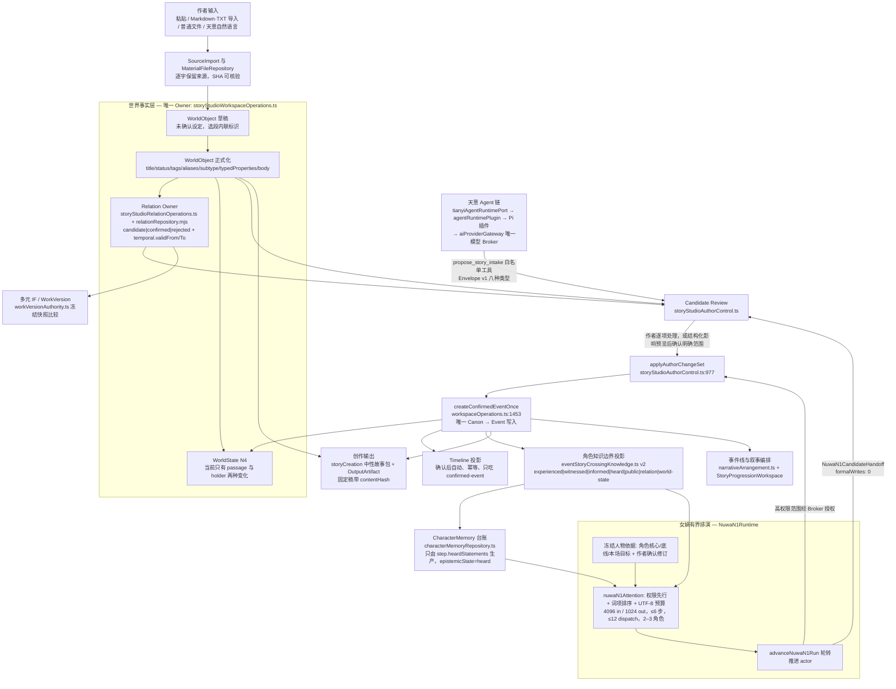
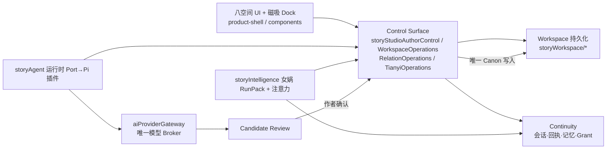

# 天衍系统地图 R0

> 生成日期：2026-09-18。角色：项目分析助手（只读）。本文不修改代码、不移动文件、不生成补丁、不提出立即实现方案；它只做一件事——把仓库当前的真实结构、真实接线状态和真实缺口画成一张可核对的地图，供后续 Codex 开发在进入前定位。
>
> 所有事实都标注了来源。文件行号一律取自实现基线 `origin/codex/semantic-world-r3`（`93f41aa`，2026-09-18 11:10 +0800），除非该行明确写出其它 ref。

---

## 0. 读这张图之前必须知道的三件事

### 0.1 仓库里没有 README.md，也没有 CHANGELOG

任务要求先读 `README.md` 和"最近的 CHANGELOG / 状态文件"。两者在本仓库都不存在，已核验而非遗漏：

- `README.md`：工作树与 `origin/codex/semantic-world-r3` 均无（`git ls-tree` 无匹配，`ls README.md` 返回 2）。
- `CHANGELOG*`：全仓 1303 个跟踪文件中无任何匹配。

承担"状态文件"职责的实际是这六个，且各自边界写在 `项目目录导航.md` 的内容分区表里：

| 状态载体 | 承担什么 | 会不会过期 |
| --- | --- | --- |
| `TIANYAN_PRODUCT_CORE.md`（2488 行） | 唯一产品定义。工程现状不得覆盖它 | 慢 |
| `docs/product/TIANYAN_ROADMAP.md`（107 行） | 路线图 + 能力账本；含"当前优先级"表（`STAB-R4`…`ADAPT-L1`）与 R5/N2/N3 检查点 | 每次切片追加 |
| `docs/architecture/FEATURE_INDEX.json` | lint 强制的功能索引：33 个功能的 status / entrypoints / domainOwners / stateOwners / persistenceOwner / providerDependency / tests / remainingGap，外加 `boundaries` 权威表 | **本身已滞后，见 §6 债务 2** |
| `docs/architecture/TIANYAN_R0_3_1_ACTIVE_TREE.md` | R0.3.1 退役清理时的可达性盘点（KEEP_ACTIVE / KEEP_DOMAIN / DELETE_RETIRED） | 冻结在 `238c892` |
| `日常入口.md` | 作者日常目录、日常分支、4192 启动命令、旧 worktree 用途 | 快 |
| `design-qa.md` | G1 视觉对照 QA，状态 `CODEX_DESIGN_QA_PASS_WITH_P2_LIMITS`，明确"不是创始人验收" | 快 |

另有 `docs/research/TIANYAN_MAINLINE_LINEAGE_AND_CAPABILITY_REALITY_MAP_R0.json`——注意它是**来源漂移对账的测试输入**，`项目目录导航.md` 明写它"不是当前工程现状报告"。

### 0.2 工作树落后基线 44 个提交，而且落后的是全部新能力

```
git rev-list --left-right --count HEAD...origin/codex/semantic-world-r3  →  0  44
```

工作树分支 `codex/world-materials`（`f77b800`，2026-09-16）是基线的**严格祖先**，无分叉。这 44 个提交不是重构杂项，而是本图 §2、§5 里一整批能力的唯一载体：

| 只在基线存在（工作树没有） | 文件数 |
| --- | --- |
| `src/storyContracts/`：`worldReferenceProjection` `worldCausalEvolution` `characterContextPack` `hybridRetrieval` `semanticChunking` `semanticIndexCache` `indexEligibility` `embeddingProfile` `nuwaBranchNode` `hybridRetrievalGoldenSet` | +10（34 → 44） |
| `apps/story-studio/src/`：`entity-dock/EntityInspectorDock.tsx`、`entity-dock/entityInspectorDockStore.ts`、`world/WorldReferenceWorkspace.tsx`、`nuwa/NuwaUnifiedSceneWorkspace.tsx`、`nuwa/NuwaSceneOverview.tsx`、`nuwa/NuwaDirectionCandidates.tsx`、`nuwa/nuwaSceneWorkspaceModel.ts`、`nuwa/nuwaWorkspaceView.ts` | +8（154 → 162） |
| `apps/story-studio/server/semanticIndexService.mjs` | +1 |
| `tests/`：world-reference、causal-evolution、context-pack、hybrid-retrieval-eval、index-eligibility、nuwa-branch、scene-workspace、semantic-index 等 | +12（256 → 268） |

**结论：任何对着工作树做出来的"天衍现状"都是 2026-09-16 之前的现状。** 本文其余部分不使用工作树计数。

### 0.3 核验方法

本文的"未接通"结论不是靠读文件名，而是靠两遍静态导入闭包：以 `apps/story-studio/src/main.tsx`、`apps/story-studio/server/server.mjs`、`src/lib/localTransport.ts`、`scripts/start-story-studio-dev.mjs` 为根，解析 `import / export from / require() / import()` 的相对路径并传递展开。基线上：生产可达 417 个文件；`src/` + `server/` 共 288 个域文件中 **17 个生产不可达**（§5.C 列表）。§5 每一项另外用 `git grep` 复核了外部引用者是谁（只有测试 / 完全为 0）。

---

## 1. 产品定位

### 一句话（`TIANYAN_PRODUCT_CORE.md:41`）

> 天衍是一套由作者掌握最终决定权、由 AI 负责理解、记忆、维护、推演和协作的故事世界创造与演化系统。

立意（`:24`）：帮"有想法但不擅长写作、缺少系统整理能力、难以长期维持庞大故事一致性"的作者，养出一整个能持续生长的故事世界。作者可以只说一句话，也可以导入几百万字，结构由系统逐步提炼、作者再决定是否采用。

### 与普通 AI 写作工具的三条硬分界（`TIANYAN_PRODUCT_CORE.md:47-63`，"天衍不是什么"）

这三条不是阶段取舍，是长期不得偏离的边界，也是本图判定"什么算接通、什么算越界"的尺子：

1. **AI 不能偷偷改正式故事。** AI 可以分析、建议、生成候选、在派生副本里自主推演、在授权后执行编辑，但作者握有正式故事的最终决定权。工程后果：唯一 Canon 写入者 + 候选审查 + 结构化语义 diff 是唯一采纳权威。
2. **角色不共享全知视角。** "每个角色只应依据自己经历过、听说过、相信、误解或怀疑的内容行动。"工程后果：`eventStoryCrossingKnowledge` 知情投影 + `nuwaN1Attention` 权限先于相关性 + ContextPack 的三条硬排除。
3. **不是资料库、不是项目管理软件、不是内嵌的小说/剧本/漫画/互动叙事全家桶。** 资料与设定存在的理由是让 AI 与作者共同维护一个活着的世界；具体格式与后续制作交给受信任的外部插件。

### 一句话对上代码

天衍的实现形态是：**一个单写入者的确定性内核（`src/storyControlSurface/` + `src/storyWorkspace/`）+ 一层可解释投影（`src/storyContracts/`）+ 一个不带路由库的八空间外壳（`apps/story-studio/src/product-shell/`）**。仓库 1303 个跟踪文件：`.ts` 552、`.tsx` 81、`.mjs` 76、`.css` 11、`.md` 44；`data/` 占 512 个（工作证据，非运行路径）。

---

## 2. 八空间地图

八个空间由 `src/storyContracts/storyStudioWorkspaceRegistry.ts:39-48` 唯一注册（注释自述："不是插件、不是路由处理器、不是第二个域 Owner"）。挂载点在 `apps/story-studio/src/product-shell/workspace/ShellWorkspaceOutlet.tsx:44-102`——一张纯 `if` 顺序表，没有路由库。产品核心第 §八 章（`:648-1420`）给每个空间写了一句"它回答："，下表职责列即取该原话。

| 空间 | 路由 | 职责（产品核心原话） | 核心组件（基线实际挂载） | 当前状态（FEATURE_INDEX） | Owner |
| --- | --- | --- | --- | --- | --- |
| **世界** | `/world` | "我的故事世界现在处于什么状态，我接下来最需要关注什么？"（`:656`） | 默认 `WorldOverviewWorkspace.tsx`（Outlet:90）；`?worldView=character&characterId=` → `CharacterWorkspace`（Outlet:86） | 组合视图**未登记进 FEATURE_INDEX**；其下 `focused-relations-r0` `object-catalog-character-directory-r0` 为 LOCAL_REVIEW / FOUNDER_REVIEW | 只读组合，不拥有任何事实：WorldObject→`storyStudioWorkspaceOperations.ts`，地图→`visualDocumentRepository.mjs` |
| **天意** | `/tianyi` | "作者与 AI 交流、理解、整理和执行的主要入口"；一个 `TianyiConversation` 内 Creative / Work 两条泳道（`:684-692`） | `TianyiConversationWorkspace.tsx`（Outlet:57）+ 侧栏 `TianyiSidebar` | `tianyi-pi-text-vertical-slice-r0.6` LOCAL_REVIEW；`tianyi-grounding` `context-attention-memory` PARTIAL | 会话/回执 `storyContinuity/`；运行时 Port `storyAgent/tianyiAgentRuntimePort.ts`；模型出口 `aiProviderGateway.mjs` |
| **事件线** | `/event-line` | "在当前选择的故事来源和版本中发生了什么，不同方向与待合并结果怎样连接、冲突或演化，哪些还没解决？"（`:775`） | `R0EventLineProjection.tsx`（Outlet:47）→ `EventLineWorkbench.tsx` + `EventGraphCanvas` + `StoryProgressionWorkspace` + `TemporalCanvas` | `event-line` PRODUCTION_CONNECTED；`story-unit-narrative-arrangement-r0` **FOUNDER_REVIEW**；`event-line-story-modeling-r7` LOCAL_REVIEW | 事件/WorldState/编排全部 `storyStudioWorkspaceOperations.ts`；建模 `storyStudioStoryModelingOperations.ts` |
| **多元** | `/multiverse` | "如果保持来源可追溯，这个故事还能用另一种语言、视角、前提或文化环境怎样存在？"（`:990`） | `MultiverseB1Workspace.tsx`（Outlet:65） | `project-scoped-work-version-authority-r0` PRODUCTION_CONNECTED，但 remainingGap 自述"仍需接 Owner 写入、补偿回执、固定稿 IF 绑定与 workspace" | `src/storyWorkspace/workVersionAuthority.ts` + `multiverseB1.ts`；派生比较是**纯冻结快照层** |
| **女娲** | `/nuwa` | "既是故事模拟器，也是高级虚拟机"：选一个明确来源与版本作蓝本，在作者给的范围/目标/权限/停止条件内让事件、Agent、关系、记忆、地点、物品、世界状态继续演化（`:1065-1069`） | `NuwaN1Workspace.tsx`（Outlet:61）；`NuwaUnifiedSceneWorkspace` / `NuwaSceneOverview` / `NuwaDirectionCandidates` 在基线存在但**不在任何 FEATURE_INDEX 入口** | `nuwa-primary-workspace` LOCAL_REVIEW；`nuwa-rehearsal-runpack-contract` / `nuwa-bounded-simulation` / `nuwa-scene-simulation-runtime-r0` PARTIAL；`nuwa-contextual-handoff` PRODUCTION_CONNECTED | RunPack `storyIntelligence/nuwaRunPack.ts`；听闻记忆 `storyContinuity/characterMemoryRepository.ts`；高权限 `actionPermissionBroker.ts`；`formalWrites: 0` |
| **资料** | `/library` | "这个世界里有哪些人、事、物、地点、关系、规则和创作资料，它们从哪里来，现在处于什么状态？"（`:1225`） | 默认 `MaterialsWorkspace.tsx`（Outlet:84）；`?libraryView=map`→`MapM1Workspace`(:72)、`relations`→`FocusedRelationsWorkspace`(:76)、`reference`→`WorldReferenceWorkspace`(:80)。旧 `/world?worldView=map/relations` 只作兼容 | `world-materials-m2` PRODUCTION_CONNECTED；`map-management-ai-editing-m4` `world-reference-r1` `hybrid-semantic-retrieval-r3` LOCAL_REVIEW | 文件 `materialFileRepository.mjs`；地图 `visualDocumentRepository.mjs`；对象/来源 `storyStudioWorkspaceOperations.ts` + `sourceImportReviewR0.ts`；分类元数据 `objectCatalog.ts` |
| **创作** | `/creation` | "我要把哪一份故事成果，以什么方向，交给哪个工具，最后得到了什么产物？"（`:1331`） | `CreationSourceWorkspace.tsx`（Outlet:53） | `CREATE-C1` 在路线图标"本地通过；作者待验"（`TIANYAN_ROADMAP.md:70`）；无独立 FEATURE_INDEX 条目 | `src/storyCreation/`：中性故事包 + OutputArtifact；来源快照带 contentHash，读/下载前服务端复核 |
| **数据** | `/data` | "把同一故事内核的只读投影、运行状态、目录成熟度、操作日志和可解释性集中呈现"，且**"R0 仅定义其导航与静态外壳，不接入领域数据"**（`:1417-1419`） | **无组件**。`ShellWorkspaceOutlet.tsx:92-102` 落到通用占位舞台 | 有意停在壳层（产品核心原话），非遗漏 | 不建第二份 Canon/Event/WorldState/会话/确认数据 |

补充两点结构性事实：

- **合册 `/collections`** 是第二张注册表 `STORY_STUDIO_DERIVED_DESTINATION_REGISTRY`（`storyStudioWorkspaceRegistry.ts:65-75`）里的"派生目的地"，与八空间并列出现在导航里（`:83-86` 合并），同样落到占位舞台。
- **磁吸实体 Dock 不属于任何空间**：`EntityInspectorDock` 在 `ShellWorkspaceOutlet.tsx:105` 无条件挂载在所有 outlet 之外，是八空间之上的一层通用实体工作面（`character-agent-magnetic-workbench-r0`，LOCAL_REVIEW）。

---

## 3. 核心数据流

主链是"作者输入 → 资料/世界 → 事件 → 角色 → 女娲推演 → 作者确认 → Canon"。**图中每个箭头都能在仓库里指到一条真实调用；每个 Owner 框都是唯一所有者，不是本图新发明的。**



数据流上不可忽略的四条约束（全部有工程载体，不是口号）：

1. **没有第二条写入路径。** `applyAuthorChangeSet` 共 12 个调用点（`server.mjs:2475`、`nuwaN1Port.mjs:457/699`、`normalEventCreationPort.mjs:165`、`tianyiCreativeEventPort.mjs:190/271`、三个 fixture、`PendingReviewPanel.tsx:178` 的「确认写入正式 Event」按钮、客户端 `localTransport.ts:2394`），全部走同一个 Canon Writer。
2. **AI 只能产出 Candidate。** 天意自由文本不能生成正式候选（`docs/handoff/TIANYI_R2_2B1_PHASE_CLOSURE_R1.md`）；女娲交接对象带 `formalWrites: 0`。
3. **BaseVersion 串行化，不 last-write-wins。** 地图/文档/关系写入都带 `expectedHash` 或基准修订，过期基准拒绝；回溯用补偿版本而非删历史。
4. **角色记忆不是世界事实。** `heard` 原话进 CharacterMemory 台账，永不升级为 World 事实；失效用非破坏性 `source-rollback` 元数据，保留历史。

---

## 4. 核心 Owner 图

**本表不新增、不改名、不推测 Owner。** 每一行要么抄自 `docs/architecture/FEATURE_INDEX.json` 的 `boundaries` / `domainOwners` 字段，要么抄自 `项目目录导航.md` §5"不可重复的所有者"。`boundaries` 的机器可读原文是：`canonWriters`、`worldStateOwners`、`eventOwners`、`candidateReviewOwner`、`narrativeArrangementOwner`、`providerBoundary`、`agentRuntimePortOwner`、`agentRuntimePluginHost`、`piInfrastructureAdapter`、`agentRecognitionProposalOwner`——且 `scripts/validate-feature-index.mjs:19-28` 强制 Canon Writer / WorldState Owner / Event Owner / NarrativeArrangement Owner **各恰好一个**。

| 被问到的责任 | 唯一 Owner（基线真实路径） | 权威来源 | 禁止行为（原文） |
| --- | --- | --- | --- |
| **Canon 写入 + 候选审查** | `src/storyControlSurface/storyStudioAuthorControl.ts`（`applyAuthorChangeSet:977`、`createCandidateReview:693`） | `boundaries.canonWriters` / `candidateReviewOwner` | UI、Pi Agent、Provider、女娲或插件绕过作者审查直接写入；把 AI 结果直接当成已确认内容 |
| **世界事实（WorldObject / 设定 / 资料对象）** | `src/storyControlSurface/storyStudioWorkspaceOperations.ts` | `项目目录导航.md` §5 | 新建平行事件库、时间线事实库或页面本地事实 |
| **事件事实 + WorldState + 正式叙事编排** | 同上 `storyStudioWorkspaceOperations.ts`（`createConfirmedEventOnce:1453`，N4 写入 `:1531-1581`），编排合同 `src/storyContracts/narrativeArrangement.ts` | `boundaries.worldStateOwners` / `eventOwners` / `narrativeArrangementOwner` | Event 全局位置、`linkedEntityIds` 数组顺序、UI/localStorage 或独立数据库成为排序事实 |
| **角色记忆（女娲跨场景 `heard`）** | `src/storyContinuity/characterMemoryRepository.ts`（唯一生产者：`step.heardStatements`，`:55-94`）；只读查询 `characterMemoryQuery.ts`（`writes:0, providerCalls:0`） | FEATURE_INDEX `nuwa-primary-workspace.domainOwners` | RunPack 成为第二个永久人物记忆库；听闻升级为 World 事实 |
| **关系** | `src/storyControlSurface/storyStudioRelationOperations.ts` + 持久化 `src/storyWorkspace/relationRepository.mjs` | FEATURE_INDEX `focused-relations-r0.domainOwners` | 建第二 Relation Owner；把系统回执时间、归档、人物听闻当成世界时间 |
| **权限** | `src/storyControlSurface/actionPermissionBroker.ts`（`AgentPermissionProfile = general｜auto-review｜full-access`；`AgentActionKind` 枚举含 `permanent-delete`） | FEATURE_INDEX `nuwa-primary-workspace.domainOwners` | 注意力/检索结果授予读取权限；未 broker 的权限可选 |
| **AI 上下文（天意侧）** | `src/storyControlSurface/storyStudioTianyiOperations.ts` + 持久化 `src/storyContinuity/receiptStoppingRepositories.ts`（Context Receipt / Stopping Point / Grant）；发送前重验 `src/storyContinuity/tianyiGroundedContextGate.ts` | FEATURE_INDEX `context-attention-memory`、`tianyi-grounding` | 用当前正文替换旧依据；无来源锚点的引用进入 Receipt |
| **AI 上下文（女娲侧）** | `src/storyIntelligence/nuwaN1Attention.ts`（算法 `permission-first-lexical-utf8/v1`，只在**已授权**集合内排序）；`src/storyContracts/characterContextPack.ts` 纯函数预览 | FEATURE_INDEX `nuwa-primary-workspace`、`character-agent-magnetic-workbench-r0` | 注意力授予访问；作者备注/传闻/该角色未知项进入 ContextPack |
| **作品版本与 IF 语义** | `src/storyWorkspace/workVersionAuthority.ts` + `src/storyWorkspace/multiverseB1.ts` | FEATURE_INDEX `project-scoped-work-version-authority-r0` | 用临时 UI 状态替代版本/来源/修订身份；比较或融入计划变成第二 Event/Relation/WorldState/编排 Owner |
| **Provider 边界与模型目录** | `apps/story-studio/server/providerGateway/aiProviderGateway.mjs`；实例与目录 `persistentProviderProfileStore.mjs`；Embedding 身份 `src/storyContinuity/embeddingIndexBinding.ts` | `boundaries.providerBoundary` | UI 直连 Provider；测试使用真实凭据；把 preset 建议伪装成 endpoint 结果 |
| **Agent 运行时** | Port `src/storyAgent/tianyiAgentRuntimePort.ts`；宿主 ABI `agentRuntimePlugin.ts`；Pi 适配 `plugins/builtinPiAgentRuntimePlugin.ts`（唯一 Pi SDK 导入点） | `boundaries.agentRuntimePortOwner` / `agentRuntimePluginHost` / `piInfrastructureAdapter` | Pi 拥有 Canon、WorldState、Event、Session 或作者确认权 |
| **地图文档 / 普通文件 / 对象分类 / Agent 识别提案** | `visualDocumentRepository.mjs`（提案表 `mapEditProposalRepository.mjs` 只存待审操作）/ `materialFileRepository.mjs` / `objectCatalog.ts` / `agentRecognitionProposalRepository.ts` | FEATURE_INDEX `map-management-ai-editing-m4`、`world-materials-m2`、`object-catalog-character-directory-r0`、`boundaries.agentRecognitionProposalOwner` | 第二地图库；普通文件创建世界对象；分类表存字段/标签/关系/记忆；组件或 Provider 内再维护一份提案状态 |



---

## 5. 当前已有但未接通能力

这一节是全图信息密度最高的地方，也是"天衍缺的不是设计、是生产者和接线"这一判断的证据。**每一条都做了引用者复核，并区分"零引用"与"只有测试引用"。**

### A. 合同完整、但没有生产者，甚至没有测试

| 模块 | 事实 | 界面上的自述 |
| --- | --- | --- |
| `src/storyContracts/characterFateProjection.ts`（11236 B，230 行） | **全仓零引用、零测试。** 基线上 `git grep characterFateProjection\|projectCharacterFate` 只命中自身 + `TIANYAN_ROADMAP.md:69` 的 `FATE-F1｜计划中` + 一份 `data/` 历史报告里提到过一个**如今不存在**的测试文件名。生产不可达集合成员 | `EntityInspectorDock.tsx:164`：「命运投影合同（tianyan-character-fate-projection/v1）已定义；当前没有 actual / planned / candidate 生产数据，不生成无来源轨迹。」 |
| `src/storyContracts/characterStateProjection.ts`（14025 B，222 行） | 有唯一域内引用者 `eventStoryCrossingKnowledge.ts`，但端口方法 `compareCharacterStates`、`explainStateTransition`、`validateKnowledgeBoundary`、`projectCharacterState` 在基线**没有任何生产调用者**，仅 `tests/storyContracts/characterStateProjectionR0.test.ts` | `EntityInspectorDock.tsx:160`：「状态投影合同（tianyan-character-state-projection/v1）已定义，但当前没有生产喂入；本面板不做无来源推断。非心理测评。」 |

**这里最容易被误解的一点：** 角色知识边界**在生产里是活的**，只是活的不是 `characterStateProjection`，而是 `src/storyContracts/eventStoryCrossingKnowledge.ts`（v2，16109 B）——它有服务端生产者（`server.mjs:115/565/1501/5087`、`nuwaN1Port.mjs:25`）和 7 个 UI/域消费者（EventLineWorkbench、EventGraphCanvas、StoryProgressionWorkspace、EntityInspectorDock、CharacterInspectorCard、CharacterWorkspace、localTransport）。`characterStateProjection.ts:205-206` 的六项裁定（「把作者全知或另一角色的秘密错误地共享给了当前角色」「信念、怀疑或错误信息不能冒充世界事实」）是**合同已写、运行时未跑**的那一半。

**另一个具体缺口：** 命运 K 线在产品核心要求至少对照**五种**轨迹（`TIANYAN_PRODUCT_CORE.md:560-568`：已确认实际、作者规划、未确认候选、女娲排演、跨分支/IF/翻译/改编），而 `characterFateProjection.ts:59-61` 只有 `actual / planned / candidate` 三条轨迹，`branchId`（`:36`）是过滤器不是对照轴。**这条合同本身还没写完，不是"只差接线"。**

### B. 类型齐全、生产分支缺席

| 位置 | 缺口 |
| --- | --- |
| `worldCausalEvolution.ts:44` `CausalTimeFrame.frameAuthority` 允许 `planned｜candidate`，但 `attachTimeFrames`（`:164/:166`）只发 `confirmed-event` | 规划/候选时间帧**类型可用、无生产者**；UI 只能诚实显示「暂无 planned/candidate 数据（诚实空态）」（`EntityInspectorDock.tsx:322`） |
| `worldCausalEvolution.ts:203` `buildWorldContextPack`（确定性 WorldContextPack） | 只有 `tests/storyContracts/worldCausalEvolution.test.ts` 引用；**无任何生产消费者**。同文件的 `projectCausalEvolution`/`attachTimeFrames` 已被 `EntityInspectorDock` 使用，所以是"卡接通、包未接通" |
| `worldCausalEvolution.ts:105-123` `deriveDimensions` | 因果维度**全部由标签正则派生**（潮汐/周期/季节 → periodic；`时间：` 前缀 → worldTime），正文里没有的结构化规则前提无处可来 |
| `typedProperties`（写入 `storyStudioWorkspaceOperations.ts:317/1633/1687/1745/3837`） | carrier 已存在且在用，但目前**只承载角色属性**（`CharacterProfileEditor.tsx:52`、`MaterialsWorkspace.tsx:412`、`localTransport.ts:549`）。没有任何组件把它当作规则/事件前提读取——它是那条"零新增存储即可承载结构化语义"的现成通道 |

### C. 已有组件但没有消费者（生产不可达 17 项）

以生产根做静态导入闭包后，`src/` + `apps/story-studio/server/` 共 288 个域文件中有 17 个不在闭包内。再按外部引用者细分：

- **完全零引用（真孤儿，2 个）：** `src/storyContracts/characterFateProjection.ts`（11236 B）、`src/storyCreation/legacyNuwaCreationHandoffAdapter.ts`（3899 B；其 `LEGACY_NUWA_CREATION_BLOCKED_MESSAGE` 无人显示）。
- **只有测试引用（合同活着、运行不活着，10 个）：** `skillControl/skillRecipeDraft.ts`、`storyAgent/piR4ValidationContract.ts`、`storyCardPresentation/characterCardHistoryProjection.ts`、`storyContinuity/tianyiRequestContextBudget.ts`、`storyContracts/hybridRetrievalGoldenSet.ts`、`storyCreation/{autosaveController,compositionBuffer,markdownDocumentModel,screenplayFormatAdapter,derivedEventLineR1}.ts`、`server/providerGateway/radeonCloudAdapter.mjs`。
- **域内可达但不在生产闭包：** `storyContracts/embeddingProfile.ts`（被 `semanticIndexService.mjs` 与 `semanticIndexCache.ts` 引用，属 R3 检索切片）、`storyCreation/fountainJsAdapter.ts`（被同目录 `fountainJsNodeAdapter.mjs` 引用）。

`apps/story-studio/src/` 侧另有 4 个**任何地方都不引用、测试也不引用**的文件：`worldObjectCatalog.ts`、`lib/initialWritingFlow.ts`、`lib/skillRegistryProjection.ts`、`lib/providerCredentialInput.ts`。

### D. 已有入口但无工作面 / 已有注册但 `not-connected`

| 空态 | 精确位置 |
| --- | --- |
| `/data`（数据）与 `/collections`（合册）在导航注册、`enabled: true`，但 outlet 无分支 → 落到 `ShellWorkspaceOutlet.tsx:92-102` 占位舞台 | 数据空间是**产品核心有意冻结**的（`:1419` "R0 仅定义其导航与静态外壳"），不是遗漏；合册同理 |
| 页面工具 6 个里 4 个 `availability: "not-connected"`：`reader-appreciation`、`language-check`、`history`、`extensions` | `components/page-tools/pageToolRegistry.ts:9-12`；`DockToolRail` 以 `disabled={!available}` 呈现，未接入工具不得打开 |
| 磁吸 Dock 角色 9 个页签中「心理与状态」「演化与命运」是合同占位（见 §5.A）；「Agent 运行」四项全显「未设置（诚实空态）」（`:194-197`）；世界 6 个页签中「当前故事」「规划/候选」为空态（`:322`） | `EntityInspectorDock.tsx:27`（DOCK_TABS）、`:246`（WORLD_TABS） |
| 混合语义检索的真实向量 | `hybrid-semantic-retrieval-r3.remainingGap` 自述 `ACTUAL_EMBEDDING_EVAL=NOT_RUN`（假向量），语义通道在配置 profile 前诚实不可用（`hybridRetrieval.ts:185` reranker 槽位空） |

### E. 已接通但不在索引里（lint 看不见）

`scripts/validate-feature-index.mjs` 只校验**已登记路径是否存在**，不校验**已挂载组件是否登记**。基线上 `apps/story-studio/src/` 的 124 个 `.ts/.tsx` 中有 **54 个**不在任何 feature 的 `entrypoints`/`sourceFiles` 里。绝大多数只是已登记 feature 的子模块，但有三个例外值得单独注意：

- `components/world/WorldOverviewWorkspace.tsx` —— **它是 `/world` 的默认工作面**（Outlet:90），却未登记。
- `components/nuwa/NuwaUnifiedSceneWorkspace.tsx` / `NuwaSceneOverview.tsx` / `NuwaDirectionCandidates.tsx` / `nuwaSceneWorkspaceModel.ts` / `nuwaWorkspaceView.ts` —— 一整组女娲统一场景工作面新文件（只在基线存在），带自己的测试（`nuwaSceneWorkspaceModel.test.ts`、`nuwaWorkspaceView.test.ts`、`nuwaBranchVerticalSlice.test.ts`、`nuwaBranchCheckpointCloseout.test.ts`），但 `nuwa-primary-workspace.entrypoints` 只列 `NuwaN1Workspace.tsx`。
- `src/storyIntelligence/` 中 9 个文件未登记：`nuwaAttentionContext`、`nuwaTaskContextPack`、`nuwaStoryMemoryRecall`、`nuwaStoryRecallProjection`、`nuwaAuthorReview`、`nuwaDelegationPolicyR1`、`nuwaCandidateFutureRuns`、`nuwaBoundedScenarioRuntime`、`storyIntelligenceTypes`。

### F. 合同正确、接错线的一处真实断链

`EntityInspectorDock.tsx:159` 的「在角色目录中编辑档案」发的是 `/world?worldView=character&objectId=…`，而 Shell 读的是 **`characterId`**（`TianyanR0Shell.tsx:95`，另外 4 个生产者 `:317/:341`、`WorldOverviewWorkspace.tsx:66`、`FocusedRelationsWorkspace.tsx:155`、`MapM1Workspace.tsx:948` 全部用 `characterId`）。后果：该链接永远进不了 `CharacterWorkspace`（Outlet:86 的 `props.characterObjectId` 为 null），静默回落到世界总览。这是八空间深链里唯一的参数名不一致。

---

## 6. 当前最大技术债

### 一级：阻塞开发（不解决就会做错事）

1. **主干 `origin/main` 已落后现实 228 个提交。** `git merge-base origin/main origin/codex/semantic-world-r3` = `0c110e2`，即 2026-09-13 的 "Merge pull request #23"。此后 09-13→09-18 的 228 个提交（R0.6 设置/全局搜索、资料 M2、地图 M2/M3/M4、N2A/N2B/N2C、N3、R1–R6、世界参考 R1、磁吸工作台 R0、因果演化 R2、混合检索 R3/R3.1、女娲分支切片）**全部只活在 `codex/*` 叠成分支上**。而 `docs/handoff/TIANYAN_R0_5_TO_R0_6_MEMORY_HANDOFF.md` 写的是"新工作必须从 fetch 后的 `origin/main` 开始"。照这条交接执行会直接丢掉 44 个提交后的世界。
2. **同一时刻存在四条 2026-09-18 的线，且两两不连续。**

   | ref | SHA | 相对 `semantic-world-r3` | 内容 |
   | --- | --- | --- | --- |
   | `codex/semantic-world-r3` | `93f41aa` | 基线 | 世界参考 R3.1C + 语义索引持久化 |
   | `codex/world-workbench-r4` | `d16563b` | +1 | R4 世界工作台改版（pulse、typed cards、causal chains、story rail） |
   | `codex/tianyan-ui-design-freeze-r0` | `7b37ad8` | +3 | 上者 + UI 设计冻结（原型、保全矩阵、tokens）+ 证据 |
   | `codex/tianyan-ui-design-freeze-r1` | `a37a314` | +1，**与 r0 分叉（r0 独有 3 / r1 独有 1）** | 父提交直接是 `93f41aa`：按创始人反馈重建女娲/世界高保真原型 = `origin/pr-31` |
   
   即 **PR #31 不含 R4 世界工作台代码**。任何"对着最新代码改"必须先由创始人裁定取哪条线，否则会把设计稿接到没有的代码上，或反之。
3. **日常服务运行的构建又不等于以上任何一条。** `日常入口.md` 记录 4192 在跑 `f95fb7c`（2026-09-15 "docs: add author daily entry guide"）构建的前端+服务端，且 `f95fb7c` 既不在 `origin/main`、也落后基线。核对真实运行版本只能读 `http://127.0.0.1:4192/__local/story-studio/health` 的 `codeRevision`。
4. **`FEATURE_INDEX.json` 的 `sourceCommit` 停在 `19f3f276`**，而 validator 不校验新鲜度、也不做反向可达性检查（§5.E）。结果是：索引是 lint 唯一强制的"当前工程依据"（`项目目录导航.md` §5 原话），但它既滞后又只覆盖单向。基线 33 项 vs 工作树 30 项的差异，恰好就是"读哪个 ref"的差异。
5. **命运 K 线缺时间轴权威。** `characterFateProjection.compareObservation`（`:186-188`）只按 `narrativeOrder` 排序；`validateWorldTime`（`:179-185`）要求非 unknown 时**必须由调用方给显式 `sortKey`**，而正式 Event 上没有一个结构化世界时间字段——世界时间目前以投影形态存在：`temporalProjection.ts:178` 的 `authoredTimeLabel / inferredWindow / anchorBefore-AfterEventIds / confidence`，以及 `relationTemporalComparison.ts` 的 `temporal.validFrom/To`。**在不指明这两者之一之前，任何 K 线的 x 轴都是叙事位置，不是世界时间。**
6. **因果本体是分裂的两套。** `src/storyContracts/eventCausalIndex.ts:3-5` 自称"Relation 仍是唯一关系所有者，本模块不推断正式边、不写故事事实"，但它的本体是 `:24-26` 与 `:71-88` 的中英文正则匹配；`worldCausalEvolution.ts:105-123` 另用正文标题 + 标签正则派生因果维度。两者无共同权威。而且 `eventCausalIndex.ts:42/:47` 把 Relation 的另一端 `objectId` 直接当作因果项的 `eventId` 输出，不校验该对象是否为正式事件。**世界模拟与因果偏移模型都必须先落在这上面，所以它是两条产品线的共同前置阻塞。**

### 二级：重要风险（不阻塞，但会持续造成误判和返工）

7. **13/33 项 `PRODUCTION_CONNECTED` 的"production"里没有真实模型。** 33 项中 `providerDependency` 直接写 `none` 的 16 项，其余项的 remainingGap 反复出现"真实 Provider 0 次""作者待验"。女娲 `NUWA-N1` 仍标 `REAL_PROVIDER_NOT_RUN_NOT_AUTHORIZED`（`TIANYAN_ROADMAP.md:61`）；`docs/implementation/TIANYAN_R4_PI_ZERO_CALL_AND_NUWA_N1.md` 记录 R4 与 N1 的远端 `verify` **都红在同一个 multi-node-prediction 终态提示**（PR #4 / #5 未合并）；`TIAN-YI-R1` 的真实首轮因正文长度不满足 80–120 字失败。**风险在于把索引状态读成"真实可用"。**
8. **验收层级只有创始人是终局的。** 3 项 FOUNDER_REVIEW（`tianyan-r0-static-shell`、`object-catalog-character-directory-r0`、`story-unit-narrative-arrangement-r0`）+ `design-qa.md` 自述 `CODEX_DESIGN_QA_PASS_WITH_P2_LIMITS` 且"不是创始人视觉或体验验收"。`AGENTS.md` 末条把它写成硬规则：技术测试通过不代表体验已验收。命运 K 线的**最终固定入口在产品核心里就是未确认项**（`TIANYAN_PRODUCT_CORE.md:2466-2468`）。
9. **六个巨型文件承载了大部分主流程**（基线行数/字节）：`src/storyControlSurface/storyStudioWorkspaceOperations.ts` 5728 行 / 320 KB（同时是 World、Event、WorldState、Story Unit、编排、Timeline 六个 Owner 的宿主）、`src/lib/localTransport.ts` 3797 行 / 254 KB、`styles/event-line-projection.css` 218 KB、`components/event-observation/EventGraphCanvas.tsx` 1647 行 / 162 KB、`components/EventLineWorkbench.tsx` 1639 行 / 152 KB、`styles/tianyan-r0-shell.css` 154 KB。任何触及事件线的切片都要在这三个文件里做外科手术。
10. **UI 回归大量依赖源码文本断言，而不是行为断言。** 基线 268 个测试文件里有 128 个使用 `readFileSync` 读源码或 `assert.doesNotMatch`；`tests/storyStudio/` 独占 104 个。其中有把设计决策直接钉死的机器锁：`tests/storyContracts/tianyanR0ShellContract.test.ts`（10 个 test）在 `:24` 用 `deepEqual` 冻结八空间 displayName 顺序、`:34` 要求 en/zh i18n key 集合完全相同、`:47` 冻结五个工作表面顺序、`:52` 冻结右侧工作面五态、`:54-58` 断言"切第二个工具后 `openPanelIds` 仍只有一个"且"点未接入工具不改变挂载"、`:62-63` 直接读 `useDockLayoutState.ts` 源码并 `doesNotMatch(/panelOrder|expert-first|pinned|priority/)`、`:208-253` 禁旧轨宽 token 与硬编码色值并要求 `focus-visible` 与 `prefers-reduced-motion`；`tianyanWorkbenchR02.test.ts:51` 更是直接 `assert.doesNotMatch(stack, /\.map\(/)` 来禁止多面板堆叠。**好处是设计决策不会静默流失；代价是任何布局/文案重构必红，且红了不代表行为坏了。**
11. **两条 AI 上下文链的"排除披露"口径不一致。** 天意 grounded answer 要求模型逐字回传 `excludedSources`（`sourceRef` + `reason`，`tianyiGroundedAnswer.ts:56-77`，不匹配即抛错）；女娲适配器只发计数与原因码（`nuwaN1PiAdapter.mjs:111` `excluded:{count, reasonCodes:["not-known-by-actor"]}`，`nuwaN1Port.mjs:1341` 才带 id）。两者都符合"权限排除不泄漏身份"，但**同一产品语义有两套合同**，未来统一 Attention Pack 时必须先裁定。
12. **54 个未登记的 UI 文件（§5.E）意味着"这个组件还有人用吗"无法由索引回答。** 只能靠静态可达性闭包重算——而基线上 UI 侧真正不可达的是 12 个文件，其中 4 个零引用、3 个只被测试引用。

### 三级：可以以后优化（现状诚实、无误导）

13. 移动端整体独立暂缓（`项目目录导航.md` §4 `src/styles/` 行：窄侧边栏只保证主工作区默认可见、目录为可关闭抽屉、无横向溢出）。
14. `/data` 与 `/collections` 两个入口按产品核心有意停在静态外壳。
15. 4 个页面工具（读者鉴赏、语言检查、历史、扩展）注册但未接入。
16. 向量库 / 完整 RAG / rerank / ASR / TTS 明确不存在（`provider-runtime.remainingGap` 原话），Embedding 索引绑定只有合同与门禁。
17. `scripts/` 里 5 个真实门禁脚本（`tianyan-pi-agent-real-gate-r0-smoke.mjs`、`tianyan-siliconflow-real-gate-r0-smoke.mjs`、`tianyan-multi-node-prediction-real-provider-smoke-r1.mjs`、`tianyan-nuwa-real-api-runner-r0.mjs`）在无命令级明确确认时返回 `REAL_PI_AGENT_GATE_NOT_STARTED_CONFIRMATION_REQUIRED`——这是设计而非缺陷。
18. 永久删除在 UI 里被有意阻断（引用枚举不完整前不放开，无级联删除）。
19. 工程包导出已实现、导入恢复未实现，因此不能称"往返"。

---

## 7. 给未来 Codex 的阅读顺序

前提：**先解析 ref，再读代码。** 第 0 步不是可选的。

### 第 0 步：定位你在读谁（30 分钟）

```
git rev-list --left-right --count HEAD...origin/codex/semantic-world-r3   # 0 44
git for-each-ref --sort=-committerdate --format='%(committerdate:short) %(refname:short) %(objectname:short)' refs/remotes/origin | head
```

工作树是 09-16 的祖先；本文所有行号在 `origin/codex/semantic-world-r3`。**若任务是 UI/视觉，先问清是哪条 09-18 的线（§6 债务 2）。** 日常服务真实版本看 `127.0.0.1:4192/__local/story-studio/health` 的 `codeRevision`，不看分支名。

### 第 1 天：边界与不可谈判项

1. `AGENTS.md`（14 行）——工程硬规则；特别记住"禁止向 `App.tsx` 和 `TianyanR0Shell.tsx` 堆逻辑"和"十条脚本"。
2. `TIANYAN_PRODUCT_CORE.md`，按这个顺序读这五处：`:22-45`（项目与一句话定义）、`:47-63`（**天衍不是什么**）、`:190-240`（六层信息：原始来源/作者意图/AI 候选/已确认/派生副本/外部输出）、`:242-420`（核心术语：候选历史、BaseVersion、采纳与结构化差异、对照、融入、升级为 IF）、`:648-700 + :1063-1075 + :1415-1419`（八空间各自回答什么、女娲是什么、数据空间为何只是壳）。
   `docs/product/TIANYAN_ROADMAP.md` **读到最后，别读中间**：它的正文按日期追加、会自我覆盖（`docs/implementation/TIANYAN_R4_PI_ZERO_CALL_AND_NUWA_N1.md` 开头就有"本节覆盖本文其余历史实施记录"这种写法）。有用的只有"当前优先级"表和 R5/N2/N3 检查点。
3. `CORE.md` + `项目目录导航.md` §2 内容分区 + §5"不可重复的所有者"。**§5 是本图 §4 的原始出处，也是唯一权威 Owner 表。**
4. `docs/architecture/FEATURE_INDEX.json` 的 `boundaries`，再扫 33 项的 `status` + `remainingGap`（13 PRODUCTION_CONNECTED / 10 LOCAL_REVIEW / 7 PARTIAL / 3 FOUNDER_REVIEW）。读 `remainingGap`，不要读 `status`。
5. `docs/operations/TIANYAN_DAILY_4191_4192_UPGRADE_RUNBOOK.md` 与 `日常入口.md`——只需要知道"不许按历史 PID 盲停""切换前只读预检""错误工具链必须在启动前停止"。

### 第 2 天：走一遍主链（对着 §3 的图）

1. `src/storyContracts/storyStudioWorkspaceRegistry.ts:39-48` → `apps/story-studio/src/product-shell/workspace/ShellWorkspaceOutlet.tsx:44-105`。**在这里建立"没有路由库、只有 window.location + query 参数"的直觉**，以及"磁吸 Dock 挂在所有 outlet 之外"。
2. `src/storyControlSurface/storyStudioAuthorControl.ts` 的 `createCandidateReview:693` → `applyAuthorChangeSet:977` → 它调的 `workspace.createConfirmedEventOnce`（`:1033`）→ `storyStudioWorkspaceOperations.ts:1453`。**这条链就是 Canon。全仓只有 12 个入口能进它**（§3 约束 1）。
3. `docs/handoff/TIANYI_R2_2B1_PHASE_CLOSURE_R1.md`——最短的一篇，讲清天意 Agent 链的真实边界：一个 `TianyiConversation`、`propose_story_intake` 唯一候选工具、Envelope v1 八个术语、Pi 超时根因**尚未证明**、"明确尚未开始：故事脉络仓库、命运线、完整 Page Agent、女娲、事件线/时间线重构与 UI 重设计"。
4. `scripts/run-selected-tests.mjs:34-94`（54 个禁止路径 = 已退役路径必须保持不存在）+ `scripts/validate-feature-index.mjs`（四个"恰好一个 Owner"）。**这两篇告诉你 lint 的红为什么会红。**

### 第 3 天：按你被派到的那一格，读它的"活的那一半"

| 如果任务涉及 | 先读（生产现实） | 再读（合同，注意状态） | 别读成 |
| --- | --- | --- | --- |
| 角色 Agent / 记忆 / 知识边界 | `src/storyContracts/eventStoryCrossingKnowledge.ts`（v2，有服务端生产者与 7 个消费者）、`src/storyContinuity/characterMemoryRepository.ts:55-135`、`characterMemoryQuery.ts` | `characterStateProjection.ts`（`compare*` / `validateKnowledgeBoundary` 无生产调用者） | 别以为状态投影已在线 |
| 女娲 / 上下文 / 预算 | `src/storyIntelligence/nuwaN1Runtime.ts`（2–3 角色、`:14` 6 步、`:15` 12 dispatch、`:282` 轮转 actor、`:191` `formalWrites: 0`）、`nuwaN1Attention.ts:14-61`、`server/nuwaN1PiAdapter.mjs:96-116`、`server/nuwaN1Port.mjs:1023-1055` | — | 别把 `TianyiEventLineCandidateTrajectory.tsx`（17 行，候选审阅叠层）当成命运线视图去扩展 |
| 命运 K 线 | `src/storyContracts/temporalProjection.ts:177-215`、`relationTemporalComparison.ts`、`multiNodePrediction.ts:1-107`（`PREDICTION_MODES=["forward-development"]`，无概率） | `characterFateProjection.ts`（零引用零测试；且只覆盖核心要求的 3/5 种轨迹） | 别加概率、别用单一分数冒充命运事实（`TIANYAN_PRODUCT_CORE.md:558`） |
| 世界模拟 / 因果 | `storyStudioWorkspaceOperations.ts` 的 WorldObject 键集（`:232/:239/:243-249`）、WorldState N4（`worldStateN4.ts:12-14` 只有 passage/holder）、`typedProperties` 现况 | `worldCausalEvolution.ts`、`eventCausalIndex.ts`（本体正则派生） | 别建第二事实库、别写"当前状态事实表" |
| 资料 / 地图 / 关系 | `materialFileRepository.mjs`、`visualDocumentRepository.mjs` + `mapEditProposalRepository.mjs`、`storyStudioRelationOperations.ts`、`WorldReferenceWorkspace.tsx`、`FocusedRelationsWorkspace.tsx` | `hybridRetrieval.ts`（假向量评测） | 别把布局坐标、地图连线、人物出现、听闻当成正式事实 |
| Shell / 布局 / Dock | `product-shell/TianyanR0Shell.tsx:50-54`（`resolveActiveDestination`：pathname+query → 目的地，全文 549 行只做区域组合）、`product-shell/layout/shellFocusLayout.ts:1-18`（`wide/focused/narrow`，阈值 840/640）、`product-shell/right-dock/useDockLayoutState.ts:6-34`（单一 `activeToolId`，`normalizeDockLayoutState` 把多面板旧态归一化）、`components/page-tools/pageToolRegistry.ts:6-13`（6 个工具，4 个 `not-connected`）、`right-dock/DockToolRail.tsx:48` `disabled={!available}` | `tests/storyContracts/tianyanR0ShellContract.test.ts:54-63`、`tests/storyStudio/tianyanWorkbenchR02.test.ts:51` | 规则文本在 `项目目录导航.md:75`：「同时最多挂载一个可用工具…不做布局持久化或跨侧拖动；未接入工具不得打开」。机器锁在同一测试里：`:58` 断言未接入工具点不动，`:63` 对 `useDockLayoutState.ts` 源码做 `doesNotMatch(/panelOrder\|expert-first\|pinned\|priority/)`。别向 `App.tsx`（7 行）和 Shell 堆菜单或业务状态 |

### 第 4 步：动手前的三行自检

1. 我要写的这个字段，**唯一 Owner 在 §4 表里存在吗**？不存在 → 停下问创始人，不要新建 Owner（`项目目录导航.md` §5、`CORE.md`）。
2. 我读的是 `93f41aa` 吗？行号还能对上吗？
3. 我的验证是 `npm run verify`（typecheck + lint + unit + integration + e2e + build，Node 22 / npm 10 由 `scripts/run-with-canonical-runtime.mjs` 强制），且**只用 Mock 或本地伪 Provider** 吗？——并清楚写下：这只证明本地门通过，不证明真实模型质量，也不证明创始人体验。

---

## 8. 本图的诚实边界

地图本身也可能过期，以下是它的已知局限：

1. **本文不预测架构演进。** 角色 Agent V2、世界模拟 V1、命运 K 线 V1、Attention Pack 统一设计属于设计文档范畴，本图只陈述"现在有什么、缺什么、谁拥有"。
2. **可达性是按静态导入解析算的。** `dynamic import()`、字符串拼接路径、服务端路由名到函数的反射映射不在闭包内，因此 §5.C 的 17 项可能对个别文件过于严格——每一项都另做了 `git grep` 外部引用复核，但引用者集合的语义（"只有测试"vs"只有假引用的注释"）仍需人工确认。
3. **基线不是终点。** `93f41aa` 之后 `codex/world-workbench-r4`、两条 design-freeze 分支已在跑；`origin/pr-31` 是文档型分支（父提交即 `93f41aa`）。本图反映 `93f41aa` 时刻。
4. **创始人体验状态未知。** §6 债务 8 只说明"待验收"，不预测裁定结果。
5. **`origin/codex/semantic-world-r3` 的 `FEATURE_INDEX.json` 里 `status` 字段与真实运行状况之间隔着 §6 债务 7 的全部距离**——这张地图不能替代运行验证。
